# Scikit-learn 中的功能选择

> 原文：<https://towardsdatascience.com/feature-selection-in-scikit-learn-dc005dcf38b7?source=collection_archive---------14----------------------->


由[马特·保罗·卡塔拉诺](https://unsplash.com/@mattpaul?utm_source=medium&utm_medium=referral)在 [Unsplash](https://unsplash.com?utm_source=medium&utm_medium=referral) 上拍摄

## Python 中的机器学习

## 过滤特征的简单方法，以获得更简单、更快速的模型

当建立监督机器学习模型时，我们收集对预测结果潜在有用的特征。并不是所有的特性都有助于构建模型。过滤掉不可预测的特征并保持模型的精简性通常是可行的，这样模型更快，更容易向利益相关者解释，并且更容易生产。在本帖中，我们将学习一些简单的方法来剔除对预测结果没有帮助的特征，并选择贡献更大的特征。


照片由[蒂姆·马歇尔](https://unsplash.com/@timmarshall?utm_source=medium&utm_medium=referral)在 [Unsplash](https://unsplash.com?utm_source=medium&utm_medium=referral) 拍摄

# 📦 1.数据

让我们首先加载必要的库，导入一个样本玩具数据，并将其划分为训练和测试数据集:

```
import pandas as pd
pd.options.display.max_rows = 20
# Used Scikit-learn version 1.0.1
from sklearn.datasets import load_breast_cancer
from sklearn.model_selection import train_test_split
from sklearn.ensemble import GradientBoostingClassifier
from sklearn.feature_selection import (RFE, SelectKBest, 
                                       SelectPercentile)
from sklearn.metrics import roc_auc_score# Load data
cancer = load_breast_cancer(as_frame=True)
X = cancer['data']
print(f"Features shape: {X.shape}")
y = cancer['target']
print(f"Target shape: {y.shape}\n")# Partition data
X_train, X_test, y_train, y_test = train_test_split(
    X, y, test_size=0.2, random_state=42
)
print(f"Training data - Features shape: {X_train.shape}")
print(f"Training data - Target shape: {y_train.shape}\n")
print(f"Test data - Features shape: {X_test.shape}")
print(f"Test data - Target shape: {y_test.shape}")
```

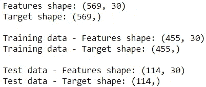

我们将使用有 30 个特征的乳腺癌数据。

# 💻 2.基线模型

我们将使用 ROC AUC(从这里开始的 AUC)来评估模型。让我们通过使用所有特性构建一个简单的模型来了解基准性能:

```
model0 = GradientBoostingClassifier(random_state=42)
model0.fit(X_train, y_train)def get_roc_auc(model, X, y):
    y_proba = model.predict_proba(X)[:,1]
    return roc_auc_score(y, y_proba)print(f"Training data - ROC AUC: {get_roc_auc(model0, X_train, y_train):.4f}")
print(f"Test data - ROC AUC: {get_roc_auc(model0, X_test, y_test):.4f}")
```

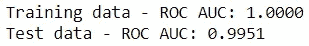

测试数据集的 AUC 为 0.9951。

# 📍 3.特征选择

我们将着眼于五种不同的方法来为有监督的机器学习问题进行特征选择。

## 📍 3.1.从要素重要性中过滤

要素重要性显示了每个要素对预测的贡献程度。进行特征选择的一个简单方法是删除对模型贡献不大的特征。

```
imp = pd.DataFrame(model0.feature_importances_, index=X.columns, 
                   columns=['importance'])\
        .sort_values('importance', ascending=False)
imp
```

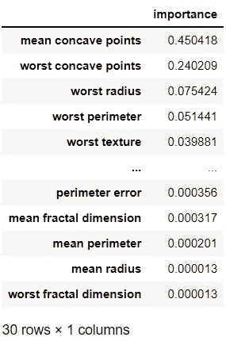

通过使用阈值 0.01，我们可以选择重要性超过阈值的特征，如下所示。或者，如果我们在寻找前 n 个特性，我们可以像这样调整语法:`imp[‘importance’].head(n).index`。

```
imp_features = imp[imp['importance']>0.01].index 
print(f"===== {len(imp_features)} features were selected =====")
print(f"{', '.join(imp_features)}")
```

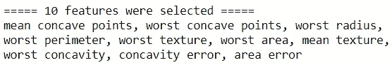

10 个特征高于阈值。如果我们使用这 10 个特征，让我们检查模型的性能:

```
model1 = GradientBoostingClassifier(random_state=42)
model1.fit(X_train[imp_features], y_train)print(f"Training data - ROC AUC: {get_roc_auc(model1, X_train[imp_features], y_train):.4f}")
print(f"Test data - ROC AUC: {get_roc_auc(model1, X_test[imp_features], y_test):.4f}")
```

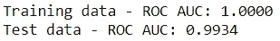

即使我们只使用了三分之一的功能，模型性能也没有显著下降。

## 📍3.2.使用递归特征消除

在递归特征消除中，我们从所有特征开始，然后每次递归地丢弃最不重要的特征(`step=1`)，直到满足一个标准。我们将使用一个标准来保留 10 个特征。

```
rfe = RFE(GradientBoostingClassifier(random_state=42), 
          n_features_to_select=10)
rfe.fit(X_train, y_train)rfe_features = X_train.columns[rfe.support_]
print(f"===== {len(rfe_features)} features were selected =====")
print(f"{', '.join(rfe_features)}")
```

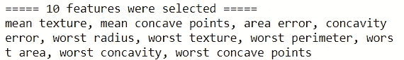

让我们使用选定的功能运行模型，并检查其性能:

```
model2 = GradientBoostingClassifier(random_state=42)
model2.fit(X_train[rfe_features], y_train)print(f"Training data - ROC AUC: {get_roc_auc(model2, X_train[rfe_features], y_train):.4f}")
print(f"Test data - ROC AUC: {get_roc_auc(model2, X_test[rfe_features], y_test):.4f}")
```

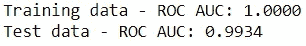

性能和以前一模一样。让我们看看这种方法是否选择了与以前相同的功能:

```
imp_features.sort_values().equals(rfe_features.sort_values())
```

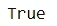

是的，它做到了！这并不奇怪，因为两者都是基于梯度推进分类器的特征重要性。这种方法也适用于提供特征重要性或系数的其他算法。使用系数时，请记住要素的比例会影响系数。

这种方法比前一种方法慢，因为它需要多次运行模型。加快速度的一个方法是增加`step`的大小，这样它可以更快地消除特征。

## 📍 3.用 SelectKBest 选择前 n 名

与前两种方法不同，这种方法和接下来的方法是模型不可知的。我们将根据分数选择 10 个最佳功能。 [F 值](https://scikit-learn.org/stable/modules/generated/sklearn.feature_selection.f_classif.html#sklearn.feature_selection.f_classif)被用作分类的默认分数，然而，可以使用[不同的分数](https://scikit-learn.org/stable/modules/generated/sklearn.feature_selection.SelectKBest.html)。

```
kbest = SelectKBest(k=10)
kbest.fit(X_train, y_train)# See selected features
kbest_features = X_train.columns[kbest.get_support()]
print(f"===== {len(kbest_features)} features were selected =====")
print(f"{', '.join(kbest_features)}")
```

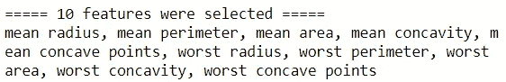

现在，该用新选择的特性再次运行模型了:

```
model3 = GradientBoostingClassifier(random_state=42)
model3.fit(X_train[kbest_features], y_train)print(f"Training data - ROC AUC: {get_roc_auc(model3, X_train[kbest_features], y_train):.4f}")
print(f"Test data - ROC AUC: {get_roc_auc(model3, X_test[kbest_features], y_test):.4f}")
```


模型性能与以前的方法相似。让我们来看看选择了哪些之前没有选择的功能:

```
[var for var in kbest_features if var not in rfe_features]
```

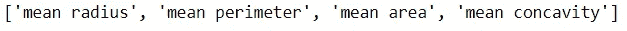

## 📍 4.使用 SelectPercentile 选择前 p 个百分点

这是前一种方法的变体，它允许指定要选择的功能的百分比，而不是功能的数量。我们将选择前 33%的功能来获得前 10 个功能:

```
percentile = SelectPercentile(percentile=33)
percentile.fit(X_train, y_train)# See selected features
percentile_features = X_train.columns[percentile.get_support()]
print(f"===== {len(percentile_features)} features were selected =====")
print(f"{', '.join(percentile_features)}")
```

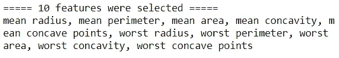

现在，让我们检查模型性能:

```
model4 = GradientBoostingClassifier(random_state=42)
model4.fit(X_train[percentile_features], y_train)print(f"Training data - ROC AUC: {get_roc_auc(model4, X_train[percentile_features], y_train):.4f}")
print(f"Test data - ROC AUC: {get_roc_auc(model4, X_test[percentile_features], y_test):.4f}")
```

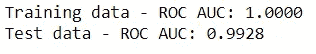

性能和以前一样。让我们看看功能是否与前面的方法相同:

```
percentile_features.sort_values().equals(kbest_features.sort_values())
```

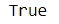

这是有意义的，因为我们选择了百分点值来获得与以前相同数量的特征。

## 📍 5.结合多种方法

如果你不想只使用一种方法，我们可以基于多种方法的组合来进行特征选择。我们来看看所有方法的总结:

```
selection = pd.DataFrame(index=X.columns)
selection['imp'] = [var in imp_features for var in X.columns]
selection['rfe'] = rfe.support_
selection['kbest'] = kbest.get_support()
selection['percentile'] = percentile.get_support()
selection['sum'] = selection.sum(axis=1)
selection.sort_values('sum', ascending=False, inplace=True)
selection
```

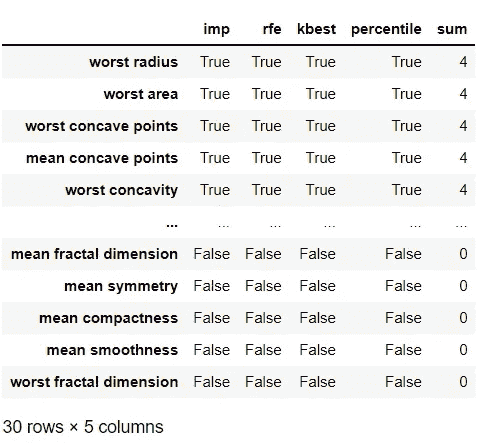

让我们检查一下`sum`列的分布:

```
pd.concat([selection['sum'].value_counts(normalize=True),
           selection['sum'].value_counts()], axis=1, 
          keys=['prop', 'count'])
```

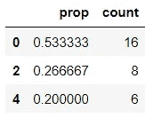

该表告诉我们，16 个特征没有被任何方法选择，6 个特征被所有方法选择。由于`imp_features`和`rfe_features`是相同的，并且`kbest_features`和`percentile_features`包含相同的特征，所以看到我们在这里只看到偶数值:0，2，4 也就不足为奇了。这意味着我们实际上是在聚合两种方法。

如果我们想更加小心，我们可以删除在两种方法中都没有选择的特性:

```
selected_features = selection[selection['sum']>0].index
print(f"===== {len(selected_features)} features were selected =====")
print(f"{', '.join(selected_features)}")
```

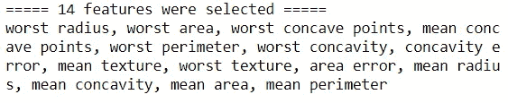

我们现在已经选择了 14 个特征，是时候检查模型性能了:

```
model5 = GradientBoostingClassifier(random_state=42)
model5.fit(X_train[selected_features], y_train)print(f"Training data - ROC AUC: {get_roc_auc(model5, X_train[selected_features], y_train):.4f}")
print(f"Test data - ROC AUC: {get_roc_auc(model5, X_test[selected_features], y_test):.4f}")
```

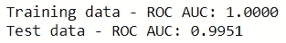

该性能与具有所有功能的基线模型相同，但我们仅使用了大约一半的功能。

瞧，这就是进行特征选择的 5 种简单方法。通过有效的特征选择，我们可以在不丧失预测能力的情况下建立更简单、更快速、更易于解释的模型。希望你能在下一个有监督的机器学习任务中使用这些方法。


马克·哈普尔在 [Unsplash](https://unsplash.com?utm_source=medium&utm_medium=referral) 上拍摄的照片

*您想访问更多这样的内容吗？媒体会员可以无限制地访问媒体上的任何文章。如果你使用* [*我的推荐链接*](https://zluvsand.medium.com/membership)*成为会员，你的一部分会费会直接去支持我。*

感谢您阅读这篇文章。如果你感兴趣，这里有我的一些其他帖子的链接:
◼️ [解释 scikit-learn models with shap](/explaining-scikit-learn-models-with-shap-61daff21b12a)
◼️️[k 近邻解释](/k-nearest-neighbours-explained-52c910c035c5)
◼️️ [逻辑回归解释](/logistic-regression-explained-7695f15d1b8b)
◼️️ [比较随机森林和梯度推进](/comparing-random-forest-and-gradient-boosting-d7236b429c15)
◼️️ [决策树是如何构建的？](/how-are-decision-trees-built-a8e5af57ce8?source=your_stories_page-------------------------------------)
◼️️ [管道，ColumnTransformer 和 FeatureUnion 说明](/pipeline-columntransformer-and-featureunion-explained-f5491f815f?source=your_stories_page-------------------------------------)t30】◼️️[feature union，ColumnTransformer &管道用于预处理文本数据](/featureunion-columntransformer-pipeline-for-preprocessing-text-data-9dcb233dbcb6)