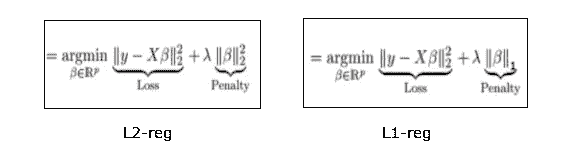
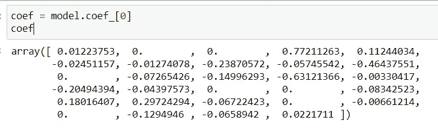
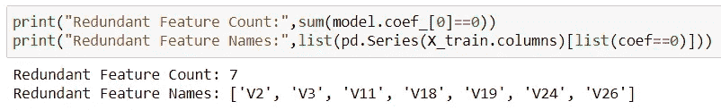
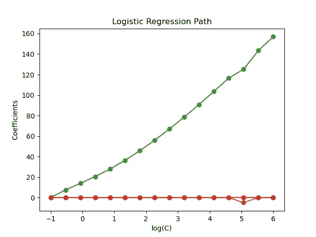

# 使用逻辑回归模型的特征选择

> 原文：<https://towardsdatascience.com/feature-selection-using-logistic-regression-model-efc949569f58?source=collection_archive---------3----------------------->

## 使用正则化移除冗余要素


图片来自[皮克斯拜](https://pixabay.com/?utm_source=link-attribution&amp;utm_medium=referral&amp;utm_campaign=image&amp;utm_content=1767563)

特征工程是数据科学模型开发管道的重要组成部分。*‘更多的数据导致更好的机器学习模型’*，对实例的数量成立，但对特征的数量不成立。

数据科学家将大部分工作时间用于准备相关特征，以训练一个健壮的机器学习模型。原始数据集包含大量可能影响模型性能的冗余要素。特征选择是一个特征工程组件，它涉及删除不相关的特征，并挑选最佳的特征集来训练健壮的机器学习模型。

特征选择方法降低了数据的维数，避免了维数灾难的问题。在我以前的一篇文章中，我已经广泛地讨论了 [7 特性选择技术](/top-7-feature-selection-techniques-in-machine-learning-94e08730cd09):

[](/top-7-feature-selection-techniques-in-machine-learning-94e08730cd09) [## 机器学习中的 7 大特征选择技术

### 选择最佳功能的流行策略

towardsdatascience.com](/top-7-feature-selection-techniques-in-machine-learning-94e08730cd09) 

在本文中，我们将讨论如何使用带有 L1 正则化的逻辑回归模型来移除数据中的冗余特征。

# 想法:

正则化是一种通过向误差函数添加惩罚来调整模型的技术。正则化可以用于训练模型，这些模型可以更好地概括测试数据或看不见的数据，并防止算法过度拟合训练数据集。

> L2 正则化指的是等价于系数大小的平方的惩罚，而 L1 正则化引入了等价于系数绝对值之和的惩罚(收缩量)。



(图片由作者提供)，L1 和 L2 正则项

L1 正则化在数据集中引入了稀疏性，它可以通过消除不重要的特征来执行特征选择。Lasso 或 L1 正则化将冗余特征的系数缩小到 0，因此这些特征可以从训练样本中移除。

# 实施:

> 从 Kaggle 下载的[信用卡欺诈检测数据集](https://www.kaggle.com/mlg-ulb/creditcardfraud)用于演示使用 Lasso 回归模型的特征选择实现

*   读取数据集并执行要素工程(标准化)以使其适合训练逻辑回归模型。

*   在标准化的训练样本上训练最适合的逻辑回归模型。

*   使用`**model.coef_**` 函数计算逻辑回归模型的系数，该函数返回逻辑回归划分平面的权重向量。



(图片由作者提供)，逻辑回归模型的系数值

系数向量的维数与训练数据集中的特征数量相同。

*   等于 0 的系数值是冗余特征，可以从训练样本中去除。从上面的系数向量快照可以看出，我们有系数为 0 的 **7 特征**。

```
**coef = model.coef_[0]
imp_features = pd.Series(X_std.columns)[list(coef!=0)]****X_train = X_train[imp_features]
X_test = X_test[imp_features]**
```



(图片由作者提供)，从信用卡数据集中删除的 7 个冗余特征的列表

在特征选择实现之前，训练样本具有 29 个特征，在去除 7 个冗余特征之后，训练样本减少到 22 个特征。

## 注意:

逻辑回归模型的参数`‘C’`影响系数项。当正则化变得越来越松散或者`‘C’`的值减小时，我们得到更多的系数值为 0。必须记住保持 `‘C’`的正确值，以获得所需数量的冗余特征。

较高的“C”值可能认为重要的特征是多余的，而较低的“C”值可能不排除多余的特征。



([来源](https://scikit-learn.org/stable/auto_examples/linear_model/plot_logistic_path.html))，C 与非零系数项的关系图

# 结论:

套索回归(带 L1 正则化的逻辑回归)可用于移除数据集中的冗余要素。L1 正则化在数据集中引入了稀疏性，并将冗余特征的系数的值缩小到 0。

通过移除不相关的特征来降低数据集的维度是一种非常有用的技术或技巧。

还有各种其他的特征选择技术。我在以前的一篇文章中已经讨论过 [7 这样的特征选择技术](/top-7-feature-selection-techniques-in-machine-learning-94e08730cd09):

[](/top-7-feature-selection-techniques-in-machine-learning-94e08730cd09) [## 机器学习中的 7 大特征选择技术

### 选择最佳功能的流行策略

towardsdatascience.com](/top-7-feature-selection-techniques-in-machine-learning-94e08730cd09) 

# 参考资料:

[1] Scikit-learn 文档:[https://sci kit-learn . org/stable/auto _ examples/linear _ model/plot _ logistic _ path . html](https://scikit-learn.org/stable/auto_examples/linear_model/plot_logistic_path.html)

> 感谢您的阅读