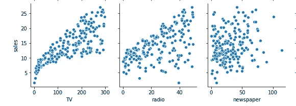
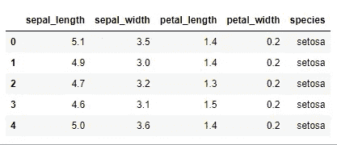
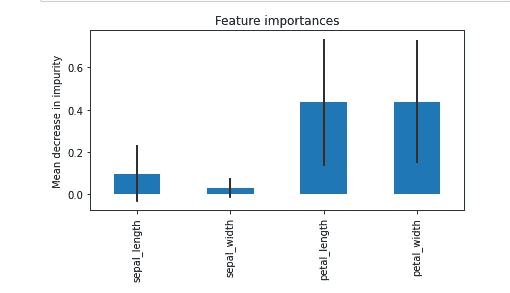

# 专题选择:科学与艺术相遇的地方

> 原文：<https://towardsdatascience.com/feature-selection-where-science-meets-art-639757d91293?source=collection_archive---------26----------------------->


戴维·克洛德在 [Unsplash](https://unsplash.com?utm_source=medium&utm_medium=referral) 上的照片

## 从启发式到算法的数据科学项目特征选择技术

有人说特征选择和工程是数据科学项目中最重要的部分。在许多情况下，并不是复杂的算法，而是特征选择决定了模型性能的差异。

太少的特征会使模型不适合。例如，如果你想预测房价，仅仅知道卧室的数量和建筑面积是不够的。你忽略了许多买家关心的重要变量，如位置、学区、房龄等。

你也可以从另一个方向来，选择 100 个不同的特征来描述每一个微小的细节，如财产上的树木名称。这些特性没有增加更多的信息，反而增加了噪音和复杂性。许多选择的功能可能完全不相关。最重要的是，太多的特征增加了训练模型的计算成本。

因此，要建立一个好的预测模型，特征的正确数量是多少，以及如何选择保留哪些特征、删除哪些特征以及添加哪些新特征？这是机器学习项目中管理所谓的[偏差-方差权衡](/bias-variance-tradeoff-in-machine-learning-an-intuition-da85228c5074)的一个重要考虑因素。

这也是“科学”与“艺术”相遇的地方

本文的目的是通过一些简单的实现来揭开特性选择技术的神秘面纱。我下面描述的技术应该同样适用于回归和分类问题。无监督分类(例如聚类)可能有点棘手，所以我将单独讨论它。

# 启发式方法

我们不太谈论数据科学中的试探法，但它非常相关。我们来看看定义(来源:[维基百科](https://en.wikipedia.org/wiki/Heuristic)):

> 启发式或启发式技术 **…**采用一种实用的方法，这种方法不能保证是最佳的、完美的或合理的，但足以达到一个直接的、短期的目标或近似值。

如果是基于直觉，这个定义同样适用于特征选择。仅仅通过查看一个数据集，你就会直觉地感觉到这样那样的特征是强有力的预测器，而其他一些特征与因变量无关，你会觉得消除它们是安全的。

如果不确定，可以进一步检查特征和因变量之间的相关性。

在数据集中有太多要素的情况下，仅这些启发式方法(直觉和相关性)就可以完成选择正确要素的大部分工作。

举个例子，假设你的公司正在分配不同渠道(电视、广播、报纸)的广告预算。你想预测哪个渠道作为广告平台最有效，预期回报是多少。

在建立模型之前，您查看历史数据，发现不同平台上的广告费用与相应的销售收入之间存在以下关系。



显示不同平台上销售额和广告支出之间关系的二元散点图(图来源:作者；数据来源: [ISLR](https://rdrr.io/cran/ISLR/) ，许可证:GLP 2，公共领域)。

根据散点图，你认为解释广告收入的最佳特征是什么？显然，报纸广告对结果没有任何重大影响，所以你可能想把它从模型中去掉。

# 自动特征选择

我们现在将进入自动特征选择技术。它们中的大部分都集成在`sklearn`模块中，所以您只需用标准格式的几行代码就可以实现特性选择。

为了演示，我将使用‘iris’数据集(来源: [Kaggle/UCI 机器学习](https://www.kaggle.com/uciml/iris/metadata)，许可证:CC0 公共域)。这是一个简单的数据集，只有 5 列，然而，你会得到关键点。

让我们从`seaborn`库中加载数据集。

```
# import seaborn library
**import seaborn as sns**# load iris dataset
**iris = sns.load_dataset('iris')
iris.head(5)**
```



```
# separate features (X) from the target (y) variable
**X = iris.drop('species', axis=1)
y = iris['species']**
```

在数据集中,“物种”是我们想要预测的，其余 4 列是预测值。让我们以编程方式确认特性的数量:

```
# number of predictors in the current dataset
**X.shape[1]**>> 4
```

现在让我们来实现一些特性选择技术。

## 1)基于卡方的技术

基于卡方的技术基于一些分数选择特定数量的用户定义的特征(k)。这些分数是通过计算 X(自变量)和 y(因变量)之间的卡方统计来确定的。

`sklearn`内置了基于卡方的特征选择方法。您所要做的就是确定想要保留多少个特征(假设虹膜数据集的 k=3)。

```
# import modules **from sklearn.feature_selection import SelectKBest, chi2**# select K best features
**X_best = SelectKBest(chi2, k=3).fit_transform(X,y)** 
```

现在让我们确认一下，我们已经获得了 4 个特性中的 3 个最佳特性。

```
# number of best features
**X_best.shape[1]**>> 3
```

对于大量的特性，您可以指定要保留或删除的特性的某个百分比。它的工作方式与上面类似。假设我们想保留 75%的特性，去掉剩下的 25%。

```
# keep 75% top features 
**X_top = SelectPercentile(chi2, percentile = 75).fit_transform(X,y)**# number of best features
**X_top.shape[1]**>> 3
```

## 2)基于杂质的特征选择

基于树的算法(如随机森林分类器)具有内置的`feature_importances_`属性。

决策树将使用减少杂质的特征来分割数据(根据[基尼杂质](https://en.wikipedia.org/wiki/Decision_tree_learning#Gini_impurity)或[信息增益](https://en.wikipedia.org/wiki/Decision_tree_learning#Information_gain)来测量)。这意味着，找到最佳特征是算法如何解决分类问题的关键部分。然后，我们可以通过`feature_importances_`属性访问最佳特性。

让我们首先将“iris”数据集与具有 200 个评估者的随机森林分类器相匹配。

```
# import model
**from sklearn.ensemble import RandomForestClassifier**# instantiate model
**model = RandomForestClassifier(n_estimators=200, random_state=0)**# fit model
**model.fit(X,y)**
```

现在让我们通过属性调用来访问特性重要性。

```
# importance of features in the model
**importances = model.feature_importances_****print(importances)**>> array([0.0975945 , 0.02960937, 0.43589795, 0.43689817])
```

上面的输出显示了 4 个特征中的每一个在减少每个节点/分裂处的杂质方面的重要性。

由于随机森林分类器有许多估计器(例如，上面的 200 个决策树)，我们可以用置信区间计算相对重要性的估计。让我们想象一下。

```
# calculate standard deviation of feature importances 
**std = np.std([i.feature_importances_ for i in model.estimators_], axis=0)**# visualization**feat_with_importance  = pd.Series(importances, X.columns)****fig, ax = plt.subplots()
feat_with_importance.plot.bar(yerr=std, ax=ax)
ax.set_title("Feature importances")
ax.set_ylabel("Mean decrease in impurity")
fig.tight_layout()**
```



图:杂质测量中特征的重要性(来源:作者)

既然我们知道了每个特性的重要性，我们就可以手动(或直观地)决定保留哪些特性，放弃哪些特性。

或者，我们可以利用 Scikit-Learn 的元转换器`SelectFromModel`来完成这项工作。

```
# import the transformer
**from sklearn.feature_selection import SelectFromModel**# instantiate and select features
**selector = SelectFromModel(estimator = model, prefit=True)
X_new = selector.transform(X)
X_new.shape[1]**>> 2
```

## 3)正规化

正则化是机器学习中减少过拟合的一个重要概念(阅读:[用正则化避免过拟合](/avoid-overfitting-with-regularization-6d459c13a61f))。如果有太多的要素，正则化通过收缩要素系数(称为 L2 正则化/岭回归)或通过将一些要素系数设置为零(称为 L1 正则化/LASSO 回归)来控制其效果。

一些线性模型内置 L1 正则化作为超参数来惩罚特征。这些特征可以用元转换器`SelectFromModel`消除。

让我们用超参数*惩罚=‘L1’*来实现`LinearSVC`算法。然后，我们将使用`SelectFromModel`删除一些功能。

```
# implement algorithm
**from sklearn.svm import LinearSVC
model = LinearSVC(penalty= 'l1', C = 0.002, dual=False)
model.fit(X,y)**# select features using the meta transformer
**selector = SelectFromModel(estimator = model, prefit=True)
X_new = selector.transform(X)
X_new.shape[1]**>> 2# names of selected features
**feature_names = np.array(X.columns)
feature_names[selector.get_support()]**>> array(['sepal_length', 'petal_length'], dtype=object)
```

## 4)顺序选择

顺序特征选择是一种古老的统计技术。在这种情况下，您将逐个向模型添加(或从中移除)特征，并检查模型性能，然后试探性地选择要保留的特征。

顺序选择有两种变体。*前向选择*技术从零个特征开始，然后增加一个最大程度地减小误差的特征；然后添加另一个特征，等等。*反向选择*反方向工作。该模型从所有特征开始并计算误差；然后，它消除一个特征，使误差进一步最小化，以此类推，直到剩下所需数量的特征。

Scikit-Learn 模块有`SequentialFeatureSelector` 元转换器，让生活更轻松。注意，它适用于`sklearn` v0.24 或更高版本。

```
# import transformer class
**from sklearn.feature_selection import SequentialFeatureSelector**# instantiate model
**model = RandomForestClassifier(n_estimators=200, random_state=0)**# select features
**selector = SequentialFeatureSelector(estimator=model, n_features_to_select=3, direction='backward')
selector.fit_transform(X,y).shape[1]**>> 3# names of features selected
**feature_names = np.array(X.columns)
feature_names[selector.get_support()]**>> array(['sepal_width', 'petal_length', 'petal_width'], dtype=object)
```

# **替代技术……**

除了我刚刚描述的技术，还有一些其他的方法可以尝试。它们中的一些并不完全是为特征选择而设计的，但是如果你深入一点，你会发现它们是如何创造性地应用于特征选择的。

*   **Beta 系数**:运行线性回归后得到的系数(Beta 系数)显示了因变量对每个特征的相对敏感度。从这里您可以选择具有高系数值的特征。
*   **p 值**:如果你在一个经典的统计软件包(如`statsmodels`)中实现回归，你会注意到模型输出包括每个特征的 p 值([看看这个](https://www.statsmodels.org/stable/regression.html))。p 值检验系数正好为零的零假设。因此，您可以消除与高 p 值相关的特征。
*   [**方差膨胀因子(VIF)**](https://etav.github.io/python/vif_factor_python.html) :通常 VIF 用于检测数据集中的多重共线性。统计学家通常移除具有高 VIF 的变量，以满足线性回归的关键假设。
*   [**【AIC/BIC】**](https://en.wikipedia.org/wiki/Akaike_information_criterion):通常用 AIC 和 BIC 来比较两个模型的性能。但是，您可以利用它来进行特征选择，例如，通过选择某些特征来获得以 AIC/BIC 衡量的更好的模型质量。
*   **主成分分析(PCA)** :如果你知道什么是 PCA，你就猜对了。这不完全是一种特征选择技术，但是 PCA 的降维特性可以用于这种效果，而不完全消除特征。
*   **和许多其他的:**有很多其他的特性选择类和`sklearn`模块一起提供，[查看文档](https://scikit-learn.org/stable/modules/classes.html#module-sklearn.feature_selection)。最近在一篇科学论文[中也提出了一种基于聚类的算法。费希尔评分是另一种可用的技术。](https://www.sciencedirect.com/science/article/pii/S2314717218300059)

# 集群怎么样？

聚类是一种无监督的机器学习算法，这意味着你将数据输入到聚类算法中，该算法将根据一些“属性”计算出如何将数据分成不同的聚类。这些属性实际上来自于特性。

聚类需要特征选择吗？当然了。没有适当的特征，集群可能是无用的。假设您想要细分客户，以便销售高端、中档和低端产品。这意味着你含蓄地使用*客户收入*作为一个因素。你也可以通过*教育*进入混。他们的*年龄*和*经验年限*？当然可以。但是，当您增加功能的数量时，算法会对您想要实现的目标感到困惑，因此输出可能并不完全是您想要的。

也就是说，数据科学家并不是在真空中运行聚类算法，他们头脑中通常有一个假设或问题。因此，功能必须符合这种需求。

# 摘要

数据科学家非常重视特征选择，因为它对模型性能有影响。对于低维数据集，试探法和直觉完美地工作，然而，对于高维数据，有自动化技术来完成这项工作。最有用的技术包括卡方和基于杂质的算法以及正则化和顺序特征选择。此外，还有其他有用的替代技术，如回归中的β系数、p 值、VIF、AIC/BIC 和维度缩减。

在这篇文章的标题里，我说的是“科学遇见艺术”。这是因为在功能选择上没有对错之分。我们可以使用科学工具，但最终，这可能是数据科学家做出的主观决定。

感谢阅读。请随意[订阅](https://mab-datasc.medium.com/subscribe)以获得我即将发布的文章的通知，或者通过 [Twitter](https://twitter.com/DataEnthus) 或 [LinkedIn](https://www.linkedin.com/in/mab-alam/) 与我联系。