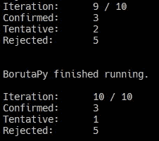
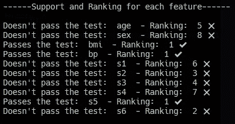
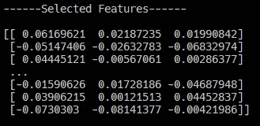
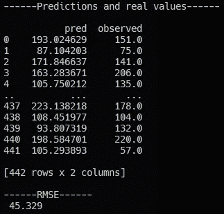

# Python 中 Boruta 的特征选择

> 原文：<https://towardsdatascience.com/feature-selection-with-boruta-in-python-676e3877e596?source=collection_archive---------6----------------------->

## *了解 Boruta 算法如何用于特征选择。说明+模板*

[卡洛琳](https://unsplash.com/@a_cat?utm_source=unsplash&utm_medium=referral&utm_content=creditCopyText)在[号宇宙飞船](https://unsplash.com/s/visual/54b7f4bd-7ab2-410c-a96a-3033270ab95e?utm_source=unsplash&utm_medium=referral&utm_content=creditCopyText)上拍摄的照片

特征选择过程是任何机器学习项目的基础。在本文中，我们将介绍 Boruta 算法，该算法允许我们对我们的特性、**进行**排序，从最重要到对我们的模型影响最小**。Boruta 使用简单，是一种强大的技术，分析师应该将它纳入到他们的管道中。**

# 介绍

Boruta 不是一个独立的算法:**它位于随机森林算法**之上。事实上，这个名字 *Boruta* 来源于斯拉夫神话中森林之魂的名字[。为了理解算法是如何工作的，我们将对随机森林做一个简单的介绍。](https://en.wikipedia.org/wiki/Leshy)

随机森林是基于**装袋**的概念——即从训练集中创建许多随机样本，并为每个样本训练不同的统计模型。对于分类任务，结果是来自模型的大多数投票，而对于回归任务，结果是各种模型的平均值。

规范装袋与随机森林的区别在于后者总是只使用**决策树模型**。对于所考虑的每个样本，决策树考虑了一组有限的特征。这使得随机森林算法能够估计每个特征的重要性，因为它基于所考虑的特征分割将误差存储在预测中。

让我们考虑一个分类任务。RF 估计特征重要性的方法分两个阶段进行。首先，**每个决策树创建并存储一个预测。**其次，通过各种训练样本随机排列某些特征的值，并重复上一步，再次追踪预测的结果。单个决策树的特征的重要性被计算为使用原始特征的模型与使用置换特征的模型之间的性能差异除以训练集中的示例数量。**特征的重要性是该特征在所有树上的测量值的平均值**。在此过程中**没有做的是计算每个特征的 z 分数**。这就是博鲁塔发挥作用的地方。

# Boruta 如何工作

Boruta 的想法既有趣又简单:对于原始数据集中的所有特征，我们将创建它们的随机副本(称为*阴影特征*)，并基于这个扩展的数据集训练分类器。**为了理解一个特征的重要性，我们将它与所有生成的阴影特征进行比较**。只有在统计上比这些合成特征更重要的特征才会被保留，因为它们对模型性能的贡献更大。让我们更详细地看看这些步骤。

1.  **创建训练集特征**的副本，并将它们与原始特征合并
2.  **在这些合成特征**上创建随机排列，以消除它们与目标变量 *y* 之间的任何相关性——基本上，这些合成特征是它们所源自的原始特征的随机组合
3.  合成特征在每次新的迭代中被随机化
4.  在每次新的迭代中，**计算所有原始和合成特征的 z 值**。如果某个特征的重要性高于所有合成特征的最大重要性，则认为该特征是相关的
5.  对所有原始特征应用统计测试并保存其结果。无效假设是一个特征的重要性等于合成特征的最大重要性。统计测试测试原始特征和合成特征之间的相等性。**当一个特征的重要性明显高于或低于一个综合特征的重要性时，零假设被拒绝**
6.  **从原始和合成数据集中移除被认为不重要的特征**
7.  重复所有步骤，重复 *n* 次，直到所有特征都被移除或被认为重要

应该注意的是，Boruta 是一种启发式算法:它的性能没有保证。因此，建议多次运行该过程，并反复评估结果。

# Boruta 在 Python 中的实现

让我们看看 Boruta 如何在 Python 中使用它的[专用库](https://github.com/scikit-learn-contrib/boruta_py)工作。我们将使用 Sklearn.datasets 的 *load_diabetes()* 数据集在一个回归问题上测试 Boruta。

特征集 X 由变量组成

*   年龄(年)
*   性
*   身体质量指数
*   平均血压
*   s1(总胆固醇)
*   s2(低密度脂蛋白)
*   s3(高密度脂蛋白，高密度脂蛋白)
*   s4(总胆固醇/高密度脂蛋白胆固醇)
*   s5 (ltg，甘油三酯水平的对数)
*   s6 (glu，血糖水平)

目标 *y* 是记录的糖尿病随时间的进展。

通过运行这个脚本，我们将在终端中看到 Boruta 是如何构建推理的

Boruta 在 Sklearn 糖尿病数据集上 10 次迭代的结果。图片作者。

这份报告可读性也很强

Boruta 结果报告——简单易懂的特征选择。图片作者。

根据 Boruta 的说法， *bmi、bp、s5* 和 *s6* 是对构建我们的预测模型贡献最大的特征。为了过滤我们的数据集并只选择对 Boruta 重要的特性，我们使用了*feat _ selector . transform(NP . array(X))*，它将返回一个 Numpy 数组。

由 Boruta 选择的特性。拟合 _ 变换。这个向量就可以用于训练了。图片作者。

我们现在准备好为我们的 RandomForestRegressor 模型提供一组选定的 X 特性。我们训练模型并打印均方根误差(RMSE)。

这是训练结果

RandomForestRegressor 模型对所选值的要素集的预测和误差。图片作者。

# 结论

Boruta 是一个强大而简单的特征选择算法，在网上得到广泛使用和赞赏，尤其是在 Kaggle 上。它的有效性和解释的简易性为数据科学家的工具包增加了价值，因为它是从著名的决策/随机森林算法扩展而来的。

尝试一下，享受一个更高性能的模型，它接收的信号比噪声多一点；)

# 推荐阅读

对于感兴趣的人来说，这里有一个我为每个与 ML 相关的主题推荐的书籍列表。在我看来，有一些必不可少的书籍对我的职业生涯产生了巨大影响。
*免责声明:这些是亚马逊会员链接。我会收到亚马逊为你推荐这些项目的一小笔佣金。你的体验不会改变，你也不会被收取更多费用，但它将帮助我扩大业务规模，围绕人工智能制作更多内容。*

*   **ML 简介** : [*自信的数据技能:掌握数据工作的基本原理，为你的职业生涯增压*](https://amzn.to/3WZ51cE) 作者:基里尔·叶列缅科
*   **sk Learn/tensor flow**:[*使用 Scikit-Learn、Keras 和 TensorFlow*](https://amzn.to/3jseVGb) 进行动手机器学习，作者 Aurelien Géron
*   **NLP** : [*文本即数据:机器学习和社会科学的新框架*](https://amzn.to/3l9FO22) 作者贾斯汀·格里默
*   **sk Learn/PyTorch**:[*用 py torch 和 Scikit 进行机器学习——Learn:用 Python 开发机器学习和深度学习模型*](https://amzn.to/3wYZf0e)Sebastian Raschka
*   Cole Knaflic 著 **Data 即** : [*用数据讲故事:商务人士数据可视化指南*](https://amzn.to/3HUtGtB)

# 有用的链接(我写的)

*   **了解如何在 Python 中执行顶层探索性数据分析**:[*Python 中的探索性数据分析——一步一步的过程*](/exploratory-data-analysis-in-python-a-step-by-step-process-d0dfa6bf94ee)
*   **学习 TensorFlow 的基础知识**:[*tensor flow 2.0 入门—深度学习入门*](https://medium.com/towards-data-science/a-comprehensive-introduction-to-tensorflows-sequential-api-and-model-for-deep-learning-c5e31aee49fa)
*   **用 Python 中的 TF-IDF 进行文本聚类** : [*用 Python 中的 TF-IDF 进行文本聚类*](https://medium.com/mlearning-ai/text-clustering-with-tf-idf-in-python-c94cd26a31e7)

**如果你想支持我的内容创作活动，欢迎点击我下面的推荐链接，加入 Medium 的会员计划**。我将收到你投资的一部分，你将能够以无缝的方式访问 Medium 的大量数据科学文章。

<https://medium.com/@theDrewDag/membership>  

# 代码模板

这是本文中展示的整个代码的复制粘贴版本。