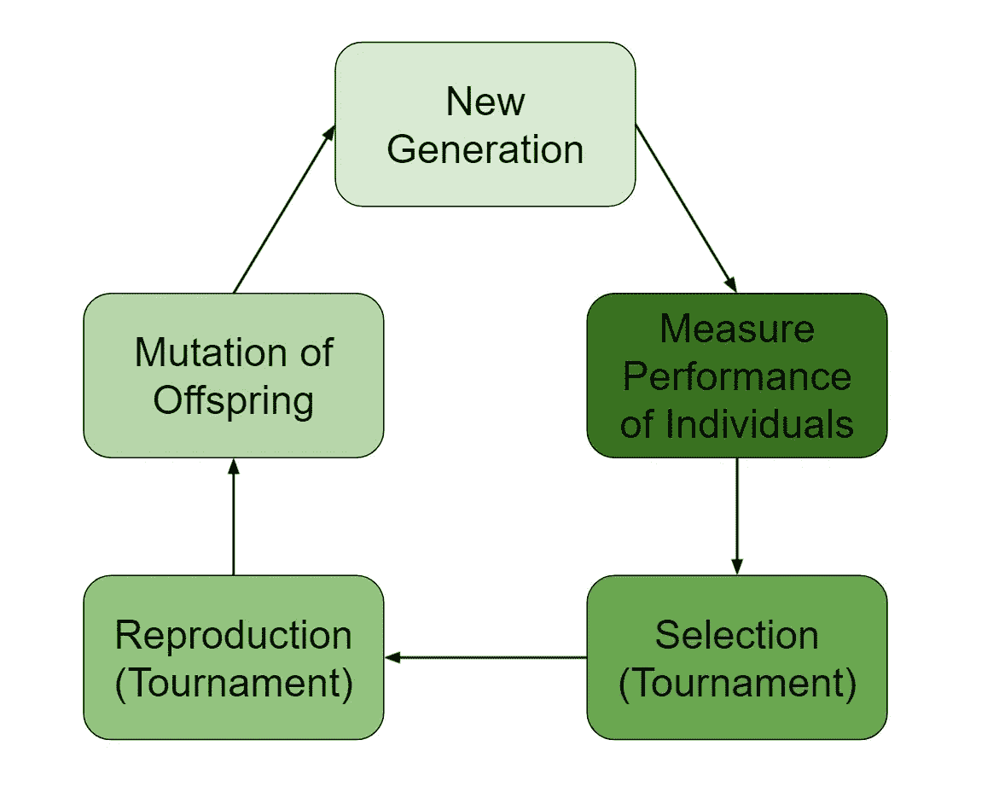
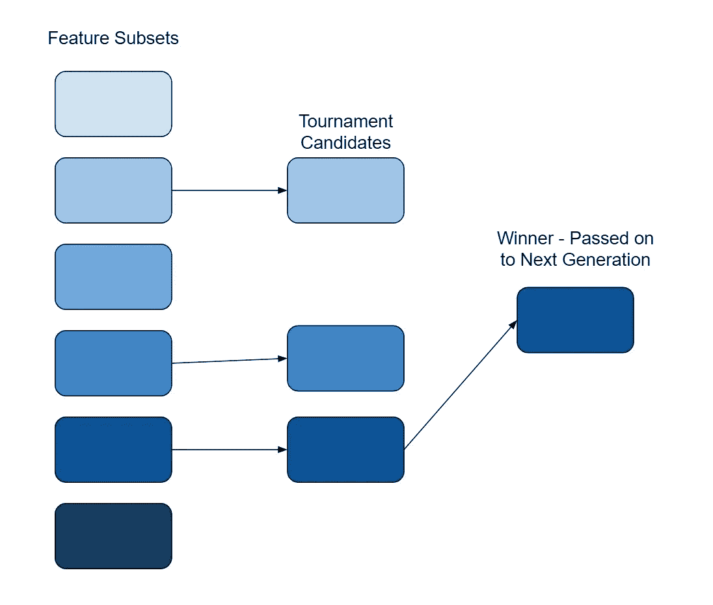
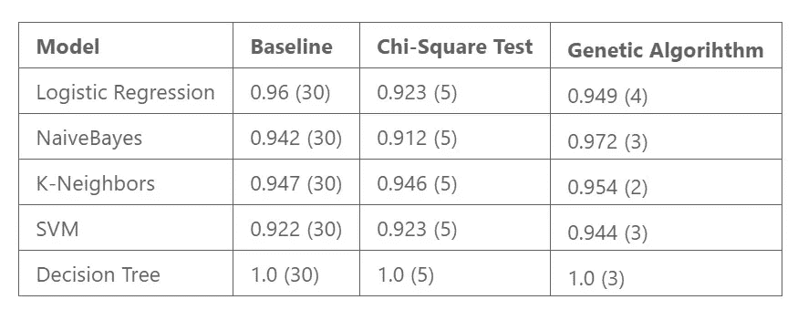

# 基于遗传算法的特征选择

> 原文：<https://towardsdatascience.com/feature-selection-with-genetic-algorithms-7dd7e02dd237?source=collection_archive---------2----------------------->

## 确定最佳特征集的自然选择过程。


尤金·日夫奇克在 [Unsplash](https://unsplash.com?utm_source=medium&utm_medium=referral) 上拍摄的照片

遗传算法是一种基于自然选择的优化问题的技术。在这篇文章中，我将展示如何使用遗传算法进行特征选择。

虽然在 *scikit-learn* 中有许多众所周知的特性选择方法，但特性选择远远超出了那里可用的范围。

特征选择是任何机器学习管道的关键方面。然而，这些天有过剩的可用数据。因此，通常会有过多的功能。

正如许多特性经常出现的情况一样，许多特性是多余的。它们给你的模型增加了噪声，并使模型解释成问题。

问题是确定什么特性与问题相关。目的是要有质量特征。

# **遗传算法**

这篇文章使用了' *sklearn-genetic'* 包:

[](https://github.com/manuel-calzolari/sklearn-genetic) [## GitHub-manuel-calzo lari/sk learn-Genetic:sci kit-learn 的遗传特征选择模块

### 学习遗传算法模拟自然选择的过程来搜索…

github.com](https://github.com/manuel-calzolari/sklearn-genetic) 

该软件包与现有的 *sklearn* 模型兼容，并为基因选择提供了大量的功能和选项。

在这篇文章中，我使用遗传算法进行特征选择。但是，遗传算法也可以用于超参数优化。因为这些步骤非常简单和通用，它适用于许多不同的领域。



遗传算法(图片由作者提供)

## 特征选择

特征选择是一个 NP 难问题。给定一组功能，最佳配置是这些功能的集合或子集。这种方法是一种离散选择。由于各种可能性，确定最佳特征集的成本非常高。

遗传算法使用一种基于进化的方法来确定最优集合。对于特征选择，第一步是基于可能特征的子集生成群体。

从这个群体中，使用目标任务的预测模型来评估子集。一旦群体中的每个成员都被考虑，就会进行一场比赛来确定哪些子集将延续到下一代。下一代由锦标赛获胜者组成，具有一些交叉(用来自其他获胜者的特征更新获胜特征集)和突变(随机引入或移除一些特征)。

1.  产生初始群体。
2.  一个分数被附加到群体的成员上。
3.  选择一个子集用于比赛的再现。
4.  选择遗传物质来传递。
5.  应用突变。
6.  重复多代。

该算法运行一定数量的代(迭代)。之后，群体中的最优成员就是所选择的特征。

# 实验

实验基于 UCI 乳腺癌数据集，该数据集包含 569 个实例和 30 个特征。有了这个数据集，我用所有的特征、来自遗传算法的特征子集和使用卡方检验进行比较的五个特征来测试几个分类器。

下面是使用遗传算法选择最多五个特征的代码。

```
from sklearn.datasets import load_breast_cancer
from genetic_selection import GeneticSelectionCV
from sklearn.tree import DecisionTreeClassifier
import pandas as pd
import numpy as npdata = load_breast_cancer()
df = pd.DataFrame(data.data, columns=data.feature_names)
df['target'] = data.target
X = df.drop(['target'], axis=1)
y = df['target'].astype(float)estimator = DecisionTreeClassifier()
model = GeneticSelectionCV(
    estimator, cv=5, verbose=0,
    scoring="accuracy", max_features=5,
    n_population=100, crossover_proba=0.5,
    mutation_proba=0.2, n_generations=50,
    crossover_independent_proba=0.5,
    mutation_independent_proba=0.04,
    tournament_size=3, n_gen_no_change=10,
    caching=True, n_jobs=-1)
model = model.fit(X, y)
print('Features:', X.columns[model.support_])
```

## 遗传学选择

初始群体(大小为‘n _ population’)是从特征集的样本空间中随机生成的。这些集合的范围受到参数“max_features”的限制，该参数设置每个特征子集的最大大小。

对于初始群体的每个成员，用目标度量来测量分数。这个度量是指定的估计器的性能。

进行锦标赛选择以确定哪些成员将延续到下一代。锦标赛中的成员数量由“锦标赛大小”设置。锦标赛规模是从人群中选择一些成员，根据得分标准相互竞争。锦标赛的获胜者被选为下一代的父母。



锦标赛选择流程(图片由作者提供)

参加锦标赛的人数应该保持在很少的水平。当该值相当大时，通常选择当前最佳成员。这种行为不会导致较弱的成员被选中。虽然提供了暂时的性能增益，但最终会导致整体性能下降，因为较弱的选项没有机会改进。

## 自然选择

在自然选择中，遗传信息储存在染色体中。在生殖过程中，一些遗传物质从父母传给子女。那么这个孩子就包含了父母双方的遗传物质。该属性用参数“crossover_proba”表示。指定的概率表示从一个世代到下一个世代的交叉机会。还有参数‘crossover _ independent _ proba’，是一个特征交叉到子代的概率。

进化的一个重要方面是突变。变异降低了搜索陷入局部最优和停滞的风险。在每一代中，除了交叉之外，还会添加一个随机突变。突变发生的概率由参数‘突变 _ 概率’设定。这个参数与' mutation_independent_proba '相结合，是将一个特性添加到特性集的机会。

值得注意的是，将这个概率设置得太高会将算法转换成随机选择过程。因此，您会希望保持这个值相对较低。在每一代中随机引入特征有效地作为遗传过程的正则化。

这里使用的遗传搜索算法也有一个“n_gen_no_change”参数，用于监控种群中的最佳成员在几代中是否没有发生变化。搜索在这种情况下找到了一个最优解。考虑增加突变或交叉概率以进一步改变选择。

## 结果

遗传特征选择与卡方特征选择的结果如下所示。基准性能也使用所有特性列出。结果来自交叉验证，测量的性能是准确性，使用的特征数量在括号中。



特征选择性能比较(图片由作者提供)

虽然这些结果决不是结论性的，但它们显示了遗传算法的好处。模型性能基于来自遗传算法的特征子集，该特征子集一贯优于基线模型和卡方特征子集。逻辑回归模型有一个例外，其结果仍然具有可比性。

此外，产生的最佳特征子集小于五个特征的最大值。具有较少特征的模型最终比更大的模型更受青睐，因为它们更简单且更易解释。

# 结论

遗传算法是难以置信的多才多艺，适用于广泛的场景。

这篇文章使用 sklearn-genetic 包探讨了如何将遗传算法用于特征选择。这些算法在超参数搜索和创成式设计中也被证明是有效的。

虽然没有 sklearn 中现有的方法那么传统，但遗传算法提供了一种独特而实用的特征选择方法。这些算法优化的方式远远不同于大多数其他特征选择方法。这个过程是基于纯粹的自然选择方法。

我鼓励数据科学家在工作中花时间理解和实现遗传算法。

如果你有兴趣阅读关于新颖的数据科学工具和理解机器学习算法的文章，可以考虑在 Medium 上关注我。

*如果你对我的写作感兴趣，想直接支持我，请通过以下链接订阅。这个链接确保我会收到你的会员费的一部分。*

[](https://zjwarnes.medium.com/membership) [## 通过我的推荐链接加入 Medium-Zachary Warnes

### 阅读扎卡里·沃恩斯(以及媒体上成千上万的其他作家)的每一个故事。您的会员费直接支持…

zjwarnes.medium.com](https://zjwarnes.medium.com/membership)