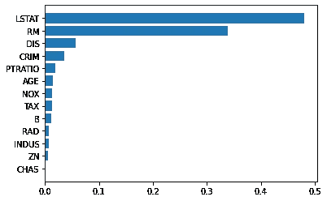
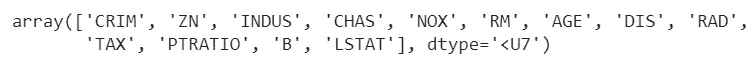
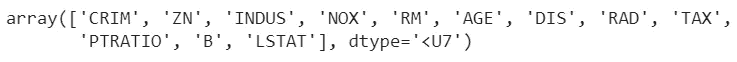

# 随机森林特征选择

> 原文：<https://towardsdatascience.com/feature-selection-with-random-forest-3e1979b3a2dc?source=collection_archive---------27----------------------->

## 让我们看看如何使用随机森林进行特征选择


史蒂文·卡梅纳在 [Unsplash](https://unsplash.com?utm_source=medium&utm_medium=referral) 上拍摄的照片

特征选择一直是机器学习中的一大难题。根据我的经验，我可以说这是数据科学项目中最重要的一部分，因为它帮助我们降低数据集的维度，去除无用的变量。幸运的是，有一些模型可以帮助我们计算特性的重要性，这有助于我们忽略不太有用的特性。随机森林就是这样一个模型。

# 什么是随机森林？

随机森林是一个监督模型，实现了决策树和 bagging 方法。其思想是根据一个称为“引导”的过程对训练数据集进行重新采样。每个样本都包含原始列的一个随机子集，用于拟合决策树。模型的数量和列的数量是要优化的超参数。

最后，将树的预测混合在一起，计算平均值(用于回归)或使用软投票(用于分类)。

bagging 的思想是，通过平均单个决策树的输出，根据偏差-方差权衡，标准误差减小，模型的方差也减小。这就是为什么兰登森林在最近几年变得非常有名。

# 随机森林如何计算特征重要性？

随机森林的每棵树可以根据其增加叶子纯度的能力来计算特征的重要性。这是一个关于分类和回归树(CART)如何工作的话题。叶子纯度的增量越高，该特征的重要性越高。对每棵树都这样做，然后在所有树中平均，最后归一化为 1。因此，由随机森林计算的重要性分数之和是 1。

# 使用递归特征消除的特征选择

一旦我们知道了每个特征的重要性，我们就使用一个叫做递归特征消除的过程来执行特征选择。在本文中，我将讨论利用 k-fold 交叉验证的版本。

想法是拟合模型，然后移除不太相关的特征，并计算 CV 中某些性能指标的平均值。然后，我们删除倒数第二个重要特征，再次拟合模型，并计算平均性能。我们一直这样做，直到没有特征剩下。最大化 CV 性能的特性集是我们必须使用的特性集。请注意，整个过程需要对超参数使用相同的值。

# Python 中使用随机森林的特征选择

既然理论已经很清楚了，那我们就用 sklearn 在 Python 中应用一下吧。对于本例，我将使用波士顿数据集，这是一个回归数据集。

让我们首先导入我们需要的所有对象，即我们的数据集、随机森林回归器和将使用 CV 执行 RFE 的对象。最后，matplotlib 用于可视化我们的结果。

```
import numpy as np from sklearn.datasets 
import load_boston from sklearn.ensemble 
import RandomForestRegressor from sklearn.model_selection 
import train_test_split from sklearn.feature_selection 
import RFECV import matplotlib.pyplot as plt
```

首先，让我们加载数据集。

```
X,y = load_boston(return_X_y=True) 
features = load_boston()['feature_names']
```

现在我们可以把它分成训练和测试。

```
X_train, X_test, y_train, y_test = train_test_split( X, y, test_size=0.33, random_state=42)
```

现在我们可以拟合我们的随机森林回归量。在实际项目中，我们必须优化超参数的值。对于这个例子，我将使用默认值。我将只设置随机状态，以使结果可重复。

```
rf = RandomForestRegressor(random_state=0) 
rf.fit(X_train,y_train)
```

拟合回归变量后，特征的重要性存储在估计器实例的 *feature_importances_* 属性中。

例如，让我们画一个条形图，按照从最重要到不太重要的顺序排列特性。我们必须创建一个元组列表。元组的第一个元素是特征名，第二个元素是重要性。然后，我们根据重要性值对列表进行排序，并绘制一个水平条形图。

```
f_i = list(zip(features,rf.feature_importances_)) 
f_i.sort(key = lambda x : x[1]) plt.barh([x[0] for x in f_i],[x[1] for x in f_i]) 
plt.show()
```



作者图片

正如我们所看到的，LSTAT 特性是最重要的，其次是 RM、DIS 和其他特性。水平条形图是表示特性重要性的非常有用的图表。

现在，让我们根据交叉验证的 RFE，使用特征重要性来选择最佳特征集。对于本例，我们试图优化的指标是负均方误差。我们将使用 5 个折叠进行交叉验证，这是一个非常好的值。

```
rfe = RFECV(rf,cv=5,scoring="neg_mean_squared_error") 
rfe.fit(X_train,y_train)
```

整套功能包括:



所选功能包括:

```
selected_features = np.array(features)[rfe.get_support()]
```



正如我们所看到的，RFE 忽略了不太相关的特性(CHAS)。

# 结论

随机森林对于回归和分类都是一个非常强大的模型。它还可以给出它自己对特征重要性的解释，这可以被绘制并用于根据例如递归特征消除过程来选择信息最丰富的特征集。正确使用，特性重要性可以给我们很好的和容易理解的可交付物(条形图)和有效的优化(特性选择)。这就是为什么我认为特征重要性是每个机器学习项目的必要组成部分。

www.yourdatateacher.com*上* [*教授机器学习和数据科学的数据科学家吉安卢卡·马拉托。*](http://www.yourdatateacher.com/)

*原载于 2021 年 10 月 11 日 https://www.yourdatateacher.com*<https://www.yourdatateacher.com/2021/10/11/feature-selection-with-random-forest/>**。**