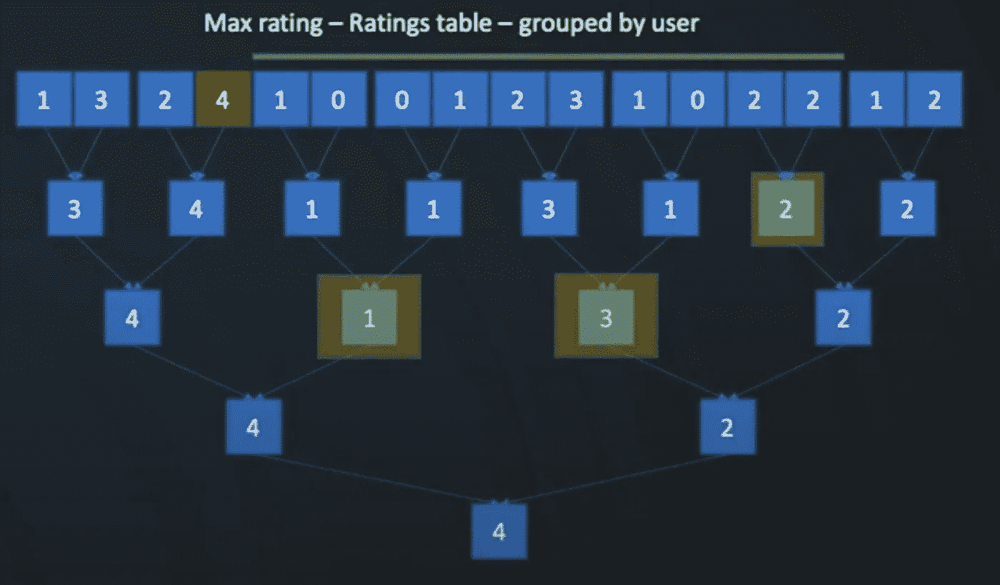
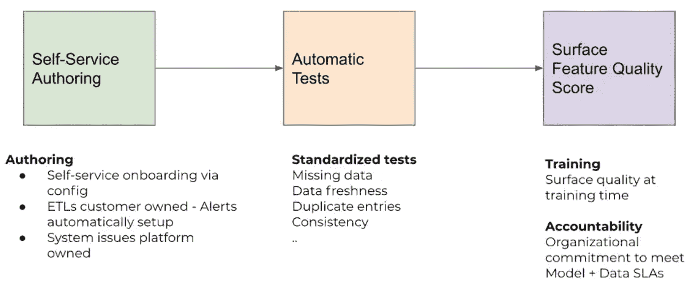
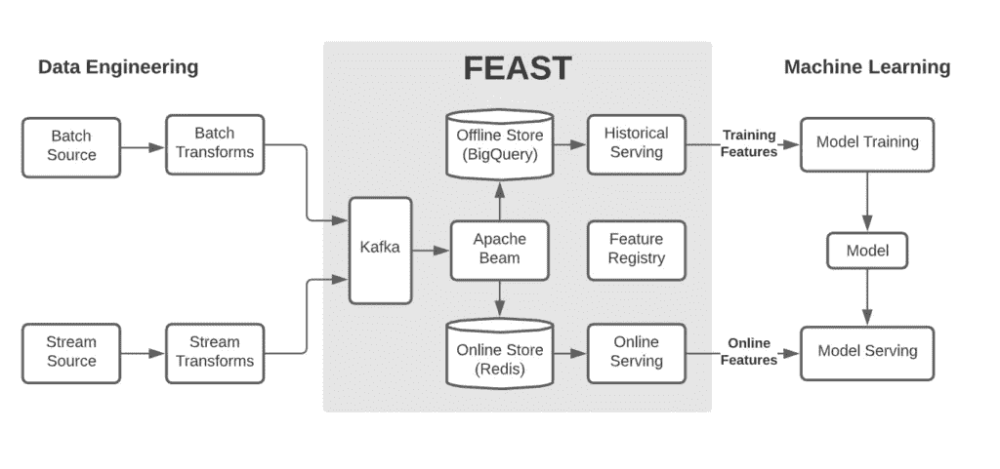

# 特征存储:机器学习的数据平台

> 原文：<https://towardsdatascience.com/feature-store-data-platform-for-machine-learning-455122c48229?source=collection_archive---------10----------------------->

## 最先进的开源和自主开发的功能商店，可大规模生成、管理和提供功能


[图片](https://unsplash.com/photos/2xEQDxB0ss4)提供: [unsplash](https://unsplash.com/) 上的 [dlanor_s](https://unsplash.com/@dlanor_s)

**特征数据**(或简称为**特征**)对于**机器学习** (ML)模型做出的准确预测至关重要。**特征存储**最近成为 ML 堆栈的重要组成部分，它通常支持以下任务作为 ML 工作流的一部分:

1.  自动化特征计算，例如回填、UDF
2.  管理功能元数据，例如沿袭、版本
3.  跨不同团队共享和重用功能
4.  离线、实时或按需提供或提取功能
5.  监控功能从生成到服务的整个生命周期

对于“最先进的”特征商店的调查，[](https://www.featurestore.org/)**https://www.featurestore.org/整合并比较了主要的类似“特征商店”的系统。如上所述，许多科技公司由于其独特的数据架构和业务需求，已经在内部建立了自己的功能商店。例如，优步的业务是为用户提供低延迟服务。对于 Airbnb 来说，个性化推荐是让旅行者在他们的平台上预订住宿的关键。**

**在这样的组织中，跨不同业务单位的多个 ML 数据团队可能独立地操作相同的 ML 工作流，因此有必要整合工作并提供一个功能存储来标准化和管理功能的整个生命周期并为所有团队服务。**

**将上述想法反馈到 ML 社区，为一般 ML 用例建立一个标准的、开箱即用的特性库听起来很有希望，可能从小规模的简单用例开始。**

**下面，我将简要介绍两家科技公司的主要特色商店:**优步和 Airbnb** ，以及一家开源特色商店: [**盛宴**](https://feast.dev/) **。**最后分享一下我个人对通用 ML 平台的想法。**

## **Airbnb: Zipline**

**Airbnb 至少在 4 年前建立了他们的特色商店，名为 Ziplin。最近的一次演讲来自于 [Spark AI 2020](https://www.youtube.com/watch?v=LjcKCm0G_OY) ，以下是我的心得:**

**(Airbnb 的许多功能都是从“滑动窗口”操作中产生的。请参阅以下示例功能(过去 30 天内对一家餐厅的平均评分)。**

```
rating_features = GroupBy(
    sources=EventSource(
        event_stream="restaurant_check_in_stream",
        event_log_table="core_data.restaurant_check_ins",
        query=Query(
            select=Select(
                restaurant="id_restaurant",
                rating="CAST(rating as Double) - 2.5",
            )
        )
    )
    keys=["restaurant"],
    aggregations=Aggregations(
        avg_rating=Aggregation(
            documentation="Avg rating for this restaurant",
            operation=AVG,
            inputColumn="rating",
            **windows=[Window(length=30, timeUnit=TimeUnit.DAYS)]**
        )
    )
)
```

**(2)为了有效地支持滑动窗口操作，他们提出了一个算子的性质，称为“可逆性”。**

```
Reversible: (a + b) - a = b
```

**有些运算符具有上述性质，例如，*和*，*平均*，【AVG】，，*计数*。当在滑动窗口中计算时，他们不需要为整个窗口进行计算，相反，由于“可逆性”属性，他们只是丢弃窗口之外的内容，并向窗口添加新的内容。**

****

**滑动窗口示例**

**有些运算符不具有“可逆性”属性，如 *Min* ， *Max* 。当在滑动窗口中计算这种算子时，在滑动窗口内的数据上建立一个二叉树，这样当旧数据滑出和新数据进入时，二叉树被调整，并且它的根总是 *Min* 、 *Max 等的答案。***

****

**图片来源:https://www.youtube.com/watch?v=LjcKCm0G_OY[的滑索演示](https://www.youtube.com/watch?v=LjcKCm0G_OY)**

**例如，4 曾经是窗口中的最大值。当 4 滑出时，将从 1 中选择根，3，2 和 3 将是新的根。**

**通过利用树结构，时间复杂度从 O(N)降低到 O(NlogN ),空间复杂度从 2N 降低到 N**

## **优步:米开朗基罗调色板**

**早期，优步开始建立他们的特色商店，叫做米开朗基罗调色板。最近的演讲是[在这里](https://vimeo.com/477753622)，我的收获是:**

**(1) 80%的 ML 工作负荷是特征工程，例如，发现好的特征、大规模地提供特征、特征对等性(训练/服务偏斜)、实时特征、特征可观察性。**

**(2)以下抽象使得特征有组织、可重用、高效:**

*   ***实体*:优步的一个业务单位，如顺风车、司机、优步 Eats**
*   ***特性组*:一组常用的特性**
*   ***特征* : ML 就绪数据点**
*   ***连接键*:用于连接用户标识、餐厅标识等功能的键。这允许在现有特征的基础上创建新特征。**

**(3)三大类特征**

*   **批量特征(通过[火花](https://spark.apache.org/)):例如 *sum_orders_1week，avg_order_size_30day***
*   **近实时特征(通过[卡夫卡](https://kafka.apache.org/)、[弗林克](https://flink.apache.org/)):例如*眼球 _ 印象 _ 5 _ 分钟***
*   **RPC 特征(来自外部 API、第三方的信号):例如 *geohash***

**(4)特征质量监控:特征管道断裂、特征数据缺失、漂移和不一致是常见的。已经实施了以下方法来解决这些问题:**

****

**图片来源:https://vimeo.com/477753622[的优步特色工程展示](https://vimeo.com/477753622)**

## **盛宴:开源特性商店**

**GoJek/Google 在 2019 年初发布了[盛宴](https://feast.dev/)，它是围绕 Google 云服务而构建的:[大查询](https://cloud.google.com/bigquery)(离线)和[大表](https://cloud.google.com/bigtable)(在线)和 [Redis](https://redis.io/) (低延迟)，使用 [Beam](https://beam.apache.org/) 进行特征工程。**

****

**图片来源:盛宴建筑[https://feast.dev/post/a-state-of-feast/](https://feast.dev/post/a-state-of-feast/)**

**从目前的 Feast 架构来看，它的重点是特性存储、服务和注册。[这里](https://feast.dev/post/a-state-of-feast/)是一篇很棒的文章，介绍什么是盛宴，当前的挑战是什么，下一个是什么。**

## **我的想法**

**对于通用 ML 数据平台，以下是我的 3 点个人想法:**

**(1)最有价值和最具挑战性的问题之一是从原始数据到高质量、ML 友好特性的数据转换。解决这个问题高度依赖于 ML 工程师的领域知识，并由业务用例驱动。换句话说，一个独立的 ML 数据平台如果不服务于特定的业务场景、用例，不与优秀的 ML 工程师团队无缝协作，那么它就是无效的。**

**(2)在**技术**方面，ML 数据平台需要支持下面的各种主流基础设施，无论它们是开源的还是商业的，是在内部运行还是在云上运行。关于平台 API，它必须支持流行的编程语言，比如 Python。出于安全考虑，it 必须提供企业级授权和身份认证，以便为北美和欧洲等监管严格的地区的客户提供服务。对于数据隐私，it 部门必须完全遵守当地政策，绝不妥协。**

**(3)在**规模**方面，随着 ML 数据平台外部产品用户和内部用户的快速增长，在业务用例和技术栈上应该高度规模化。仅举几个例子，**

*   **提供一个通用和灵活的接口，让 ML 工程师能够容易和准确地描述任何类型的特征**
*   **每天优化数千个新功能的上线**
*   **跨不同的领域有效且高效地应用不断变化的隐私策略**
*   **管理异构基础架构，将新出现的基础架构添加到设备群中，并顺利淘汰旧的基础架构。**