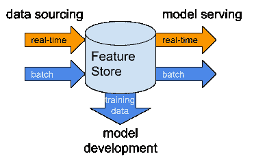

# 功能商店需要一个 HTAP 数据库

> 原文：<https://towardsdatascience.com/feature-stores-need-an-htap-database-f4fae96c9e0e?source=collection_archive---------31----------------------->

图片经由 [Cybrain](https://stock.adobe.com/contributor/200906733/cybrain?load_type=author&prev_url=detail) /Adobe Stock 在 Zer0 到 5ive 的许可下

特征存储是用于训练和服务机器学习模型的组织和管理的特征的集合。使它们保持最新、服务于特征向量以及创建训练数据集需要结合事务性(OLTP)和分析性(OLAP)数据库处理。这种混合工作负载数据库被称为混合事务分析处理的 HTAP。

最有用的要素存储包含数据管道，这些管道通过与源数据节奏相匹配的批处理或实时处理来持续保持其要素最新。因为这些特征总是最新的，所以它们提供了用于推理的特征向量的理想来源。特征向量甚至可以从特征库中实时传递。完整的特征存储保存特征值的历史，并使用它来创建时间准确的训练数据集。

生产中的特征存储保持特征值最新，使 ML 模型能够快速进入生产。通常，功能是基于共同的上下文(即客户、产品、位置)和数据节奏进行分组的。为每个组提供适当节奏的数据管道使功能保持最新。有了现成的精选特征，许多推理引擎无需任何额外的努力就可以访问它们。

功能存储数据流

在上图中，我们用橙色表示低延迟/高并发处理，这通常是 OLTP 数据库的特征。我们用蓝色表示大规模并行处理数据库引擎(通常称为 OLAP)中的高容量数据处理。让我们来看看为什么我们需要两者来最大限度地运行一个特性库。

**批量数据流水线**定期发生(通常一天或一周一次)。它们通过提取、加载、清理、聚合和以其他方式将数据管理成可用的特征来处理大量的源数据。建立 RFM 客户档案是一个常见的例子。客户活动用于计算多个类别和多个移动时间窗口(可能包括过去 24 小时、上周、上月和去年)的近期、频率和货币指标。为大量客户和交易转换这些数据通常需要并行处理，随着业务增长导致数据量增加，这种并行处理可以扩展。

**训练数据集**是通过扫描和连接具有感兴趣的特征和事件历史的大型数据集而创建的。这些联接跨越多个不同的特征组，并将每个训练案例与对应于每个事件时间的特征值准确地绑定在一起。这就产生了最适合 MPP/OLAP 处理的复杂连接条件。

另一方面，需要**实时数据管道**来驱动 ML 模型，用于实时地直接对最终用户交互做出反应。一个例子是产品推荐引擎或下一个最佳行动模型，其中用户活动直接影响推理使用的特征值。在这种情况下，特征的源需要通过流或直接数据库插入或更新操作实时连接到特征存储。在处理这些消息/事务时，它们会及时生成新的特征值，以便后续的推理读取它们。这种操作通常一次只影响少量的行，但有可能产生非常高的并发性。

在许多情况下，用户交互可能涉及多个功能集。重要的是，当为了推断而读取时，所有的特征值都与用户最近的动作一致。这推动了对数据库引擎中保证这种一致性的 ACID 属性的需求。这些高并发、低延迟的工作负载最好由 OLTP 数据库引擎来处理，这些引擎可以随着用户和业务活动的增长而扩展。

很少有数据库同时支持这两种工作负载并提供水平可伸缩性。随着特征存储成为具有实时解决方案的机器学习平台中的标准实现模式，将需要这种规模的 HTAP 数据库。所以现在，商用拼接机就是这样一个数据库引擎，提供符合 ACID 的 OLTP 和 OLAP 引擎，它们可以独立伸缩。 [Splice Machine 的特征库](https://splicemachine.com/product/feature-store/)及其数据库内模型部署提供了一个完美的组合，可直接在特征库上提供实时和批量推理。