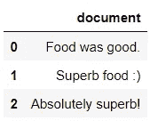
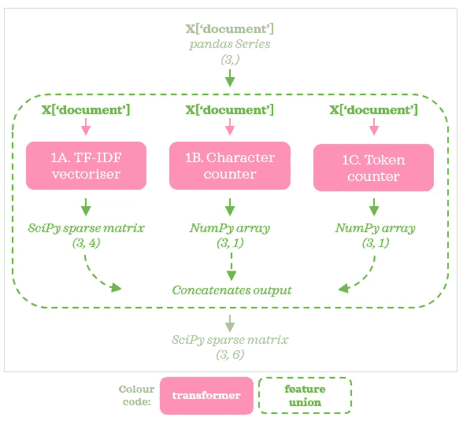
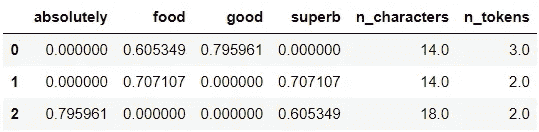
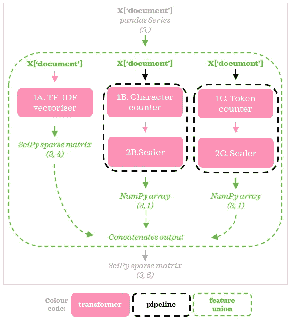
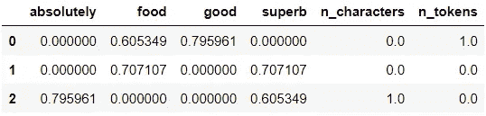
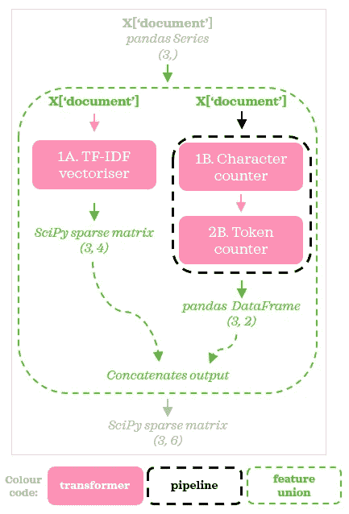
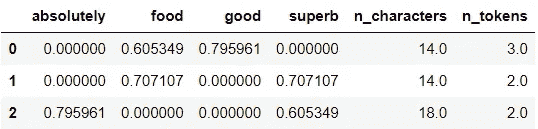
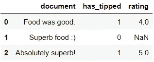
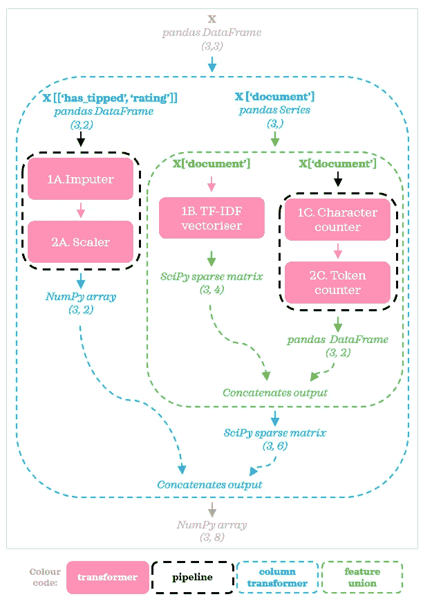
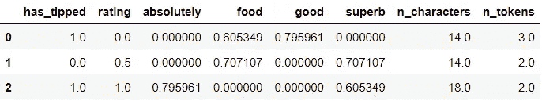

# 用于预处理文本数据的 FeatureUnion、ColumnTransformer 和 Pipeline

> 原文：<https://towardsdatascience.com/featureunion-columntransformer-pipeline-for-preprocessing-text-data-9dcb233dbcb6?source=collection_archive---------24----------------------->

## 了解如何在 NLP 项目中应用这些工具

假设您已经使用矢量器(例如`TfidfVectorizer`、`CountVectorizer`)将文本数据预处理成矩阵，作为模型的准备。您可能会想到，导出其他特征(比如文档的长度)也可能对您的模型有用。虽然有许多可能的方法来组合这些预处理步骤，但是利用`FeatureUnion`、`ColumnTransformer`和/或`Pipeline`可能是完成该任务的最佳方法之一。在本帖中，我们将通过几个例子来了解如何应用这些令人敬畏的工具(主要关注`FeatureUnion`)。

[杰瑞米·托马斯](https://unsplash.com/@jeremythomasphoto?utm_source=medium&utm_medium=referral)在 [Unsplash](https://unsplash.com?utm_source=medium&utm_medium=referral) 上的照片

虽然没有必要，但在阅读本文之前，对以下主题有所了解可能会有所帮助。
◻️`TfidfVectorizer`t16】◻️`Pipeline`、`ColumnTransformer`和`FeatureUnion`

在这篇文章中，我们不会详细解释这些概念，因为它们会在下面两篇文章中解释。

🔗 [*TF-IDF 解说*](/introduction-to-nlp-part-3-tf-idf-explained-cedb1fc1f7dc)🔗 [*管道、列变压器和特性联合解释*](/pipeline-columntransformer-and-featureunion-explained-f5491f815f)

相反，我们将直接进入他们的文本预处理应用程序！

# 0.设置和数据🔧

让我们从导入必要的库开始，并在餐馆评论上创建一个最小的可用玩具数据集:

保持较小的数据集将有助于更好地理解该过程，并更专注于实际 *sklearn 工具*的实际应用。

# 1.并联变压器

## 1.1.不带`Pipeline`

假设我们预处理的目标是对文本进行矢量化，并从文本中提取两个特征。更准确地说，我们希望做到以下几点:

◻️ ️Vectorise *“文档”*列带`TfidfVectorizer` ◻️️添加显示文本长度的功能带`CharacterCounter`
◻️️添加显示文本中字母数字标记数量的功能带`TokenCounter`

`CharacterCounter`和`TokenCounter`是我们将要创建的定制变形金刚。我们不能在单个`Pipeline`中顺序地链接这三个，因为`TfidfVectorizer`只将文本列作为输入，并输出一个没有原始文本列的稀疏矩阵。`FeatureUnion` 是这种情况下的完美工具。由于`FeatureUnion` 的行为就好像它创建了输入数据的副本，我们可以用并行转换器设计这样的预处理流程:

作者图片

每个流都接受相同的输入:`X[‘document’]`，输出被连接起来。为了简洁明了，我们从这里开始将这些流称为*流 A* 、*流 B* 和*流 C* 。现在，让我们将流程翻译成代码:

Tada！我们已经使用`FeatureUnion`对数据进行了预处理。

## 1.2.用`Pipeline`

让我们用`Pipeline`来扩展我们之前的例子。这一次，我们将使用缩放器扩展*流 B* 和*流 C* 。换句话说，下面总结了我们的目标:

◻️️用`TfidfVectorizer` 向量化*‘文档’*列◻️️用`CharacterCounter`添加显示文本长度的特征，然后用`MinMaxScaler`缩放
◻️️用`TokenCounter`添加显示文本中字母数字标记数量的特征，然后用`MinMaxScaler`缩放

使用`Pipeline`，预处理流程可以总结如下:

作者图片

管道给了我们灵活性，我们可以用更多的转换器来扩展任何流。虽然在本例中，两个*流 B & C* 使用相同的定标器，但它们不必相同，因为它们彼此独立。所以现在代码变成了:

正如我们所看到的，`FeatureUnion`帮助我们保持预处理步骤有组织，并编写干净的代码。

# 2.顺序变压器

现在让我们看看从 1.1 节获得相同输出的另一种方法。我们可以不添加并联变压器，而是将*流 B* 和*流 C* 合并，并在`Pipeline`中按如下顺序放置:

作者图片

为了让这个流程工作，我们需要调整我们的定制转换器，为它们创建一个名为`counter_pipe`的管道，并更新`preprocessor`:

我们可以用不同的方式设计预处理流程，同时仍然得到相同的结果。在这个特殊的例子中，我更喜欢 1.1 节中的方法。与这种替代方法相比。一般来说，这取决于用例以及个人偏好。

📍**练习:**尝试扩展上面的代码，从第 1.2 节获得相同的输出。

# 3.带列变压器

最后，这个例子是我最喜欢的，也是本帖中所有例子中最令人兴奋的一个。我们将利用所有三种工具:`FeatureUnion`、`ColumnTransformer`和`Pipeline`，其中每一种工具都发挥着独特的作用，并相互补充。

实际上，数据包含文本和非文本列的情况并不少见。例如，文字评论也可能伴随着星级评论。在这种情况下，我们将研究如何对所有信息进行预处理，这样我们就不会丢弃潜在的有价值的信息。让我们用一些数字特征来扩展数据集。

现在我们预处理的目标是:

◻️️用`TfidfVectorizer` 向量化*‘文档’*列◻️️用`CharacterCounter`
添加显示文本长度的功能◻️️用`TokenCounter`
添加显示文本中字母数字标记数量的功能◻️️用*‘has _ tipped’*和*‘rating’*列使用`SimpleImputer`中值，然后用`MinMaxScaler`缩放它们

现在预处理流程可以如下所示:

作者图片

使用`ColumnTransformer`，我们将数据集分成两个流。左侧流有一个带两个变压器的`Pipeline`。右边的流与我们在第 2 节中看到的`FeatureUnion`相同。使用我们在上一节中定义的转换器，我们可以这样定义新的流:

瞧啊。希望这展示了一个`FeatureUnion,` `ColumnTransformer`，`Pipeline`如何和谐工作的实际用例。

# 4.结束语

熟练运用`FeatureUnion,``ColumnTransformer``Pipeline`是数据科学家的一项有用技能。有了这些工具，预处理过程可以保持整洁有序。例如，对所有例子来说，预处理看不见的数据都是轻而易举的事情，可以用一行代码完成:`preprocessor.transform(new_data)`。下面显示了第 3 部分的示例:

这看起来不是很优雅很专业吗？

我希望您喜欢学习如何以不同的方式应用这些工具！希望它对你当前或下一个 NLP 项目有用。

照片由[杰佩·霍夫·詹森](https://unsplash.com/@jayhaywire?utm_source=medium&utm_medium=referral)在 [Unsplash](https://unsplash.com?utm_source=medium&utm_medium=referral) 拍摄

*您想访问更多这样的内容吗？媒体会员可以无限制地访问媒体上的任何文章。如果您使用* [*我的推荐链接*](https://zluvsand.medium.com/membership) ，*成为会员，您的一部分会费将直接用于支持我。*

感谢您阅读我的文章。这里是我的另一个可能感兴趣的帖子: [Pipeline，ColumnTransformer 和 FeatureUnion 解释](/pipeline-columntransformer-and-featureunion-explained-f5491f815f)。
我所有博客的精简列表来自 here:️ [我的数据科学文章目录](https://zluvsand.medium.com/catalogue-of-my-data-science-articles-13a5ff76c33a)

再见🏃 💨