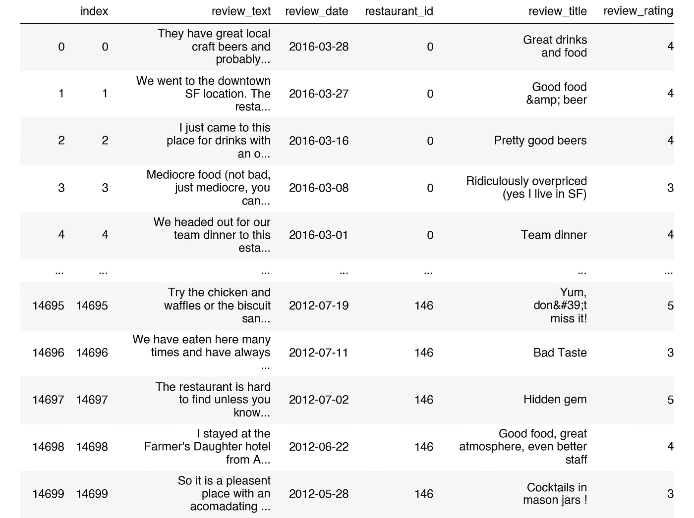
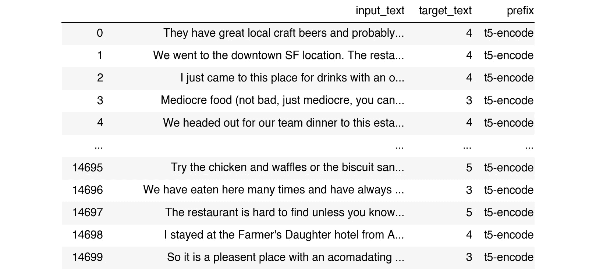
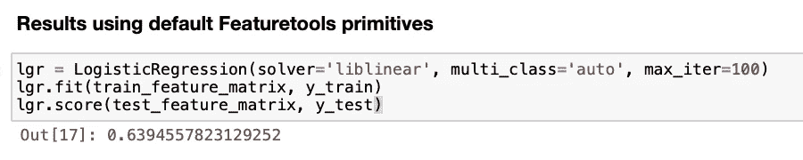
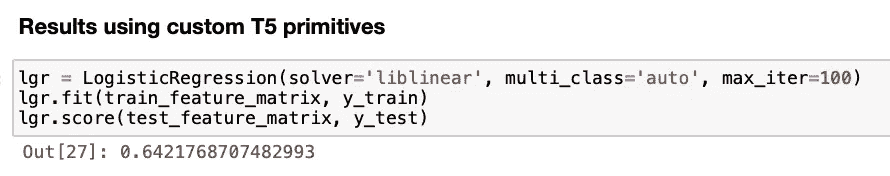
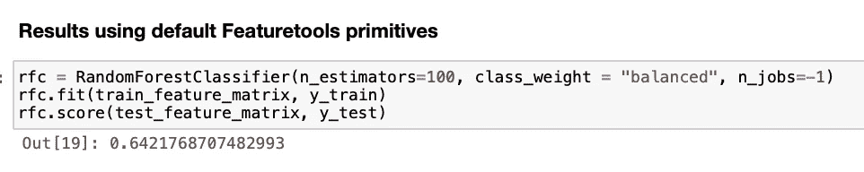
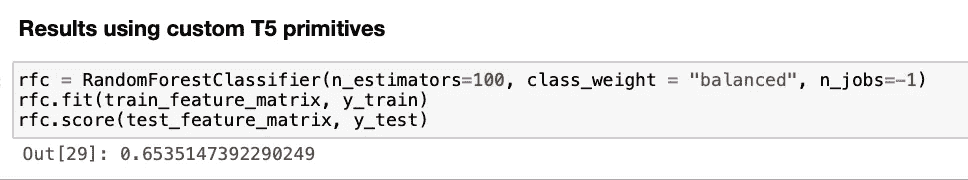
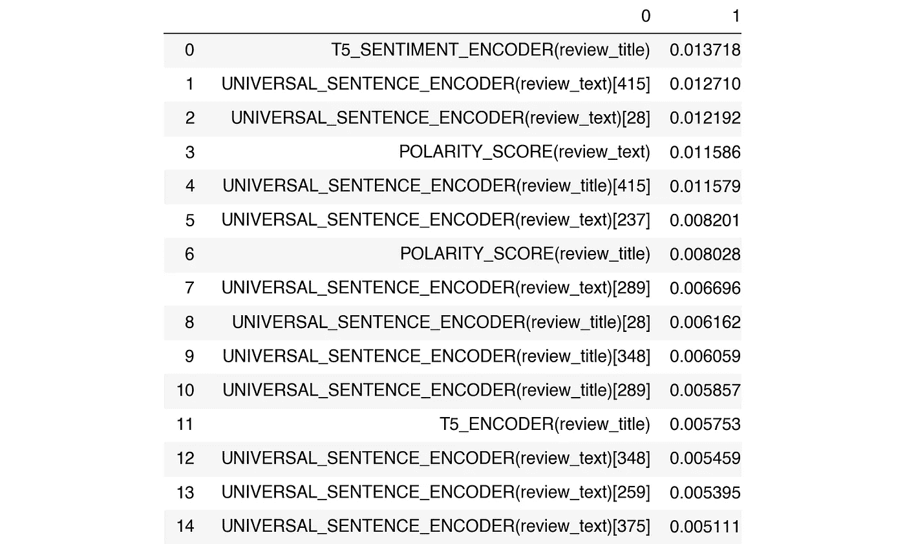
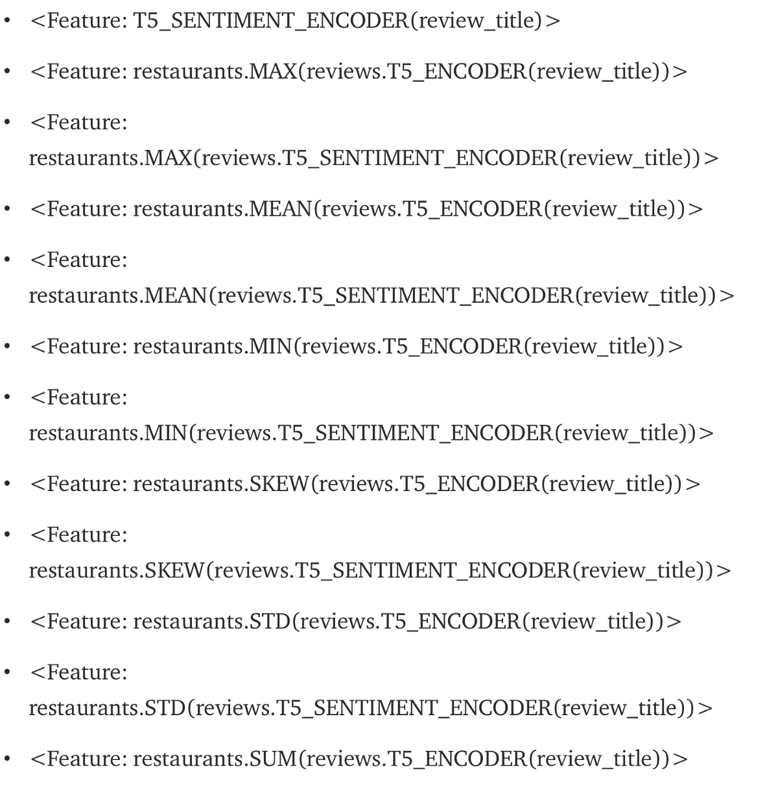

# 使用 Google 的 T5 文本到文本转换器来特征化文本

> 原文：<https://towardsdatascience.com/featurizing-text-with-googles-t5-text-to-text-transformer-a4855f49d8bd?source=collection_archive---------42----------------------->

## 如何扩展[特征工具](https://github.com/Featuretools/featuretools) [*原语-函数*](https://docs.featuretools.com/automated_feature_engineering/primitives.html?__hstc=142826602.c56a6db62f4f0668decced094ba5d9fd.1608037254960.1616692672748.1616763943831.10&__hssc=142826602.1.1616763943831&__hsfp=3461249301) 从表格文本列自动创建*特征*。


*图片由* [*谷歌*](https://ai.googleblog.com/2020/02/exploring-transfer-learning-with-t5.html) *提供。*文本到文本框架图。每个任务都使用文本作为模型的输入，模型被训练生成一些目标文本。这允许相同的模型、损失函数和超参数跨越不同的任务集，包括翻译(绿色)、语言可接受性(红色)、句子相似性(黄色)和文档摘要(蓝色)。参见 [*用统一的文本到文本转换器探索迁移学习的极限*](https://arxiv.org/abs/1910.10683)

*原载于 2021 年 3 月 29 日 https://blog.ccganalytics.com**的* [*。*](https://blog.ccganalytics.com/featurizing-text-with-googles-t5-text-to-text-transformer)

在本文中，我们将演示如何使用 Google 的 T5 文本到文本转换器来特征化表格数据中的文本。您可以使用这个库中的 Jupyter 笔记本继续学习。

当试图在机器学习管道中利用真实世界的数据时，经常会遇到书面文本，例如，在预测房地产估值时，有许多数字特征，例如:

*   “卧室数量”
*   “浴室数量”
*   "平方英尺的面积"
*   “纬度”
*   “经度”
*   &等等…

但是也有大量的文字，比如在 Zillow 网站上的房地产列表描述中。这些文本数据可能包含许多有价值的信息，这些信息在其他情况下不会被考虑在内，例如:

*   提及开放式厨房/平面图
*   提到花岗岩柜台
*   提及硬木地板
*   提及不锈钢器具
*   提及最近的装修
*   &等等…

然而，令人惊讶的是，许多 AutoML 工具完全忽略了这些信息，因为流行的表格算法(如 XGBoost)不能直接使用书面文本。

这就是[功能工具](https://github.com/Featuretools/featuretools) [*原始函数*](https://docs.featuretools.com/automated_feature_engineering/primitives.html?__hstc=142826602.c56a6db62f4f0668decced094ba5d9fd.1608037254960.1616692672748.1616763943831.10&__hssc=142826602.1.1616763943831&__hsfp=3461249301) 的用武之地。Featuretools 旨在为不同类型的数据(包括文本)自动创建*功能*，然后这些功能可以被表格形式的机器学习模型使用。

在本文中，我们展示了如何扩展 [nlp-primitives 库](https://github.com/FeatureLabs/nlp_primitives)以用于 Google 最先进的 T5 文本到文本转换器模型，在这样做的过程中，我们创建了最重要的 nlp 原语特性，这反过来又提高了 Alteryx 博客[自动特征工程的自然语言处理](https://innovation.alteryx.com/natural-language-processing-featuretools/)中展示的准确性。

## 关于 T5

对于任何不熟悉 T5 的读者来说，T5 模型是在谷歌的论文中提出的，题为[用统一的文本到文本转换器探索迁移学习的极限](https://arxiv.org/pdf/1910.10683.pdf)，作者是*科林·拉弗尔、诺姆·沙泽尔、、凯瑟琳·李、·纳朗、迈克尔·马特纳、周燕琪、和彼得·刘。*以下是摘要:

> 迁移学习已经成为自然语言处理(NLP)中的一种强大技术，在迁移学习中，模型首先在数据丰富的任务上进行预训练，然后在下游任务上进行微调。迁移学习的有效性已经产生了各种各样的途径、方法和实践。在本文中，我们通过引入一个统一的框架，将每一个语言问题转换成文本到文本的格式，来探索自然语言处理中迁移学习技术的前景。我们的系统研究比较了几十个语言理解任务的预训练目标、架构、未标记数据集、迁移方法和其他因素。通过将我们的探索与 scale 和我们新的“庞大干净的爬行语料库”相结合，我们在涵盖摘要、问题回答、文本分类等许多基准上实现了最先进的结果。为了促进 NLP 迁移学习的未来工作，我们发布了我们的数据集、预训练模型和代码。

# 一个机器学习演示，使用拥抱脸 T5 来表征文本


罗纳德·里根在 1985 年《变形金刚》英国年会上遇见擎天柱。在 NLP 的背景下——Hugging Face Transformers 是一个自然语言处理库，一个 hub 现在对所有 ML 模型开放，支持库有 [Flair](https://github.com/flairNLP/flair) 、 [Asteroid](https://github.com/asteroid-team/asteroid) 、 [ESPnet](https://github.com/espnet/espnet) 、 [Pyannote](https://github.com/pyannote/pyannote-audio) 等等。

为了扩展用于 T5 的 NLP 原语库，我们将构建两个定制的`TransformPrimitive`类。出于实验目的，我们测试了两种方法:

*   微调[抱紧面 T5-底座](https://huggingface.co/t5-base)
*   一个现成的[拥抱脸 T5 模型为情绪分析预先调整](https://huggingface.co/mrm8488/t5-base-finetuned-imdb-sentiment)

首先，让我们加载基本模型。

```
from simpletransformers.t5 import T5Modelmodel_args = {
    "max_seq_length": 196,
    "train_batch_size": 8,
    "eval_batch_size": 8,
    "num_train_epochs": 1,
    "evaluate_during_training": True,
    "evaluate_during_training_steps": 15000,
    "evaluate_during_training_verbose": True,
    "use_multiprocessing": False,
    "fp16": False,
    "save_steps": -1,
    "save_eval_checkpoints": False,
    "save_model_every_epoch": False,
    "reprocess_input_data": True,
    "overwrite_output_dir": True,
    "wandb_project": None,
}model = T5Model("t5", "t5-base", args=model_args)
```

其次，让我们加载预调好的模型。

```
model_pretuned_sentiment = T5Model('t5',
                                   'mrm8488/t5-base-finetuned-imdb-sentiment',
                                   use_cuda=True)
model_pretuned_sentiment.args
```

为了微调`t5-base`模型，我们需要重新组织和格式化用于训练的数据。



图片作者。原始 Kaggle 数据集

从 Kaggle 数据集中，我们将把`review_text`列映射到一个名为`input_text`的新列，并且我们将把`review_rating`列映射到一个名为`target_text`的新列，这意味着`review_rating`是我们试图预测的。这些变化符合用于微调 t5 的 Simpletransformers 库接口，其中主要的额外需求是指定一个“前缀”，这意味着有助于多任务训练(注意:在本例中，我们关注的是单个任务，因此前缀是不必要的，但是为了便于使用，我们还是要定义它)。

```
dft5 = df[['review_text','review_rating']
].rename({
'review_text':'input_text',
'review_rating':'target_text'
},axis=1)dft5['prefix'] = ['t5-encode' for x in range(len(dft5))]dft5['target_text'] = dft5['target_text'].astype(str)dft5
```



输出。图片作者。

本例中的目标文本是消费者对给定餐馆的评分。我们可以通过以下方式轻松地微调此任务的 T5 模型:

```
from sklearn.model_selection import train_test_splittrain_df, eval_df = train_test_split(dft5)model.train_model(train_df, eval_data=eval_df)
```

接下来，我们加载预调好的拥抱脸模型。

```
from sklearn.model_selection import train_test_splittrain_df, eval_df = train_test_split(dft5)model.train_model(train_df, eval_data=eval_df)
```

让我们测试这两个模型，以更好地了解它们将预测什么。

```
test = ['Great drinks and food', list(np.array(model.predict(test)).astype(float))
 'Good food &amp; beer',Generating outputs: 0%| | 0/1 [00:00<?, ?it/s] Generating outputs: 100%|██████████| 1/1 [00:00<00:00, 3.17it/s] Generating outputs: 100%|██████████| 1/1 [00:00<00:00, 3.16it/s] Decoding outputs: 0%| | 0/3 [00:00<?, ?it/s] Decoding outputs: 33%|███▎ | 1/3 [00:00<00:01, 1.14it/s] Decoding outputs: 100%|██████████| 3/3 [00:00<00:00, 3.43it/s] Out[14]: [4.0, 4.0, 4.0] 
 'Pretty good beers']
```

我们可以看到，微调后的模型输出了一个`review_rankings`【4.0，4.0，4.0】的列表，这是试图预测我们问题的最终答案。

接下来，我们用预先调好的拥抱脸模型做一个*测试预测*。

```
test = ['Great drinks and food', 
     'Good food &amp; beer', 
     'Pretty good beers']list(np.where(np.array(model_pretuned_sentiment.predict(test))=='positive', 1.0, 0.0)) Generating outputs:   0%|          | 0/1 [00:00<?, ?it/s] Generating outputs: 100%|██████████| 1/1 [00:00<00:00,  7.57it/s] Generating outputs: 100%|██████████| 1/1 [00:00<00:00,  7.56it/s]  Decoding outputs:   0%|          | 0/3 [00:00<?, ?it/s] Decoding outputs:  33%|███▎      | 1/3 [00:00<00:01,  1.17it/s] Decoding outputs: 100%|██████████| 3/3 [00:00<00:00,  3.50it/s] Out[15]: [1.0, 1.0, 1.0]
```

请注意，预调优的模型输出一系列布尔真/假值，这些值指示语句是`positive`还是`negative`——我们将这些值转换为浮点值，以便更好地与表格建模集成。在这种情况下，所有值都为真，因此输出变为[1.0，1.0，1.0]。

现在我们已经加载了 T5 的两个版本，我们可以构建`TransformPrimitive`类，它将集成 NLP 原语和 Featuretools 库。

```
from featuretools.primitives.base import TransformPrimitive
from featuretools.variable_types import Numeric, Text class T5Encoder(TransformPrimitive):

    name = "t5_encoder"
    input_types = [Text]
    return_type = Numeric
    default_value = 0

    def __init__(self, model=model):
      self.model = model def get_function(self): def t5_encoder(x):
            model.args.use_multiprocessing = True
            return list(np.array(model.predict(x.tolist())).astype(float))
        return t5_encoder
```

上面的代码创建了一个名为`T5Encoder`的新类，它将使用经过 ***微调的*** T5 模型，下面的代码创建了一个名为`T5SentimentEncoder`的新类，它将使用经过 ***预调的*** T5 模型。

```
class T5SentimentEncoder(TransformPrimitive):

    name = "t5_sentiment_encoder"
    input_types = [Text]
    return_type = Numeric
    default_value = 0

    def __init__(self, model=model_pretuned_sentiment):
      self.model = model def get_function(self): def t5_sentiment_encoder(x):
            model.args.use_multiprocessing = True
            return list(np.where(np.array(model_pretuned_sentiment.predict(x.tolist()))=='positive',1.0,0.0))
        return t5_sentiment_encoder
```

Featuretools 现在将知道如何使用 T5 来特征化文本列，它甚至会使用 T5 输出来计算聚合，或者对其执行操作，例如从其他特性中减去该值。定义了这些新类后，我们只需将它们与默认类一起以所需的 Featuretools 格式进行汇总，这将使它们可用于自动化特征工程。

```
trans = [
           T5Encoder,
           T5SentimentEncoder,
           DiversityScore,
           LSA,
           MeanCharactersPerWord,
           PartOfSpeechCount,
           PolarityScore, 
           PunctuationCount,
           StopwordCount,
           TitleWordCount,
           UniversalSentenceEncoder,
           UpperCaseCount
        ]ignore = {'restaurants': ['rating'],
          'reviews': ['review_rating']}drop_contains = ['(reviews.UNIVERSAL']features = ft.dfs(entityset=es,
                  target_entity='reviews',
                  trans_primitives=trans,
                  verbose=True,
                  features_only=True,
                  ignore_variables=ignore,
                  drop_contains=drop_contains,
                  max_depth=4)
```

正如你在下面的输出中看到的，Featuretools 库非常强大！事实上，除了这里展示的 T5 特性，它还使用指定的所有其他 NLP 原语创建了数百个特性，非常酷！

```
feature_matrix = ft.calculate_feature_matrix(features=features,
                                             entityset=es,
                                             verbose=True)features
```

*   <feature: t5_encoder=""></feature:>
*   <feature: t5_sentiment_encoder=""></feature:>
*   <feature: restaurants.max=""></feature:>
*   <feature: restaurants.max=""></feature:>
*   <feature: restaurants.mean=""></feature:>
*   <feature: restaurants.mean=""></feature:>
*   <feature: restaurants.min=""></feature:>
*   <feature: restaurants.min=""></feature:>
*   <feature: restaurants.skew=""></feature:>
*   <feature: restaurants.skew=""></feature:>
*   <feature: restaurants.std=""></feature:>
*   <feature: restaurants.std=""></feature:>
*   <feature: restaurants.sum=""></feature:>
*   <feature: restaurants.sum=""></feature:>

# 机器学习

现在，我们使用包括新创建的 T5 原语的特征矩阵来创建和测试来自 sklearn 的各种机器学习模型。

提醒一下，我们将比较 T5 增强的准确性和 Alteryx 博客[中展示的自动化特征工程的自然语言处理](https://innovation.alteryx.com/natural-language-processing-featuretools/)的准确性。

## 使用逻辑回归:



请注意，上面的 0.64 逻辑回归分数显示了对 Featuretools 原生逻辑回归分数(0.63)的改进。

## 使用随机森林分类器:



请注意，上面的 T5 增强的 0.65 随机森林分类器分数显示了对 Featuretools 原生随机森林分类器分数(0.64)的改进。

# 随机森林分类器特征重要性

我们可以使用 sklearn 随机森林分类器特征重要性将改进的分数归因于新的 T5 基元。



随机森林要素重要性。作者图片

从上表中我们可以看出，随机森林模型的最高特征重要性是新创建的特征

**T5 _ 情操 _ 编码器(评论 _ 标题)！**


随机森林分类器特征重要性，图片由作者提供

## 关键要点



1.  **T5 模型是一个健壮、灵活的文本到文本转换器，它可以增强几乎任何 nlp 任务的结果，包括那些 NLP 原语库在处理文本数据时处理的结果。**额外的准确性，虽然在这里是微不足道的，但几乎肯定可以通过实现情感分析之外的额外拥抱面部预调整模型来提高。此外，在这个例子中，我们的微调 T5 版本只在`review_text`数据上进行训练，而不是在`review_title`数据上进行训练，这似乎与 Featuretools 创建的功能不一致——这意味着所有创建的功能似乎只使用`review_title`数据作为微调模型的输入，因此其性能更差。纠正这个问题很可能意味着更好的整体性能。
2.  使用拥抱面部变形器和简单变形器库，扩展 Featuretools 框架很简单。通过加入一些额外的代码行，准确性提高了，而代码的复杂度保持不变。

## 最后的想法

大多数企业都有大量的表格数据，其中大部分数据都是书面文本格式的。CCG 是一家数据和分析公司，帮助组织变得更加洞察驱动。我们通过行业特定的解决方案解决复杂的挑战并加速增长。我们的数据科学团队使企业能够获得更大的可见性并做出明智的决策，从而获得竞争优势。我们的[战略产品](https://ccganalytics.com/solutions)旨在加快价值实现，改善业务成果，并围绕可信见解的共同观点团结团队。请联系我们，帮助您构建下一个定制的 NLP 解决方案…

*原载于 2021 年 3 月 29 日*[*【https://blog.ccganalytics.com】*](https://blog.ccganalytics.com/featurizing-text-with-googles-t5-text-to-text-transformer)*。*

[*CCG*](http://ccganalytics.com) *是一家数据和分析公司，通过行业特定的解决方案，帮助组织变得更加洞察驱动，解决复杂的挑战并加速增长。我们让客户能够更好地了解他们的业务，做出明智的决策，从而获得竞争优势。我们的* [*战略产品*](https://ccganalytics.com/solutions) *旨在加快价值实现、改善业务成果，并围绕可信见解的共同观点团结团队。*