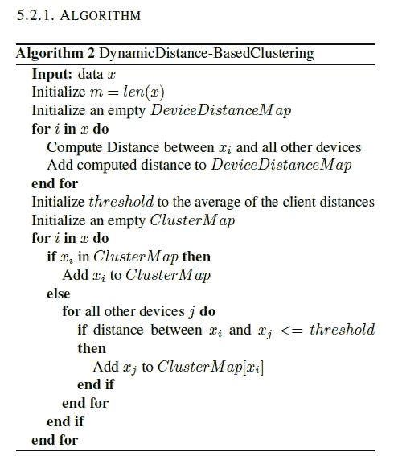
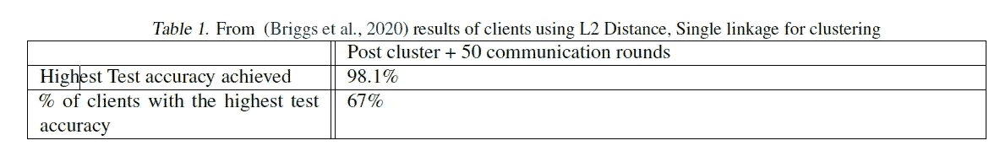

# 通过基于距离的聚类进行联合学习

> 原文：<https://towardsdatascience.com/federated-learning-through-distance-based-clustering-5b09c3700b3c?source=collection_archive---------20----------------------->

## 隐私没得商量

作者照片

***你有没有想象过你的手机键盘是如何预测下一个关键词笔画的？***

单词的工作/预测由部署在您的手机上的 ML 算法给出，并根据您的本地数据进行训练。由于它是对你的数据进行训练，你现在可能会有一个问题，我的隐私没有丢失吗？

答案是否定的。这些科技公司使用 ***联合学习*** 来解决隐私问题，因为没有数据被发送到主模型。相反，ML 模型将部署在您的设备上，并根据可用的数据进行训练，然后返回模型参数而不是数据。让我们深入了解它的工作原理，在本文中，我们提出了一种新的方法来对相似的设备进行聚类，以提高模型的性能。

内容列表:

1.  介绍
2.  联合学习
3.  我们的框架
4.  使聚集
5.  培训阶段
6.  结果和比较
7.  结论

F 深度学习(FL)是一种系统架构，它利用手机等分布式网络来增强 AI 模型性能，同时对其所有者保密个人数据。本文提出了一种对传统 FL 设计的新颖补充，它利用集群将相似的设备分组，并在训练期间增强彼此的协作。

# 1.简介:

联合学习是一种范例，其中建立了一个分布式设备系统来协作训练模型。传统的联合学习涉及具有包含模型权重的中央服务器，该中央服务器具有通过偶尔将权重发送回服务器来帮助训练该模型的设备。当权重被发送回服务器时，所有设备都有均等的机会使用称为联合平均的过程来更新主/服务器模型( [FedAvg](https://arxiv.org/abs/1907.02189) )。用简单的术语来说，它可以被认为是一组值的平均值。

> 如果你不熟悉几个术语，不要惊慌。我们将从头开始学习它们。

一旦应用了 FedAvg，就用它来更新集中式模型，然后将更新后的权重广播给网络中的所有设备。
*传统方法的问题在于，它严重依赖于所有设备都将以类似方式学习的假设*。然而，现实地说，设备将使用不同的数据集进行操作，每个数据集代表由 f1 表示的整个模型的子集。

因此，平均设备重量不太可能是最佳方法，因为它忽略了设备间不平衡数据引起的偏差。因此，在我们的实践中，我们以不同的方式看待问题。我们看到，除了只有中央模型，我们还可以引入聚类的概念，表示表现出相似学习行为的不同设备的组。通过进行这种聚类，我们认为在聚类级别上应用的算法(如 FedAvg)应该强调对其中的设备最重要的权重更新。

在本文中，我们将看到一个三阶段实验来探索我们的聚类方法。以下是我们所做工作的总结:

第一阶段:

1.  跨多个设备分割目标数据集
2.  使用传统的外语学习方法训练所有设备

*   第二阶段:

1.  基于阶段 2 之后的设备权重，我们运行两种聚类算法。聚类算法输出一个聚类列表，每个
    聚类都有一个属于它的设备 id 列表。每个群集通过平均所有设备的权重来计算自己的权重。
2.  进一步训练设备，但不是将它们的重量报告回中央服务器，而是仅将它们报告给它们的集群。因此，这实际上创建了多个传统的 FL 网络，其中每个网络代表一个集群以及属于该集群的设备子集。

第三阶段:

1.  我们计算阶段 2 完成后生成的权重的多个排列，然后使用它来评估应用聚类后模型的改进。

# 2.联合学习:

机器学习算法，尤其是深度学习算法，需要大数据集才能有效训练。在现实世界中，数据在隐私限制下分布在多个组织中。此外，有许多部门的数据不能在内部共享，如政府、金融、医院和研究实验室，由于数据法规和政策的原因，内部协作是不可能的。然而，如果这些实体能够在保持其数据匿名的同时进行合作，我们就可以将我们的模型暴露给丰富多样的数据集。

为了适应这些限制，需要一种无需交换用户数据的协作学习解决方案。该解决方案是通过结合联邦和机器学习提出的，它被称为联邦学习(FL)。在一般的机器学习中，数据存在于单个设备或数据中心，这些算法使用这些数据并在其上建立模型。

然而，如果你看看下面的图片，在 FL 中，服务器将模型发送到其网络中的各个设备，并根据每个设备的数据进行训练。训练完成后，仅返回模型参数，而数据保留在拥有它的设备上。因此，服务器聚合所有客户端的结果，并使用 FedAvg 执行聚合。

有机会使用模型参数来确定模型行为。因此，可以计算安全聚合来克服这个问题，其中从客户端获得的模型参数被*加密*，而服务器模型只能解密聚合。以下是外语培训过程的概述。

传统 FL:作者照片

一次外语训练通常要进行四个步骤。

1.  第一步，在集中式服务器上选择机器学习模型。
2.  接下来，这个模型被传播到所有的网络设备(在上图中，是 4 个设备)。
3.  每个设备在第三步中开始训练模型，并开始具有反映其数据的唯一权重。
4.  最后，在步骤 4 中，它们将自己的权重发送回服务器，在服务器中进行联合平均，然后将结果广播给所有设备。这四步算一轮 FL 训练。

我们在我们的项目中使用了 [TensorFlow Federated](https://www.tensorflow.org/federated) ，这是一个允许分散数据计算的机器学习框架。这个开源框架将使用户能够研究和构建基于 FL 架构的模型。

# 3.我们的框架:

我们的框架已经建立，以比较提出的多阶段模型和一个香草 FL 模型。因此，这两个模型是我们研究框架的两个组成部分。这两种型号都被配置为运行在 E epochs 上，并且在其网络中包含 100 个设备。网络中的每个设备包括数据集的随机分布。

## 数据集:

对于数据集，使用 10 重交叉验证，指标是召回率和准确度。

[em NIST](https://www.tensorflow.org/federated/api_docs/python/tff/simulation/datasets/emnist/load_data):
tensor flow em NIST 可以被视为 MNIST 数据集，其中有 10 个类别标签(0–9)。它包含 60，000 个训练样本和 10，000 个测试样本。Tensorflow federated 提供了将数据集分发到多个客户端的方法，在此实现中，它用于在客户端之间拆分数据集。这可以在下图中看到，其中数据分布在多个客户端上。从图中我们可以看出数据分布不均匀(不平衡)。Tensorflow federated 允许我们将数据分成等量(平衡的)。在我们的研究中，我们根据训练后获得的数据分布和权重，使用不平衡数据对设备进行聚类。

[数据在客户端的分布](https://www.tensorflow.org/federated/tutorials/federated_learning_for_image_classification)图片由 Google FL 提供

# 4.聚类:

我们提出的模型的基本部分是设备的<https://en.wikipedia.org/wiki/Cluster_analysis>****群集。集群可以被认为是组合相似的设备。它允许设备从来自具有相似学习特征的设备的附加协作层中受益。例如，假设 EMNIST 数据集正被用于训练，并且两个设备可能具有大量学习识别数字 5 类别标签的经验。通过分享他们的体重，他们可以理想地帮助彼此以更快的速度学习。聚类发生在我们模型的第二阶段，并且在第二和第三阶段进行的训练中起着重要作用。在我们的研究中，我们测试了两种聚类方法。****

1.  *******K-Means 聚类:***
    K-Means 算法( [scikit learn，2020](https://scikit-learn.org/stable/modules/generated/sklearn.cluster.KMeans.html) )是一种为一组特定输入点创建聚类的成熟方法。该算法采用这些输入点，并且输入整数 K. K 表示要形成的聚类的数量。****

******算法:******

****在给定的算法 1 中，让 X 表示输入点的集合。****

********

****K 均值聚类算法:Ibrahim Helmy****

*****关键特征:*****

****这种聚类方法有几个重要的特征。第一个与设备可以包含在其中的集群数量有关。使用 K-means 聚类，一个设备一次只能是一个聚类的一部分。另一个关键特征是聚类的数量，K 变量，一个预定义的整数。这意味着集群的数量不能动态增加或减少。该整数必须是一个微调的超参数，根据所使用的数据集
和设备数量，该参数最好是一个不同的值。****

*****更新设备重量:*****

****在模型训练期间，群集中的每个设备在特定点接收更新。对于这种群集方法，每个设备的权重被设置为共享其群集的每个设备的所有权重的平均值。****

****2. ***基于距离的动态聚类*******

****第二种聚类方法是基于动态距离的聚类方法。对于这种方法，我们执行多个操作来获得最终的聚类列表。首先，所有设备之间的欧几里德距离是根据它们的权重计算的
。其次，确定阈值。该阈值用作集群中包含的两个不同设备之间的最大距离。一旦选择了该值，算法就开始聚类过程。在我们的研究中，阈值被设置为所有聚类权重的平均值。算法 2 对此进行了更详细的描述。****

********

****基于动态距离的聚类算法:作者 [Ibrahim Helmy](https://medium.com/@ibyhelmy)****

## ****示例:****

****让我们把这个 Python 字典看作一个设备和所有其他设备的地图，这些设备都在先前定义的阈值距离之内。python 字典中的键是“:”前面的值，值是后面的元素。关于下面的例子，****

****“1”是一个键，“[9，10]”是它的值。
{0: []，1: [9，10]，2: [9]，3: []，4: []，5: [9]，6: []，7: []，8: []，9: [1，2，5]，10: [1]}
在这里的例子中，字典的关键字是设备 id，值是距离设备最多阈值距离的设备的设备 id 列表。使用算法 2，聚类的结果列表将如下:
[[5，9]，[9，1]，[10，1]，[2，9]，[0]，[3]，[4]，[6]，[7]，[8]]****

## ****关键特征:****

****如前面给出的示例所示，与 K-Means 聚类不同，结果显示单个设备可以是多个聚类的一部分。这是一个*独特的属性*，它将允许一个设备与共享多个学习特征的其他设备协作，而不会受到它们彼此
不相似的限制。****

****还需要注意的是，尽管允许一个设备成为多个集群的一部分，但是该方法的算法不允许子集。甚至未能成为组集群的一部分的设备形成它们自己的集群。****

## ****更新设备权重:****

****由于使用这种方法，单个设备可以是多个集群的一部分，因此设备权重是单独计算的，而不是在集群中计算的。每个设备的权重被更新为其所属的每个集群的所有权重平均值的平均值。使用上述示例中的集群列表，设备 9 的更新如下:****

****设备 9 新权重= Avg( Avg([5，9])，Avg([9，1])，Avg([2，9]))****

# ****5.培训阶段:****

## ****阶段 1 —初始化****

********

****第一阶段:穆斯塔法·卡特吉拍摄的照片****

> ****这个阶段是为了初始化我们的实验。****

****它由传统的 FL 模型组成，其中 N 个设备在“e”个时期内进行训练，并通过 FedAvg 在集中式 FL 模型上进行协作。在训练期间，集中式 FL 模型也将向所有设备广播重量更新。在“e”时代完成后，每个设备将具有唯一的权重，该权重来自与其他设备的协作，并且非常适合该设备的数据集。我们跟踪第 2 阶段的单个设备重量，并评估该模型的总体性能。****

## ****第 2 阶段——集群培训:****

********

****第二阶段:穆斯塔法·卡特吉的照片****

> ****在这一阶段，我们将介绍我们对集群培训的贡献。****

****使用来自阶段 2 的单个设备权重，我们使用 K-means 和基于距离的聚类对它们进行聚类。对于每种聚类算法，我们得到一组不同的设备聚类。****

****然后，我们将每个设备群集视为其自己的 FL 模型，其中群集的中心模型使用群集的平均设备权重进行初始化。之后，我们为每个集群的“e”时期训练设备，这最终导致更新的中央集群权重。****

****因此，群集鼓励在阶段 1 中进行类似训练的设备严格协作。这与传统的 FL 训练相比是有利的，在传统的 FL 训练中，不相关的设备相互影响，这可能损害它们各自数据集的性能。****

## ****第 3 阶段—评估:****

****在这一步中，我们通过评估从阶段 2 中探索的聚类方法得出的最终权重来评估我们的聚类方法的有效性。****

*   ****我们以三种不同的方式评估新的权重:****
*   ****所有权重的平均值在通用测试集上的表现如何？****
*   ****所有权重的加权平均值在通用测试集上的表现如何？
    -每个聚类权重使用其达到的最高精度进行加权
    -如果我们通过取其权重和所有聚类的平均值之间的平均值来更新每个聚类权重，那么每个聚类是否仍然保留
    其专业性，但也通过受益于其他聚类来获得更好的泛化能力？
    -该评估使用每个集群设备的测试集。****

# ****6.结果和比较****

## ****评估指标:****

****用于评估的指标是准确度和精确度。TFF 的联邦学习 API 层提供了可以直接在张量流模型中使用的高级接口。然而，它只返回一个精度分数，并且使用这个 API 层不可能获得精度值。为了得到召回分数，TFF 的联邦核心 API 层可以作为构建 FL 的基础。它提供了一组低级接口，因为它允许用户通过改变函数式编程环境来执行计算。****

****为全局模型分割一个测试集，并且跨每个客户端分布唯一的测试集。对全局模型和局部更新模型的评估是用它们独特的测试集来执行的。对测试集执行以下评估，并记录结果:****

****客户端和全局模型的准确性(第 1 阶段)
；聚类平均值更新后的全局模型的准确性(第 3 阶段)
；加权聚类平均值更新后的全局模型的准确性(第 3 阶段)
；聚类平均值更新后的客户端的准确性(第 3 阶段)
还报告了具有 K 均值和基于动态距离的聚类的模型的结果。****

## ****与之前的作品形成对比:****

****实验中使用的分层聚类技术具有不同的因素，如聚类前的通信回合数、不同的非 iid 设置、距离度量，如 L1、L2、余弦距离。****

****记录参与的客户数量、通信回合、客户的测试准确度以及达到目标测试准确度的客户的百分比。要注意的是，没有报告聚类步骤之后的全局模型的性能。****

*******以下是本文呈现的新颖之处:*******

*   ****聚类技术—使用 K 均值和动态距离聚类。****
*   ****所有客户都参与学习过程。****
*   ****聚类后，局部模型没有用当前全局状态初始化。相反，用于聚类的权重同样用于进一步的基于聚类的训练。****
*   ****聚类是独立训练的，没有对全局模型的任何反馈。****
*   ****第 3 阶段在本文中介绍，其中全局模型以两种不同的方式更新—聚类平均和加权聚类平均。客户端使用其所属的集群和所有其他
    集群的平均权重进行更新。****

****中央服务器和客户端使用卷积神经网络在 EMNIST 数据集上进行训练。数据被分发给 100 个具有非 iid 设置的客户端。阶段 1 执行 20 个时期，随后是阶段 2 聚类训练 20 个时期。SGD optimizer 的学习率为 0.1。****

****在所提出的方法中，欧几里德距离用于计算相似性，并且计算设备到设备的距离。因此，L2 和单一连锁结果被认为是一个公平的比较。由于报告了客户的最高测试准确度和达到该准确度的客户的百分比，因此也报告了所提议的方法。表 1 描述了 L2 距离、单个链接设置的结果。以下是从实施建议的方法中观察到的结果。****

********

****图表作者:Rajitha Muthukrishnan****

********

****图由 [Rajitha Muthukrishnan 绘制](https://medium.com/@rajitha.muthukrishnan)****

# ****7.结论:****

****观察了联邦学习中的培训过程的概述，并提供了基线学习如何工作以及它与具有两个数据集的多阶段方法的比较。后者取得了比基线 FL 更好的结果，因为聚类允许相似的设备相互训练。****

****同样，相同的设备形成集群，影响其性能的无关设备被分离。因为单个设备可以是多个集群的一部分，所以它比传统的集群方法产生了更好的结果，在传统的集群方法中，一个设备可以是单个集群的一部分。在没有对全局模型的任何反馈的情况下独立地训练聚类产生了更好的结果。FL 是一个热门的研究课题，用置信区间或由此衍生的其他方法扩展聚类方法将是一个强有力的研究方向。****

****这篇文章是基于与 [Ibrahim Helmy](https://medium.com/u/7681dc816bab?source=post_page-----5b09c3700b3c--------------------------------) 、 [Mostafa Katerji](https://www.linkedin.com/in/mostafaelkaterji/) 和 [Rajitha Muthukrishnan](https://medium.com/u/780a71460c77?source=post_page-----5b09c3700b3c--------------------------------) 一起进行的研究。****

*****感谢阅读到最后。如有错误或建议，欢迎不吝赐教。*****

****如果你想联系我，请通过 LinkedIn 联系我。****

****参考资料:****

****<https://www.tensorflow.org/federated>        <https://ai.googleblog.com/2017/04/federated-learning-collaborative.html> ****