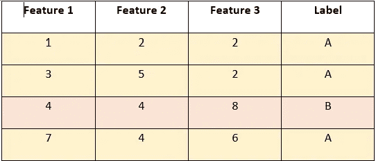
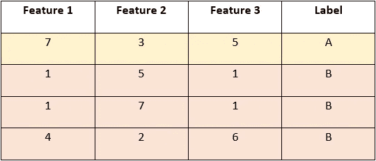
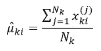
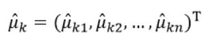

# 联合学习:你的数据与你同在

> 原文：<https://towardsdatascience.com/federated-learning-your-data-stays-with-you-fc1d49b35ec4?source=collection_archive---------22----------------------->

## 通过联合学习，我们可以在不共享用户数据的情况下，以另一种方式提高集中式机器学习模型的性能。

约翰·萨尔维诺在 [Unsplash](https://unsplash.com?utm_source=medium&utm_medium=referral) 上拍摄的照片

这是 21 世纪，“数据是新的黄金”。随着新技术的出现，更高的计算能力，当然还有大量的数据，人工智能获得了很大的发展势头，全球**人工智能(AI)市场**预计将从 2021 年的 583 亿美元增长到 2026 年的 3096 亿美元，根据 [MarketsandMarkets](https://www.marketsandmarkets.com/Market-Reports/artificial-intelligence-market-74851580.html) 的预测，预测期内的复合年增长率(CAGR)为 39.7%。

虽然人工智能给我们的日常生活带来了很多舒适，但我们甚至没有意识到这一点，也存在一些挑战。数据隐私就是其中之一。应用程序收集你的数据(当然不会卖给第三方应用程序，是吗？)为您提供更个性化的推荐和结果(以及广告😐).

那么问题来了，数据离开你的手机了吗？

答案是肯定的。例如，当您授权任何应用程序访问您的位置信息时，它会收集您的位置数据。现在取决于应用程序，他们希望他们的人工智能算法如何使用它。有两种选择:

1.  **在服务器**上:机器学习/深度学习模型部署在服务器上，在服务器上，它根据从数十亿部智能手机接收的数据训练模型。
2.  **On-device**:ML/DL 模型部署在手机上，用户数据用于训练和改进模型以获得更好的推荐。

两者各有利弊。在服务器上进行培训需要大量的存储空间来存储数据，并需要世界一流的安全性来保护他们免受数据泄露的影响。而设备上训练是在有限的数据量上训练的，并且模型性能受到损害。

**解决方案:在分散数据上训练集中模型。嘣！！！！**

好的，让我解释一下。

为了获得更好的用户体验，一家公司将希望来自数十亿部智能手机的数据在服务器中的一个集中模型上进行训练。但为此，数据必须离开智能手机。但是我们不想那样，对吗？相反，如果在进行训练的所有设备中都存在集中式模型的副本，那么我们已经解决了性能问题。现在，我们不得不将来自每部智能手机的所有结果整合到一个单一的结果中。现在，训练结果(我们机器学习工程师称之为:**【权重】**显然可以发送到服务器，在那里进行合并。现在，权重被高度加密，密钥取决于设备上的**模型。**

哦耶！！！

并且为了进一步改善用户隐私，使用安全聚合协议，该协议使得服务器能够组合加密结果，仅通过添加零和掩码来解密该聚合。要了解更多相关信息，请参考这篇[文章](https://arxiv.org/pdf/1912.00131.pdf)。

最后，总重量被发送回设备上的模型，我们现在有一个新的改进的模型更新。

> 每一个新的开始都会带来新的挑战。相信新挑战的美丽，它们会帮助我们成长。

**让我们来讨论一下挑战。**

1.  有些数据是特定用户专用的。这将降低整个模型的性能。我们不希望模型记住来自特定用户的稀有数据。

解决方案:a)通过设计一种机制来控制单个用户对整体结果的贡献量。b)通过向更具体的数据添加噪声。这也被称为**差分隐私**。我发现这篇[文章](https://2021.ai/machine-learning-differential-privacy-overview/)挺直观的。

2.现在我们有了从汇总结果中形成的新模型。但是，在推出更新之前，我们如何才能看到模型在新数据上的表现呢？

解决方法:简单！我们可以应用我们都知道的相同的训练验证分割概念。相反，在这里我们将用户作为我们的实验！！！！听起来很有趣，嗯？我们将用户分为训练和验证。在智能手机用户中，我们有一小部分人会验证这个结果。其余的将训练模型。因此，该模型在实时数据上进行了测试。

3.简单的平均聚合适用于所有算法吗？让我们用两个例子来解释这一点:

a)我们就拿[正态贝叶斯(openCV)](https://docs.opencv.org/3.4/d4/d8e/classcv_1_1ml_1_1NormalBayesClassifier.html) 来说。平均向量和协方差矩阵受每类样本数量的影响很大。现在，假设我们有两部智能手机和一个二进制分类问题，其中**A 类**和**b 类**

用户 1:

图片作者:包含三个 A 类样本和一个 B 类样本

用户 2:

图片作者:包含 3 个 B 类样本和 1 个 a 类样本。

其中 *x ki* ( *j* )表示训练样本中属于类别 *k* 的第 *j-* 个样本的第 *i-* 个特征属性的值，最后的*n*-维(共 *n* 个特征属性)类别 k ' *μk'* 的均值向量估计为:

因此，平均向量的值很大程度上受每类样本数量的影响。所以用户 1 的平均向量 *μA(1)* 具有类别 A 的 75%影响，而 *μA(2)具有 25%影响。那么当我们通过取平均值 1/2(*μA(1)+μA(2))****来合并它们时，我们能够保留特定于类的信息吗？****

b)对于像 SVM 这样的算法，其权重只不过是依赖于数据集中样本数量的支持向量，我们可以有一个对于所有结果大小不变的权重矩阵吗？我们可能需要专门针对机器学习任务的聚合算法。

4.隐私和准确性之间的权衡:

有时为了增加用户数据的隐私，会添加一些噪声，导致数据偏离其实际行为，从而导致一些准确性下降。

结论:

联合学习可以解决很多与用户隐私相关的问题，同时提高模型性能以获得更好的推荐。这是一个相当新的领域，更多的研究可以解决我们称之为协作学习所面临的许多挑战。

参考资料:

 [## 联合学习:没有集中训练数据的协作机器学习

### 标准的机器学习方法需要将训练数据集中在一台机器或数据中心。还有…

ai.googleblog.com](https://ai.googleblog.com/2017/04/federated-learning-collaborative.html)  [## 联合学习:提高沟通效率的策略

### 联合学习是一种机器学习设置，其目标是训练高质量的集中式模型，同时…

arxiv.org](https://arxiv.org/abs/1610.05492)  [## 张量流联邦

### TensorFlow Federated:分散数据上的机器学习 TensorFlow Federated (TFF)是一个开源框架，用于…

www.tensorflow.org](https://www.tensorflow.org/federated)