# 前馈神经网络——如何在 Python 中成功构建它们

> 原文：<https://towardsdatascience.com/feed-forward-neural-networks-how-to-successfully-build-them-in-python-74503409d99a?source=collection_archive---------2----------------------->

## 神经网络

## 使用真实数据的 Python 示例对神经网络进行了详细的图形说明

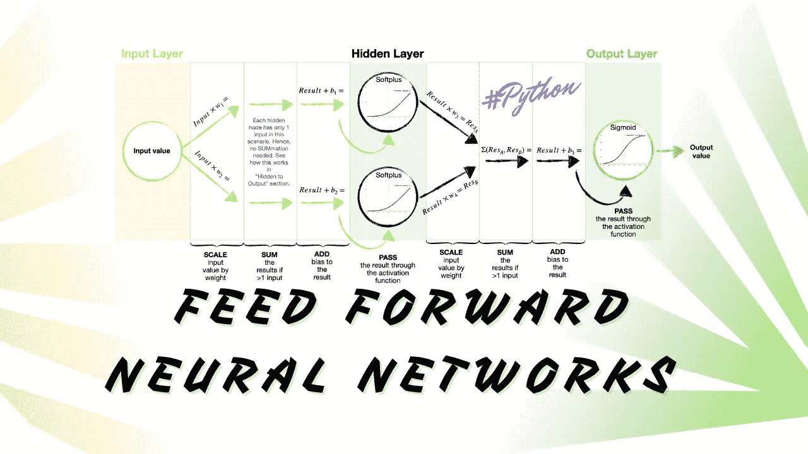

前馈神经网络。图片由[作者](https://solclover.com/)提供。

# **简介**

神经网络已经成为过去几年的中心话题。虽然它们最初看起来令人生畏，但我向你保证，你不需要博士学位就能理解它们是如何工作的。

在本文中，我将带您了解基本神经网络背后的主要思想，也称为前馈神经网络或多层感知器(MLPs)，并向您展示如何使用 Tensorflow 和 Keras 库在 Python 中构建它们。

# **内容**

*   前馈神经网络在机器学习领域中的地位
*   直观解释前馈神经网络如何工作
    -网络结构和术语
    -参数和激活函数
    -损失函数、优化器和训练
*   如何建立和训练你自己的前馈神经网络的 Python 例子

# **前馈神经网络在机器学习领域中的地位**

机器学习是一个巨大且不断扩展的空间，每天都有新的算法开发出来。我试图通过在下面的**交互式**图表中对一些最常用的算法进行分类，来给这个世界带来结构。**点击不同类别，放大并展示更多内容。**👇

虽然这种分类并不完美，但它让我们大致了解了不同部分是如何组合在一起的，并且希望它还能促进您的数据科学学习之旅。

我将神经网络放在一个独特的类别中，认识到它们对机器学习的独特方法。然而，重要的是要记住，神经网络最常用于使用带标签的训练数据来解决分类和回归问题。因此，另一种方法是将它们置于机器学习的监督分支之下。

机器学习算法分类。由[作者](https://solclover.com/)创建的互动图表。

***如果你喜欢数据科学和机器学习*** *，请* [*订阅*](https://solclover.com/subscribe) *每当我发表一个新的故事，你都会收到一封电子邮件。*

# **直观解释前馈神经网络如何工作**

## 结构和术语

首先，让我们熟悉一下神经网络的基本结构。

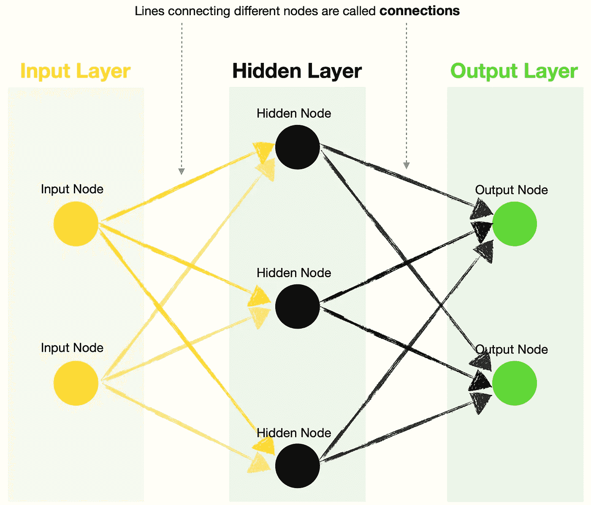

前馈(FF)神经网络的基本结构。图片由[作者](https://solclover.com/)提供。

*   **输入层** —包含一个或多个输入节点。例如，假设您想预测明天是否会下雨，并根据湿度和风速这两个变量做出决定。在这种情况下，第一个输入是湿度值，第二个输入是风速值。
*   **隐藏层**——这一层包含隐藏节点，每个节点包含一个**激活函数**(稍后将详细介绍)。*注意，具有多个隐藏层的神经网络被称为深度神经网络。*
*   **输出层** —包含一个或多个输出节点。按照上面相同的天气预测示例，您可以选择只有一个输出节点生成降雨概率(其中> 0.5 表示明天有雨，而≤0.5 表示明天无雨)。或者，您可以有两个输出节点，一个用于降雨，另一个用于无雨。注意，您可以对输出节点和隐藏节点使用不同的**激活函数**。
*   **连接** —连接不同节点的线称为连接。这些包含**内核(权重)**和**偏差**，这些参数在神经网络的训练过程中得到优化。

## **参数和激活功能**

让我们仔细看看核(权重)和偏差，以了解它们的作用。为简单起见，我们创建一个基本的神经网络，它有一个输入节点、两个隐藏节点和一个输出节点(1–2–1)。

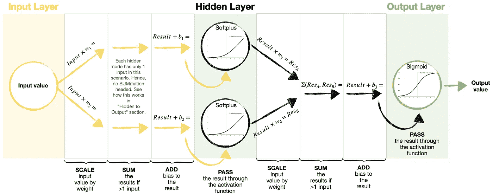

在前馈(FF)神经网络中如何应用权重和偏差的详细视图。图片由[作者](https://solclover.com/)提供。

*   **内核(权重)** — 用于缩放输入和隐藏节点值。每个连接通常具有不同的重量。
*   **偏差** —用于在通过激活功能之前调整缩放值。
*   **激活函数** —将激活函数视为神经网络用来创建定制曲线以拟合训练数据的标准曲线(构建模块)。通过网络传递不同的输入值会选择标准曲线的不同部分，然后将这些部分组合成最终的定制曲线。

有很多激活功能可供选择，最常用的有 [Softplus](https://www.tensorflow.org/api_docs/python/tf/keras/activations/softplus) 、 [ReLU](https://www.tensorflow.org/api_docs/python/tf/keras/activations/relu) 、 [Sigmoid](https://www.tensorflow.org/api_docs/python/tf/keras/activations/sigmoid) 。以下是神经网络中六种常用激活函数的形状和方程:

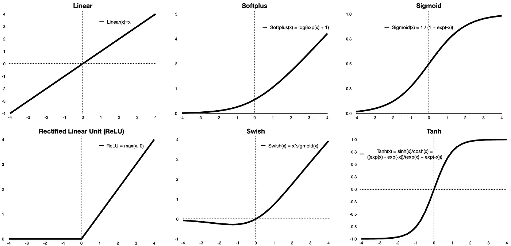

激活功能。图片由[作者](https://solclover.com/)提供。

我们现在已经熟悉了核(权重)、偏差和激活函数，让我们使用相同的神经网络根据今天的湿度计算明天下雨的概率。

注意，我已经训练好了这个神经网络*(见下面 Python 部分)*。因此，我们已经知道了核(权重)和偏差的值。下图显示了 FF 神经网络如何获取输入值并产生答案(输出值)的逐步过程。

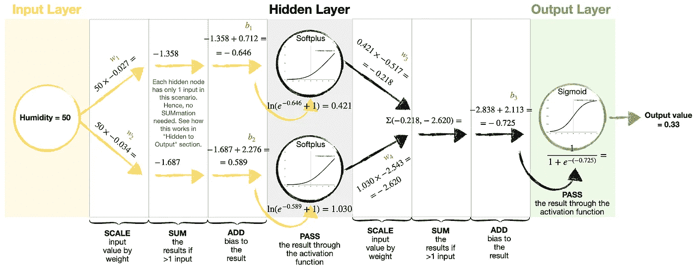

前馈(FF)神经网络执行的示例计算。图片由[作者](https://solclover.com/)提供。

正如你所看到的，上面的神经网络告诉我们，今天 50%的湿度意味着明天有 33%的可能性下雨。

## 损失函数、优化器和训练

训练神经网络涉及一个被称为**反向传播**的复杂过程。我不会一步一步地解释反向传播是如何工作的，因为这是一个足够大的主题，值得单独写一篇文章。

相反，让我简要地向您介绍损失函数和优化器，并总结当我们“训练”一个神经网络时会发生什么。

*   **损失** —代表**真实**值/标签和**预测**值/标签之间的误差“大小”。训练神经网络的目标是使这种损失最小化。损失越小，真实数据和预测数据之间的匹配越接近。有很多**损失函数**可供选择，最常见的有[二进制交叉熵](https://www.tensorflow.org/api_docs/python/tf/keras/losses/BinaryCrossentropy)、[分类交叉熵](https://www.tensorflow.org/api_docs/python/tf/keras/losses/CategoricalCrossentropy)、[均方误差](https://www.tensorflow.org/api_docs/python/tf/keras/losses/MeanSquaredError)。
*   **优化器**——是在反向传播中使用的**算法。优化器的目标是找到最佳的核(权重)和偏差集，以最小化损失。优化器通常使用梯度下降方法，这允许他们迭代地找到权重和偏差的“最佳”可能配置。最常用的有 [SGD](https://www.tensorflow.org/api_docs/python/tf/keras/optimizers/SGD) 、 [ADAM](https://www.tensorflow.org/api_docs/python/tf/keras/optimizers/Adam) 、 [RMSProp](https://www.tensorflow.org/api_docs/python/tf/keras/optimizers/RMSprop) 。**

训练神经网络基本上是通过训练数据来拟合自定义曲线，直到它尽可能地逼近该曲线。下图说明了特定情况下定制曲线的外观。该示例包含一组数据，随着输入值的增加，这些数据似乎在 0 和 1 之间翻转。

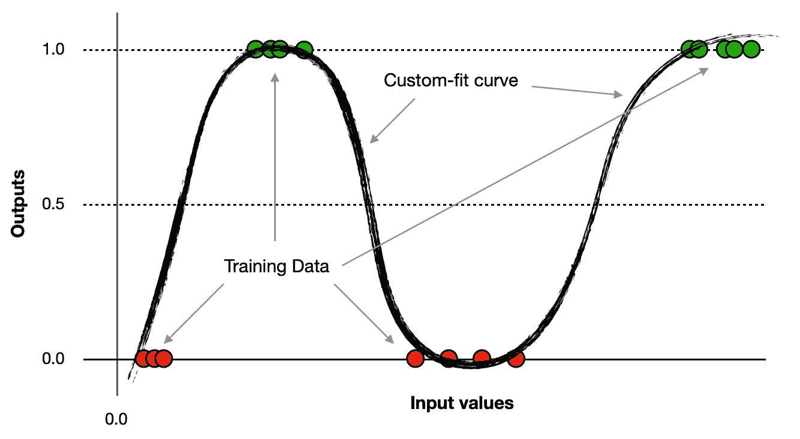

将曲线拟合到训练数据。图片由[作者](https://solclover.com/)提供。

一般来说，激活函数的广泛选择加上我们希望添加尽可能多的隐藏节点的能力(假设我们有足够的计算能力)意味着神经网络可以创建任何形状的曲线来拟合数据。

然而，拥有这种极大的灵活性有时可能会导致数据过度拟合。因此，在使用模型进行预测之前，我们必须始终确保在测试/验证集上验证模型。

## 总结我们所学的

前馈神经网络接受一个或多个输入值，并在通过激活函数传递结果之前，使用核(权重)和偏差来应用变换。最后，我们得到一个输出(预测)，这是通过训练优化的复杂转换集的结果。

我们通过训练数据拟合定制曲线来训练神经网络，以损失最小化为指导，并通过参数(核和偏差)优化来实现。

[](https://solclover.com/membership)[](https://www.linkedin.com/in/saulius-dobilas/)

# 用 Python 构建和训练前馈神经网络

现在让我们找点乐子，建立我们自己的神经网络。我们将使用澳大利亚历史天气数据来训练一个神经网络，预测明天是否会下雨。

## 设置

我们需要以下数据和库:

*   [来自 Kaggle](https://www.kaggle.com/jsphyg/weather-dataset-rattle-package) 的澳大利亚天气数据(许可:[知识共享](http://www.bom.gov.au/other/copyright.shtml?ref=ftr)，数据原始来源:[澳大利亚联邦气象局](http://www.bom.gov.au/climate/data/))。
*   用于数据操作的[熊猫](https://pandas.pydata.org/docs/)和 [Numpy](https://numpy.org/)
*   [Plotly](https://plotly.com/python/) 用于数据可视化
*   [神经网络的 Tensorflow/Keras](https://www.tensorflow.org/api_docs/python/tf)
*   [Scikit-learn 库](https://scikit-learn.org/stable/index.html)用于将数据拆分成[训练-测试](https://scikit-learn.org/stable/modules/generated/sklearn.model_selection.train_test_split.html?highlight=train_test_split#sklearn.model_selection.train_test_split)样本，以及用于一些基本的[模型评估](https://scikit-learn.org/stable/modules/generated/sklearn.metrics.classification_report.html?highlight=classification_report#sklearn.metrics.classification_report)

让我们导入所有的库:

上面的代码打印了本例中使用的包版本:

```
Tensorflow/Keras: 2.7.0
pandas: 1.3.4
numpy: 1.21.4
sklearn: 1.0.1
plotly: 5.4.0
```

接下来，我们下载并获取澳大利亚的天气数据(来源: [Kaggle](https://www.kaggle.com/jsphyg/weather-dataset-rattle-package) )。我们也做一些简单的数据操作，并为我们的模型导出新的变量。

这是数据的样子:

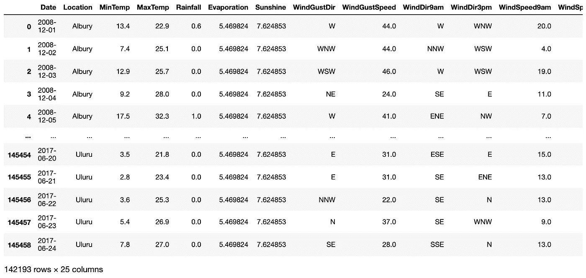

一段经过修改的 [Kaggle 的澳大利亚天气数据](https://www.kaggle.com/jsphyg/weather-dataset-rattle-package)。图片由[作者](https://solclover.com/)提供。

## 神经网络

现在我们训练和评估我们的前馈(FF)神经网络。我对下面的代码做了大量的注释，以便让您清楚地理解每个部分的作用。因此，我不会在文章正文中重复同样的内容。

**使用一个输入(湿度 3pm)**

简而言之，我们是用今天下午 3 点的湿度来预测明天会不会下雨。我们的神经网络具有本文前面分析过的简单结构(1–2–1):一个输入节点、两个隐藏节点和一个输出节点。

有几点需要注意:

*   下面的代码执行两次验证，一次是对 X_train 数据的一部分(参见步骤 5 中的 validation_split ),另一次是对步骤 2 中创建的测试样本。当然，没有必要做两次，所以可以随意使用任何一种方法来验证您的模型。
*   数据是不平衡的(晴天比雨天多)，所以我在步骤 5 中调整了 classes_weight。

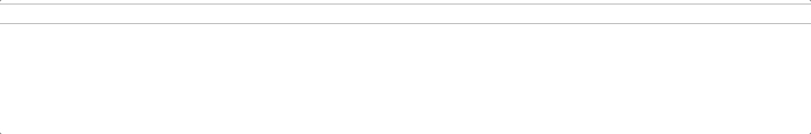

训练前馈(FF)神经网络。Gif 图片由[作者提供。](https://solclover.com/)

上述代码为我们的 1–2–1 神经网络打印了以下摘要和评估指标:

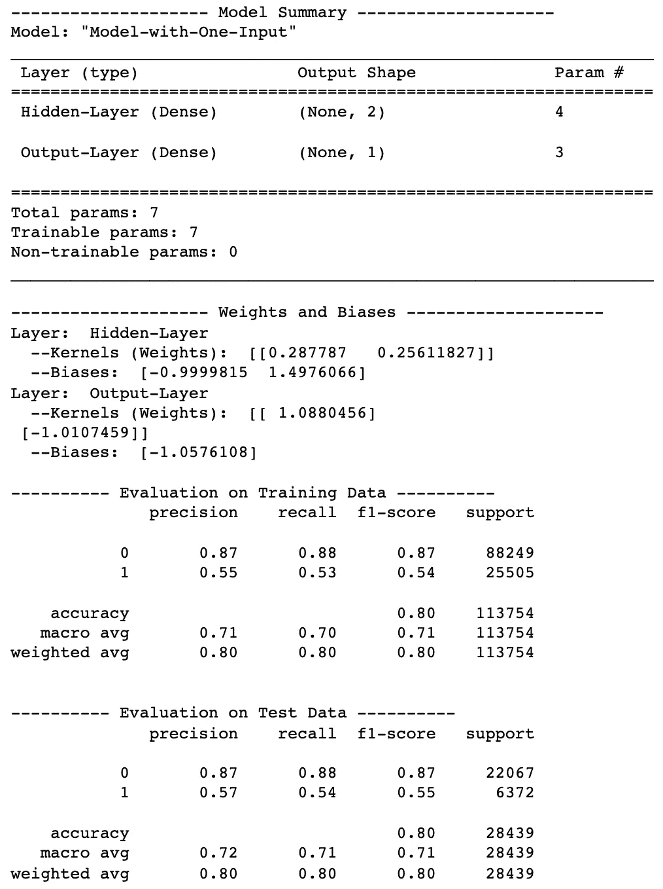

1–2–1 前馈(FF)神经网络性能。图片由[作者](https://solclover.com/)提供。

请注意，这个模型的权重和偏差与本文前面的计算示例中的不同。这是因为 ***神经网络训练使用了优化器算法内的随机(random)方法。因此，每次重新训练时，您的模型都会有所不同。***

现在让我们在图表上绘制预测曲线。

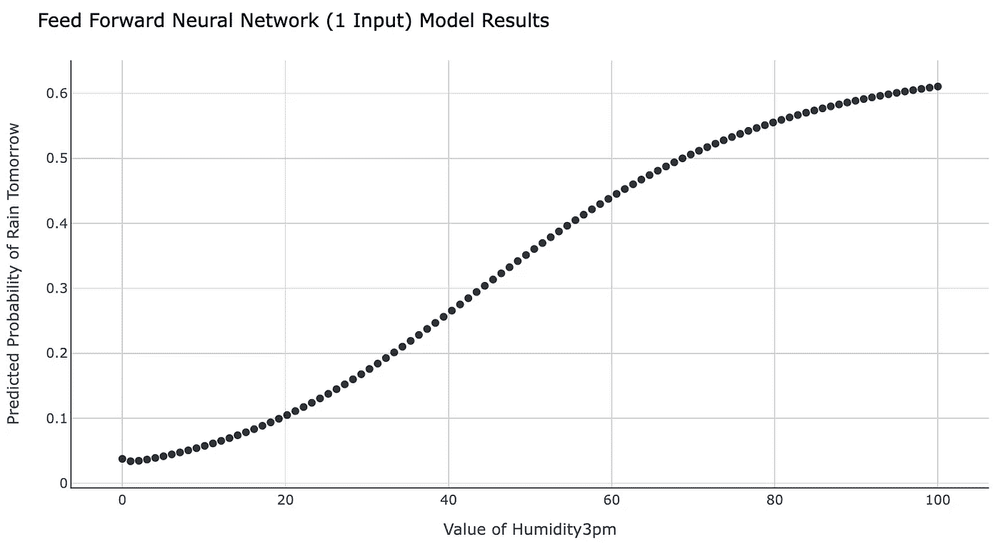

单输入神经网络生成的预测曲线。图片作者[作者](https://solclover.com/)。

**使用两个输入(风速和湿度 3pm)**

让我们看看当我们使用两个输入(风速和湿度 3pm)来训练具有 2–2–1 结构的神经网络时，网络和预测是如何变化的。

*通过训练一个具有 17 个输入和不同数量的隐藏节点的模型，您可以随时进行试验。*

结果是:

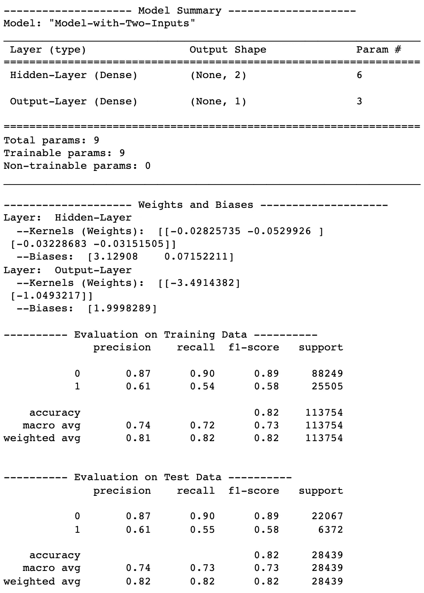

2–2–1 前馈(FF)神经网络模型性能。图片由[作者](https://solclover.com/)提供。

由于我们使用了两个输入，我们仍然可以可视化预测。但是，这一次我们需要一个 3D 图表来完成:

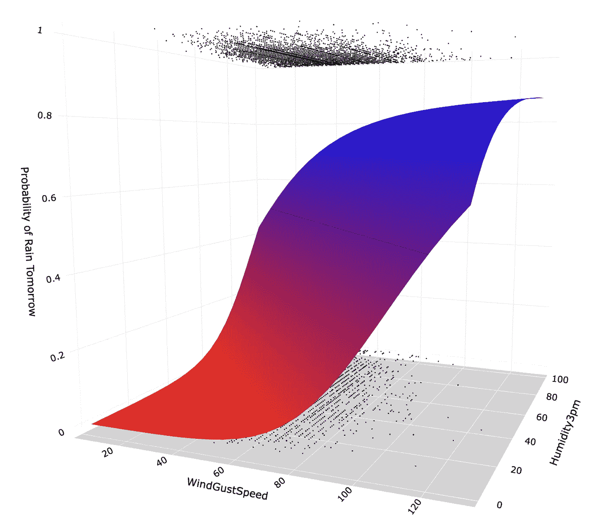

由具有两个输入的神经网络产生的弯曲预测曲面。图片由[作者](https://solclover.com/)提供。

# 结论

神经网络并不像一开始看起来那么可怕。我真诚地希望你喜欢阅读这篇文章，并获得一些新的知识。

请使用本文提供的代码来构建您自己的神经网络。另外，你可以在我的 [GitHub 库](https://github.com/SolClover/Art041_NN_Feed_Forward)中找到完整的 Jupyter 笔记本。

在我努力让我的文章对读者更有用的时候，如果你能让我知道是什么驱使你阅读这篇文章，以及它是否给了你想要的答案，我将不胜感激。如果不是，缺少什么？

干杯！👏
T21【索尔·多比拉斯

***如果你已经花光了这个月的学习预算，下次请记得我。*** *我的个性化链接加盟媒介是:*

[](https://solclover.com/membership) [## 通过我的推荐链接加入 Medium 索尔·多比拉斯

### 作为一个媒体会员，你的会员费的一部分会给你阅读的作家，你可以完全接触到每一个故事…

solclover.com](https://solclover.com/membership) 

您可能感兴趣的其他文章:

[](/umap-dimensionality-reduction-an-incredibly-robust-machine-learning-algorithm-b5acb01de568) [## UMAP 降维——一种非常健壮的机器学习算法

### 一致流形近似和投影(UMAP)如何工作，以及如何在 Python 中使用它

towardsdatascience.com](/umap-dimensionality-reduction-an-incredibly-robust-machine-learning-algorithm-b5acb01de568) [](/self-training-classifier-how-to-make-any-algorithm-behave-like-a-semi-supervised-one-2958e7b54ab7) [## 自训练分类器:如何使任何算法的行为像一个半监督的

### 使用 Sklearn 库中的标准分类算法进行自我训练的简单 Python 实现

towardsdatascience.com](/self-training-classifier-how-to-make-any-algorithm-behave-like-a-semi-supervised-one-2958e7b54ab7) [](/bbn-bayesian-belief-networks-how-to-build-them-effectively-in-python-6b7f93435bba) [## BBN:贝叶斯信念网络——如何用 Python 有效地构建它们？

### 使用真实生活数据在 Python 中构建模型的贝叶斯信念网络的详细解释

towardsdatascience.com](/bbn-bayesian-belief-networks-how-to-build-them-effectively-in-python-6b7f93435bba)