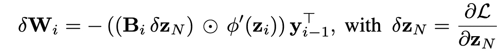

# 反馈校准方法

> 原文：<https://towardsdatascience.com/feedback-alignment-methods-7e6c41446e36?source=collection_archive---------14----------------------->

## [思想和理论](https://towardsdatascience.com/tagged/thoughts-and-theory)

## 生物驱动的反向传播替代方案

由 [Robina Weermeijer](https://unsplash.com/@averey?utm_source=medium&utm_medium=referral) 在 [Unsplash](https://unsplash.com?utm_source=medium&utm_medium=referral) 上拍摄的照片

反向传播的简单、高效、高精度和收敛速度，使其成为训练神经网络的实际算法。然而，有证据表明，这种算法不能由人脑在生物学上实现[1]。其中一个主要原因是反向传播需要前向和后向路径中的突触对称。由于突触在大脑中是单向的，前馈和反馈连接在物理上必须是不同的。这就是所谓的重量运输问题。

为了克服这一限制，最近对学习算法的研究通过研究更具生物学意义的算法，专注于神经科学和机器学习之间的交叉。其中一个主要的方法被称为反馈校准，它采用不同的前向和反馈突触权重。

不同学习算法的比较:反向传播、FA 和 DFA——作者图片

除了提供更具生物合理性的训练方案之外，已经表明对齐方法可以提高深度学习模型对抗敌对攻击的鲁棒性。最后，对反馈对准的额外兴趣还受到它们允许前向和反馈权重在专用集成电路(ASICs)中本地存在的能力的驱动，这最终允许节省时间和能量。

在这篇文章中，我将描述主要的反馈校准方法，并展示一个比较它们的准确性和鲁棒性与反向传播的基准。

# 反馈校准方法介绍

## 反向传播在生物学上是不合理的

使用反向传播的 N 层神经网络的训练在前向传递和后向传递之间交替，前向传递用于执行推理和计算误差信号，后向传递用于发送误差信号和更新权重。

我们可以观察下面的权重更新规则:

反向传播权重更新规则

层 *i* 的权重更新需要前向权重矩阵 *W_(i+1)的知识。*那个在生物学上是不可信的，因为它要求神经元互相发送大量的突触权重来执行反向传递。

重量运输问题——图片由[伊恩·泰勒](https://unsplash.com/@carrier_lost?utm_source=medium&utm_medium=referral)在 [Unsplash](https://unsplash.com?utm_source=medium&utm_medium=referral) 上拍摄

## 反馈校准算法避免了重量转移问题

反馈对准算法提出在后向传递中替换前向权重矩阵 *W* 信息，消除了传输权重的需要。不同方法之间的差异包括如何计算后向传递以及如何构建后向权重矩阵 *B* 。

**反馈校准(FA):** 权重更新的计算方式与反向传播相同，但反向权重矩阵是随机矩阵[2]。将 *B* 初始化为与 *W* 具有相同的分布和数量级有助于提高网络训练的收敛性。下面的公式描述了 FA 的权重更新规则:

**一致符号一致反馈(uSF):** 这种权重更新方法类似于 FA，但是它通过假设单位幅度的突触权重来传输前向矩阵的符号[3]。因此， *B* 矩阵为:

**分批随机幅度符号一致反馈(brSF):** 该方法不是为第 *i* 层的后向权重假设一个单位幅度，而是在每次更新后重新绘制它们的幅度|*R _ I*|,使得:

**固定随机幅度符号一致反馈(frSF):** 这是 brSF 方法的变体，其中权重的幅度|*R _ I*|不是在每次更新后重新绘制，而是在训练开始时固定和初始化。

**直接反馈校准(DFA)** :虽然 FA 中的权重更新是跨层递归计算的，但是可以通过直接将最后一层的损耗导数 *𝛿z_N* 向后推至所有层来预测误差传播【4】。这将导致以下更新:

其中 *B_i* 是一个适当形状的固定随机矩阵(即 *layer_i* 的输入维数×*layer _ N*的输出维数)。

# 算法基准

在本节中，我将解释在*反馈校准算法*【5】的准确性和鲁棒性基准测试中进行的实验。我们使用了 [*BioTorch*](https://github.com/jsalbert/biotorch) 开源框架来进行基准测试。

我们使用 Xavier uniform 初始化我们的层的前向和后向权重，W 和 T2。使用这种方差保持初始化允许我们将权重保持在相同的数量级，并且改进了不对称条件下的训练。对于 uSF 方法，我们通过 Xavier 初始化的标准偏差来缩放权重的符号。

我们的实验表明，根据优化器的选择，模型的分类准确性存在显著差异，特别是对于 FA 和 DFA，即使在调整了它们各自的学习速率之后。为此，我们展示了 SGD 和 Adam 优化器的实验结果。

## **MNIST &时尚 MNIST**

我们通过在 MNIST 和时尚 MNIST 数据集上对 LeNet 的所有对齐方法进行基准测试来开始我们的实证研究。用设置动量为 0.9 的 SGD 优化器和 10^(−3).的权重衰减来训练网络我们训练了 100 个时期，在第 50 个和第 75 个时期将初始学习率降低了 2 倍。

MNIST 和时尚 MNIST LeNET 网络的最大错误率(%)

我们观察到 FA 和 DFA 的性能接近 BP，并且符号一致性方法在 MNIST 上匹配 BP 性能。如果我们增加数据集的难度(时尚 MNIST)，反向传播和其他方法之间的性能差距，特别是那些不使用符号一致反馈的方法，也会增加。

## CIFAR-10

为了将对齐方法的应用扩展到更深层次的架构和更具挑战性的任务，我们在 CIFAR-10 中对 ResNet-20 和 ResNet-56 进行了基准测试。使用 SGD 优化器的网络以 0.9 的动量和 10^(−4 的权重衰减来训练)。使用 Adam 的网络用相同的权重衰减和等于[0.9，0.999]的 betas 参数来训练。我们以 128 的批量进行 250 个时期的训练，在第 100、150 和 200 个时期将初始学习率降低 10 倍。我们使用网格搜索来选择每种方法的最佳学习率。

在 FA 和 DFA 方法的两种网络配置中，Adam 使用的自适应参数独立优化器都优于 SGD，如下所示。这些方法是反向通道中的不对称性较大的方法。

使用 SGD 和 Adam 训练的每个方法的 ResNet-20 和 ResNet-56 的 CIFAR-10 中的前 1 名错误(%)

Adam 带来的显著改进是可以预期的，因为它保持了基于从 RMSProp 继承的梯度的二阶矩的平均值而调整的每个参数的学习率。因此，它在噪声梯度下产生更好的性能。为了证实这一观察，我们为 SGD 和 Adam 优化器绘制了 DFA 方法的后向-前向范数权重比。

在 CIFAR-10 上为 SGD 和 Adam 训练 ResNet56 时，方法 FA 和 DFA 的权重比

可以观察到，SGD 已经驱动网络的第一层的范数权重比非常接近 0，这意味着前向权重矩阵 *W_i* 被更新以达到比后向权重矩阵 *B_i* 中的值大得多的值。这是由于在 DFA 方法中误差从最后一层到每一层的直接误差投影，从而避开了使用链规则计算的梯度的小范数。

同样的观察结果不适用于 FA 方法，其中第一层的权重范数比不为零，如下所示。然而，我们看到，与 SGD 相比，Adam 实现了更小的前后重量排列角度。

用带 SGD (a)和 Adam (b)的 FA 训练的 ResNet-20 的矩阵排列(左)和重量比(右)

## ImageNet

最后，我们在 ImageNet 上对所有训练 ResNet-18 网络的方法进行了基准测试。我们使用 256 的批量大小，并使用初始学习率为 0.1 的 SGD 训练 75 个时期。调度器在第 20、40 和 60 个时期将学习速率降低 10 倍。我们使用 10^(−4 的重量衰减)和 0.9 的动量。对于 DFA，我们使用初始学习率为 0.001 的 Adam。我们的结果可以在下图中看到:

用所有反馈校准方法训练的 ResNet-18 网络的前 1 名 ImageNet 验证误差(%)

我们可以观察到，就性能而言，没有一种比对方法可以与反向传播相比。虽然符号一致反馈方法在精度上更接近，但是仍然有小的差距。对于 FA 和 DFA 方法，差距要大得多，这意味着在训练过程中反馈权重不能与反向权重对齐。

# 结论

反馈比对算法是一种比反向传播更具生物合理性的替代方法，因为它们避免了重量转移问题。在整个基准测试中，我们已经看到，尽管它们的性能与 MNIST 和 CIFAR-10 相当，但它们无法扩展到 ImageNet 之类的困难任务。然而，在使用 ASICs 的应用中，它们的应用可以有助于降低成本，因为反馈和反向权重是独立的。此外，这些方法的研究仍然很重要，因为在神经科学的帮助下，有助于我们揭示和了解更多关于人类大脑学习过程的信息。

**感谢阅读，希望你喜欢这篇文章，并学到一些新东西！**

# 参考

[1]蒂莫西·P·莉莉卡普、亚当·桑托罗、卢克·马里斯、科林·J·阿克曼和杰弗里·辛顿，[反向传播和大脑](https://www.nature.com/articles/s41583-020-0277-3) (2020 年)，《自然评论神经科学》。

[2] Timothy P Lillicrap，Daniel Cownden，Douglas B Tweed 和 Colin J Akerman，[随机突触反馈权重支持深度学习的误差反向传播](https://www.nature.com/articles/ncomms13276) (2016)，自然通讯。

[3]李倩·廖、乔尔·雷博和托马索·波吉奥，[权重对称在反向传播中有多重要？](https://arxiv.org/abs/1510.05067) (2016)，《AAAI 人工智能会议论文集》。

[4]Arild nkland，[直接反馈对齐提供深度神经网络中的学习](https://arxiv.org/pdf/1609.01596.pdf) (2016)，神经信息处理系统。

[5] Sanfiz，Albert Jiménez 和 Mohamed Akrout，[对反馈对齐算法的准确性和鲁棒性进行基准测试](https://arxiv.org/pdf/2108.13446.pdf) (2021)， *arXiv 预印本 arXiv:2108.13446* 。