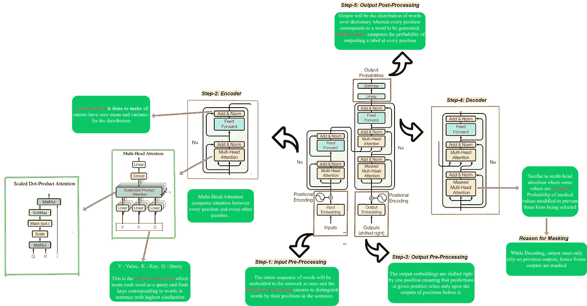
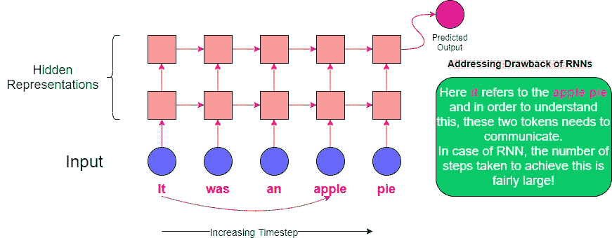
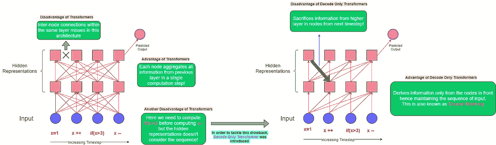
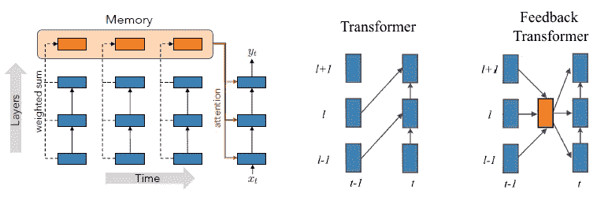
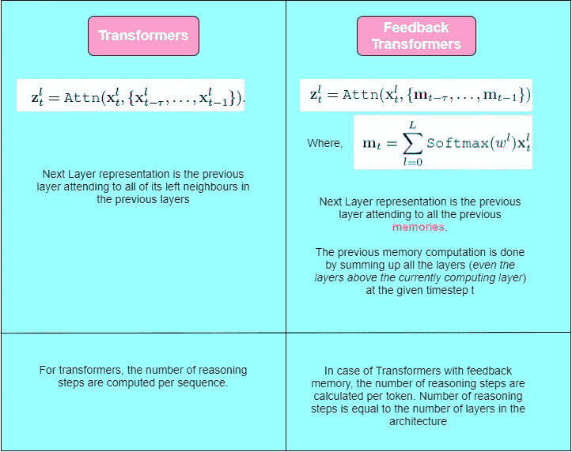
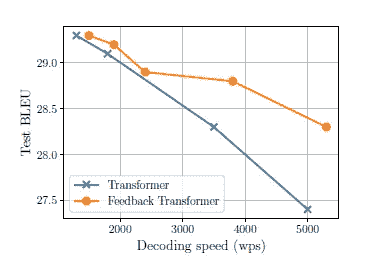
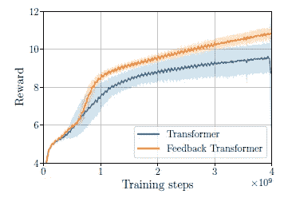

# 脸书人工智能反馈变压器

> 原文：<https://towardsdatascience.com/feedback-transformers-from-facebook-ai-221c5dd09e3f?source=collection_archive---------34----------------------->

## 解决具有反馈记忆的变压器的一些限制

保罗·库科在 [Unsplash](/s/photos/backe%3Dward?utm_source=unsplash&utm_medium=referral&utm_content=creditCopyText) 上的照片

在自然语言处理时代，Transformer 架构的增强已经成为革命的核心，突破正以前所未有的速度发生。本文展示了反馈变换器的概念，它克服了传统变换器架构以及递归神经网络的缺点，使较浅的模型具有更快的解码速度、更少的内存以及所需的计算，最重要的是，可以利用来自所有先前层的所有计算信息，而不像仅解码变换器那样为了并行训练而牺牲很多信息。

# 在进入反馈存储器的杂草之前，让我们修改变压器架构！

自然语言处理中的转换器架构旨在解决序列到序列的任务，同时轻松处理长范围依赖。这个模型完全依靠*对* [*自我关注*](/illustrated-self-attention-2d627e33b20a) *来计算其输入和输出的表示，而不使用序列对齐的 RNNs 或卷积。*

***让我们在此一窥其架构，更深层次地钻研其推荐访问论文*** [***关注你所需要的***](https://arxiv.org/abs/1706.03762) ***！***

图 1:变压器架构综合视图

# RNNs 和变压器架构的局限性

在 RNN 和变压器架构的情况下，不是所有计算的信息都被使用，尽管在技术上，人们可以利用它，但是为了并行训练，做出了牺牲。然而，新颖的反馈变换器架构使用具有相对更强性能的浅层模型来揭示从所有先前表示到所有未来表示的信息。

## 递归神经网络及其局限性

图 2:对 RNN 建筑及其缺点的直观研究

在 RNN 的情况下，所有信息仅在顶部和右侧方向流动，因此有大量信息丢失。此外，为了与其他信息相结合，这些信息通常需要经过多次计算。

## 变压器及其局限性

Transformer 体系结构有许多局限性，例如它不能有效跟踪长序列以及处理分层输入。这种架构的一些最重要的限制是:

*(A)对更高级别陈述的有限访问*

*(B)如果频繁更新，变压器无法长时间保持内部状态*

图 3:变压器及其缺点的直观研究

# 引入带反馈存储器的变压器

为了克服变压器结构的局限性，引入了反馈记忆的概念。正如我们可以在图 3 中分析的，每个隐藏的表示都有许多箭头(即连接),这种数量的注意力连接可以引爆任何系统。为了克服这一点，反馈记忆将特定时间步长的所有信息混合到一个记忆表示中。随后的层不再关注先前层的单独表示，现在只关注单一的记忆表示。

图 4:(左)反馈转换器将所有层的隐藏表示合并成一个向量，并存储在内存中。(右)反馈和变压器的区别。t 表示时间步长，l 表示层。

将信息存储到相应的存储器表示中的显著好处在于使用了总体更少的存储器以及更少的计算，因为这种方法共享了注意机制的密钥和值计算，从而由于存储器共享而进一步导致 GPU 存储器使用的减少。

图 5:解释变压器和反馈变压器中下一层表示的计算差异

# 反馈变压器架构的优势

以下是将反馈存储器引入变压器架构对性能提升的主要贡献:

1.  ***能够用小而浅的模型实现更好的性能***

图 6:wmt 14 En-De 上的机器翻译，测试集 BLEU 和不同解码器深度的解码速度(每秒字数)。

根据图 6 的检查结果，可以得出结论，随着解码速度的提高，由于较浅的网络，即架构中的层数较少，与反馈变压器相比，变压器的性能下降更多。

***2。与变形金刚*** 相比，反馈变形金刚收敛以在强化学习中达到更高的平均回报

图 Gridworld 中的迷宫导航。显示反馈变压器与标准变压器的平均奖励比较。

强化学习任务通常需要长时间的记忆来最佳地解决任务。从图 7 可以诊断出，与变压器架构相比，反馈变压器收敛以在任何训练步骤达到更高的回报。

# 结论

尽管在训练和推理时间期间使用了相当少的存储器，但是与具有更小和更浅模型的相同大小的变换器架构相比，反馈变换器以更快的解码速度实现了更强的性能。保留远程信息流以及立即访问可用的更高表示信息是具有反馈记忆的变压器的一些主要贡献。

# 参考资料:

[1]范，安吉拉，等，“解决变压器的一些限制与反馈记忆。”arXiv 预印本 arXiv:2002.09402 (2020)。

[2]瓦斯瓦尼、阿希什等人，“你所需要的只是关注。” *arXiv 预印本 arXiv:1706.03762* (2017)。

[【3】扬尼克·基尔彻的《反馈变压器》](https://www.youtube.com/watch?v=zdb8MM94A5c)。

> 希望你能像我写这篇文章一样喜欢阅读这篇文章！
> 
> *如果你觉得这些内容有意义，可以看看我的其他文章* [*这里*](https://medium.com/@dhwanidm1996) *。*