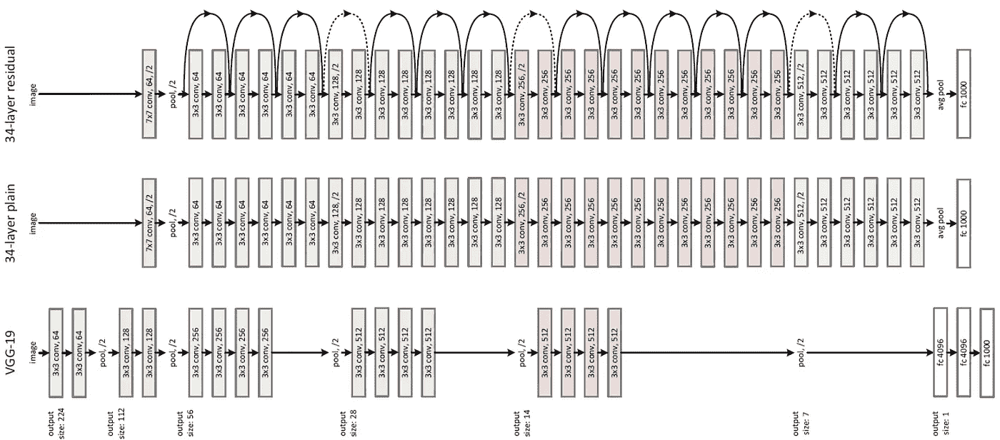

# 喂野兽:深度学习训练的数据加载路径

> 原文：<https://towardsdatascience.com/feeding-the-beast-understanding-and-optimizing-the-data-loading-path-for-training-deep-learning-f896548dca89?source=collection_archive---------6----------------------->

## 通过了解和调整从磁盘到 GPU 内存的数据加载，优化您的深度学习培训流程

大卫·拉扎罗在 [Unsplash](/s/photos/feeding?utm_source=unsplash&utm_medium=referral&utm_content=creditCopyText) 上拍摄的照片

深度学习实验速度对于按时交付高质量的解决方案非常重要。

数据加载路径——即将训练样本从存储中获取到 GPU 中是一个经常被忽视的领域，尽管它对实验速度有着重大影响。

在这篇文章中，我将介绍数据加载路径的组件，如何形式化它们的性能目标，以及如何设计满足这些性能目标的解决方案。

# 逆向工作—从 GPU 到存储

## 基本原理—让 GPU 保持忙碌

购买/租赁 GPU 非常昂贵。因此，在培训期间，您希望确保他们处于 100%的利用率，处理这些矩阵并更新权重。

GPU 在小批量中的工作效率最高，即通过将网络运算符表示为多维张量，同时将它们应用于大量训练示例。*从纯计算效率的角度来看，批量越大越好(主要限制是 GPU 内存)*

为了保持 GPU 的高利用率，我们需要确保在小批量(向前+向后传递)的训练步骤结束时，下一个小批量将准备好传输到 GPU 的内存中。

GPU 利用率下降表明数据加载太慢。作者图片

## 数据加载性能要求(针对单个 GPU)

定义:

***n =小批量***
***t=小批量 GPU 处理时间***

在典型的训练制度中，这些值在整个训练过程中是固定的。

目标:

99%的小批量应在*秒或更短时间内加载 ***n*** 个实例。
简单测量的上限可以是:*

*   ****最大延迟*** (单例)≤ ***t****
*   ****最小吞吐量*** (例/秒)*≥***n/t*****

## **什么影响 n 和 t？**

**首先也是最重要的， ***n*** 是一个超参数，你需要调优它，让你的网络真正收敛，学习你希望它学习的东西。**

> **通常，如果训练数据量很小，您会选择较小的批量(例如 16/32)，如果训练数据量很大，则选择较大的值。**

****

**选择正确的批量大小可以使网络更快地收敛。作者图片**

*****t*** 是 GPU 需要在小批量上执行的**计算量(FLOPs)** 的函数；这取决于 **GPU 型号、网络复杂性和 *n.*****

**最后， ***n*** 受到可用 **GPU 内存**数量的限制。存储器需要保存整个小批量的网络状态。**

> **网络状态的内存占用随着批处理的大小而线性增长，因为它包含反向传播所需的每个训练示例的激活和功能**

**迷茫？让我们看一些例子。**

****Resnet 50 上的 Imagenet****

****

**Resnet 架构。来源:[kaggle.com](https://www.kaggle.com/keras/resnet50)**

*   **数据表示— 224X224X3，双精度(32 位)**
*   **单个示例的计算— [4 GFLOPs](https://github.com/albanie/convnet-burden/blob/master/reports/resnet-50.md) (约 40 亿次浮点运算)**
*   **GPU 型号— V100，16 GB。能够进行 [7 TFLOPS](https://images.nvidia.com/content/technologies/volta/pdf/437317-Volta-V100-DS-NV-US-WEB.pdf) (每秒约 7 万亿次浮点运算**)****
*   ****GPU 内存中单个示例状态的大小:103 MB****
*   ****内存中模型参数的大小:98MB(约 2500 万个可训练参数)****

******分析:******

*   ****V100 应该能够每秒处理 7 TFLOPs。
    结果应该是每秒处理 7 TFLOPS/4GFLOPs = 1750 个实例
    注:NVIDIA 公布的数字是 [1457](https://developer.nvidia.com/deep-learning-performance-training-inference) ，可能是由于从 CPU 获取实例到 GPU 内存的开销。****
*   ****内存大小为***n***128 = 103 mbx 128+98MB = 12.97 GB。
    这意味着 ***n*** =256 不适合 GPU 内存。****
*   ****结果: **n=128，t = 128/1457 = 0.087s******

******接下来，为了在带有 Resnet 50 网络的 V100 上训练 imagenet，我们要求我们的数据加载为我们提供以下内容:******

> ****t =单个图像的最大延迟≤87 毫秒****
> 
> ******n/t =每秒约 1457 张图像的读取吞吐量******

******rest net 152 上的 Imagenet******

****为了让您了解改变网络架构对性能的影响，下面是用 Resnet 152 重复的相同实验:****

*   ****内存中单个示例的大小:219 MB(是 Resnet 50 的两倍)****
*   ****内存中模型参数的大小:209 MB(约 5000 万个可训练参数)****
*   ****单个示例处理成本= 8 GFLOPs****
*   *******n*= 64(64 * 219 MB = 13.8 GB)******
*   *******t*** = 0.087s(总计~每批计算量相同)****

> ****t =单个图像的最大延迟≤87 毫秒****
> 
> ****n/t =每秒约 730 张图像的读取吞吐量****

****因此，一个“小”的架构变化会导致数据加载性能需求的巨大变化。****

## ******猜测数据加载需求的经验法则******

******小数据****** 

****为了充分利用每个训练示例，**您需要较小的 n** 值。****

****在这种情况下:****

*   *******t*** 会很短(几十毫秒)****
*   *******n*** 会小(如 16/32)****
*   ****吞吐量( **n/t** )仍然可以很高****

******大数据******

****如果您有大量数据，您通常会使用容量更大的网络，并针对更多时期对其进行训练。这种情况下，你要一个**大 n** 。你的网络可以接受而不会混淆，再加上，*否则，训练将永远进行下去*。

当你*想要*一个高 ***n*** 的时候，你面临着一个问题 GPU 内存中每个例子的大小都会很大(高复杂度网络)——这就限制了 ***n*** (并延长了 ***t*** )。****

****为了解决这个问题，常见的解决方案是:****

*   ****使用分布式训练，使用多个 GPU(同一台机器/集群)处理整个大批量****
*   ****减少网络的内存占用(例如混合精度)****

****因此:****

*   *******t*** 可以相对放松(比如说 2 秒)****
*   *******n*** 可以很大(比如说 1024)****

## ****分解数据加载过程****

****由于 GPU 本身必须忙于学习，一个显而易见的选择是使用 CPU 加载和准备数据——CPU 反正连接到每台机器，除此之外几乎没有任何事情可做。****

********

****当前一批正在 GPU 上处理时，使用 CPU 工作线程加载小批。作者图片****

****为 GPU 准备小批量包括以下步骤:****

1.  ****决定需要加载哪些示例(通常使用数据集的混排)****
2.  ****从存储(IO)加载示例****
3.  ****转换，如预处理或扩充(CPU)****
4.  ****将它们存储在 RAM (CPU)中****
5.  ****将张量传输到 GPU 内存(CPU)****

******使用并行性实现吞吐量** 大量的 I/O、每个示例的中高延迟以及拥有许多空闲内核的强大机器表明，在数据加载中使用并行性是明智的。****

****为了进一步卸载并降低对延迟峰值的敏感性，如果我们有空闲的工作人员，就有机会急切地从下一个批次的*中加载示例(确保不要破坏 RAM……)*****

****我们现在将更深入地研究数据加载的主要部分，从 CPU 对示例的处理向后追溯到从存储中读取数据的实际 IO。****

****在这篇文章中，我们不会讨论将数据从 RAM 移动到 GPU (5)的步骤，尽管这也很重要，并且有多种优化，如 PCIe、NVLink、固定内存等。****

## ****阶段 3 —从原始输入示例到训练示例****

****GPU 期望为它的小批量接收张量。
然而，通常我们从存储器中加载的不是张量，而是数据的其他二进制表示，例如. jpg 文件。****

****在简单的情况下，将原始输入示例转换为定型示例就像将. jpg 解码为像素一样简单。在其他情况下，我们会进行各种变换(例如下采样)和增强。****

****转换甚至可以包括原始输入示例和训练示例之间的多对多关系。天空是极限，但当然，所有这些都花费了我们在 CPU 上的时间。****

****还有一个需要考虑的内存占用，特别是如果您不能在数据仍处于压缩形式时对其进行缩减采样，但我们现在将把这个问题放在一边。****

********

****来源:[相册](https://github.com/albumentations-team/albumentations)项目(麻省理工学院许可)****

> ****如果您的处理量很大，您可以通过提前批量处理，并将处理过的示例存储在磁盘上来进行优化，从而减少 CPU，甚至减少磁盘上的文件大小。****

## ****阶段 2 —从存储中加载示例****

****在大多数情况下，I/O 是数据加载的最大成本。
一般情况下我们需要注意的存储参数有:****

*   ****以 GB 为单位的存储总大小=基于我们的训练集大小****
*   ****读取 IOPS = **n/t(假设 CPU 处理时间可以忽略不计)******
*   ****块大小(=磁盘上的典型示例大小，以 MB 为单位，表示为 **es)******
*   ****读取带宽(MB/s) = **es * n/t******

****注意:如果我们考虑使用**共享存储**进行多个并发实验:****

*   ****对于训练数据的总大小(以 GB 为单位)-对您计划训练的所有数据集使用联合****
*   ****从您计划的训练负荷中选择一个具有挑战性的组合 ***t，n，es******* 
*   ****使用 ***n*** = **#并发实验 **典型批量*******

******示例——四个 v100 训练图像网络和 Resnet 50******

*   *******总数据集大小*** = ~150 GB****
*   *******n*** = 128*4 = 512****
*   *******t*** = 0.087****
*   *******es*** = 469x387 像素 jpg，说 **64 KB** 。****

****结果:****

*   ******IOPS** = 512/0.087 = 5885****
*   ******块大小** = 64 KB****
*   ******读取带宽** = 367 MB/s****

> ****这些要求适合现代 SSD 存储设备。
> 为了在旋转的磁盘上实现类似的性能，我们需要同时将负载分散到大约 45 个磁盘上。****

********

****现代旋转磁盘的 IOPS 和块大小。来源:[wikipedia.com](https://en.wikipedia.org/wiki/IOPS)****

****当你是一名研究人员，在几十 GB 的稳定数据集上训练网络时，本地 SSD 驱动器是你的朋友。它们并不昂贵，您可以在合理的时间内获得它们的数据，并且您可以获得很好的性能，而无需过多考虑 I/O。****

# ****随着您的培训操作扩展存储****

****当您有一个由 15 名工程师和研究人员组成的团队，在一个训练集群上同时运行数十个实验，并且每月利用数 TB 的训练数据时，会发生什么？****

****在训练之前将数据集复制到连接的存储设备(例如本地磁盘或块设备)实际上不是一个选项。****

*   ****要么是数据太大，要么是复制时间太长****
*   ****如果您在集群上进行培训，您需要能够轻松地“移动”机器，而使用附加存储则无法做到这一点。****

> ****较大的 DL 培训操作需要远程存储解决方案，该解决方案通过使用来自培训机器的 API 来“安装”或访问。****
> 
> ****典型的解决方案包括结合 HDD 和 SSD 的横向扩展 NAS 存储。这些解决方案以高吞吐量提供并行读取，并且在许多情况下，延迟是可接受的。****

********

****来源: [AWS 文档](https://github.com/awsdocs/amazon-efs-user-guide/blob/3f3a66edf632a976b876bca813ba7c0ac461a42f/doc_source/accessing-fs.md) ( [许可证](https://github.com/awsdocs/amazon-efs-user-guide/blob/3f3a66edf632a976b876bca813ba7c0ac461a42f/LICENSE))****

## ******体面的 NFS 可以处理更大的文件和宽松的延迟******

****让我们来看看一个理论上的 DL 商店的储物需求:****

*   ****5tb 到 10 TB 的数据(仅活动使用的数据)****
*   ****5-10 个同时进行的实验****
*   ****每个实验的 GPU 数量= 4****
*   *******n*** = **单个** GPU= 64****
*   *******es*** = 500K****
*   *******t*** = 2s(重网)****

****这将需要:****

*   ****IOPS—640–1280****
*   ******读取带宽** — 600 MB/s — 1.28 GB/s****

> ******在云上，这种类型的性能可以通过 NFS 存储产品实现，例如** [**GCP 文件存储**](https://cloud.google.com/filestore/docs/performance) **或**[**AWS EFS**](https://docs.aws.amazon.com/efs/latest/ug/performance.html)**。******

## ******小输入/短延迟是一个代价高昂的问题******

> ****存储有一个众所周知的问题，叫做“小文件问题”。本质上，这意味着进行快速随机访问和返回小块是昂贵的。****

****这里有一个例子:****

*   ****5tb 到 10 TB 的数据(仅活动使用的数据)****
*   ****5-10 个同时进行的实验****
*   ****每个实验的 GPU 数量= 4****
*   *******n*** = **单个** GPU= 256****
*   *******es*=*64K*******
*   *******t*= 0.2s******

****这将需要:****

*   ****IOPS = 25600–51200****
*   ****读取带宽= 1.6–3.2 GB/秒****

> ****在标准 NFS 解决方案中，非常快速地加载许多小文件是有问题的——您要么需要将数据分布在大量驱动器上，要么使用昂贵的 SSD 阵列和其他高端解决方案****

## ****了解工作负载特征****

****从存储的角度来看，用于培训的数据加载有一组非常独特的特征:****

*   ****单个“原始输入示例”的大小可能会因数据的形态而有很大的不同，从每个原始输入示例几十 K 到几 MB 不等。****
*   ****数据被“批量”读取、处理和写入，然后被多次读取****
*   ****对于延迟峰值，读取稍微宽松一些，更关心吞吐量****
*   ****数据是“随机”访问的，因为小批量会打乱每个小批量中包含的示例****
*   ****一旦读取了单个数据示例数据，几乎可以保证它会在相对较短的时间框架(每个时期)内被反复读取****

****这些可以用来以创造性的方式优化存储。****

## ****利用负载特征优化存储****

****要优化存储解决方案，请考虑使用以下部分或全部方法:****

****首先-使用紧凑的表示格式，这将尽可能减小单个示例的大小。如果数据将在一秒钟后被向下采样，则不需要支持高带宽！****

****第二，您可以使用本地的部分缓存解决方案(例如 SSD)，利用未来时代的缓存命中保证。如果您能够以这种方式随机缓存 20%的数据集(惰性)，那么您可以轻松获得加速。****

> ****最后—尝试从非常短的延迟/许多随机 IOPS 转向更长的延迟和顺序读取。****

****坦率地说，应该避免上面讨论的极端情况(非常短的延迟，许多小的随机 IOPS)—例如，通过使用较弱的 GPU，或者通过在不同的培训工作之间[共享 GPU。](https://www.run.ai/)****

****但是，即使对于更温和的情况——如果我们可以在磁盘上批量处理例子，会怎么样呢？我们将依次读取 1 个较大的文件，而不是读取*个小文件并进行多次寻道？*****

> *****这是一个吸引人的想法；挑战在于支持每个时期的随机洗牌——但事实证明，如果你足够努力，这是可以解决的…*****
> 
> *****在不久的将来，我会试着在另一篇文章中讨论这些问题。*****

# *****摘要*****

*****保持 GPU 的充分利用需要了解和优化数据加载路径-从磁盘到 GPU 内存。*****

*****这样做的细节取决于各种参数，如数据的大小，以及您拥有的计算资源和您正在训练的网络。*****

*****在这篇文章中，我试图介绍数据加载流程和优化的基础知识，并提供一些解决方案。*****

*****请继续关注下一期文章，它将关注存储优化技术。*****