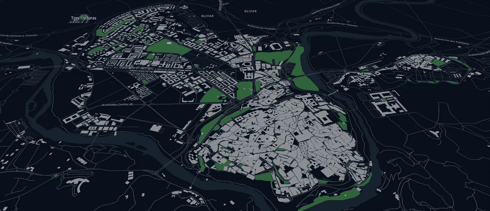
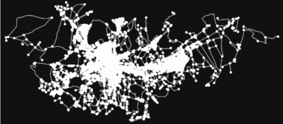
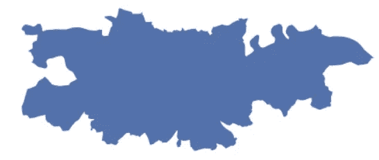
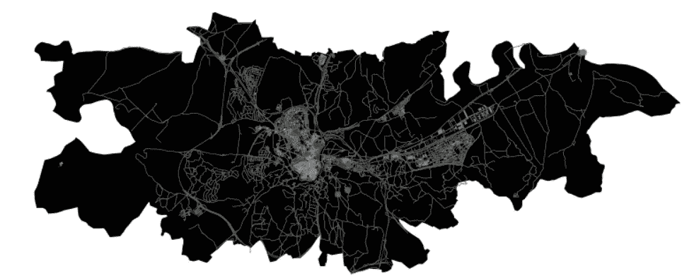
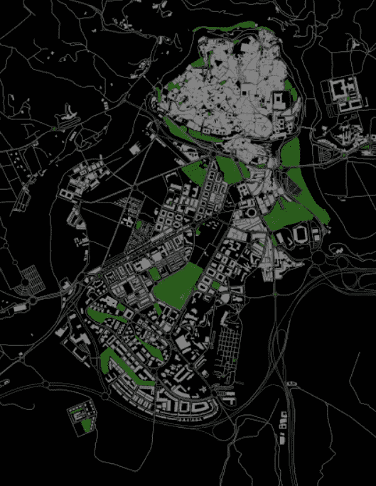

# 从托莱多的 OSM 数据中提取绿色区域

> 原文：<https://towardsdatascience.com/fetching-green-areas-from-osm-data-a6ff835c40dc?source=collection_archive---------18----------------------->

## 如何使用 OSMnx 以几何图形的形式检索公园



图片由作者提供。OSM 数据托莱多市中心(建筑、道路、公园)

我在赫尔辛基大学的自动化 GIS 课程中担任研究助理的经历非常棒。我支持学生的任务，提供 GIS 流程自动化方面的提示。我很高兴看到地理学家是如何用 python 脚本接管地理空间分析的。这些课结束了，但学到的东西还在。我想保留的一个类是由 [Geoff Boeing](https://medium.com/u/c490d872f7a?source=post_page-----a6ff835c40dc--------------------------------) 创建的 python 库 [OSMnx](https://geoffboeing.com/2016/11/osmnx-python-street-networks/) 的用法。多亏了这个图书馆，从世界各地的城市获取街道网络成为可能。此外，还可以获取其他元素，如本编码实践所示。我在这里展示了一个关于如何绘制绿色区域和街道网络的简短教程。

如果你有兴趣从 OSM 找到更多的几何物体，你可以仔细查看 [OSM 维基上的建筑标签](https://wiki.openstreetmap.org/wiki/Buildings)。您可以使用标签来检索咖啡馆、市场、停车场等。另一个有用的网站是 [OSM 域名](https://nominatim.openstreetmap.org/ui/search.html?q=toledo)，在那里你可以找到你想要从 OSMnx 中检索数据的地方的名称。因此，不要怀疑测试它与您想要的城市，不要忘记分享您的地图。我会很高兴看到你的作品。我在这种情况下是托莱多。

> 找到此回购中的材料:[获取 OSM](https://github.com/bryanvallejo16/fetch_OSM_data)

# 编码实践

首先，您将导入库

```
**import** osmnx **as** ox
**import** matplotlib.pyplot **as** plt
```

然后你从 OSM 命名中指定位置并想象这个区域。

```
**# Specify the name that is used to seach for the data**
place_name = “ Toledo, Castile-La Mancha, Spain”**# Fetch OSM street network from the location**
graph = ox.graph_from_place(place_name)**# Plot the streets**
fig, ax = ox.plot_graph(graph)
```



由作者想象。托莱多的曲线图

将边(街道网络)放入地理数据框架

```
**# Retrieve nodes and edges**
nodes, edges = ox.graph_to_gdfs(graph)
```

将地名(Toledo)放入地理数据框架

```
**# Get place boundary related to the place name as a geodataframe**
area = ox.geocode_to_gdf(place_name)area.plot();
```



图片由作者提供。托莱多行政单位

获取带有标签和地名的建筑物几何图形作为地理数据框

```
**# List key-value pairs for tags**
tags = {‘building’: True}buildings = ox.geometries_from_place(place_name, tags)
```

绿色区域/公园的标签很棘手，但希望你能在 OSM 维基中找到你需要的所有对象。现在，让我们把绿色区域作为地理数据框架

```
**# List key-value pairs for tags**
tags = {‘leisure’: ‘park’, ‘landuse’: ‘grass’}**# Get the data**
parks = ox.geometries_from_place(place_name, tags)parks.plot(color="green");
```

现在我们一起来出图。在整个地区。

```
fig, ax = plt.subplots(figsize=(12,8))**# Plot the footprint**
area.plot(ax=ax, facecolor=’black’, zorder=0)**# Plot street edges**
edges.plot(ax=ax, linewidth=0.5, edgecolor=’dimgray’, zorder=1)**# Plot buildings**
buildings.plot(ax=ax, facecolor=’silver’, alpha=0.7, zorder=2)**# Plot parks
parks.plot(ax=ax, color=’green’, alpha=0.7, markersize=10, zorder=3)**plt.tight_layout()
plt.axis(‘off’)
```



图片由作者提供。获取 OSM 数据的托莱多

由于我们注意到区域太大，所以我们将 xlim 和 ylim 指定到市中心，以便以更好的方式可视化 OSM 数据。只需在此之前添加到单元格的末尾

```
plt.xlim((-4.05, -4.01))
plt.ylim((39.89, 39.85))
```



图片由作者提供。获取 OSM 数据的托莱多市中心

您可以保存地理数据框，并根据自己的喜好和设计创建地图。主要有:`edges`、`area`、`parks`和`buildings`

# **结论**

OSMnx 确实可以方便地获取街道网络。它的特别之处在于，您可以在分析中包含大量的几何对象选项。像医院、公园、市场、咖啡馆、餐馆或不同种类的建筑。OSM 维基会给你线索。我希望这是有用的。学习好；)