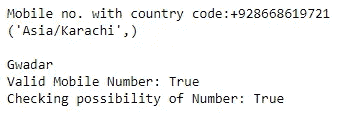
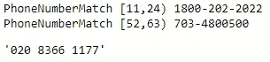

# 使用 Python 获取手机号码详细信息

> 原文：<https://towardsdatascience.com/fetching-mobile-number-details-using-python-79077c2ae4f0?source=collection_archive---------12----------------------->

## 使用电话号码检索手机号码详情


照片由[奎诺·阿尔](https://unsplash.com/@quinoal?utm_source=medium&utm_medium=referral)在 [Unsplash](https://unsplash.com?utm_source=medium&utm_medium=referral) 上拍摄

Python 是一种非常丰富的语言，因为它提供了大量的库。它包含多种功能，有助于解决现实生活中的业务问题。今天我们将讨论这样一个库。

Phonenumbers 是一个开源 Python 库，用于访问电话号码的信息。它还有助于验证电话号码、解析电话号码等。

在这篇文章中，我们将探索电话号码及其功能。

让我们开始吧…

# 安装所需的库

我们将从使用 pip 安装来安装 Phonenumbers 开始。下面给出的命令将使用 pip 安装 Phonenumbers。

```
pip install phonenumbers
```

# 导入所需的库

在这一步中，我们将导入访问电话号码信息所需的所有库。

```
import phonenumbers
from phonenumbers import carrier, geocoder, timezone
```

# 访问关于电话号码的信息

现在，我们将访问我们想要的任何电话号码的信息，我们需要传递国家代码，后跟电话号码，它将显示该号码的详细信息。

```
mobileNo=input("Mobile no. with country code:")
mobileNo=phonenumbers.parse(mobileNo)
print(timezone.time_zones_for_number(mobileNo))
print(carrier.name_for_number(mobileNo,"en"))
print(geocoder.description_for_number(mobileNo,"en"))
print("Valid Mobile Number:",phonenumbers.is_valid_number(mobileNo))
print("Checking possibility of Number:",phonenumbers.is_possible_number(mobileNo))
```



信息(来源:作者)

在这里，您可以看到与我们提供的号码相关的信息是如何显示的。同样的，你也可以针对不同的手机号码进行查看。

接下来，让我们看看如何从文本中解析电话号码，以及如何格式化它。下面给出的代码将执行这些操作。

```
text = "Call me at 1800-202-2022 if it's before 9:30, or on 703-4800500 after 10am."
for match in phonenumbers.PhoneNumberMatcher(text, "US"):
    print(match)
x = phonenumbers.parse("+442083661177", None)
phonenumbers.format_number(x, phonenumbers.PhoneNumberFormat.NATIONAL)
```



解析(来源:作者)

尝试用不同的文本和数字来解析数据和格式化电话号码。您可以在任何实际项目或问题中轻松实现这一点。在回复部分让我知道你对这个库的看法。

本文是与[皮尤什·英加尔](https://medium.com/u/40808d551f5a?source=post_page-----79077c2ae4f0--------------------------------)合作完成的。

# 在你走之前

***感谢*** *的阅读！如果你想与我取得联系，请随时通过 hmix13@gmail.com 联系我或我的* [***LinkedIn 个人资料***](http://www.linkedin.com/in/himanshusharmads) *。可以查看我的*[***Github***](https://github.com/hmix13)**简介针对不同的数据科学项目和包教程。还有，随意探索* [***我的简介***](https://medium.com/@hmix13) *，阅读我写过的与数据科学相关的不同文章。**