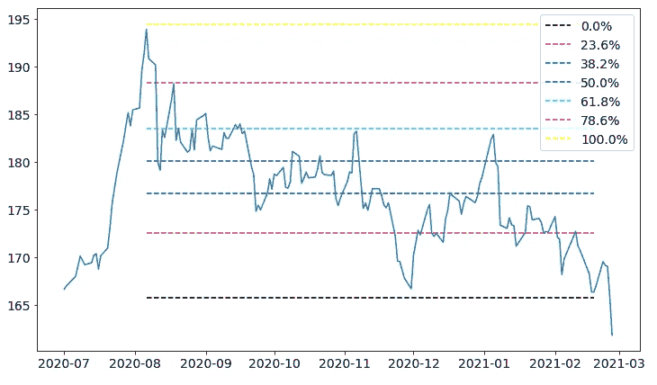

# Python 中的斐波那契回撤

> 原文：<https://towardsdatascience.com/fibonacci-retracements-in-python-470eb33b6362?source=collection_archive---------10----------------------->

## 让我们看看如何用 Python 计算这个强大的技术指标


斐波那契回撤的例子。作者图片

量化交易者总是根据技术指标和高级图表寻找交易机会。交易者寻找的最好的指标之一是价格可能反弹的关键水平。其中一些水平是斐波纳契回撤。让我们看看它们是如何工作的。

# 什么是斐波那契回撤？

斐波纳契回撤是根据两次摆动计算的特殊关键水平，即反转点。斐波那契回撤背后的想法是根据预先定义的分数，在这两个波动之间的价格范围内创建一些关键水平。最重要的分数是 0.618，与黄金分割比(1.618…)有关。这就是为什么它们被称为斐波那契回撤。其他比值为 0.5，0.236，0.382，0.786。

这里有一个斐波纳契回撤的例子:


斐波那契回撤的例子。图片作者。

第一秋千与第二秋千相连。由于第二次摆动高于第一次，因此趋势看涨。然后，从第二次摆动开始，我们根据我们想要使用的分数的需要画尽可能多的水平线。我们只需减去幅度乘以目标分数。如果趋势是看跌的，我们就要加上这样一个分数。第一个摆幅总是与 1 分数相关，第二个摆幅与 0 分数相关。

# 它们是如何使用的？

因为它们是关键水平，所以它们可以用于，例如，均值回复策略。从上图可以看出，价格已经反弹到 0.618 水平附近。因此，我们的想法是在水平附近寻找反转模式，以便尝试利用反转。

斐波纳契回撤在交易者中非常受欢迎，为了提高回报/风险比，在很宽的时间范围内使用这个工具非常重要。显然，这个工具不能单独使用，但是我们需要建立一个完整的策略，例如，利用多时间框架分析。

现在让我们看看如何使用 Python 计算斐波那契级数。下面的代码可以在我这里的 GitHub 储存库中找到:[https://GitHub . com/gianlucamalato/machine learning/blob/master/Fibonacci _ retracements . ipynb](https://github.com/gianlucamalato/machinelearning/blob/master/Fibonacci_Retracements.ipynb)

# Python 中的示例

我们先安装 *yfinance* 库

```
!pip install yfinance
```

然后，让我们导入将要使用的库。

```
import yfinance
import pandas as pdimport matplotlib.pyplot as plt
```

现在，对于这个例子，让我们导入黄金(GLD)从 2020 年 7 月 1 日到 2021 年 3 月 1 日的每日数据。

```
name = "GLD"ticker = yfinance.Ticker(name)
df = ticker.history(interval="1d",start="2020-07-01",end="2021-03-01")
```

现在我们要计算最高和最低的摆动。这些波动将通过第二根蜡烛线的指数来识别。

```
highest_swing = -1
lowest_swing = -1for i in range(1,df.shape[0]-1):
  if df['High'][i] > df['High'][i-1] and df['High'][i] > df['High'][i+1] and (highest_swing == -1 or df['High'][i] > df['High'][highest_swing]):
    highest_swing = iif df['Low'][i] < df['Low'][i-1] and df['Low'][i] < df['Low'][i+1] and (lowest_swing == -1 or df['Low'][i] < df['Low'][lowest_swing]):
    lowest_swing = i
```

现在让我们创建一个列表，其中包含与要显示的级别和颜色相关的分数。最后，我们可以计算等级本身。

如果最高的振幅紧挨着最低的振幅，我们有一个上升趋势，否则，我们有一个下降趋势。这有助于在正确的方向上绘制标高。

```
ratios = [0,0.236, 0.382, 0.5 , 0.618, 0.786,1]
colors = ["black","r","g","b","cyan","magenta","yellow"]
levels = []max_level = df['High'][highest_swing]
min_level = df['Low'][lowest_swing]for ratio in ratios:
  if highest_swing > lowest_swing: # Uptrend
    levels.append(max_level - (max_level-min_level)*ratio)
  else: # Downtrend
    levels.append(min_level + (max_level-min_level)*ratio)
```

现在我们有了绘制价格和斐波纳契回撤线图的所有要素。

```
plt.rcParams['figure.figsize'] = [12, 7]plt.rc('font', size=14)plt.plot(df['Close'])
start_date = df.index[min(highest_swing,lowest_swing)]
end_date = df.index[max(highest_swing,lowest_swing)]
for i in range(len(levels)):plt.hlines(levels[i],start_date, end_date,label="{:.1f}%".format(ratios[i]*100),colors=colors[i], linestyles="dashed")plt.legend()
plt.show()
```



作者图片

正如我们所看到的，趋势是看跌的(100%水平高于 0%水平)，在价格反弹之前，61.8%水平已经被触及两次。

# 结论

斐波纳契回撤对于量化交易者来说是非常有用的工具。它们很容易阅读和计算，是交易者策略中非常有用的工具。再次强调，首先测试你的策略并引入更多的规则是很重要的，例如，基于多时间段的分析。

Gianluca Malato 是意大利数据科学家和小说作家。他是数据科学、机器学习和数据分析在线学校[*【YourDataTeacher.com】*](https://www.YourDataTeacher.com)*的创始人。*

# 参考

[1]吉安卢卡·马拉托。*风险/回报比:超越神话的真相。*[https://medium . com/the-trading-scientist/risk-reward-ratio-the-truth-beyond-the-myth-22a 00 c 258 b 83](https://medium.com/the-trading-scientist/risk-reward-ratio-the-truth-beyond-the-myth-22a00c258b83)

***来自《走向数据科学》编辑的提示:*** *虽然我们允许独立作者根据我们的* [*规则和指导方针*](/questions-96667b06af5) *发表文章，但我们并不认可每个作者的贡献。你不应该在没有寻求专业建议的情况下依赖一个作者的作品。详见我们的* [*读者术语*](/readers-terms-b5d780a700a4) *。*