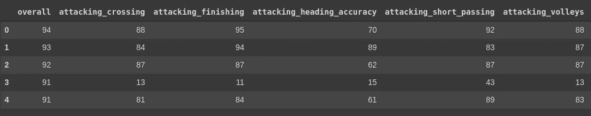

# 国际足联终极团队机器学习项目

> 原文：<https://towardsdatascience.com/fifa-ultimate-team-rating-prediction-machine-learning-project-3a02767fcb38?source=collection_archive---------18----------------------->

## 一个端到端的 ML 项目，预测一个球员在国际足联终极队的评级


古列尔莫·巴西尔在 [Unsplash](https://unsplash.com?utm_source=medium&utm_medium=referral) 上拍摄的照片

这个项目遵循 ML 顾问 Aurélien Géron 在机器学习端到端指南中概述的原则/步骤。

# 介绍

## 什么是机器学习？

机器学习(ML)是人工智能(AI)的一个子集，它使用计算机算法在大型数据集中寻找模式，而无需显式编程。ML 赋予计算机自我学习和改进的能力，以便它能够从数据中产生最佳模型。如今，许多应用程序都使用 ML，例如:

*   产品推荐
*   垃圾邮件检测器
*   恶意软件检测
*   人脸识别

## 这个项目是关于什么的？

从我记事起，我就一直在玩国际足联的游戏。我喜欢能够作为我最喜欢的足球运动员和球队踢球。虽然现在的游戏因为大部分是付费赢而名声不好，但我仍然发现自己很享受 FIFA 终极团队(FUT)和竞争性多人游戏的战利品。话虽如此，我一直想知道开发者如何决定玩家评级，然后我问自己，“机器也能做到吗？”。电子艺界(EA)的开发团队很可能使用 ML 模型来决定玩家评级，但这并没有阻止我建立自己的模型。这个项目是我试图创建一个 ML 模型，可以预测任何球员的总体评分。

我用 [**Google Colabs**](https://colab.research.google.com/notebooks/welcome.ipynb) 来完成这个项目。

## 我们使用的是哪种数据？

我在 Kaggle 上找到了一个关于国际足联比赛的大型数据集。数据集由 FIFA 15 至 FIFA 20 的数据组成。我们将使用数据集中最新的国际足联游戏，即 FIFA 20。数据集可以从 [Kaggle](https://www.kaggle.com/stefanoleone992/fifa-20-complete-player-dataset) 下载。数据集由 18，278 行和 104 列组成。这些列包含诸如玩家姓名、年龄、身高、体重、国籍等特征。因为我们试图预测总体评分，所以我们只需要关注与总体评分相关的特性，但我们稍后会谈到这一点。

# 如何入门？

## 1.定义问题

任何 ML 工程师应该做的第一件事就是定义问题。对于这个项目，我们面临的问题是准确预测玩家评分，而不必硬编码算法，因此建立一个可行的 ML 模型应该是我们的最终目标。在 FIFA 20 中，一个球员的总得分是由每个球员属性的得分来定义的，例如速度、射门、传球、运球和许多其他属性。我们试图根据球员的进攻和防守属性来预测整体得分。数据已经带有标记的训练示例，这意味着我们正在处理一个监督学习问题。这也是一个典型的回归任务，因为我们的任务是预测一个值。更具体地说，这是一个多元回归问题，因为模型将使用多个特征来进行预测。

## 2.选择绩效评估

既然我们已经定义了问题，我们需要选择一个性能度量。我喜欢用均方根误差(RMSE)。这是回归问题的首选性能度量。RMSE 是衡量模型表现好坏的一个标准。它给出了一个系统在预测中有多大误差的概念。RMSE 是关于最佳拟合线的残差(预测误差)的计算。公式如下所示:


为了更多地了解 RMSE 及其运作方式，我推荐阅读这篇文章。

现在我们准备开始编码了！！！

## 3.导入库

我们需要做的第一件事是导入最常见的数据科学库，如 **numpy** 、 **scipy** 和 **pandas** 。我们还需要导入 **matplotlib** 和 **seaborn** 以便我们可以绘制图表来帮助我们可视化数据。

```
# Common imports
import numpy as np
import pandas as pd
import os
import seaborn as sns
from scipy import stats
import missingno as msno# To plot pretty figures
%matplotlib inline
import matplotlib as mpl
import matplotlib.pyplot as plt
from matplotlib import style
sns.set(style='ticks', color_codes=True)
sns.set(style='darkgrid')
import plotly.express as px# Ignore useless warnings (see SciPy issue #5998)import warnings
warnings.filterwarnings(action="ignore", message="^internal gelsd")
warnings.filterwarnings('always')
warnings.filterwarnings('ignore')
```

## 4.下载并浏览数据

我将数据集保存到我的 [**GitHub**](https://github.com/jpzambranoleon) 存储库中，这样我可以更容易地下载数据集，而不必在我的机器上搜索它。如果数据不断变化，拥有在线下载数据的功能真的很有用。它还省去了必须在多台机器上安装数据集的麻烦。

```
import urllib.requestDOWNLOAD_ROOT = "https://raw.githubusercontent.com/jpzambranoleon/ML_Projects/master/"TRAIN_PATH = os.path.join("datasets", "players_20")
TRAIN_URL = DOWNLOAD_ROOT + "datasets/players_20.csv"def fetch_train_data(train_url=TRAIN_URL, train_path=TRAIN_PATH):
  os.makedirs(train_path, exist_ok=True)
  csv_path = os.path.join(train_path, "players_20.csv")
  urllib.request.urlretrieve(train_url, csv_path)
```

**fetch_train_data()** 函数用于获取数据集。

```
fetch_train_data()
```

数据集被下载并保存在文件夹**数据集**和**玩家 _20** 下的 **Google Colabs** 的文件部分。现在剩下要做的就是将数据加载到 pandas 数据框架中。幸运的是，我们可以创建一个函数来返回 pandas DataFrame 对象。

```
import pandas as pddef load_train_data(train_path=TRAIN_PATH):
  csv_path = os.path.join(train_path, "players_20.csv")
  return pd.read_csv(csv_path)
```

我将 **load_train_data()** 函数调用到 player_data 变量中，将数据帧保存到一个变量中，以使事情变得更简单。DataFrame 的 **head()** 方法用于查看数据的前五行。

```
player_data = load_train_data()
player_data.head()
```


显示前 5 行。

我使用了 **shape** 方法来返回一个表示数据帧维度的元组。通过使用 **shape** 方法，我们可以看到数据集中有多少行和列。

```
player_data.shape**(18278, 104)**
```

正如我们从元组中看到的，数据集有 18，278 行和 104 列。我们不需要使用所有的列，所以最好截断数据帧，只包含目标列和玩家统计数据列。有 34 个球员统计栏，所以我们需要选择它们。

```
#player stat features
columns = ['overall','attacking_crossing', 'attacking_finishing', 'attacking_heading_accuracy', 'attacking_short_passing', 'attacking_volleys', 'skill_dribbling', 'skill_curve', 'skill_fk_accuracy', 'skill_long_passing', 'skill_ball_control', 'movement_acceleration', 'movement_sprint_speed', 'movement_agility', 'movement_reactions', 'movement_balance', 'power_shot_power', 'power_jumping', 'power_stamina', 'power_strength', 'power_long_shots', 'mentality_aggression', 'mentality_interceptions', 'mentality_positioning', 'mentality_vision', 'mentality_penalties', 'mentality_composure', 'defending_marking', 'defending_standing_tackle', 'defending_sliding_tackle', 'goalkeeping_diving', 'goalkeeping_handling', 'goalkeeping_kicking', 'goalkeeping_positioning', 'goalkeeping_reflexes']player_df = player_data[columns]player_df.head()
```



显示新数据框中的前 5 行。

我在新的数据帧上使用了 **info()** 方法来快速描述数据。

```
player_df.info()
```


我们可以从数据中看到，数据帧中有 18，278 个非空值，这意味着我们不必担心丢失值。

为了获得数据的统计描述，我们可以使用 **describe()** 方法。

```
player_df.describe()
```


为了更好的测量，让我们再次使用 **shape** 方法来查看新数据帧的维度。

```
player_df.shape**(18278, 35)**
```

感受数据的另一个好方法是绘制每个数字属性的直方图。要绘制每个属性的直方图，只需在 DataFrame 上调用 **hist()** 方法。 **hist()** 方法需要 matplotlib 库。您可以为每个直方图指定仓的数量，也可以指定图形的大小。我选择了 40 个箱子和(27，17)的尺寸，但是这完全取决于你。直方图很有用，因为它们显示了具有给定值范围(x 轴)的实例(y 轴)的数量。

```
player_df.hist(bins=40, figsize=(27,17))
plt.show()
```


从图中可以看出，每个直方图的取值范围是 0 到 100。这很好地表明了每个属性都具有相同的比例，这意味着我们不必进行任何要素比例变换。

为了更好地实践，我喜欢完全确定数据中没有丢失的值，所以我使用了 **isna()。any()** 方法返回关于数据是否有缺失值的 True 或 False 语句。

```
player_df.isna().any()
```


正如我们从输出中看到的，每个属性的返回值都是 False，这意味着没有丢失值。我们准备继续！！！

## 5.将数据分成训练集和测试集

探索完数据后，我们需要做的下一件事是将数据分成训练集和测试集。我们可以自己拆分数据，或者创建一个函数来完成这项工作。幸运的是，Scikit-Learn 有一个很酷的功能，可以将数据集分成训练集和测试集。 **train_test_split()** 函数可以很容易地将数据拆分成我们需要的集合。我设置 **test_size=0.2** ，这样 20%的数据存储在测试集中。另外 80%的数据存储在训练集中。训练集应该有更多的数据，因为它是模型学习的对象。测试集将是我们用来验证模型的集。

```
from sklearn.model_selection import train_test_splittrain_set, test_set = train_test_split(player_df, test_size=0.2, random_state=42)print("Length of training data:", len(train_set))
print("Length of testing data:", len(test_set))
print("Length of total data:", len(player_df))**Length of training data: 14622 
Length of testing data: 3656 
Length of total data: 18278**
```

## 6.寻找相关性

您可以使用 **corr()** 方法计算每对属性之间的标准相关系数。查看每个属性之间的所有相关性会占用太多时间，所以让我们只查看每个属性与整体值的相关程度。

```
fifa_df = train_set.copy()corr_matrix = fifa_df.corr()corr_matrix['overall'].sort_values(ascending=False)
```


相关系数范围从-1 到 1。当相关系数接近 1 时，说明有很强的正相关性；例如，当运动反应上升时，整体倾向于上升。当相关系数接近-1 时，意味着存在强负相关(即与强正相关相反)。

为了可视化属性之间的相关性，我们可以使用 pandas **scatter_matrix()** 函数。该函数将每个数值属性与其他数值属性进行对比。让我们来看看前五个有希望的属性，因为有 35 个数字属性。

```
from pandas.plotting import scatter_matrixattributes = [‘overall’, ‘movement_reactions’, ‘mentality_composure’, ‘power_shot_power’, ‘mentality_vision’]scatter_matrix(fifa_df[attributes], figsize=(15,12))plt.show()
```


强相关关系往往是线性的，因此总体预测最有希望的属性是运动反应。从图中我们可以看出，运动反应和整体有很强的线性关系。

让我们仔细看看相关性散点图。

```
fifa_df.plot(kind=’scatter’, x=’movement_reactions’, y=’overall’, alpha=0.1, color=’red’)plt.show()
```


相关性确实很强；你可以清楚地看到一个上升趋势。

现在，是时候为 ML 算法准备数据了。

## 7.为 ML 算法准备数据

我将训练集和测试集分成独立的功能集和目标集。数据帧 **y_train** 和 **y_test** 包含目标值(目标值为整体)，而 **X_train** 和 **X_test** 包含特征值(与目标值相关的所有其他属性)。

```
y_train = train_set['overall']
X_train = train_set.drop('overall', axis=1)
y_test = test_set['overall']
X_test = test_set.drop('overall', axis=1)
```

## 8.选择并训练一个模型

让我们首先使用 Scikit-Learn 的 **LinearRegression()** 函数训练一个线性回归模型:

```
from sklearn.linear_model import LinearRegressionlin_reg = LinearRegression()
lin_reg.fit(X_train, y_train)
```

让我们使用 Scikit-Learn 的 **mean_square_error()** 函数测量整个训练集上回归模型的 RMSE:

```
from sklearn.metrics import mean_squared_errory_predictions = lin_reg.predict(X_train)
lin_mse = mean_squared_error(y_train, y_predictions)
lin_rmse = np.sqrt(lin_mse)
lin_rmse**2.493574884183225**
```

分数还不错！！！似乎线性回归模型可以做到这一点。从散布矩阵中我们可以看出，并不是每个属性都有线性关系。对于非线性关系，我们需要一个更强大的模型，所以让我们训练一个决策树回归模型。这是一个强大的模型，能够发现数据中复杂的非线性关系。让我们使用 Scikit-Learn 的 **DecisionTreeRegressor()** 函数:

```
from sklearn.tree import DecisionTreeRegressortree_reg = DecisionTreeRegressor()
atree_reg.fit(X_train, y_train)
```

让我们再次测量模型的 RMSE:

```
y_predictions = tree_reg.predict(X_train)
tree_mse = mean_squared_error(y_train, y_predictions)
tree_rmse = np.sqrt(tree_mse)
tree_rmse**0.0**
```

什么？！0.0 的 RMSE！！！这是一个完美的模型吗？

实际上，可能是这个模型严重地过度拟合了数据。这就是为什么在每一个 ML 项目中，执行模型验证是很重要的，但是我们将在后面讨论。

现在，让我们只训练我们的最终模型，这是一个随机森林回归模型。

我们可以使用 Scikit-Learn 的 **RandomForestRegressor()** 函数训练一个随机森林回归模型:

```
from sklearn.ensemble import RandomForestRegressorforest_reg = RandomForestRegressor()
forest_reg.fit(X_train, y_train)
```

让我们看看这个模型的 RMSE:

```
y_predictions = forest_reg.predict(X_train)
forest_mse = mean_squared_error(y_train, y_predictions)
forest_rmse = np.sqrt(forest_mse)
forest_rmse**0.4774070457668509**
```

这是一个比我们的线性回归模型更好的分数，但不如我们的决策树模型。同样，这可能是我们的决策树模型严重过度拟合数据，这就是为什么我们总是需要在选择最佳模型之前验证每个模型。验证模型准确性的一个简单方法是使用 Scikit-Learn 的 K-fold 交叉验证功能。交叉验证将训练集随机分为 10 个不同的子集，称为折叠，然后它训练和评估模型 10 次，每次选择不同的折叠进行评估，并在 9 个折叠上进行训练。结果是一个包含 10 个评估分数的数组。在选择最佳模型之前，我们需要看一下平均验证分数。

让我们看看线性回归模型的交叉验证分数:

```
from sklearn.model_selection import cross_val_scorescores = cross_val_score(lin_reg, X_train, y_train,scoring='neg_mean_squared_error', cv=10)lin_reg_scores = np.sqrt(-scores)def display_scores(scores):
  print("Scores:", scores)
  print("Mean:", scores.mean())
  print("Standard Deviation:", scores.std())display_scores(lin_reg_scores)**Scores: [2.48985397 2.509888   2.50910312 2.4642167  2.46189444 2.51445854  2.48370267 2.4734443  2.48382446 2.59475861] 
Mean: 2.4985144826450054 
Standard Deviation: 0.03662607159427437**
```

现在让我们看看决策树模型的交叉验证分数:

```
scores = cross_val_score(tree_reg, X_train, y_train,scoring='neg_mean_squared_error', cv=10)tree_scores = np.sqrt(-scores)display_scores(tree_scores)**Scores: [2.03976196 2.10100389 2.24933491 2.18751588 2.13289653 2.1158318  2.10529916 2.08391009 2.30935171 2.15395796] 
Mean: 2.147886387907302 
Standard Deviation: 0.07682311253910523**
```

现在这是一个比第一个更可信的分数。它仍然优于我们的线性回归模型，但让我们看看我们的随机森林模型的交叉验证分数:

```
scores = cross_val_score(forest_reg, X_train, y_train,scoring='neg_mean_squared_error', cv=10)forest_scores = np.sqrt(-scores)display_scores(forest_scores)**Scores: [1.29156727 1.24883845 1.2625419  1.288613   1.22436926 1.30612055  1.25621857 1.24755531 1.30399247 1.28656714] 
Mean: 1.2716383911151843 
Standard Deviation: 0.026074298378757566**
```

哇！！！这可能是我们见过的最好成绩。随机森林看起来很有前途。这是我们将在项目中使用的模型。

## 9.微调模型

既然我们已经选择了我们的模型，我们需要微调它。微调要求我们手动调整超参数，直到找到超参数值的最佳组合。微调是非常繁琐的工作，如果数据集很大，可能需要很长时间。你可能甚至没有时间去探索许多组合。Scikit-Learn 提供了一个更简单的选项，而不是手动完成所有事情。

您应该使用 Scikit-Learn 的 GridSearchCV 来搜索您，而不是手动摆弄超参数。你需要做的就是告诉它你想让它试验哪些超参数，试验什么，它会用交叉验证来评估超参数值的所有可能组合。下面的代码提供了我用来试验的参数。

```
from sklearn.model_selection import GridSearchCVparam_grid = [{'n_estimators': [3, 10, 30], 'max_features': [2, 4, 6, 8]},{'bootstrap': [False], 'n_estimators': [3,10], 'max_features': [2,3,4]},]forest_reg = RandomForestRegressor() grid_search = GridSearchCV(forest_reg, param_grid, cv=5,scoring='neg_mean_squared_error',return_train_score=True) grid_search.fit(X_train, y_train)
```

训练完成后，你可以得到如下参数的最佳组合:

```
grid_search.best_params_**{'max_features': 8, 'n_estimators': 30}**
```

你也可以直接得到最佳估计量:

```
grid_search.best_estimator_**RandomForestRegressor(bootstrap=True, ccp_alpha=0.0, criterion='mse', max_depth=None, max_features=8, max_leaf_nodes=None, max_samples=None, min_impurity_decrease=0.0,                 min_impurity_split=None, min_samples_leaf=1,                     min_samples_split=2, min_weight_fraction_leaf=0.0,                       n_estimators=30, n_jobs=None, oob_score=False,                       random_state=None, verbose=0, warm_start=False)**
```

当然，您可以用任何超参数值进行实验，但是我认为目前这样就可以了。

## 10.在测试集上评估模型

在调整了训练集上的模型之后，终于到了在测试集上评估最终模型的时候了。这个过程非常相似，但是这一次我们需要指定最终模型的最佳估计量。同样，我们需要测量最终模型的性能。完成这项工作的代码如下:

```
final_model = grid_search.best_estimator_
final_predictions = final_model.predict(X_test)
final_mse = mean_squared_error(y_test, final_predictions)
final_rmse = np.sqrt(final_mse)
final_rmse**1.135337798136083**
```

这个分数是我们迄今为止看到的最好的，更不用说它还被用于模型以前没有见过的数据。老实说，我没想到模型会做得这么好，但我们不能假设 RMSE 永远是某个值。我们想知道这个估计有多精确。为此，您可以使用 **scipy.stats.t.interval()** 计算泛化错误的 95%置信区间:

```
confidence = 0.95squared_errors = (final_predictions - y_test)**2np.sqrt(stats.t.interval(confidence, len(squared_errors)-1,loc=squared_errors.mean(),
scale=stats.sem(squared_errors)))**array([1.10181563, 1.16789818])**
```

我们可以看到 RMSE 将在 1.10 和 1.17 之间

95%的时候。

我们已经基本上完成了这个模型，但是出于好奇，我们想看看预测和实际目标有什么不同。为此，只需从测试集中选择五个实例，并在最终模型上使用 **predict()** 方法:

```
some_data = X_test.iloc[:5]
some_label = y_test.iloc[:5]print("Predictions:", final_model.predict(some_data))
print("Labels:", list(some_label))**Predictions: [64.2    73.8     68.76666667 68.13333333 63.4     ] 
Labels: [64, 74, 69, 68, 63]**
```

预测相当准确。我很惊讶模型表现得这么好。我对结果非常满意。

# 结论

这个项目告诉我们，我们可以建立一个 ML 模型来预测一个球员的总体 FUT 评级。这个项目制作起来很有趣，我从中学到了很多。我对 ML 及其提供的所有可能性充满热情。我很高兴能在这个领域探索更多，并在这个过程中学习一切。我希望你喜欢这篇文章，也许有一天你可以开始自己的 ML 项目！！！