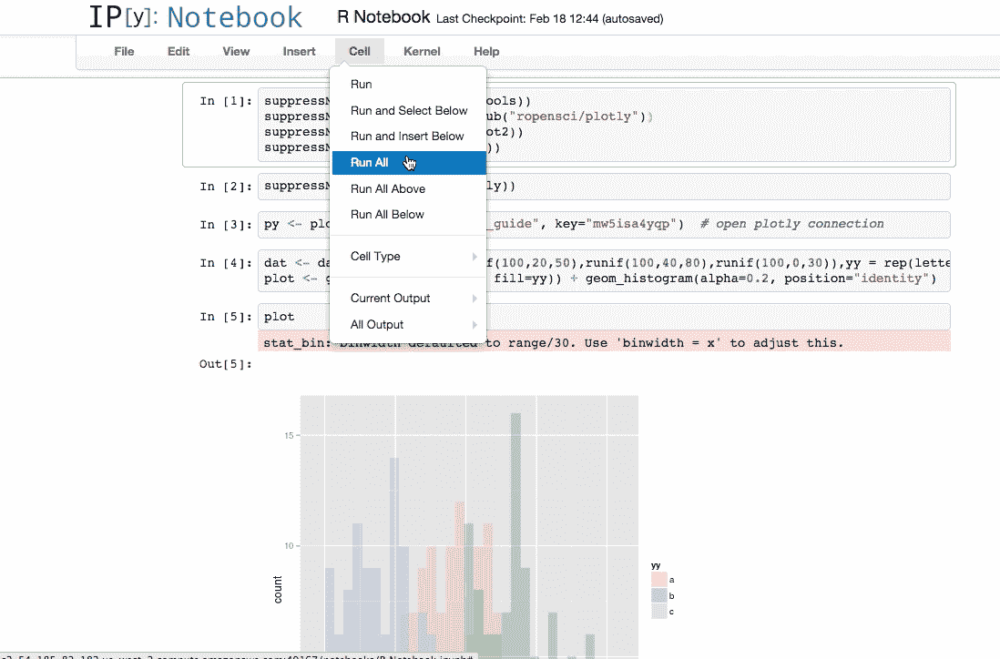

# 一个 Docker 映像的十五个 Jupyter 笔记本扩展

> 原文：<https://towardsdatascience.com/fifteen-jupyter-notebook-extensions-to-a-docker-image-4dce942faadc?source=collection_archive---------17----------------------->

我们的**Jupyter****Python**和 **R** 用户的 **Docker** 图像要求他们在每次启动后设置自己的`Nbextensions`偏好。我们能够通过在 **Docker** 映像中设置常用的`Nbextensions`首选项来提高 **Jupyter** 笔记本用户的工作效率。



一个显示 ggplot 图的 R 代码 Jupyter 笔记本。资料来源:Giphy

## 1.3.0 版本开发人员的目录结构

我们有一个共享磁盘，任何人都可以将模板文件复制到他们的本地目录结构中。

```
|-- dockerSeasons
     |-- dev
         |--- Dockerfile
         |--- docker-compose.yml
     |-- test
         |--- Dockerfile
         |--- docker-compose.yml
```

*开发*和*测试*的每个成员将版本 1.3.0 `dockerSeasons` 目录复制到他们的`PROJECTS`目录中。

```
- PROJECTS
.
.
.
    |-- <project-name>
        |-- dockerSeasons
             |-- dev
                 |--- Dockerfile
                 |--- docker-compose.yml
                 |--- README.md
                 |--- <ln> requirements.txt             
             |-- test
                 |--- Dockerfile
                 |--- docker-compose.yml
                 |--- README.md
                 |--- <ln> requirements.txt
        |-- src
        |-- test
        |--- requirements.txt
        |--- README.md
.
.
```

注意: *Dev* 1.0.3 可以使用 0.0.3 `PROJECTS`目录结构不变。版本 3.0.1 `dockerSeasons`会覆盖`docker` 0.0.3 目录。

*测试*针对 **Python** 包中他们需要和不需要的差异修改`<project-name>/requirements.txt`。然后*测试*象征性地将`<project-name>/requirements.txt`(在`<project-name>/dockerSeasons/test`目录中)与命令链接起来:

```
*# MacOS and linux variants
$ ln ../../requirements.txt requirements.txt*
```

在*测试*目录中唯一不同的是文件`requirements.txt`，目录`dockerSeasons/test/`中的文件。*测试*将此目录结构移动到*阶段*服务器和 3 个冗余*生产*服务器。服务器场是内部的。

1.0.3 发布了一个`dockerfile`模板，使 *Dev* 和 *Test* 能够通过`requirements.txt.`定制每个 **Docker** 图像

## Docker 图像的 1.3.0 版本

在之前的[文章](https://medium.com/swlh/a-docker-solution-for-the-enterprise-7b5d2942b43a)中，我展示了用于用 Jupyter notebook 创建 **Docker** 图像的`Dockerfile`。我们现在在 DES 1 . 3 . 0(**D**ocker**E**enterprise**S**solution)上，为 Jupyter 笔记本用户提供了不同规格的`Dockerfile`。

有意义的变化是在`requirements.txt.`之后的`jupyterthemes (nbextentsions)`阶段，通过试验和反馈，我们发现 *Dev* 和 *Test* 改变`requirements.txt`的频率比`jupyterthemes`低。

将分段的顺序从较不频繁的更改更改为较频繁的更改，这允许我们利用 Docker 缓冲。结果是比以前更快的`Dockerfile`版本。

根据`requirements.txt`中的内容，我们会经历长达 10 分钟的完整构建。通过将`jupyterthemes`放在最后，我们经历了大约 30 秒的构建(没有`requirements.txt` 变化)。

您可能会考虑`Dockerfile`构建中的变更频率和构建顺序。

部分`Dockerfile`的 DES 1.3.0 版本为:

```
**FROM** python:3.7
**FROM** jupyter**/**minimal-notebook
**WORKDIR** $*HOME* **RUN** python **-**m pip install **--**upgrade pip
**COPY** requirements.txt .**/**requirements.txt
**RUN** python **-**m pip  install **-**r requirements.tx
**RUN** python **-**m pip install **--**upgrade **--**no-deps **--**force-reinstall notebook
#
**RUN** python **-**m pip install jupyterthemes
**RUN** python **-**m pip install **--**upgrade jupyterthemes
**RUN** python **-**m pip install jupyter_contrib_nbextensions
```

注意:不要**而不是**从你的终端外壳执行以下命令。如果你这样做了，你在你的本地副本 **jupyter** 中安装`jupyterthemes`。 ***更大的*** 问题是你在 **jupyter** 的本地副本中重置了你的本地`nbextentsions`设置。

```
pip install jupyterthemes
pip install **--**upgrade jupyterthemes
pip install jupyter_contrib_nbextensions
```

## 有哪些`Nbextensions`可用？

我们必须分两步构建`Dockerfile`，因为我们需要找到可用的`jupyterthemes`以及它们的名称。首先，我们执行了上面列出的部分`Dockerfile`。

我们使用命令`updev`启动了 **juptyer** (将在本文稍后描述)。然后，我们在 **Jupyter** 笔记本上运行了以下内容。

```
!jupyter nbextension list
```

输出-> >

```
Known nbextensions:
  config dir: /home/jovyan/.jupyter/nbconfig
    notebook section
      nbextensions_configurator/config_menu/main  enabled 
      - Validating: problems found:
        - require?  X nbextensions_configurator/config_menu/main
      contrib_nbextensions_help_item/main  enabled 
      - Validating: OK
      jupyter-js-widgets/extension  enabled 
      - Validating: problems found:
        - require?  X jupyter-js-widgets/extension
      jupyter-notebook-gist/notebook-extension  enabled 
      - Validating: problems found:
        - require?  X jupyter-notebook-gist/notebook-extension
      autosavetime/main  enabled 
      - Validating: OK
      codefolding/main  enabled 
      - Validating: OK
      code_font_size/code_font_size  enabled 
      - Validating: OK
      code_prettify/code_prettify  enabled 
      - Validating: OK
      collapsible_headings/main  enabled 
      - Validating: OK
      comment-uncomment/main  enabled 
      - Validating: OK
      equation-numbering/main  enabled 
      - Validating: OK
      execute_time/ExecuteTime  enabled 
      - Validating: OK
      gist_it/main  enabled 
      - Validating: OK
      hide_input/main  enabled 
      - Validating: OK
      spellchecker/main  enabled 
      - Validating: OK
      toc2/main  enabled 
      - Validating: OK
      toggle_all_line_numbers/main  enabled 
      - Validating: OK
    tree section
      nbextensions_configurator/tree_tab/main  enabled 
      - Validating: problems found:
        - require?  X nbextensions_configurator/tree_tab/main
  config dir: /opt/conda/etc/jupyter/nbconfig
    notebook section
      plotlywidget/extension  enabled 
      - Validating: OK
```

现在我们有了要添加到 1.3.0 版本中的`Nbextensions`名称`dockerfile`！

## jupyter 扩展的 docker 文件

*开发*的`dockerfile` 启用了注释# `enable the Nbextensions.`后显示的以下`Nbextensions`

```
**FROM** python:3.7
**FROM** jupyter**/**minimal-notebook
**WORKDIR** $*HOME* **RUN** python **-**m pip install **--**upgrade pip
**COPY** requirements.txt .**/**requirements.txt
**RUN** python **-**m pip  install **-**r requirements.tx
**RUN** python **-**m pip install **--**upgrade **--**no-deps **--**force-reinstall notebook
#
**RUN** python **-**m pip install jupyterthemes
**RUN** python **-**m pip install **--**upgrade jupyterthemes
**RUN** python **-**m pip install jupyter_contrib_nbextensions
**RUN** jupyter contrib nbextension install **--**user
# enable the Nbextensions
**RUN** jupyter nbextension enable contrib_nbextensions_help_item**/**main
**RUN** jupyter nbextension enable autosavetime**/**main
**RUN** jupyter nbextension enable codefolding**/**main
**RUN** jupyter nbextension enable code_font_size**/**code_font_size
**RUN** jupyter nbextension enable code_prettify**/**code_prettify
**RUN** jupyter nbextension enable collapsible_headings**/**main
**RUN** jupyter nbextension enable comment-uncomment**/**main
**RUN** jupyter nbextension enable equation-numbering**/**main
**RUN** jupyter nbextension enable execute_time**/**ExecuteTime 
**RUN** jupyter nbextension enable gist_it**/**main 
**RUN** jupyter nbextension enable hide_input**/**main 
**RUN** jupyter nbextension enable spellchecker**/**main
**RUN** jupyter nbextension enable toc2**/**main
**RUN** jupyter nbextension enable toggle_all_line_numbers**/**main
```

## Docker-Compose 命令和 docker-compose.yaml 文件

**Docker-Compose** 用于为同一个应用程序同时管理几个容器。这个工具提供了与 Docker 相同的功能，但是允许你拥有更复杂的应用程序。


插图由[雷切尔·科特曼](http://ralvearcottman@gmail.com)

**Docker-Compose** 可以将多个 **Docker** 容器合并成一个运行时映像。目前，我们只对一个 **Docker** 图像(`dockerfile.yaml`)使用 **Docker-Compose** 。

```
**version**: '3'
**services**:
  **dev**:
    **build**: '.'
    **ports**:
        - "127.0.0.1:8889:8888"
 **volumes:
      - ../../../.:/docker**
    **working_dir**: /docker
```

注意:当您使用命令`updev`(将在本文后面描述)时， *docker-compose* 命令`volume:` `**- ./../../.**`会导致`<path-to-projects>`被映射到`**/docker**`，即 **docker** 映像的内部目录。随后推出的 **jupyter** 使用`<path-to-projects>` 作为其顶级目录。请使用上面显示的示例目录结构，或者用您自己的本地目录结构代替`**- ./../../.**` 。

## 自动化常用的 docker-compose 命令

**Docker**命令通过将以下命令添加到`˜/.bashrc_profile` 或`˜/bashrc.txt.`来设置

```
devdir='<path-to-projects>/photon/photonai/dockerSeasons/dev/'
testdir='<path-to-projects>/photon/photonai/dockerSeasons/test/'echo $devdir
echo $testdirexport testdir
export devdir#
alias updev="(cd $devdir; docker-compose up) &"
alias downdev="(cd $devdir; docker-compose down) &"
alias builddev="(cd $devdir; docker-compose build) &"#
alias uptest="(cd $testdir; docker-compose up) & "
alias downtest="(cd $testdir; docker-compose down) &"
alias buildtest="cd $testdir; docker-compose build) &"
```

如果找不到文件`˜/bashrc.txt` ，用 touch `˜/bashrc.txt.` ( **MacOs** 或各种 **Linux** 或 **Unix** 操作系统之一创建它。)

注意:当你完成编辑时，记得按`source` `˜/.bashrc_profile and/`或`˜/bashrc.txt`。

`updev`命令在我的终端控制台上产生了以下消息流。(你的会有不同的时间戳和其他细微差别。)

```
dev_1  | [I 15:53:33.389 NotebookApp] [jupyter_nbextensions_configurator] enabled 0.4.1dev_1  | [I 15:53:33.817 NotebookApp] JupyterLab extension loaded from /opt/conda/lib/python3.7/site-packages/jupyterlabdev_1  | [I 15:53:33.818 NotebookApp] JupyterLab application directory is /opt/conda/share/jupyter/lab**dev_1  | [I 15:53:34.196 NotebookApp] Serving notebooks from local directory: /docke**rdev_1  | [I 15:53:34.196 NotebookApp] The Jupyter Notebook is running at:dev_1  | [I 15:53:34.196 NotebookApp] [http://dd974d01052d:8888/?token=78824facb945e1bf386a6ead41f7b147d5ac4240dc673421](http://dd974d01052d:8888/?token=78824facb945e1bf386a6ead41f7b147d5ac4240dc673421)dev_1  | [I 15:53:34.196 NotebookApp]  or [http://127.0.0.1:8888/?token=78824facb945e1bf386a6ead41f7b147d5ac4240dc673421](http://127.0.0.1:8888/?token=78824facb945e1bf386a6ead41f7b147d5ac4240dc673421)
```

注意:`updev`命令输出:

```
.
.
h[ttp://127.0.0.1:**8888**/?token=12377aa1c91b45e66e45eb5d5bdf2115cad2dae5b61be5c0](http://127.0.0.1:8888/?token=12377aa1c91b45e66e45eb5d5bdf2115cad2dae5b61be5c0)
```

因为我们在`dockerfile.yaml`中将端口`8888`映射到端口`8889` ( *Dev* )和端口`8890` ( *Test* )。DET 1.3.0 版本的用户必须将以下内容剪切并粘贴到他们的 web 浏览器中。

```
h[ttp://127.0.0.1:**8889**/?token=12377aa1c91b45e66e45eb5d5bdf2115cad2dae5b61be5c0](http://127.0.0.1:8888/?token=12377aa1c91b45e66e45eb5d5bdf2115cad2dae5b61be5c0)
```

## 摘要

对于“将 Jupyter 笔记本扩展添加到 Docker 映像”来说，这看起来是不是太详细了也许是吧。我重述一下:

1.  在 **Jupyter** user `Dockerfile.`中添加你想要的`Nbextensions``Nbextensions`名称以及如何启用它们已在上面给出。
2.  如有必要，编辑`dockerfile.yaml volume:` `**- ./../../.**`。随后推出的 **jupyter** 使用`<**./../../.**`作为其顶级目录。
3.  可选地，通过将常用的 docker-compose 命令添加到您的`˜/.bashrc_profile` 文件中来“自动化这些命令”。
4.  最后，启用`Nbextensions`:


所有的`Nbextensions`都被禁用。您必须手动启用**码头**集装箱下水。不酷！瑞秋·科特曼的动画

DET 1.3.0 版本的发布经历了几天的曲折和错误。我希望你花更少的时间来实现你的解决方案，这篇文章对你的努力有所帮助。

如果你有建议或改进，请评论。

我使用的 Docker 实现的更多细节在:

[](https://medium.com/swlh/a-docker-solution-for-the-enterprise-7b5d2942b43a) [## 面向企业的 Docker 解决方案

### 这是一个关于我们公司推出 Docker 的故事。我展示我们的 Docker 和 Docker-Compose 解决方案。被警告…

medium.com](https://medium.com/swlh/a-docker-solution-for-the-enterprise-7b5d2942b43a) [](https://medium.com/@dr.bruce.cottman/a-docker-solution-for-the-test-groups-use-cases-8e8ed6c28e11) [## 我们将 Docker 企业解决方案的速度提高了一倍

### 我们收到了大量关于 Docker 解决方案 0.0.2 版本的反馈。反馈有一个共同的主题:只有 R&D…

medium.com](https://medium.com/@dr.bruce.cottman/a-docker-solution-for-the-test-groups-use-cases-8e8ed6c28e11) 

注意:你可以从可克隆的 **GitHub** [repo](https://github.com/bcottman/dockerSeasons) 中改编 **Docker** 代码到你的项目中。