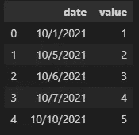
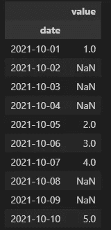
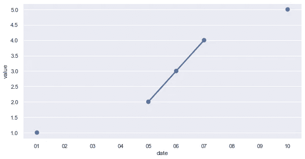
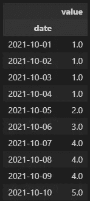
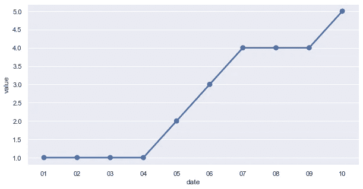
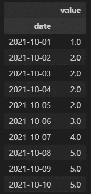
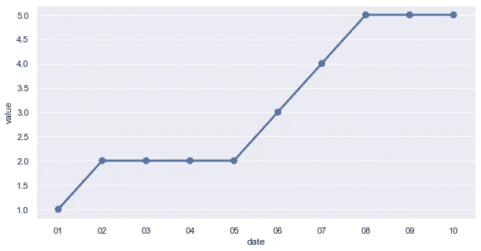
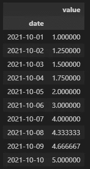
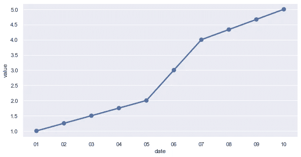

# 填补时间序列数据中的空白

> 原文：<https://towardsdatascience.com/filling-gaps-in-time-series-data-2db7366f1965?source=collection_archive---------11----------------------->

## 使用熊猫作为时间序列数据准备的一个步骤进行重新采样

在 [Unsplash](https://unsplash.com?utm_source=medium&utm_medium=referral) 上由 [Aron 视觉](https://unsplash.com/@aronvisuals?utm_source=medium&utm_medium=referral)拍摄的照片

时间序列数据并不总是完全清晰的。有些日子可能会有间隙和缺失值。机器学习模型可能不需要数据缺口，您需要在数据分析和清理过程中填充缺失的值。本文将介绍如何使用 pandas 重采样方法来识别和填补这些空白。

# 原始资料

出于演示的目的，我模拟了一些每日时间序列数据(总共 10 天的范围),其中有一些有目的的缺口。初始数据如下所示:

初始数据集，按作者分类的图像

# 再取样法

pandas 中一个强大的时间序列功能是[重采样功能](https://pandas.pydata.org/docs/reference/api/pandas.DataFrame.resample.html)。这允许我们指定一个规则来对时间序列进行重采样。

如果我们在同一粒度上调用重采样，这种重采样功能对于识别和填充时间序列数据中的间隙也很有用。例如，我们正在处理的原始数据集有间隙，并且不是每天都有值。如下利用重采样功能将这些间隙识别为 NA 值。

简单的重新取样，作者的图像

简单的重采样图表，作者图片

正如您将在上面看到的，重采样方法为不存在的日期插入 NA 值。这扩展了我们的数据框架，并从本质上确定了需要处理的差距。下一步是根据各种方法用实际数字填充这些 NA 值。

# 正向填充重采样

填充缺失值的一种方法是向前填充。使用这种方法，直接在前的值用于填充缺失的值。例如，我们的数据中缺少第二个到第四个，将用第一个的值(1.0)填充。

正向填充重采样，按作者排序的图像

向前填充图表，按作者排序的图像

# 反向填充重采样

类似的方法是反向填充。完成上述操作后，您可能会猜到这是做什么的——使用 After 值来填充缺失的数据点。不是用我们时间序列中第一天的 1.0 来填充第二天到第四天，您将在下面看到它现在的值是 2.0(从 10 月 5 日开始)。

反向填充重采样，按作者排序的图像

反向填充图表，按作者排序的图像

# 插值填充重采样

本文中的最后一种方法是内插法。下图显示了插值，其中数据基本上是从一个点到下一个点的拟合。您将在下面的示例中看到平滑的线条连接缺失的值。

插值重采样，作者图像

插值填充图表，按作者排序的图像

# 摘要

有许多方法可以识别和填补时间序列数据中的空白。重采样功能是一种识别并填充缺失数据点的简单方法。这可以用来在建立机器学习模型之前准备和清理数据。

*所有的例子和文件都可以在* [*Github*](https://github.com/bstuddard/python-examples/tree/master/time-series-resample) *上找到。*

*原发布于*[*https://data stud . dev*](https://datastud.dev/posts/time-series-resample)*。*