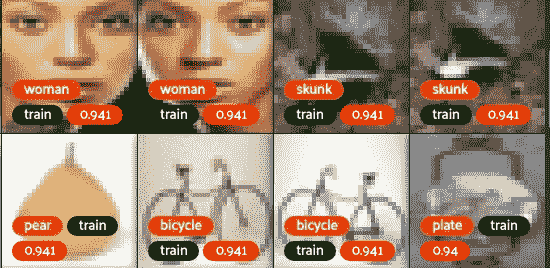
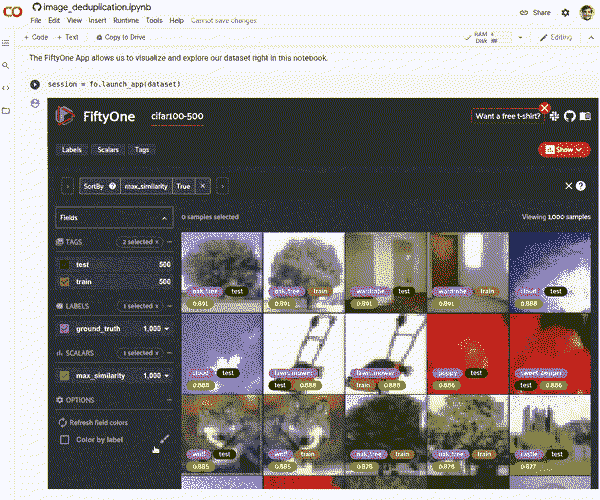
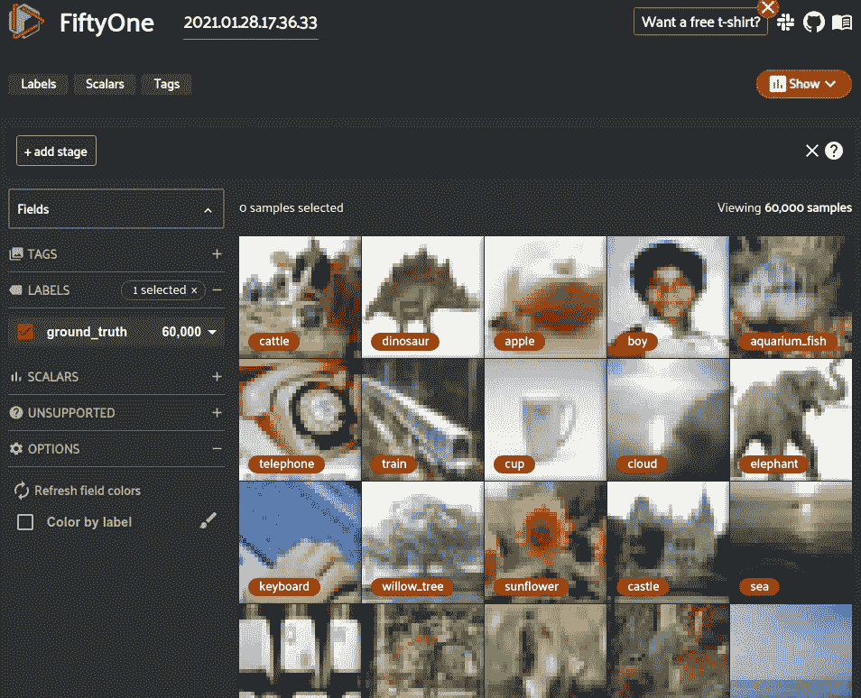
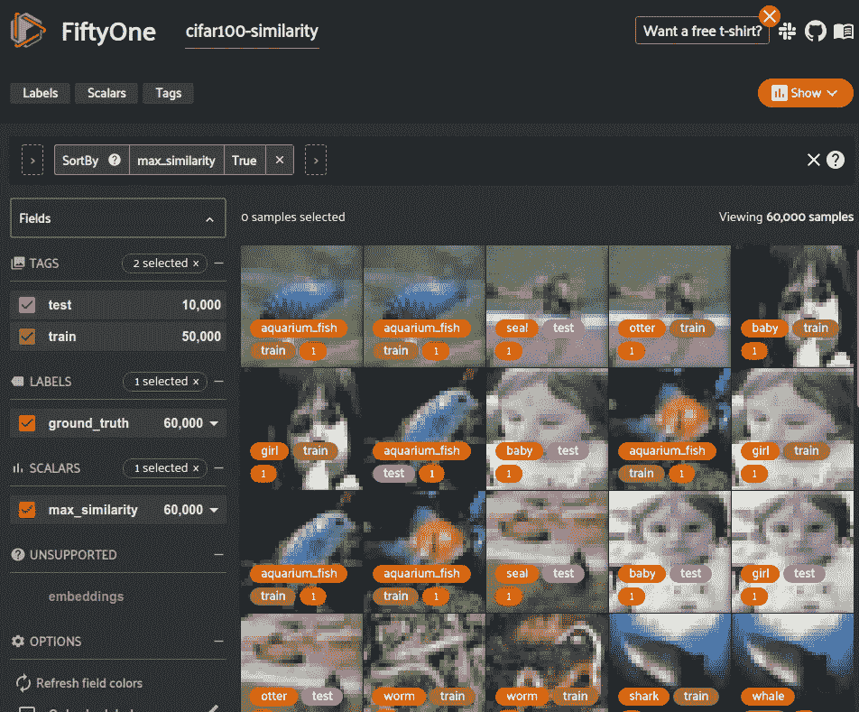
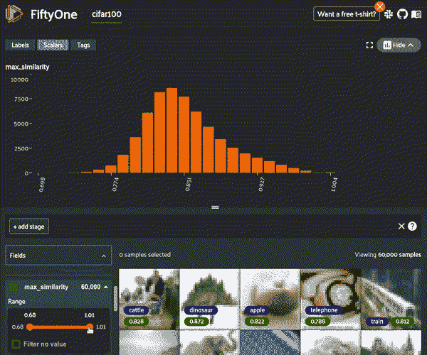
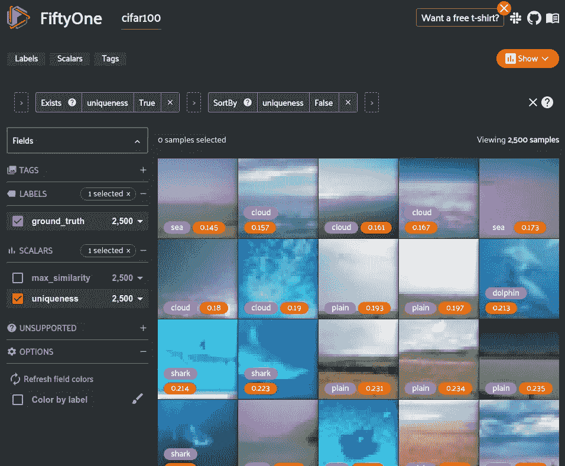

# 查找并移除数据集中的重复图像

> 原文：<https://towardsdatascience.com/find-and-remove-duplicate-images-in-your-dataset-3e3ec818b978?source=collection_archive---------12----------------------->

## 通过自动检测重复和近似重复的图像并删除它们，改进您的深度学习图像数据集



CIFAR-100 中的重复图像在[五十一](https://voxel51.com/docs/fiftyone/index.html)中可视化(图片由作者提供)

最先进的深度学习模型通常在拥有[数百万张图片](https://storage.googleapis.com/openimages/web/factsfigures.html)的数据集上进行训练。收集如此规模的数据集本身就是一项非常困难的任务。您可能需要自动化原始数据的处理过程。

一旦您收集了原始数据，您需要确保样本的高质量，以便正确训练和测试您的模型。[高质量数据集的一个要求是缺少重复样本](https://arxiv.org/pdf/2009.03224.pdf)。训练集中的副本会导致模型学习 ***偏向*** 复制的样本，从而导致模型更难推广到新数据。测试集中的重复将导致对模型的不正确性能评估，从而导致 ***对不可见数据的更差性能。***

在包含数百万张图像的数据集中手动查找重复图像是一项昂贵的工作。编写一个算法来查找完全相同的图像的副本可能很容易，但如果两幅图像只是略有不同，仅因轻微的光照变化或像素值而有所不同，该怎么办呢？这些样本仍然会影响性能，但是很难找到。

本文将向您展示如何自动查找和移除数据集中的重复和近似重复的图像，同时可视化图像以确保移除正确的图像。

> 我们将查看 CIFAR-100 数据集，我们发现它包含超过 4500 个重复的图像，有时在测试和训练分割之间重复

在这篇文章中，我将使用我正在开发的开源 ML 开发工具 [FiftyOne](https://voxel51.com/docs/fiftyone/) 。它将让您轻松操作和可视化图像数据集，并使用其模型动物园生成数据嵌入。安装非常简单:

```
pip install fiftyone
```

[**跟着一起在 Colab！**](https://colab.research.google.com/github/voxel51/fiftyone-examples/blob/master/examples/image_deduplication.ipynb)



Colab 笔记本中来自该博客的代码(图片由作者提供)

# 概观

*   加载数据集
*   计算嵌入
*   计算相似度
*   可视化并删除重复项

应该注意的是，有多种方式可以做到这一点。此处的示例对于成对查找数据集中每幅图像的近似副本非常有用。

[FiftyOne 还提供了一个](https://voxel51.com/docs/fiftyone/user_guide/brain.html) `[uniqueness](https://voxel51.com/docs/fiftyone/user_guide/brain.html)` [函数](https://voxel51.com/docs/fiftyone/user_guide/brain.html)，该函数计算数据集的标量属性，确定样本相对于其余数据的唯一性。它还可以用于手动查找近似重复，低`uniqueness`表示可能重复或近似重复的图像。你可以在文章的最后看到一个例子。

或者，如果你只对精确的副本感兴趣，你可以[对你的文件](https://voxel51.com/docs/fiftyone/recipes/image_deduplication.html)计算一个散列来快速找到匹配。但是，如果图像仅在小像素值上有所不同，这种方法将无法找到副本。

# **1)加载数据集**

第一步是[将你的数据集加载到第五十一个](https://voxel51.com/docs/fiftyone/user_guide/dataset_creation/index.html)中。

在本例中，我将使用图像识别数据集 [CIFAR-100](https://www.cs.toronto.edu/~kriz/cifar.html) 。这个数据集相当旧(2009 年)，但仍然足够相关，以至于提交给 ICLR 2021 的论文都在使用它作为基线。

CIFAR-100 包含训练和测试分割之间的 60，000 个图像，用 100 个标签类进行注释，这些标签类被分组为 20 个“超级类”。该数据集也存在于[51 数据集 Zoo](https://voxel51.com/docs/fiftyone/user_guide/dataset_zoo/index.html) 中，可以轻松加载。

如果您希望遵循本指南的轻量级版本，您可以加载包含 1000 个样本(或者您指定的任意数量)的数据集子集。

加载的数据集可以在 51 应用程序中可视化。



五十一应用程序中的数据集(图片由作者提供)

## 1a)加载您自己的数据集

[FiftyOne 支持多种标签类型](https://voxel51.com/docs/fiftyone/user_guide/dataset_creation/index.html)。如果使用分类数据集查找重复项，可以导入一个`ImageClassificationDirectoryTree`数据集。

# **2)生成嵌入**

图像在其像素值中存储了大量信息。逐个像素地比较图像将是一种昂贵的操作，并且导致质量差的结果。

相反，我们可以使用预训练的计算机视觉模型来为每个图像生成 ***嵌入*** 。嵌入是通过深度模型将图像处理成包含几千个值的向量形式的结果，这些值提取了存储在数百万像素中的信息。

51 模型动物园包含了许多不同的预训练模型，我们可以用它们来完成这个任务。在本例中，我们将使用经过训练的 [MobileNet](https://voxel51.com/docs/fiftyone/user_guide/model_zoo/models.html#mobilenet-v2-imagenet-torch) 对 ImageNet 数据集上的图像进行分类。该模型提供了相对较高的性能，但最重要的是它是轻量级的，并且可以比其他模型更快地处理我们的数据集。任何现成的模型都会提供丰富的信息，但人们可以很容易地试验对特定数据集更有用的其他模型。

我们可以轻松地加载模型，并在数据集上计算嵌入。

# **3)计算相似度**

既然我们已经显著降低了图像的维数，我们可以使用经典的相似性算法来计算每个图像嵌入与每个其他图像嵌入的相似程度。

在这种情况下，我们将使用 Scikit Learn 提供的[余弦相似度，因为这种算法很简单，并且在高维空间中工作得相当好。](https://scikit-learn.org/stable/modules/generated/sklearn.metrics.pairwise.cosine_similarity.html)

N×N 相似性矩阵为每对 N 个样本提供一个介于 0(低相似性)和 1(相同)之间的值。

```
[1, 0.532, 0.624, 0.461, ...]
[0.422, 1, 0.125, 0.031, ...]
...
[..., 0.236, 0.942, 0.831, 1]
```

正如你所看到的，所有的对角线值都是`1`，因为每个图像都是相同的。我们可以通过单位矩阵(对角线上为 1，其他地方为 0 的 N×N 矩阵)进行减法，以消除对角线，这样当我们寻找具有最大相似性的样本时，这些值就不会出现。

***注*** :在超过 100，000 幅图像的数据集上计算余弦相似度会耗费大量时间和内存。建议将嵌入拆分成批，并将该过程并行化，以加快计算速度。

# **4)可视化并移除重复项**

我们现在可以遍历每一个样本，找出哪些其他样本与它最相似。

将结果可视化并按具有最高相似性的样本排序，向我们展示了数据集中的重复项。



按最大相似性图像排序的数据集(按作者排序的图像)

马上，我们可以看到许多重复的东西，甚至更有问题的东西。两个图像是重复的，但一个是在列车分裂和一个是在测试分裂…它们被贴上不同的标签，海豹和水獭！！！这有几个明显的问题:

*   它不可能既是海豹又是水獭，所以其中一个标签是错的。此外，为图像的训练和测试版本提供不同的标签无疑会导致模型失败。
*   包含训练集副本的测试集将导致对模型概化的错误信任。如果测试集没有真正独立于定型集，那么当应用于生产数据时，模型的表观性能可能会下降。

## 删除重复项

撇开标记和分割的不幸不谈，我们仍然希望自动移除数据集中的重复图像。

通过查看结果，我们可以找到一个阈值，当两个图像被确定为重复时，我们可以使用该阈值作为截止值。该阈值对于该过程中使用的每个数据集/模型都是不同的，因此可视化步骤至关重要。五十一应用程序中的范围滑块提供了一种简单的方法来降低`max_similarity`分数，直到我们不再看到重复的分数。



使用滑块查找相似性阈值(图片由作者提供)

看起来好像在 0.94 `max_similarity`左右，我们得到的图像是复制的，但通过旋转、翻转和颜色变化得到了增强。数据扩充是一种有价值的工具，可以增加训练数据集的多样性和生产模型的概化能力；然而，如果“原子”训练集中有重复的，那么你的模型的训练时间可能仍然偏向于违规的类，所以我们也想删除近似重复的。


近似重复(图片由作者提供)

进一步的检查将保证重复的良好阈值设定在 0.92 左右。较低的值可能也包括重复值，但应该手动验证，这样我们就不会删除有用的数据。我们也可以通过代码过滤数据集，看看有多少样本的`max_similarity`为> 0.92。

> 60，000 个中有 4，345 个被标记为重复！

现在，我们可以再次遍历我们的数据集，并为每个样本找到所有相似性大于 0.92 的重复项，要么将它们标记为“重复”，要么将其删除。

我们可以找到在训练和测试分割中存在的副本的数量，以及被不同地标记的副本的数量。

结果是 4345 个副本中的 1621 个在训练和测试分裂中，427 个被不同地标记！

# **(可选)寻找独特的图像**

与此相关，FiftyOne 还提供了一种更先进的方法来计算数据集中每个图像的唯一性。这将为每个图像产生一个分数，该分数指示该图像的内容相对于所有其他图像有多独特。“独特性”与“相似性”极性相反。唯一性值较低的图像是您应该探索的潜在副本。

在决定将哪些样本发送给注释者时，惟一性会很有帮助。如果你只打算花钱得到你的数据的最好子集，那么你会想要最独特的样本来训练/测试你的模型。



CIFAR-100 的 2500 个样本子集中最少的独特图像(图片由作者提供)