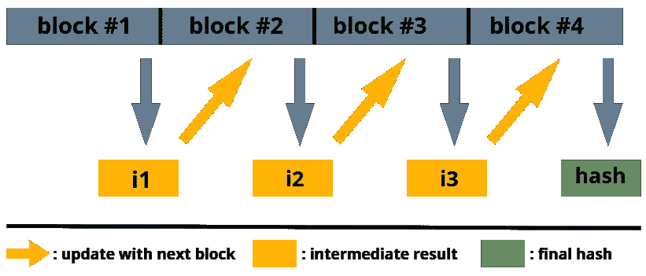

# 查找重复的照片和其他文件

> 原文：<https://towardsdatascience.com/find-duplicate-photos-and-other-files-88b0d07ef020?source=collection_archive---------32----------------------->

## 基于密码哈希函数的重复查找器


图片来自[峡湾](https://pixabay.com/users/haujord-924930/)

这是同一张照片吗？在另一个文件夹中有这个文件的副本吗？最近我在查阅一些旧文件，不得不经常问自己这些问题。我猜你们大多数人都经历过这样的情况。如您所知，手动识别所有重复文件非常耗时。因此，在这里，我们将探索一种在 Python 中自动识别重复文件的选项。

**但是在我们开始&之前，长话短说**:如果你只对代码感兴趣，而不是对如何识别重复文件的解释感兴趣，你可以直接进入 [***Github 库***](https://github.com/akcarsten/Duplicate-Finder) 并开始清理你的系统。否则…我们来看看效果如何。

## 查找重复文件

我们如何自动化识别重复文件的过程？我们可以生成所有重复文件的列表吗？有几种方法可以做到这一点。所以，我们应该仔细考虑一些选择，然后决定我们想走哪条路。

1.  最简单的方法是简单地寻找具有相同名称的文件。但是，如果文件副本是用新名称创建的，我们可能会遗漏重复项。同样，这也很危险，因为同名文件可能包含完全不同的信息。例如:如果你用智能手机拍照，你可能点击了一张名为 *IMG_0001.jpg* 的图片。然而，我怀疑这是我拿的一样。
2.  但是文件大小呢？反对这种方法的理由和反对文件名的理由一样，在这里也适用。更有可能的是，相同大小的文件不会保存相同的内容。
3.  好吧，那我们为什么不看看多重特征呢？如果两个文件具有相同的名称、大小和创建日期，它们应该是相同的？是的，他们很可能是相同的，但也有很小的可能不是。此外，我们将再次错过不同名称的重复文件。

所以没有机会可靠地找到我们硬盘上的重复文件？当然有。但它不是基于文件名、大小等参数。相反，我们将直接比较文件的内容。这里最直接的方法是逐位比较两个文件*。这将工作，我们将 100%确定文件是对方的副本。然而，根据我们想要检查的文件的大小和数量，对每一个可能的文件对都这样做在计算上是很昂贵的。幸运的是，这里有一个我们可以玩的把戏。我们可以计算每个文件的唯一标识符，然后比较这些标识符而不是整个文件，而不是一点一点地比较所有的东西*。检索这种标识符的一种常见方式是*加密哈希函数*。**

## ***加密哈希函数的概念***

*在我们进入加密散列函数的概念之前，让我们后退一步，想一想我们希望我们的标识符具有什么特性。*

1.  *标识符必须是唯一的。如果两个不同的文件有相同的标识符，这对我们来说是没有用的。*
2.  *标识符应该是可复制的。我们不希望有随机的标识符，这意味着如果我们再次为同一个文件生成标识符，我们希望得到相同的结果。否则我们不能用它来寻找重复。*

*对我们来说好的是，我们的两个需求都已经被散列函数满足了。第一个要求被称为*防碰撞*。这对于任何场景中的每个散列函数来说可能都不正确，但是在我们的上下文中，我们可以假设我们稍后将使用的散列函数是无冲突的。第二个要求是每次计算时为同一个文件生成相同的标识符，这也是散列函数的一般要求——它们是*确定性的*。此外，哈希函数是单向函数*,这意味着给定哈希，不可能重构生成哈希的输入。这一特性开辟了一系列超出本文范围的应用，包括它们在加密货币中的使用，比如比特币。**

**加密哈希函数的概念在这里只能粗略地概括，但是解释细节的资源在其他地方是可用的(例如这里的、这里的或者这里的)。简而言之，哈希函数获取不同长度的数据序列，并将它们映射到固定长度的位数组上。由于我们硬盘上的文件大小不一，我们将它们切割成块，然后通过散列函数运行第一块，将中间散列附加到下一块，并通过函数( *update* )再次运行它。我们这样做，直到处理完所有的块。如果最后一个块比定义的块长度短，将应用填充以确保恒定的块长度。下面的图 1 中也概述了该过程。通常，输入(这里是感兴趣的文件)被称为*消息*，而哈希函数的输出被称为*摘要*。**

****

**图 1:散列计算的大致轮廓**

## ****用 Python 实现****

**现在我们对加密哈希函数有了一个非常粗略的了解，我们可以继续使用它们来识别硬盘上的重复文件。**

**如果你想看完整的实现或者直接开始使用，要么去 [***Github 库***](https://github.com/akcarsten/Duplicate-Finder) 或者用 pip 安装:**

```
**pip install duplicate-finder**
```

**首先，我们需要创建一个函数来计算任何给定文件的哈希。计算将使用 Pythons 的 *hashlib* 库中包含的 [*sha256*](https://en.wikipedia.org/wiki/SHA-2) 哈希函数。从下面的代码块可以看出，它遵循了我们在图 1 中描述的内容。首先打开感兴趣的文件，读取固定长度的块，更新摘要，然后从文件中读取下一个块，再次更新摘要，以此类推，直到处理完整个文件。**

**现在，我们可以将上述函数与另一个函数结合使用，该函数可以搜索感兴趣的目录的所有子文件夹。它将返回每个文件的散列作为一个 [Pandas DataFrame](https://pandas.pydata.org/pandas-docs/stable/reference/api/pandas.DataFrame.html) ，并且可以选择将搜索限制到具有特定扩展名的文件，例如*。jpg* 。**

**由于结果是一个 Pandas 数据帧，我们可以继续使用 Pandas inbuild 方法来查找重复项。结果将再次是一个数据帧，但这一次它只保存重复的文件，按它们的散列排序。此外，我们可以选择将结果导出为*。csv* 文件。**

**然而，在某些情况下，我们可能不会对所有的副本感兴趣，而是想知道某个特定文件是否有副本。我们可以使用重复查找器 Python 包来做到这一点，如下所示:**

**最后，在某些情况下，我们希望比较两个文件夹，并检查重复。这也可以通过我们的重复查找工具包轻松完成:**

## **结论**

**使用 Python 在文件夹内和文件夹间查找重复文件是一项容易解决的任务。虽然文件名和大小等元数据不适合这项任务，并且*逐位*比较可能会很慢，但利用加密哈希函数提供了一种有效的前进方式。这里我们使用了 *sha256* 哈希函数。然而，其他散列算法可以很容易地包含在该框架中。**

**因此，如果你还没有这样做，你可以查看这篇文章的完整代码[这里](https://github.com/akcarsten/Duplicate-Finder)，在 [Twitter](https://twitter.com/ak_carsten) 上关注我或者通过 [LinkedIn](https://www.linkedin.com/in/carsten-klein/) 联系我。**