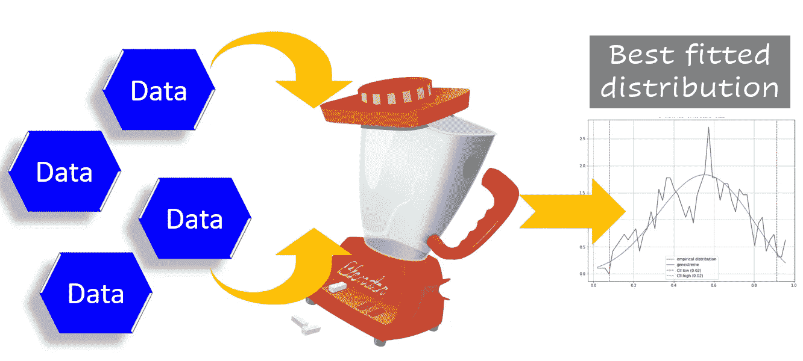
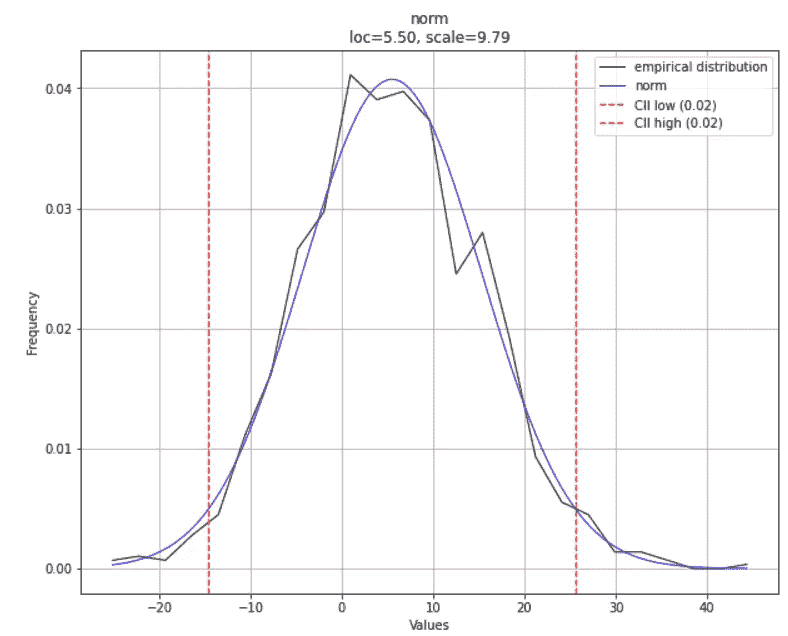
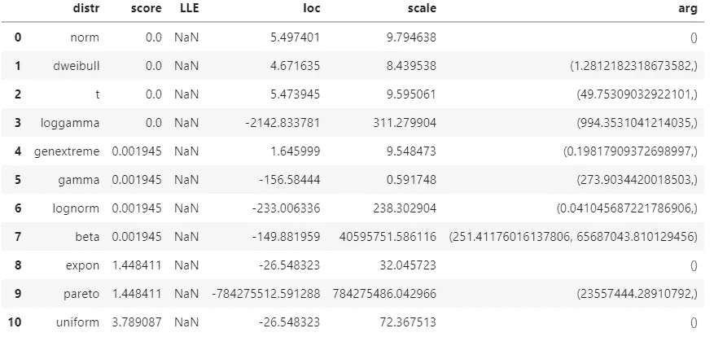
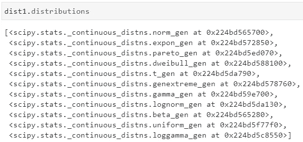
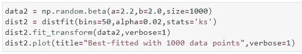
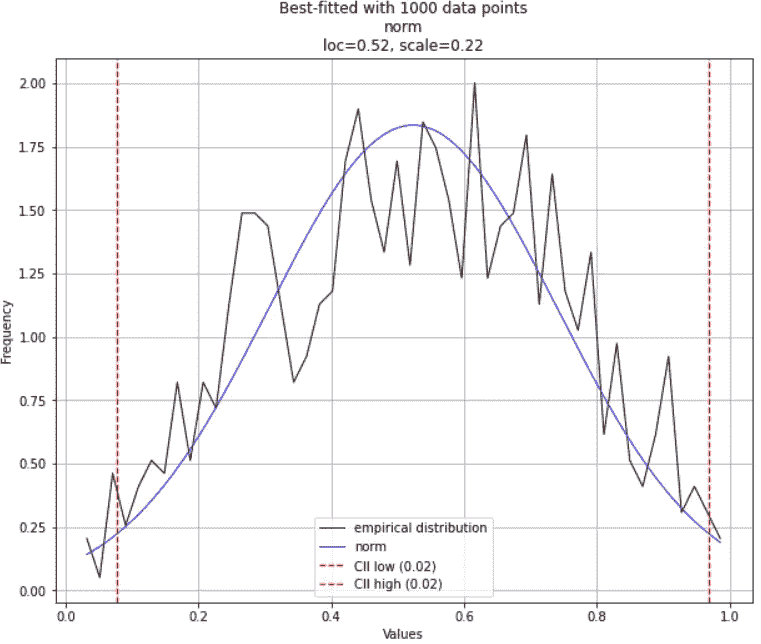
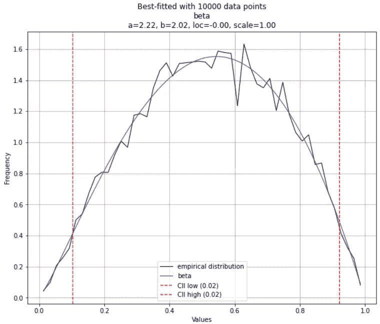

# 毫不费力地找到最匹配的数据分布

> 原文：<https://towardsdatascience.com/find-the-best-matching-distribution-for-your-data-effortlessly-bcc091aa08ab?source=collection_archive---------8----------------------->

## 如何以自动化和简单的方式为您的数据点找到最匹配的统计分布。然后，如何进一步扩展该工具。

# 我们的目标是什么？



**图片来源**:作者用 [Pixabay 图片](https://pixabay.com/vectors/mixer-grinder-blender-machine-575443/)制作(免费使用)

你有一些数据点。最好是数字。

你想找出**它们可能来自于**的哪个统计分布。经典的统计推断问题。

当然，有严格的统计方法来实现这个目标。但是，也许你是一个忙碌的数据科学家。或者，一个更忙的软件工程师碰巧得到了这个数据集来快速编写一个应用程序端点，以找到与数据匹配的最佳分布。以便另一个机器学习应用程序可以使用基于这种分布生成的一些合成数据。

简而言之，您手头没有很多时间，并且想要找到一个**快速方法来发现数据可能来自的*最佳匹配*分布**。

基本上，您想要在许多发行版上运行**自动批次的** [**拟合优度(GOF)测试**](https://en.wikipedia.org/wiki/Goodness_of_fit) ，并快速总结结果。

当然，您可以从头开始编写代码，使用比如说 Scipy 库，一个接一个地为许多发行版运行标准的 GOF 测试。

或者，您可以使用这个 [**小而有用的 Python 库**](https://erdogant.github.io/distfit/pages/html/index.html) — distfit 来为您完成繁重的工作。

# distfit——一个 Python 库，用于自动将分布与数据相匹配

根据他们的[网站](https://erdogant.github.io/distfit/pages/html/index.html) , `**distfit**`是一个 python 包，用于单变量分布的概率密度拟合。它使用残差平方和(RSS)和 GOF 的其他度量来确定 89 个理论分布的**最佳拟合。**

让我们看看如何使用它。这里是 [**演示笔记本**](https://github.com/tirthajyoti/Stats-Maths-with-Python/blob/master/Fitting-data-to-univariate-distributions-with-distfit.ipynb) 。

照常安装，

```
pip install -U distfit
```

## 生成测试数据并进行拟合

生成一些正态分布的测试数据，并将它们拟合到 distfit 对象。

> 基本上，您希望在许多发行版上运行**自动化的一批拟合优度(GOF)测试**,并快速总结结果

## 合身程度如何？

那么，合身吗？

注意，在上面的代码中，模型`dist1`不知道生成分布或其参数，即正态分布的`loc`或`scale`参数，也不知道我们调用`np.random.normal`来生成数据的事实。

我们可以通过一段简单的代码一次性测试拟合优度和估计的参数，

```
dist1.plot(verbose=1)
```

这是预期的曲线图(注意，由于生成数据的随机性，在您的情况下，曲线图看起来肯定会有些不同)。

**注意** `**loc**` **和** `**scale**` **参数是由绘图副标题中的拟合过程估计的**。非常接近我们之前设置的参数值，不是吗？估计的分布类型显示为`norm`，即正态分布。好极了。



**作者创作的图像**

## 关于合身模型的更多信息

使用另一个一行代码，您可以获得所有符合数据(内部)并经过拟合优度测试的分布的摘要。

```
dist1.summary
```

你会得到这样的东西，



**作者创造的形象**

这显示了用给定数据测试的各种分布的所有参数。它还显示了`**score**` **，表示拟合优度** —预期数据和给定数据之间的距离，即越低越好。请注意，在此模型中，不止一个分布具有相同的零分，但正态分布被选为内部逻辑下最合理的分布。

**为什么这个摘要中只有 10 个分布**？因为默认情况下，它使用最流行的 10 个发行版的列表进行扫描。在初始化时，您可以将确切的列表指定为`distfit`对象的参数。

## 在内部使用 Scipy

如果您键入`dist1.distributions`，那么您将看到拟合过程中使用的函数列表，它们来自 Scipy 包。



## 不要停留在拟合上，还要生成合成数据

作为一个附加组件，`distfit` model 提供了基于最佳拟合分布轻松生成数据的 API。这里，我们用`loc=5.5`和`scale=9.79`生成 10 个随机变量(如之前拟合的)。


## 你必须小心的事情

如果两个或多个分布的数据形状之间有很多相似之处，则估计可能是错误的。**特别是，如果样本量(训练数据)很小**。

例如，让我们从 [**Beta 分布**](https://en.wikipedia.org/wiki/Beta_distribution) 中生成一些数据，选择参数，例如它们*看起来几乎像正态分布*。如果我们选择参数 **α** 和 **β** 相等或接近，我们可以实现这一点。然后，如果你拟合 1000 个数据点，你可能得到正态分布作为最佳拟合分布。



**作者创作的图像**

然而，如果你把样本量扩大到 10，000 点，你很可能会得到正确的答案。



**作者创造的形象**

## 你可以做的其他事情

可以选择哪个**统计检验** (RSS，Kolmogorov-Smirnov 等。)用于确定最佳拟合。

您还可以指定您想要运行的发行版的精确列表。

你可以使用`distfit.predict`方法**预测一个响应变量的概率**。

我们只展示了连续分布拟合的例子。你也可以用**离散分布**进行拟合。

# 为什么这是一个“生产数据科学”的例子？

我认为使用像`distfit`这样的实用程序包是进行 ***高效数据科学*** 的一个典型例子。

我在这篇文章中写过什么是生产数据科学。本质上，这意味着**以更高的速度、稳健的方式进行同样的数据科学活动**。

[](https://medium.com/productive-data-science/why-and-how-should-you-learn-productive-data-science-53377b473f37) [## 为什么以及如何学习“生产数据科学”？

### 什么是生产数据科学，它有哪些组成部分？

medium.com](https://medium.com/productive-data-science/why-and-how-should-you-learn-productive-data-science-53377b473f37) 

您可以使用 Scipy 函数从头开始编写纯 Python 代码，遍历各种发行版，并对您拥有的数据运行 GOF 测试。但是当有人已经为完全相同的任务编写了一个优秀的库(带有高质量的文档)时，你为什么还要浪费时间呢？

这就是为什么每当您想要将单变量数据拟合到最佳分布并一次性获得所有统计属性时，您都可以想到`distfit`。

Y 你可以查看作者的 [**GitHub**](https://github.com/tirthajyoti?tab=repositories) **知识库**获取机器学习和数据科学方面的代码、思想和资源。如果你和我一样，对人工智能/机器学习/数据科学充满热情，请随时[在 LinkedIn 上添加我](https://www.linkedin.com/in/tirthajyoti-sarkar-2127aa7/)或[在 Twitter 上关注我](https://twitter.com/tirthajyotiS)。

[](https://www.linkedin.com/in/tirthajyoti-sarkar-2127aa7/) [## Tirthajyoti Sarkar -数据科学和解决方案工程经理- Adapdix 公司|…

### 将 AI/ML 的力量放在工业 4.0 和下一代智能工厂的边缘。将人工智能引入工业领域…

www.linkedin.com](https://www.linkedin.com/in/tirthajyoti-sarkar-2127aa7/) 

享受中等:[https://medium.com/@tirthajyoti/membership](https://medium.com/@tirthajyoti/membership)