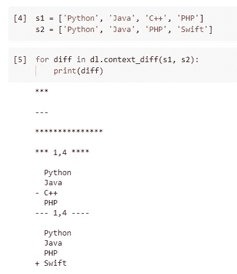

# Python 中的“寻找差异”

> 原文：<https://towardsdatascience.com/find-the-difference-in-python-68bbd000e513?source=collection_archive---------1----------------------->


照片由 [geralt](https://pixabay.com/users/geralt-9301/) 在 [Pixabay](https://pixabay.com/illustrations/difference-mobile-phone-smartphone-2048174/) 拍摄

## difflib——Python 内置库中隐藏的瑰宝

最近，我一直专注于审查和试用 Python 内置库。这个自我分配的任务给我带来了很多乐趣。Python 中有许多有趣的特性，为不同类型的问题提供了现成的实现和解决方案。

其中一个例子就是我要在本文中介绍的内置库——Difflib。因为它是 Python3 内置的，所以我们不需要下载或安装任何东西，只需如下导入即可。

```
import difflib as dl
```

现在我们应该开始了:)

# 1.查找“已更改”的元素


照片由 [geralt](https://pixabay.com/users/geralt-9301/) 在 [Pixabay](https://pixabay.com/illustrations/change-arrows-clouds-sky-direction-948024/) 上拍摄

我相信我的大多数观众都知道如何使用 git。如果您是其中之一，您可能已经看到了如下带有冲突的原始代码文件。

```
<<<<<<< HEAD:file.txt
Hello world
=======
Goodbye
>>>>>>> 77976da35a11db4580b80ae27e8d65caf5208086:file.txt
```

在大多数 Git 的 GUI 工具中，比如 Atlassian Sourcetree，您一定见过这样的表示。


图片提供:[https://blog.sourcetreeapp.com/files/2013/03/hero-small.png](https://blog.sourcetreeapp.com/files/2013/03/hero-small.png)

减号表示该行代码在新版本中被删除，而加号表示该行代码被添加到新版本的代码中，而该代码在旧版本中并不存在。

在 Python 中，我们可以使用 Difflib 通过一行代码轻松实现非常类似的东西。我要展示的第一个函数是`context_diff()`。

让我们用一些字符串元素组成两个列表。

```
s1 = ['Python', 'Java', 'C++', 'PHP']
s2 = ['Python', 'JavaScript', 'C', 'PHP']
```

然后，魔法来了。我们可以生成如下的比较“报告”。

```
dl.context_diff(s1, s2)
```

`context_diff()`函数将返回一个 Python 生成器。因此，我们可以循环它来一次性打印所有内容。

```
for diff in dl.context_diff(s1, s2):
    print(diff)
```


输出使用感叹号`!`清楚地显示第二个和第三个元素是不同的，表示“这个元素是不同的”！

在这种情况下，第一个和第四个元素是相同的，因此它将只显示差异。最有趣的是，如果我们把场景变得更复杂，它会显示出更有用的东西。让我们将这两个列表更改如下。

```
s1 = ['Python', 'Java', 'C++', 'PHP']
s2 = ['Python', 'Java', 'PHP', 'Swift']
```



上面的输出表明“C++”已经从第一个列表(原始列表)中删除，“Swift”已经被添加到第二个列表(新列表)中。

如果我们想显示与从 Sourcetree 获得的截图完全相似的内容，该怎么办？是的，Python 允许我们这样做。只需使用另一个名为`unified_diff()`的函数。

```
dl.unified_diff(s1, s2)
```


`unified_diff()`函数将两个列表“统一”在一起，可以生成如上图所示的输出，在我看来这更具可读性。

# 2.准确指出差异


照片由 [Pixabay](https://pixabay.com/photos/magnifying-glass-research-find-5288875/) 上的 [lucasgeorgewendt](https://pixabay.com/users/lucasgeorgewendt-15638399/) 拍摄

在第 1 节中，我们着重于确定行级的差异。能不能具体一点？例如，如果我们想要一个字符一个字符地比较，并显示有什么不同呢？

答案是肯定的。我们可以使用`ndiff()`功能。

假设我们正在比较两个列表中的单词，如下所示。

```
['tree', 'house', 'landing']
['tree', 'horse', 'lending']
```

这三个单词看起来非常相似，但是只有第二和第三个单词有一个字母的变化。让我们看看函数会返回给我们什么。


它不仅显示了哪些内容已更改(带减号和加号)和未更改(“树”未更改，因此根本没有指示符)，还显示了哪个字母已更改。`^`指示符已正确添加到已被识别为差异的信函中。

# 3.获得相近的匹配


由 [Pezibear](https://pixabay.com/users/pezibear-526143/) 在 [Pixabay](https://pixabay.com/photos/tulips-garden-garden-flowers-flower-3339416/) 上拍摄的照片

你有没有输入“teh”被自动更正为“the”的经历？我打赌你有，我一直都是这样:)

现在，有了 Difflib，您可以非常容易地在 Python 应用程序中实现这个特性。关键是使用`get_close_matches()`功能。

假设我们有一个候选列表和一个“输入”，这个函数可以帮助我们挑选与“输入”接近的一个(或多个)。让我们看看下面的例子。

```
dl.get_close_matches('thme', ['them', 'that', 'this'])
```


当我们输入“thme”(一个错别字)而不是“this”或“that”时，它成功地找到了“them”，因为“them”是最接近的一个。但是，该函数不能保证返回某个值。也就是说，当没有足够接近输入的内容时，将返回一个空列表。


这非常有意义，因为我们不会一直犯拼写错误，对吗？:)

事实上，我们可以通过向参数`cutoff`传递一个参数来控制如何度量“相似性”。它需要一个介于 0 和 1 之间的浮点数。数字越大意味着越严格，反之亦然。


一个`cutoff = 0.1`足够小，可以让函数匹配输入的所有候选项。如果我们想限制返回的匹配项的数量呢？我们可以使用另一个参数`n`，它将返回给我们“前 n 个”最匹配的术语。


# 4.如何将一个字符串 A 修改为 B？


[铸造厂](https://pixabay.com/users/foundry-923783/)在 [Pixabay](https://pixabay.com/photos/knit-sew-girl-female-make-craft-869221/) 上拍摄的照片

如果你有一些信息检索的知识，你可能已经意识到上述函数利用了 Levenshtein 距离。它试图找出两个文本术语之间的差异，并测量它们之间的“距离”。

通常，该距离由修改术语 A 到 b 所需的最小替换、插入和删除次数来定义。有时，不同的修改将被赋予不同的权重。在本文中，我将跳过算法部分。如果你感兴趣的话，可以去 Levenshtein Distance 的 Wiki 页面了解详情。

 [## 莱文斯坦距离

### 在信息论、语言学和计算机科学中，Levenshtein 距离是一个字符串度量，用于测量…

en.wikipedia.org](https://en.wikipedia.org/wiki/Levenshtein_distance) 

其实这篇文章还没写完。使用 Difflib，我们甚至可以实现如何将 Levenshtein 距离应用于两个字符串的步骤。这可以使用 Difflib 中的`SequenceMatcher`类来完成。

假设我们有两个字符串`abcde`和`fabdc`，我们想知道如何将前者修改成后者。第一步是实例化该类。

```
s1 = 'abcde'
s2 = 'fabdc'seq_matcher = dl.SequenceMatcher(None, s1, s2)
```

然后，我们可以使用类方法`get_opcodes()`来获得元组列表，该列表指示:

*   修改操作(插入、等于或删除)的标签
*   源字符串的开始和结束位置
*   目标字符串的开始和结束位置

我们可以将上述信息“翻译”成可读性更强的东西。

```
for tag, i1, i2, j1, j2 in seq_matcher.get_opcodes():
    print(f'{tag:7}   s1[{i1}:{i2}] --> s2[{j1}:{j2}] {s1[i1:i2]!r:>6} --> {s2[j1:j2]!r}')
```


超级爽:)

你可能也注意到了，我们传递给`SequenceMatcher`类的第一个参数是`None`。此参数用于指示某些字符可能被“忽略”的算法。这种忽略并不意味着从源字符串中删除它，而是在算法处理中忽略它。我知道这有点难以理解。让我给你看一个例子。

```
seq_matcher = dl.SequenceMatcher(lambda c: c in 'abc', s1, s2)
```


字母“abc”不会在算法中运行，但会被视为一个整体。

最后但同样重要的是，下面的例子展示了我们在实践中如何使用这个函数。


# 摘要


在 [Pixabay](https://pixabay.com/photos/woman-girl-freedom-happy-sun-591576/) 上由[吉尔·威林顿](https://pixabay.com/users/jillwellington-334088/)拍摄的照片

在本文中，我介绍了另一个名为 Difflib 的 Python 内置库。它可以生成报告，指出两个列表或两个字符串之间的差异。此外，它还可以帮助我们在输入和候选字符串列表之间找到最匹配的字符串。最终，我们可以使用这个模块的一个类来实现一些更复杂和高级的功能。

[](https://medium.com/@qiuyujx/membership) [## 通过我的推荐链接加入 Medium 克里斯托弗·陶

### 作为一个媒体会员，你的会员费的一部分会给你阅读的作家，你可以完全接触到每一个故事…

medium.com](https://medium.com/@qiuyujx/membership) 

**如果你觉得我的文章有帮助，请考虑加入灵媒会员来支持我和成千上万的其他作家！(点击上面的链接)**