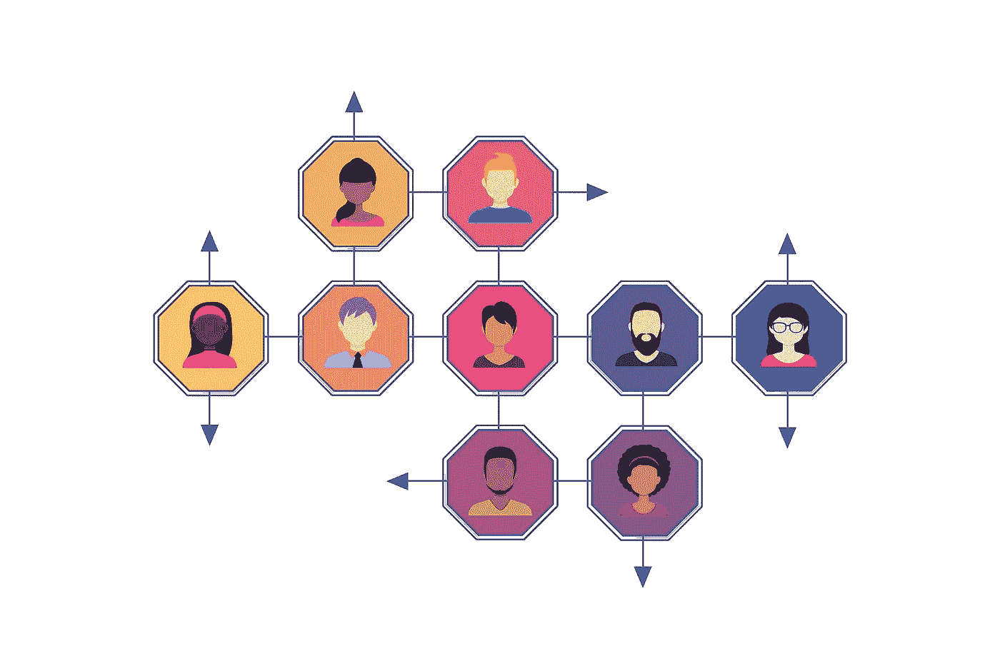
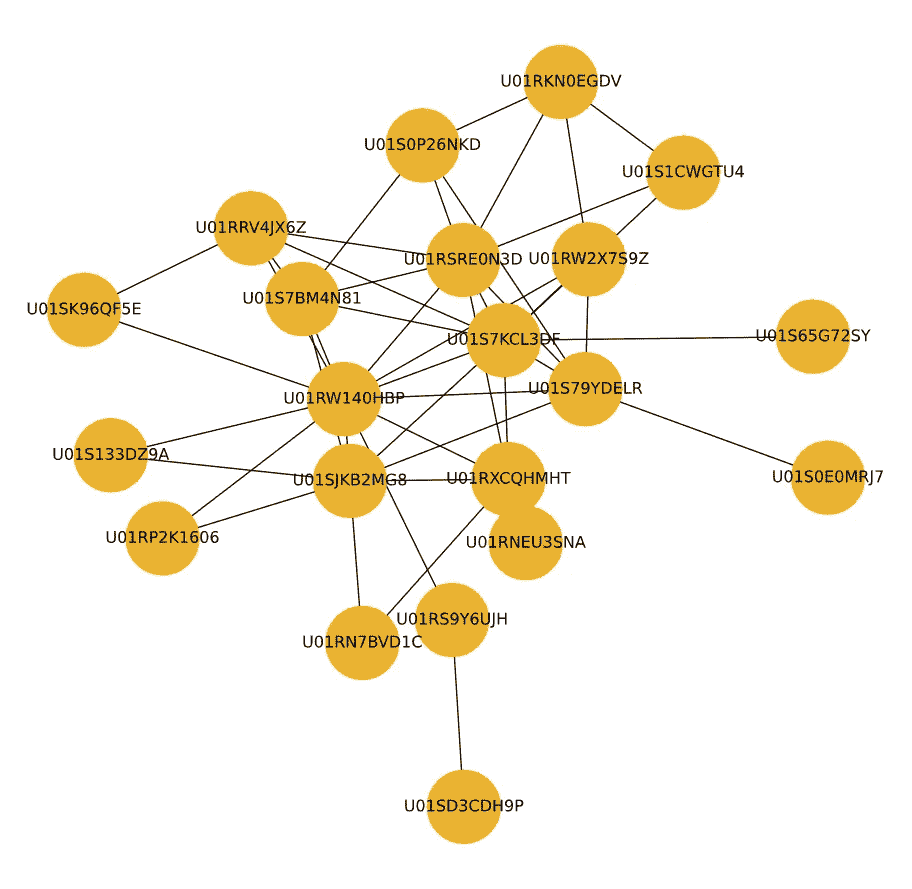
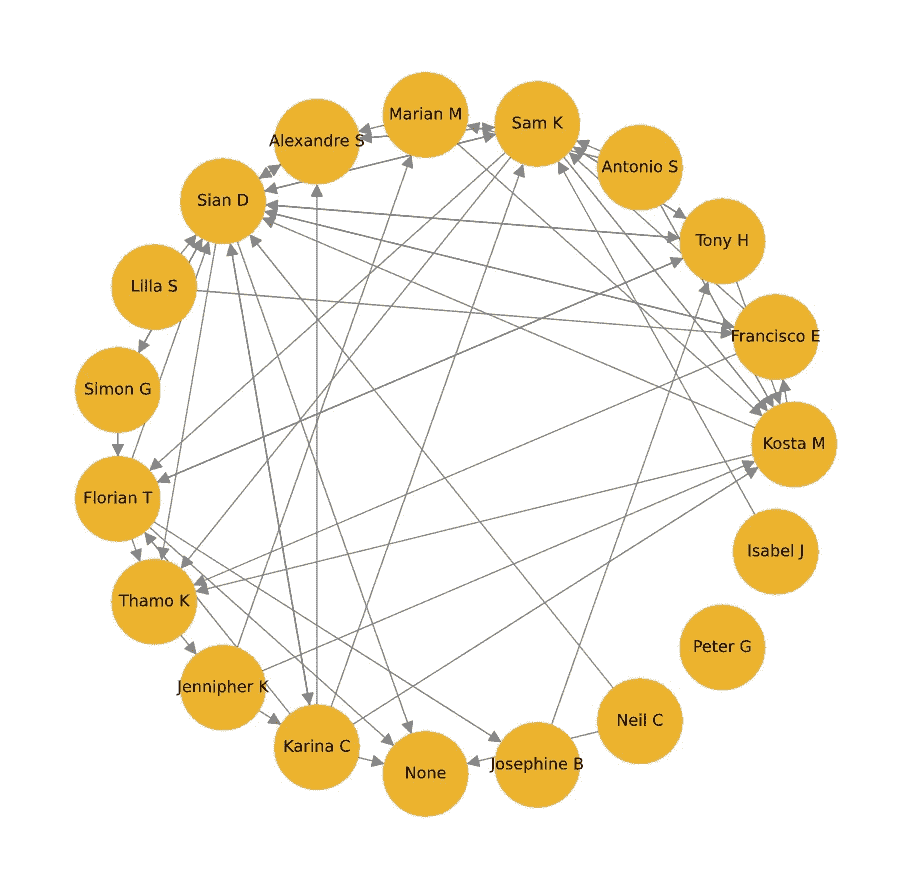
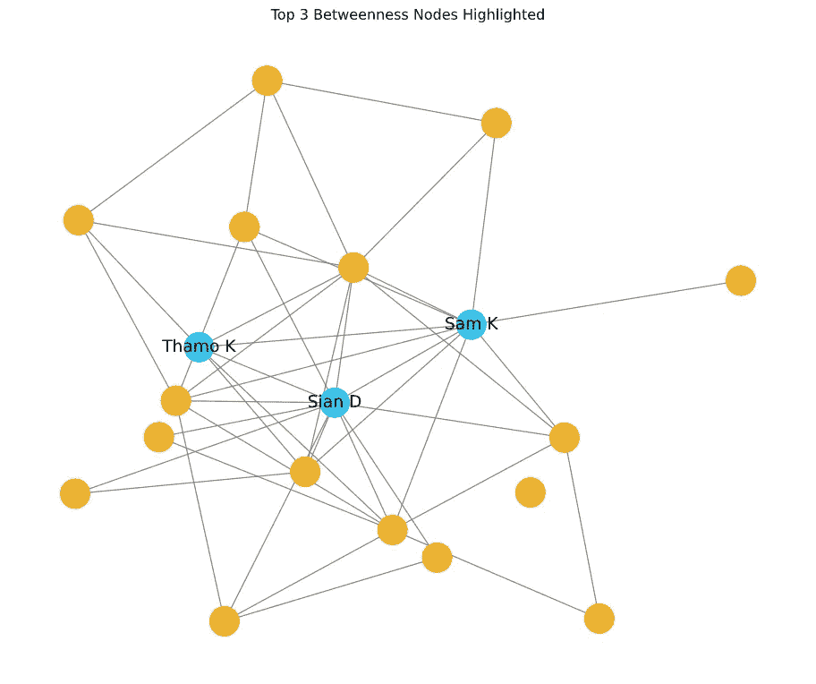
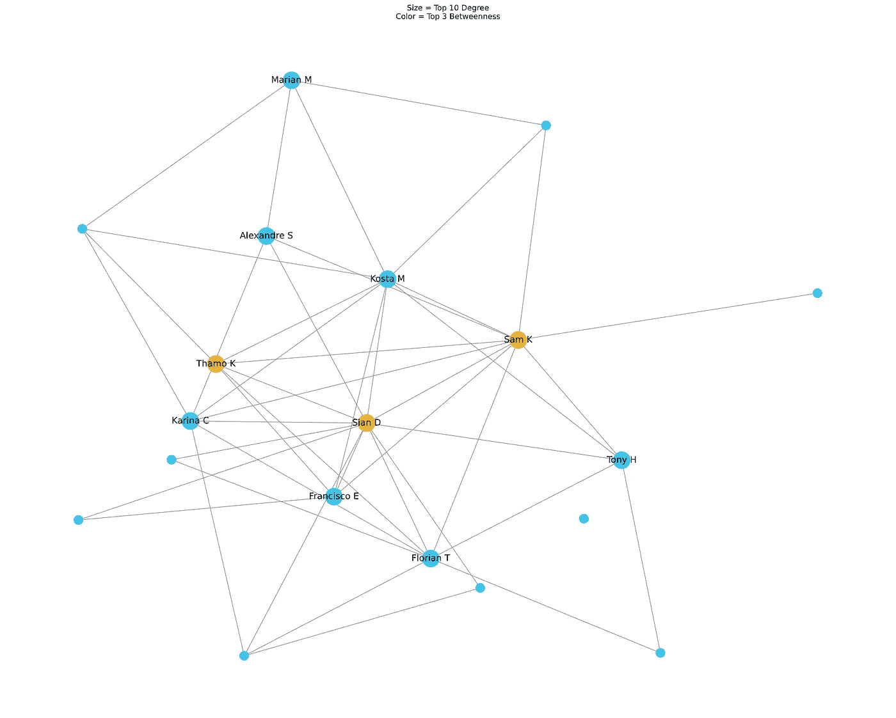

# 找到你公司的知识中心

> 原文：<https://towardsdatascience.com/find-the-knowledge-hubs-in-your-company-38afb89d2eaa?source=collection_archive---------24----------------------->

## 在冗余数据上使用社会网络分析

来源:[unsplash.com](https://unsplash.com/photos/gUIJ0YszPig)，图片作者:
奥斯丁·迪斯特尔

# 一场非常普通的斗争

假设你是一家快速发展的大公司的新经理，你需要问题的答案。你怎么知道如何提问？

虽然团队像蘑菇一样到处涌现，每个奇数周都会改变方向，但你真的不能再依赖过时的组织图表了。你最好自己去发现内部网络，找到最有价值的贡献者。

来源: [Pixabay](https://pixabay.com/illustrations/networks-people-users-communication-3017398/) 作者 [geralt](https://pixabay.com/users/geralt-9301/)

这就是社会网络分析(SNA)可以发挥作用的地方。

不过，在进入网络科学之前，我建议先浏览几个基本概念，以便熟悉这个主题:

*   网络科学:尼基·凯斯(Nicky Case)的一款名为《群体的智慧与疯狂》(T9)的互动游戏。
*   社交网络分析:由 Mitchell Telatnik 撰写的简短 [medium pos](/how-to-get-started-with-social-network-analysis-6d527685d374) t。

我们可以使用来自 Slack 等通信系统的数据，用 Python 构建网络。这些人通过他们发送的信息联系在一起，我们可以通过下载聊天记录来跟踪他们。

# 目标

…就是找到:

*   谁在网络中拥有最多的连接=谁发送/接收的消息最多？
*   谁在网络中连接最多和最少的部分(离群值)之间充当桥梁=谁对信息流的影响最大？

# 数据

今年早些时候，我参加了一个数据分析训练营，获得了一个相对较小但真实的数据集，这个训练营有 3 个月的价值。

使该数据集适合分析需要一些时间，但所有步骤都包含在 EDA 笔记本中。为了可视化网络，我使用了 Python 的 Network X 库——代码可以在名为 network_graphs 的文件中找到。

为了消除我的第一个概念验证的噪音，我只查看了公共频道上的一对一对话(两个人之间的线索)。这似乎是一个明智的选择，因为我自己也是网络科学的新手。

# 让我们找到那些枢纽！

大约

*   30 小时的争吵
*   2 社交网络分析课程(Datacamp 和 Coursera，好久不见！)
*   几个心理障碍之后，我发现自己对我的第一张图表感到困惑和惊讶:

啊哈！我想，这究竟是怎么回事。我可以把消息看作是用户之间的联系，但是必须找到一种方法把这些用户 id 变成真实的名字。

在更多的数据争论之后，我用一个圆形布局的有向图来清楚地显示谁给谁发了信息。

看起来不错。我们现在可以清楚地看到信息的方向，所有的名字都是有意义的。你能猜出谁的关系网最广吗？

回到我们的主要目标，我们需要找到与更孤立的个人有良好联系的用户，以了解:

*   谁知道网络中发生的最微小的事情，
*   谁能把信息传播到各处。

它们被称为具有最高介数的节点。如果你越来越难以理解，现在是查看文章开头提到的资源的好时机。

用蓝色突出显示:Sian D、Sam K 和 Thamo K 似乎是您的主要联系点。

好吧，假设你运气不好，那三个人此刻正在桑给巴尔啜饮冰镇果汁朗姆酒，所以我们需要下一对排队的人。

下图显示了以下特征:

*   十个联系最紧密的人，我们的问题突出显示为较大的节点和
*   三个黄色的连接到网络的隔离部分。

看这张图，还有几件事要提一下。

你看到那些黄色的圆圈和它们之间的联系了吗？分析师表示，它们就像网络中的桥梁，因此很容易变成瓶颈，因为它们可以在保存和传播信息方面发挥核心作用。

连接最少的个体是网络的离群者，他们坐在边缘，没有太多的连接(有意或无意)。如果他们聚集在一起，形成孤岛，他们可能会损害公司的生产力和效率，因为他们将与中心行动脱节，并可能偏离轨道。

谈到生产率，作为一名曾经帮助公司找到并消除高绩效障碍的前顾问，我对这一部分特别感兴趣。我发现了 SNA 中一个处理公司网络的特殊领域，称为组织网络分析，它提供了关于公司内部工作的新鲜和可行的见解，例如人们如何在团队中合作，以及谁是推动公司内部变革的关键影响者。

好吧，我觉得是时候承认了:ONA 是我做这个项目的原因。我发现发现一个组织每天挣扎的真正原因，而不是靠猜测来玩，这很有意思。

## 准备好自己尝试了吗？

以这个[回购](https://github.com/lillaszulyovszky/network-analysis-slack)为基础，拿自己团队的 Slack 数据，看看谁是你公司最有人脉/最有价值的用户。

请注意，这些指标只能让你起步，明智地使用它们，并用常识验证。

## *特别感谢*

*Eric Sims 在 DataTalks 上的演讲鼓励我继续这个项目，我的兄弟 Mark Szulyovszky 和我的 python 导师 James Clare 帮助我度过了陷入困境的阶段。*

这是所有的乡亲。