# 通过可视化频率分布找到数据集的模式(Stat-05)

> 原文：<https://towardsdatascience.com/find-the-patterns-of-a-dataset-by-visualizing-frequency-distribution-c5718ab1f2c2?source=collection_archive---------19----------------------->

## [入门](https://towardsdatascience.com/tagged/getting-started)

## 通过可视化频率分布来深入了解数据集


照片由[尼克·费因斯](https://unsplash.com/@jannerboy62?utm_source=medium&utm_medium=referral)在 [Unsplash](https://unsplash.com?utm_source=medium&utm_medium=referral) 上拍摄

> 视觉化给你一些你不知道的问题的答案— [**本·施奈德曼**](https://www.cs.umd.edu/users/ben/)

数据科学被定义为解释数据并从中获取有用信息的艺术。同时，数据可视化涉及到数据的表示。尽管它们来自完全不同的实体，但背景是相同的。数据科学不是单一的流程、方法或工作流。我们可以认为数据可视化是数据科学的子集。

数据科学在我们日常生活中的最好例子是用户购物时的电子商务推荐。机器定期学习用户的活动，并根据你的兴趣和购物选择来操纵它，从而给出最佳建议。分析原始数据非常困难。数据科学家需要将操纵的数据可视化并进行分析，以便为用户提供最佳选择。这就是数据可视化发挥作用的地方。

有几种统计和数学方法，我们可以通过这些方法获得关于数据集的洞察信息。其中，频率分配是最简单但也是最重要的技术。

## 路线图…

*   为什么需要频率分布的图形表示？
*   频率分布柱状图
*   频率分布饼图
*   频率分布直方图
*   偏斜频率分布
*   频率的对称分布

*让我们开始我们的旅程……*

## **什么是数据可视化？**

数据可视化是将信息转换成可视化上下文(如地图或图形)的实践，以使数据更容易被人脑理解并从中获得见解。数据可视化的主要目标是从数据中发现模式。数据可视化是数据科学的一部分。收集数据后，我们必须修改和模拟数据。最后，它应该是可视化的最终结论。

## **为什么需要频率分布的图形表示？？**

要深入理解它，你必须有频率分布的先验知识。要知道什么是频数分布，如何制定频数分布表。可以看我们之前的文章基于频率分布。

</to-increase-data-analysing-power-you-must-know-frequency-distribution-afa438c3e7a4>  

在我们以前的文章中，我们可能会看到如何从原始数据创建一个频率分布表。当我们试图从数据中寻找模式时，我们可能会面临另一个问题。你猜怎么分析频率表从数据集中找到模式？如果您想从频率表中找到一个模式，您必须查找每个唯一值或类间隔的频率。仅仅通过查找每个唯一值的频率，就能发现什么规律吗？不，你必须同时比较每个值的频率。对于一些独特的值或类间隔，或者当频率值较少且*更容易比较*时，这将是容易的。但是，如果我们试图比较大量唯一值的频率，我们会感到困惑。我们可以通过可视化数据来解决这个问题。图表使扫描和比较频率变得容易得多，提供了整个变量分布的单一图像。因为它们容易掌握，也引人注目。有时，您必须在非技术人员面前展示数据。如果我们需要向非技术观众展示我们的发现，图表是更好的表达方式。在本文中，我们将讨论三种表示分布表的图形:

***1。条形地块***

***2。饼状图***

***3。直方图***

*   ***我们正在考虑一个数据集，以便更好地演示***

在本文中，我们使用的是 wnba.csv 数据集。全国女子篮球协会 ( **WNBA** )是美国的职业篮球联盟。它目前由 12 个小组组成。在我们的数据集中，我们有 2016-2017 赛季所有比赛的统计数据。数据集有 143 行和 32 列。数据集概述如下。

## 频率分布柱状图

条形图或条形图是一种图形，用矩形条表示数据类别，矩形条的长度和高度与它们所表示的值成比例。

柱状图用于在序数或名义尺度上测量的变量。显示 1801-1961 年间 Edge 人口变化的条形图示例。

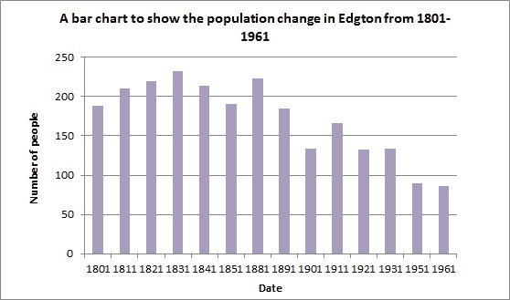

作者照片

*   ***如何生成柱状图***

要生成条形图，我们需要两组值。

(I)一个包含唯一值列表的集合。

(ii)另一组包含每个独特值的频率。

我们可以很容易地从频率表中得到两组数值。为了得到一个频率表，我们可以使用 pandas `Series.value_counts()` [方法](https://pandas.pydata.org/docs/reference/api/pandas.Series.value_counts.html)。那我们就得用`Series. plot.bar()` [的方法](https://pandas.pydata.org/pandas-docs/stable/generated/pandas.Series.plot.bar.html)。我们可以对数据集中的`Pos (Player Position)`变量这样做。

我们可以使用`Series.value_counts().plot.bar()`只用一行代码创建柱状图。

```
wnba[‘Pos’].value_counts().plot.bar()
```

输出:

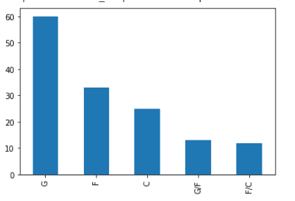

作者照片

`Series. lot.bar()` 方法生成竖条印迹，其中频率在 y 轴，每个唯一值在 x 轴。有时，您需要生成一个水平条形图。要生成水平条形图，您可以使用`Series.plot.barh()` [方法](https://pandas.pydata.org/pandas-docs/stable/generated/pandas.Series.plot.barh.html)。

```
wnba[‘Pos’].value_counts().plot.barh()
```

输出:

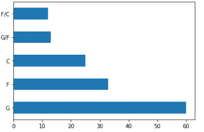

作者照片

*   ***如何自定义条形图***

`Series.value_counts().plot.bar()`方法有几个参数。

(i)x-设置 x 轴的标签。

(ii)y-设置 y 轴的标签。

(iii)颜色-设置自定义颜色。

(iv)旋转-旋转 x 轴的技巧标签。

(五)以此类推。

通过更改这些参数，您可以根据需要装饰您的条形图。

欲知详情，可以阅读 [***柱状图***](https://pandas.pydata.org/docs/reference/api/pandas.Series.plot.html) *的文档。*

## 频率分布饼图

饼图是一种以圆形图形直观显示数据的图表。数据的圆形、球形和角形表示通常是用来表示真实世界数据的图形。饼图的形状是圆形的，其中饼图代表整个数据，饼图的切片代表数据的各个部分，并离散地记录数据。

它可以假设为一个普通的馅饼。让我们看看下面的例子，它代表了制作奶油蛋糕所用的配料。


作者照片

整个饼图代表值 100。各种颜色代表了制作蛋糕的原料。只看切片颜色就能理解除法。

*   ***我们为什么要用饼状图？***

饼图相对于条形图的主要优势在于，它能更好地显示分布中的相对频率，或者说是比例频率。查看条形图，我们可以看到哪些类别的数量或多或少，但我们无法判断比例。

只看饼状图，就能论证出各个品类的比例。

*   ***如何生成饼状图***

我们可以使用`Series.plot.pie()` [方法](https://pandas.pydata.org/pandas-docs/stable/generated/pandas.Series.plot.pie.html)生成饼图。我们可以在数据集中的`‘Pos’` 列上应用该方法。

```
`wnba[‘Pos’].value_counts().plot.pie()
```

输出:

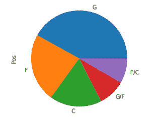

*   ***如何自定义饼状图***

在大多数情况下，我们希望每个切片的百分比应该显示在切片内部。我们可以通过设置[***auto pct***](https://matplotlib.org/stable/api/_as_gen/matplotlib.pyplot.pie.html)参数来轻松实现。该参数接受 python 字符串，我们可以使用 *'%.1f%%'* 以一位小数的精度显示百分比。在下面，我们分解琴弦。

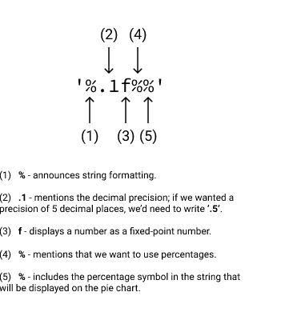

作者照片

我们可以在下面展示它如何寻找精度值为 2 的`‘Pos’` 变量。

```
wnba[‘Pos’].value_counts().plot.pie(figsize = (6,6), autopct = ‘%.2f%%’)
```

输出:

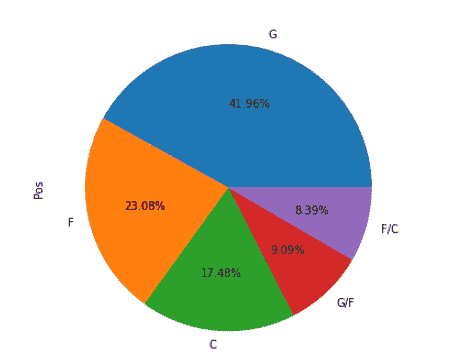

## ***为频率分布直方图***

频率分布显示一组数据中每个不同值出现的频率。直方图是最广泛使用的可视化频率分布的技术。它看起来像一个条形图，但有明显的区别。

*   ***我们为什么要用直方图？***

当在*区间和*比例范围内测量变量属性时，详细描述分布。让我们用一个真实的例子来理解这个事实。

让我们使用`‘PTS’ (total points )`,它是在比率标尺上测量的。

```
print(wnba[‘PTS’].describe())
```

输出:

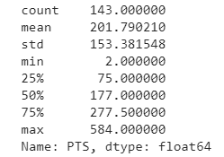

作者照片

如果我们试图分析上面的图表，我们会发现 75%的变量分布在一个相对狭窄的区间内。剩下的 25%分布在相对较大的区间内。为了形象化这一事实，我们必须画一张图来立即显示分布情况。

*   ***如何生成直方图***

我们可以使用`Series.plot.hist()` [方法](https://pandas.pydata.org/pandas-docs/stable/generated/pandas.Series.plot.hist.html)生成一个直方图。我们可以在数据集中的`‘PTS’(total points)`列上应用该方法。

```
wnba[‘PTS’].plot.hist()
```

输出:

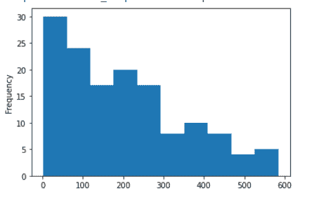

作者照片

*   ***如何自定义直方图***

有时候，你必须创建一个固定数量的条，比如 2，5，10，20，30。如果您想在直方图中为一个`‘PTS’`变量创建 5 个条形，幕后会发生什么？以下步骤将有助于您的工作。

(I)为具有 5 个类别间隔的`‘PTS’`变量生成分组频率分布表。

(ii)对于每个课堂间隔，绘制一个高度与间隔频率相对应的条形图。

```
print(wnba[‘PTS’].value_counts(bins = 5).sort_index())
```

输出:

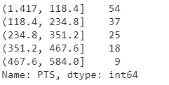

作者照片

这里，箱参数表示类间隔的数量。

现在，我们尝试借助直方图来表示数据。

```
wnba[‘PTS’].plot.hist(bins=5)
```

输出:

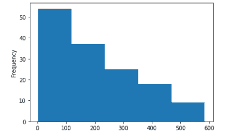

作者照片

您还可以使用 numpy 的`arange()` [函数](https://docs.scipy.org/doc/numpy/reference/generated/numpy.arange.html?highlight=arange#numpy.arange)来生成用于绘制特定范围和间隔的频率的值，使用网格参数来清楚地理解条形，使用 rot 参数来获得更好的可读性。

```
from numpy import arange
wnba[‘PTS’].plot.hist(grid = True, xticks = arange(2,585,58.2), rot = 30)
```

输出:

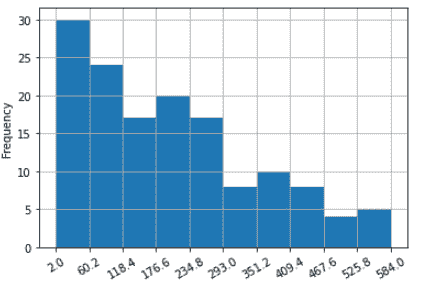

作者照片

如果你分析图表，你可以找到你想要看到的模式。我们可以看到，75%的值在 2–277 之间，其余的值分布在 277–584 之间。所以图是偏左的(**偏态分布)，**我们会在文章的字母部分了解一下。

## 偏斜频率分布

偏斜分布是一条尾巴比另一条长。这些分布有时被称为不对称或不对称分布。*两种类型的偏态分布*

(一) [**右偏分布**](https://www.statisticshowto.com/probability-and-statistics/skewed-distribution/#SkewRight)

如果尾部指向右侧，则称分布为**右偏**。

(二) [**左偏分布**](https://www.statisticshowto.com/probability-and-statistics/skewed-distribution/#SkewLeft)

如果尾部指向左侧，则称分布为**左偏**。

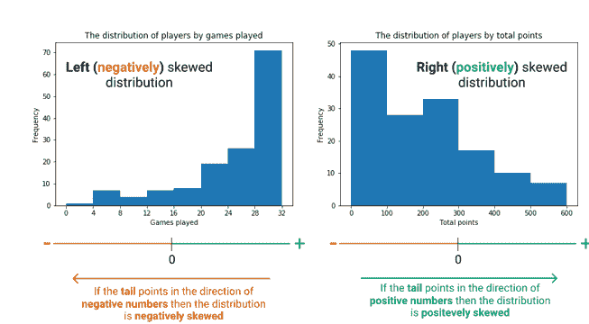

作者照片

## **对称分布**

当均值两边的分布是另一边的镜像时，称该分布是对称的。

一种非常常见的对称分布是直方图中间值高，频率向两端逐渐降低。这种模式也称为正态分布。

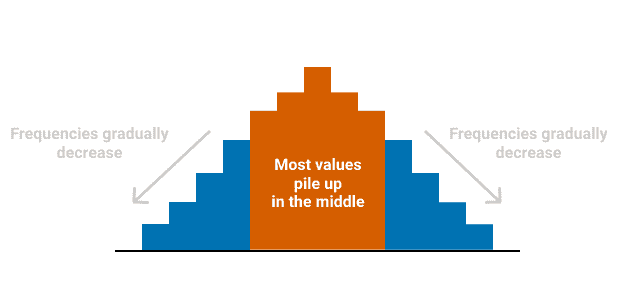

作者照片


[M](https://unsplash.com/@lamerbrain?utm_source=medium&utm_medium=referral) 在 [Unsplash](https://unsplash.com?utm_source=medium&utm_medium=referral) 上拍照

## 结论

在整篇文章中，我们试图了解可视化频率分布的技术。然而，当变量以名义或顺序尺度来衡量时，我们应该使用条形图或饼图。但是，如果变量是在一个区间或比率尺度上测量的，那么我们必须使用直方图。

如果你是数据科学爱好者，请与我保持联系。我很快会带着另一篇有趣的文章回来。如果你喜欢这篇文章，别忘了加上一些掌声。

## ***数据科学统计系列文章***

1.  [*少即是多；采样的‘艺术’(Stat-01)*](/less-is-more-the-art-of-sampling-dda8b59d399?source=your_stories_page-------------------------------------)
2.  [*熟悉数据科学最重要的武器~变量(Stat-02)*](/get-familiar-with-the-most-important-weapon-of-data-science-variables-48cc7cd85dc5?source=your_stories_page-------------------------------------)
3.  [*要提高数据分析能力，您必须了解频率分布(Stat-03)*](/to-increase-data-analysing-power-you-must-know-frequency-distribution-afa438c3e7a4?source=your_stories_page-------------------------------------)
4.  [*通过可视化频率分布找到数据集的模式(Stat-04)*](/find-the-patterns-of-a-dataset-by-visualizing-frequency-distribution-c5718ab1f2c2?source=your_stories_page-------------------------------------)
5.  [*比较多个频率分布，从数据集中提取有价值的信息(Stat-05)*](/compare-multiple-frequency-distributions-to-extract-valuable-information-from-a-dataset-10cba801f07b?source=your_stories_page-------------------------------------)
6.  [*通过简短的讨论消除你对均值的误解(Stat-06)*](https://medium.datadriveninvestor.com/eliminate-your-misconception-about-mean-with-a-brief-discussion-a9fed67d4b08?source=your_stories_page-------------------------------------)
7.  <https://medium.datadriveninvestor.com/increase-your-data-science-model-efficiency-with-normalization-918484b4626f?source=your_stories_page------------------------------------->
8.  *[*数据科学基础概率概念(Stat-08)*](/basic-probability-concepts-for-data-science-eb8e08c9ad92?source=your_stories_page-------------------------------------)*
9.  *[*从朴素贝叶斯定理到朴素贝叶斯分类器的路线图(Stat-09)*](/road-map-from-naive-bayes-theorem-to-naive-bayes-classifier-6395fc6d5d2a?source=your_stories_page-------------------------------------)*
10.  *[*数据科学爱好者需要了解的假设检验(Stat-10)*](https://medium.datadriveninvestor.com/all-you-need-to-know-about-hypothesis-testing-for-data-science-enthusiasts-30cfe1dce028?source=your_stories_page-------------------------------------)*
11.  *[*用 ANOVA 进行多组间的统计比较(Stat-11)*](/statistical-comparison-among-multiple-groups-with-anova-d4ac27f6e59e?source=your_stories_page-------------------------------------)*
12.  *[*用卡方检验比较分类变量的依赖性(Stat-12)*](/compare-dependency-of-categorical-variables-with-chi-square-test-982baff64e81?source=your_stories_page-------------------------------------)*