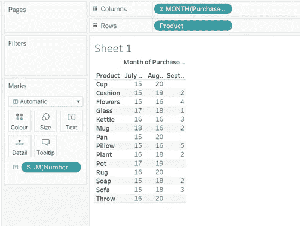
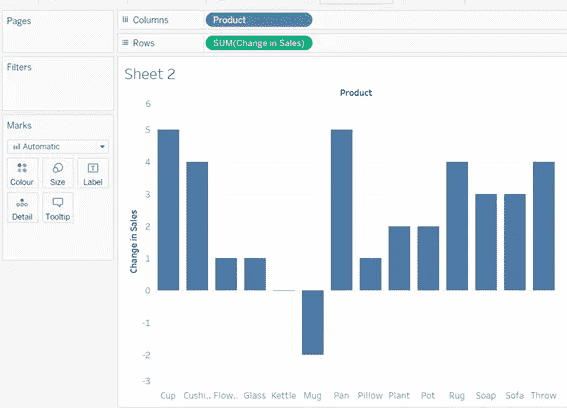
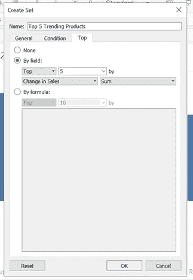
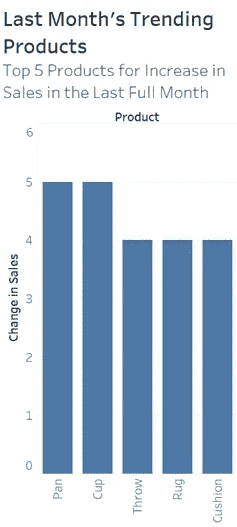
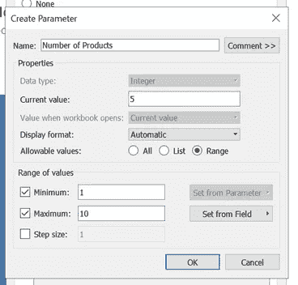
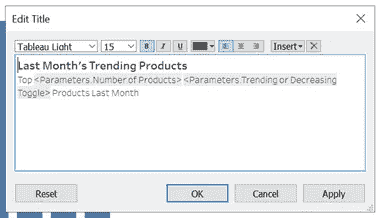
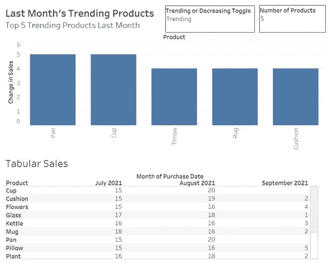

# 使用 Tableau 每月查找热门产品

> 原文：<https://towardsdatascience.com/find-trending-products-each-month-using-tableau-85c1d9a76314?source=collection_archive---------28----------------------->

## 如何使用详细程度计算来选择和显示每月增加最多的销售额

假设您销售大量产品，并希望了解哪些产品的销售额增长最快。在 Tableau 中使用快速表格计算很容易做到这一点:计算差额，按大小排序，去掉除最大数字以外的所有内容。但是，如果您想要一个每月自动完成这项工作的仪表板，该怎么办呢？


作者使用照片提供图片(左)安娜·邦达伦科在[像素上的照片](https://www.pexels.com/photo/colorful-plastic-toy-8148534/) |(右)卢卡斯在[像素上的照片](https://www.pexels.com/photo/person-holding-pen-pointing-at-graph-590020/)

最近有人要求我这么做，但我找不到任何讨论类似问题的文章，所以想分享我用来创造观想的解决方案。在本文中，我将创建一个图表，自动选择上个月销售额增长最大的五种产品，并可视化这种变化。这是写给以前做过 Tableau 的人的，定位在初级/中级水平。

我不会分享我的完整玩具数据集，但我已经包括了下面的前几行给你一个想法。它包括每个销售的一行，带有日期/日期时间和产品字段。自然，真实的销售数据集将包含更多的信息，但这对我们的目的来说已经足够了。

```
+---------+---------------+
| Product | Purchase Date |
+---------+---------------+
| Glass   | 23/08/21      |
| Mug     | 02/07/21      |
| Plants  | 31/08/21      |
| Rug     | 04/09/21      |
+---------+---------------+
```

一旦将 Tableau 连接到数据，就可以开始将正在使用的日期字段拖放到列中，将产品字段拖放到行中，将记录数拖放到文本标记中。您可能需要编辑列中的日期药丸以显示连续的月份。



(*图片作者*)

这种数据的表格视图可能有助于向用户展示其本身，但也有助于验证您的计算。虽然我使用的是平面文件，但我模拟了一个包含九月份部分数据的实时数据连接。本文假设，因为这只是部分数据，所以还不感兴趣，并着眼于 7 月和 8 月之间的变化。

创建一个新的工作表来计算和显示每月的变化。为了计算上一个整月与其前一个整月之间的差异，我们需要创建一个计算字段。特别是详细程度的计算。Tableau 对它们有很好的解释[这里是](https://help.tableau.com/current/pro/desktop/en-us/calculations_calculatedfields_lod.htm)，但是本质上它们允许你在不同的细节层次上计算值。在这种情况下，我们希望了解每个产品的变化，因此我们希望在产品级别进行计算。如下所示创建计算字段。

```
//calculates change in sales per product between last two months
{fixed [Product]:
    COUNT(IIF(DATEDIFF('month',[Purchase Date],TODAY())=1,
        [Product],NULL)) - 
    COUNT(IIF(DATEDIFF('month',[Purchase Date],TODAY())=2,
        [Product],NULL))
```

注意这个函数中注释的使用；对于像这样的长时间计算，这些总是可取的。此计算将计算上个月和上个月购买日期的行数之间的差异，所有这些都是按产品计算的。通过要求 Datediff 函数等于 1，可以从当前月份中筛选出任何值。

创建该字段并将其命名为“销售额变化”之后，您可以创建一个如下图所示的图表。在这个阶段，您可以根据表 1 中的表格验证 LOD 计算的变化值。



(*图片作者*)

下一步是让 Tableau 选择销售变化最大的产品。在维中，右键单击产品字段，然后选择创建>设置。在弹出窗口中，选择顶部选项卡，选择“按字段”并使用您创建的 LOD 计算作为选择依据的变量，确保聚合设置为 Sum。在本例中，我们选择了查看前 5 名。



(*图片作者*)

一旦您创建了这个集合，进入过滤器并选择。这应该会过滤掉前两个月中销售额变化最大的五种产品。因为用于创建动态集的 LOD 计算是用来查找与今天的日期相比最近的月份的，所以这前 5 个将每月更新一次。



(*图片作者*)

当然，这是一个非常简单的例子和一个非常简单的图表，但它展示了这些销售趋势计算的能力。这方面的一些细微变化包括希望看到销售额下降最多的产品(使用上面的方法实现，但在创建集合时在“按字段”选项中选择底部而不是顶部)，或者希望看到总体变化最大的产品(在用于创建集合的 LOD 计算周围添加 ABS()函数，但在显示值时使用与上面相同的计算)。

为了给图表添加一些更加用户友好的功能，我们可以为用户提供他们想要看到多少趋势产品的选项。为此，在创建集合时，单击下拉菜单 5，选择“创建新参数”并创建一个名为“产品数量”的参数。确保参数设置为显示参数控制。



(*图片作者*)

我们还可以使用参数的力量来允许用户选择他们是看到表现最好的产品还是表现最差的产品。为此，首先创建两个集合，一个选择排名靠前的产品(例如“排名靠前的产品”)，另一个选择排名靠后的产品(排名靠后的产品)。然后，我们创建一个数据类型为 String 的参数，并赋予它两个可能的值“Trending”和“Decreasing”。


(*图片作者*)

然后创建一个使用 CASE()的计算字段，以允许参数选择来确定使用哪个集合。按照下面的代码块创建该字段，将该字段转换为维度，将其作为唯一的筛选器添加到工作表中，并在出现提示时选择 1。

```
//toggles which set to apply based on parameter selection
CASE [Trending or Decreasing Toggle]
    WHEN 'Trending' THEN INT([Top Trending Products])
    WHEN 'Decreasing' THEN INT([Top Decreasing Products])
END
```

您可能需要编辑视觉效果的标题，以包含正在使用的参数。特别是如果你允许用户选择他们看到的是增加还是减少的销售，有一个非反应性的标题可能会令人困惑。



(*图片作者*)

显然，你可以利用这些计算来创建更复杂的视觉效果，但是我们可以将上面创建的所有东西结合起来，创建一个如下图所示的仪表板。



(*图片作者*)

在这篇文章中，我以销售为例，这并不是我最初的图表所要表达的，但这是讨论我所做工作的一种简单方式。这方面的一些其他用例可能希望看到动物行为、员工表现甚至股票价格的变化。

最终，当用户面对迅速变得普遍的大规模数据时，仪表板和报告需要能够只提取最重要的趋势。通过减少甚至消除分析师做这件事所花费的时间，我们可以专注于发现事情背后的原因。