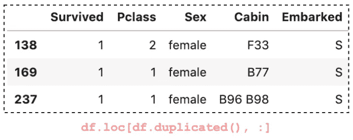

# 在 Pandas 数据帧中查找和删除重复行

> 原文：<https://towardsdatascience.com/finding-and-removing-duplicate-rows-in-pandas-dataframe-c6117668631f?source=collection_archive---------0----------------------->

## 熊猫帮助你开始数据分析的提示和技巧


Susan Q Yin 在 [Unsplash](/s/photos/book?utm_source=unsplash&utm_medium=referral&utm_content=creditCopyText) 上拍摄的照片

在数据预处理和分析中，您经常需要弄清楚是否有重复的数据以及如何处理它们。

在本文中，您将学习两种方法，`duplicated()`和`drop_duplicates()`，用于查找和删除重复行，以及如何修改它们的行为以满足您的特定需求。这篇文章的结构如下:

1.  查找重复行
2.  计算重复行和非重复行
3.  用`loc`提取重复行
4.  确定用`keep`标记哪些重复
5.  删除重复的行

为了演示，我们将使用 Kaggle 上可用的 [Titanic 数据集](https://www.kaggle.com/c/titanic/overview)的子集。

```
import pandas as pddef load_data(): 
    df_all = pd.read_csv('train.csv')
    # Take a subset
    return df_all.loc[:300, **['Survived', 'Pclass', 'Sex', 'Cabin', 'Embarked']**].dropna()df = load_data()
```


作者图片

源代码请查看[笔记本](https://github.com/BindiChen/machine-learning/blob/master/data-analysis/034-pandas-find-and-remove-duplicates/pandas-duplicates.ipynb)。

# 1.查找重复行

要在特定的列上查找重复项，我们可以简单地在该列上调用`duplicated()`方法。

```
>>> df.Cabin.**duplicated()**0      False
1      False
9      False
10     False
14     False
       ...  
271    False
278    False
286    False
299    False
300    False
Name: Cabin, Length: 80, dtype: bool
```

结果是一个布尔序列，值`True`表示重复。换句话说，值`True`意味着该条目与前一个条目相同。

要从整体上查看数据帧中的副本，只需在数据帧上调用`duplicated()`方法。如果整行与前一行相同，则输出`True`。

```
>>> df**.duplicated()**0      False
1      False
9      False
10     False
14     False
       ...  
271    False
278    False
286    False
299    False
300    False
Length: 80, dtype: bool
```

为了识别重复的列，我们可以将一个列列表传递给参数`subset`:

```
>>> df.duplicated(**subset=['Survived', 'Pclass', 'Sex']**)0      False
1      False
9      False
10      True
14      True
       ...  
271     True
278     True
286     True
299     True
300     True
Length: 80, dtype: bool
```

# 2.计算重复和非重复

`duplicated()`的结果是一个布尔序列，我们可以将它们相加来计算重复的次数。在主题后面，`True`被转换为`1`，而`False`被转换为`0`，然后将它们相加。

```
# Count duplicate on a column
>>> df.**Cabin.duplicated().sum()** 11
```

就像以前一样，我们可以计算数据帧和某些列中的重复数据。

```
# Count duplicate in a DataFrame
>>> df.**duplicated().sum()** 3# Count duplicate on certain columns
>>> df.**duplicated(subset=['Survived', 'Pclass', 'Sex']).sum()** 70
```

如果想统计不重复的个数(`False`的个数)，可以用否定(`~`)反过来，然后调用`sum()`:

```
# Count the number of non-duplicates
>>> (**~df.duplicated()**).sum()
77
```

# 3.用`loc`提取重复行

熊猫`duplicated()`返回一个布尔型序列。然而，当我们需要执行一些数据分析时，看到一个`True`和`False`的列表是不实际的。

我们可以用数据选择器来提取那些重复的行:

```
# Extract duplicate rows
df.**loc[df.duplicated(), :]**
```



作者图片

`loc`可以接受一个布尔序列，并根据`True`和`False`过滤数据。第一个参数`df.duplicated()`将查找由`duplicated()`标识的行。第二个参数`:`将显示所有列。

# 4.确定用`keep`标记哪些重复项

在熊猫`duplicated()`中有一个争论`keep`来决定标记哪些副本。`keep`默认为`'first'`，这意味着第一个出现的被保留，所有其他的被识别为重复。

我们可以将其更改为`'last'`保留最后一次出现的内容，并将所有其他内容标记为重复。


作者图片

我们可以使用第三种选择`keep=False`。它将所有重复标记为`True`，并允许我们查看所有重复的行。


作者图片

# 5.删除重复的行

我们可以使用 Pandas 内置方法`drop_duplicates()`来删除重复的行。

```
df.**drop_duplicates()**
```


作者图片

请注意，我们开始时是 80 行，现在是 77 行。默认情况下，此方法返回删除了重复行的新数据帧。我们可以设置参数`inplace=True`来删除原始数据帧中的重复数据。

```
df.drop_duplicates(**inplace=True**)
```

## 确定要保留哪个副本

也可以为`drop_duplicates()`设置参数`keep`,以确定保留哪些副本。默认为`'first'`保留第一次出现的内容，并删除所有其他重复的内容。

类似地，我们可以将`keep`设置为`'last'`来保留最后一次出现的内容，并删除其他重复的内容。

```
# Use keep='last' to keep the last occurrence 
df.drop_duplicates(**keep='last'**)
```

我们可以将`keep`设置为`False`来删除所有重复的内容。

```
# To drop all duplicates
df.drop_duplicates(**keep=False**)
```

## 考虑删除重复的某些列

类似地，为了考虑删除重复的某些列，我们可以将一个列列表传递给参数`subset`:

```
# Considering certain columns for dropping duplicates
df.drop_duplicates(**subset=['Survived', 'Pclass', 'Sex']**)
```

# 结论

熊猫`duplicated()`和`drop_duplicates()`是查找和删除重复的两种快速便捷的方法。了解它们很重要，因为我们经常需要在数据预处理和分析中使用它们。

我希望这篇文章能帮助你节省学习熊猫的时间。我建议你查看一下`duplicated()`和`drop_duplicates()` API 的文档，并了解你可以做的其他事情。

感谢阅读。请查看[笔记本](https://github.com/BindiChen/machine-learning/blob/master/data-analysis/034-pandas-find-and-remove-duplicates/pandas-duplicates.ipynb)获取源代码，如果您对机器学习的实用方面感兴趣，请继续关注。

## 你可能会对我的其他一些熊猫文章感兴趣:

*   [所有熊猫切()你应该知道把数值数据转换成分类数据](/all-pandas-cut-you-should-know-for-transforming-numerical-data-into-categorical-data-1370cf7f4c4f)
*   [使用熊猫方法链接提高代码可读性](https://medium.com/@bindiatwork/using-pandas-method-chaining-to-improve-code-readability-d8517c5626ac)
*   [如何对熊猫数据帧进行自定义排序](/how-to-do-a-custom-sort-on-pandas-dataframe-ac18e7ea5320)
*   [为了数据分析你应该知道的所有熊猫移位()](/all-the-pandas-shift-you-should-know-for-data-analysis-791c1692b5e)
*   [何时使用 Pandas transform()函数](/when-to-use-pandas-transform-function-df8861aa0dcf)
*   [你应该知道的熊猫串联()招数](/pandas-concat-tricks-you-should-know-to-speed-up-your-data-analysis-cd3d4fdfe6dd)
*   [Pandas 中 apply()和 transform()的区别](https://medium.com/@bindiatwork/difference-between-apply-and-transform-in-pandas-242e5cf32705)
*   [所有熊猫合并()你应该知道](/all-the-pandas-merge-you-should-know-for-combining-datasets-526b9ecaf184)
*   [在 Pandas 数据帧中处理日期时间](/working-with-datetime-in-pandas-dataframe-663f7af6c587)
*   [熊猫阅读 _csv()你应该知道的招数](https://medium.com/@bindiatwork/all-the-pandas-read-csv-you-should-know-to-speed-up-your-data-analysis-1e16fe1039f3)
*   [你应该知道的用熊猫 read_csv()](/4-tricks-you-should-know-to-parse-date-columns-with-pandas-read-csv-27355bb2ad0e) 解析日期列的 4 个技巧

更多教程可以在我的 [Github](https://github.com/BindiChen/machine-learning) 上找到