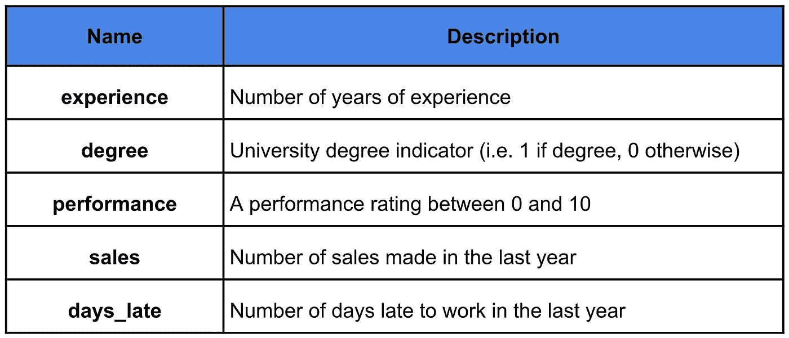

# 发现和可视化交互

> 原文：<https://towardsdatascience.com/finding-and-visualising-interactions-14d54a69da7c?source=collection_archive---------8----------------------->

## 使用特征重要性、弗里德曼的 H-统计量和 ICE 图分析相互作用

药物的副作用取决于你的性别。与不吸烟者相比，吸烟者吸入石棉会增加患肺癌的几率。如果你更温和/自由，你对气候变化的接受程度往往会随着教育水平的提高而提高。对于最保守的人来说，情况正好相反。这些都是数据交互的例子。识别和合并这些可以极大地提高准确性并改变对模型的解释。

在本文中，我们探索了分析数据集中交互的不同方法。我们讨论如何使用散点图和冰图来可视化它们。然后我们继续寻找/强调潜在互动的方法。这些包括特征重要性和弗里德曼的 H 统计。你可以在 [GitHub](https://github.com/conorosully/medium-articles) 上找到用于这个分析的 R 代码。在我们开始之前，有必要解释一下交互的确切含义。

# 什么是交互？

当一个特征与目标变量有某种关系时，我们说它是可预测的。例如，汽车的价格可能会随着车龄的增长而降低。年龄(特征)可在模型中用于预测汽车价格(目标变量)。在某些情况下，目标变量和特征之间的关系取决于另一个特征的值。这被称为特征之间的相互作用。

以图 1 中年龄和汽车价格之间的关系为例。这里我们有第二个特征——汽车类型。一辆车既可以是老爷车(经典=1)，也可以只是普通车(经典=0)。对于普通汽车来说，价格随着车龄的增长而下降，但是对于老爷车来说，车龄实际上增加了它们的价值。价格和车龄的关系取决于车型。换句话说，年龄和车型是有交互作用的。

图 1:汽车价格交互示例

整合这样的交互可以提高我们模型的准确性。非线性模型，如随机森林，可以自动模拟相互作用。我们可以简单地包括年龄和汽车类型作为特征，模型会将交互作用纳入其预测中。对于线性模型，像线性回归，我们必须添加[显式交互项。](https://stattrek.com/multiple-regression/interaction.aspx)要做到这一点，我们首先需要知道我们的数据中存在哪些交互作用。

# 资料组

为了解释这些技术，我们随机生成了一个包含 1000 行的数据集。数据集包括表 1 中列出的 5 个要素。这些用于预测员工的年度奖金。我们设计了数据集，因此体验和程度之间以及业绩和销售之间存在互动。days_late 不与任何其他功能交互。

表 1:随机生成的数据集中的字段

由于相关特征的性质，这两种交互是不同的。程度是绝对的，经验是连续的。所以，我们有一个分类和连续特征之间的相互作用。对于另一个相互作用，我们有两个连续的特征。我们会看到，我们仍然以同样的方式分析这些相互作用。

# 可视化交互

我们可以从使用简单的散点图来可视化这些相互作用开始。在图 2 中，我们看到了经验和程度之间的相互作用。如果员工有学位，他们的奖金会随着经验的增加而增加。相比之下，当员工没有学位时，这些特征之间没有关系。如果这是一个真实的数据集，我们希望对此有一个直观的解释。例如，受过教育的员工可能会承担更看重经验的角色。

图 2:学位-体验互动散点图

同样，我们可以在图 3 中看到销售和绩效之间的相互作用。这种情况下，可能就不那么清楚了。我们现在有一个渐变配色方案，其中较暗的点表示较低的性能评级。一般来说，奖金会随着销售额的增加而增加。仔细观察，你会发现较亮的点有一个较陡的斜率。对于更高的绩效评分，销售额的增加会带来更大的奖金增长。

图 3:销售-绩效互动散点图

以这种方式可视化交互可能很直观，但并不总是奏效。我们只可视化目标变量和两个特征之间的关系。实际上，目标变量可能与许多特征有关系。这一点以及统计变化的存在意味着散点图点将围绕潜在趋势展开。我们已经可以在上面的图表中看到这一点，在真实的数据集中，情况会更糟。最终，为了清楚地看到交互作用，我们需要剔除其他特征和统计变量的影响。

## 冰原

这就把我们带到了个体条件期望(ICE)图。要创建冰图，我们首先要根据数据拟合模型。在我们的例子中，我们使用了一个有 100 棵树的随机森林。在表 2 中，我们的数据集中有两行用于训练模型。在最后一列中，我们可以看到每个雇员的预测奖金。这是随机森林在给定特征值的情况下做出的预测。为了创建冰图，我们改变一个特征的值，同时保持其他特征不变，并绘制结果预测。

表 2:员工奖金预测示例

查看图 4，这可能更有意义。这里我们在表 2 中取了两个雇员。我们绘制了 days_late 的每个可能值的预测奖金，同时保持其他特性的原始值。(即第一名和第二名员工的工作经验将分别保持在 31 年和 35 年)。两个黑点对应于表 2 中的实际预测值(即它们的真实天数 _ 延迟值)。

图 days _ late 的示例 ICE 图

最后，为了获得 ICE 图，我们对数据集中的每一行都执行这个过程。我们还将每条线居中，使它们在 y 轴上从 0 开始。粗线给出了所谓的[部分依赖图](https://christophm.github.io/interpretable-ml-book/pdp.html) (PDP)。这是每个 days_late 值的平均部分 yhat(居中)值。查看 PDP，随着 days_late 的增加，预计奖金会减少。我们也可以看到，大部分的个体预测都遵循这个趋势。如果 days_late 与另一个特性进行了交互，我们不会想到这一点。我们会有几组不同趋势的预测。

图 days _ late 的居中冰图

您可以通过查看图 6 中的 ICE 图来了解我们的意思。这里有两种截然不同的趋势。那些预测奖金会随着经验增加的员工和那些不会随着经验增加的员工。通过按程度给图着色(即蓝色代表程度，红色代表其他)，你可以清楚地看到这是由于经验和程度之间的相互作用。

图 6:学位-经验冰图

我们可以为销售-绩效互动创建一个类似的图表。此处，如果员工的绩效评分高于 5，则该线为蓝色，如果低于 5，则为红色。所有员工的预期奖金都会增加，但绩效评分较低的员工增加速度较慢。对于这两个冰图，相互作用比使用相应的散点图时更清楚。

图 7:销售业绩冰图

这些图非常强大，因为通过保持其他特征值不变，我们可以专注于一个特征的趋势。这就是预测如何因这一特征的变化而变化。此外，随机森林将对数据中的潜在趋势进行建模，并使用这些趋势进行预测。因此，当我们绘制预测图时，我们能够剔除统计变化的影响。

## 最大限度地利用 ICE 地块

我们使用了随机森林，但冰图实际上是一种模型不可知的技术。这意味着我们可以在创建它们时使用任何模型。但是，模型应该是非线性的(即 XGBoost，神经网络)。线性模型不能以创建这些图所必需的方式来模拟相互作用。模型的选择并不重要，但是根据数据集的不同，不同的模型可能更能捕捉到潜在的交互。

你使用的模型的准确性也不是那么重要。目标是可视化交互，而不是做出准确的预测。然而，你的模型越好，你的分析就越可靠。欠拟合的模型可能无法捕捉交互，而过拟合的模型可能呈现实际上不存在的交互。最后，使用 k-fold 交叉验证或测试集来测试您的模型是很重要的。例如，您可以在图 8 中看到我们随机森林的预测奖金值与实际奖金值的对比图。这个模型并不完美，但我们能够捕捉到潜在的趋势。

图 8:测试集的准确性

仅仅使用冰图可能不足以发现相互作用。根据数据集的大小，可能的交互数量可能会很大。例如，如果你有 20 个特征，你将有 174 个可能的成对交互。想象并试图分析所有这些冰图将是极其乏味的。所以我们需要一种突出/缩小搜索范围的方法。在本文的其余部分，我们将讨论如何使用特征重要性、Friedman 的 H 统计和领域知识来实现这一点。

# 寻找互动

## 特征重要性

特征重要性是基于特定特征在多大程度上提高了模型准确性的分数。如果我们在数据集中包含交互术语，我们可以计算这些术语的特征重要性。我们通过添加每个特征的成对乘积(即经验*程度)来实现这一点。然后，我们使用所有交互特征训练模型，并计算结果特征重要性。

在图 9 中，您可以看到 10 个交互特性和 5 个原始特性的特性重要性。这里，我们使用随机森林作为我们的模型，MSE 的百分比增长作为我们的特征重要性分数。我们可以看到，体验度和销售绩效交互术语都具有最高的重要性。这表明这些术语之间存在相互作用。

图 9:交互特性的重要性

您可能还会注意到，其他一些互动术语也很重要(例如，体验、销售)。我们没有预料到这一点，因为在生成数据集时，我们没有包括这两个特征之间的交互。下面的图 10 有助于解释为什么我们会得到这个结果。请注意，经验和销售都与奖金有正相关关系。这意味着这些特征的乘积具有正相关关系。

图 10:体验、销售和体验、销售散点图

这突出了这种方法的缺点。特征对预测的影响可以分为两个部分。第一个是它对预测的直接影响(即主要影响)。第二种是它通过与其他特征的相互作用而产生的效应(即相互作用效应)。由于这两个独立功能的主要影响，experience.sales 交互术语具有很高的功能重要性。因此，我们需要一种方法来将交互效应从主效应中分离出来。

## 弗里德曼的 H 统计量

弗里德曼的 H-statistics 正是这么做的。为了给出如何计算的概述，我们从拟合模型开始。在我们的例子中，我们使用了与创建 ICE 地块相同的随机森林。然后，我们将观察到的部分相关函数与假设没有相互作用的部分相关函数进行比较。这两种功能的巨大差异表明存在相互作用。

该统计数据有两种版本。第一种通过与**所有**其他功能的交互来衡量功能的效果。您可以在图 11 中看到这个统计值。值为 1 表示某个特征仅通过交互作用对预测产生影响(即没有主要影响)。值为 0 表示没有交互(即只有主效果)。就经验而言，我们的 H 统计值为 0.28。我们可以把这理解为 28%的体验效果来自于这个特征与其他特征的相互作用。

图 11:总体 h 统计量

H 统计的第二个版本给出了两个特征之间的相互作用的度量。图 12 中的第一个图表给出了体验和其他特征的 H 统计量。我们可以看到，学位和经验之间的相互作用是最重要的。类似地，第二个图表给出了销售的 H 统计。同样，正如预期的那样，我们可以看到与性能的交互是最重要的。

图 12:经验和销售个人 h 统计

其思想是首先使用总体 H 统计量来了解哪些特征具有交互作用。然后，我们可以使用第二个 H-statistic 的图表来识别它们正在交互的其他特征。没有完美的统计数据，这个过程也不总是有效的。你可以看到销售的整体 H 统计值相当低。才 0.11。这接近没有交互的 days_late 的 H 统计量。因此，按照这个流程，我们可能已经决定不进一步分析销售，错过了互动。

## 领域知识

正如我们在上面看到的，仅仅依靠这些方法，我们可能会错过一些交互或者识别出实际上并不存在的交互。这就是为什么将你所拥有的任何领域知识融入到过程中是很重要的。你可能已经知道了一些可以用这些技术来确认的相互作用。你还应该对发现的任何新的交互进行感知检查。他们应该对自己存在的原因有一个直观的解释。希望通过使用领域知识和这些统计技术的结合，您能够找到一些有用的交互。

## 成为推荐会员

如果你觉得这篇文章很有帮助并且想看更多，你可以成为我的 [**推荐会员**](https://conorosullyds.medium.com/membership) 来支持我

## 图像来源

所有图片均为本人或从 www.flaticon.com[获得。在后者的情况下，我拥有他们的](http://www.flaticon.com/)[高级计划](https://support.flaticon.com/hc/en-us/articles/202798201-What-are-Flaticon-Premium-licenses-)中定义的“完全许可”。

## 参考

[1] A. Goldstein 等人，窥视黑盒内部:用个体条件期望图可视化统计学习(2014)，[https://arxiv.org/pdf/1309.6392.pdf](https://arxiv.org/pdf/1309.6392.pdf)

[2] C. Molnar，可解释机器学习(2021)[https://christophm . github . io/interaction-ml-book/html](https://christophm.github.io/interpretable-ml-book/interaction.html)

[3]互动(统计)(2021)，[https://en . Wikipedia . org/wiki/Interaction _(统计)](https://en.wikipedia.org/wiki/Interaction_(statistics))

[4] Stat Trek，回归中的相互作用效应(2021)，[https://stattrek.com/multiple-regression/interaction.aspx](https://stattrek.com/multiple-regression/interaction.aspx)