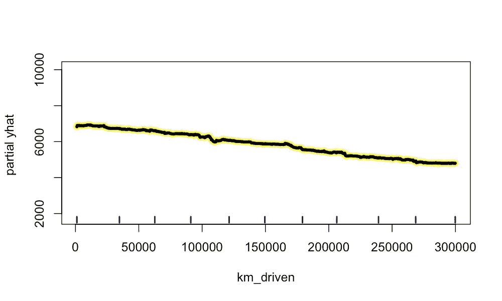

# 发现并可视化非线性关系

> 原文：<https://towardsdatascience.com/finding-and-visualising-non-linear-relationships-4ecd63a43e7e?source=collection_archive---------1----------------------->

## [实践教程](https://towardsdatascience.com/tagged/hands-on-tutorials)

## 用部分相关图(PDP)、互信息和特征重要性分析非线性关系

来源:作者

当你第一次开始开车时，你缺乏经验，有时会更加鲁莽。随着年龄的增长，你获得了更多的经验(和感觉),你卷入事故的可能性变得越来越小(T2)。然而，这种趋势不会永远持续下去。当你上了年纪，你的视力可能会下降，或者你的反应可能会变慢。现在，随着年龄的增长，你卷入事故的可能性越来越大**。这意味着事故的概率与年龄成非线性关系。找到并合并这样的关系可以提高模型的准确性和解释能力。**

来源:flaticon

在本文中，我们将深入非线性关系。我们将探索如何使用散点图和部分相关图(PDP)来可视化它们。然后，我们将继续探讨突出显示数据中潜在非线性关系的方法。这些包括像特征重要性和交互信息这样的度量。你可以在 [GitHub](https://github.com/conorosully/medium-articles) 上找到用于这个分析的 R 代码。在我们开始之前，有必要解释一下非线性关系的确切含义。

# 什么是非线性关系？

图 1:线性关系的例子

如果两个变量有线性关系，我们可以用一条直线来概括这种关系。该线可以有正斜率或负斜率，但斜率将始终保持不变。您可以在图 1 中看到一个例子。在这种情况下，我们有一个正的线性关系。从另一个角度来看，变量 X 的增加会导致 Y 的增加，不管 X 的初始值是多少。

另一方面，对于**非线性**关系，由于变量 X 的变化而导致的变量 Y 的变化将取决于 X 的初始值。您可以在图 2 中看到一些例子。上面给出的年龄-事故关系可以是二次的。也就是说，随着年龄的增长，事故发生的概率先降低后升高。归根结底，任何不能用直线概括的关系都是非线性关系。准确地说，这些也包括互动，但是我们在另一篇[文章](/finding-and-visualising-interactions-14d54a69da7c)中关注这些类型的关系。

图 2:非线性关系的例子

非线性模型，如随机森林和神经网络，可以自动模拟上述非线性关系。如果我们想使用线性模型，比如线性回归，我们首先要做一些特征工程。例如，我们可以向数据集添加年龄来捕捉二次关系。为了进行更有效的特征工程，首先在我们的数据中找到这些关系是有帮助的。

# 资料组

为了帮助解释我们如何找到这些关系，我们将使用一个随机生成的数据集。您可以在表 1 中看到特性列表，其中**价格** 是我们的目标变量。我们将尝试使用这 4 个特征来预测二手车的价格。数据集已经被设计成使得**车龄**和**修理**与**价格**具有非线性关系。而 **km_driven** 具有线性关系，而 **owner_age** 没有关系。

表 1:随机生成的数据集中的字段

你可以在图 3 的散点图中看到我们的意思。这里我们可以看到这两个特征之间的非线性关系。如果这是一个真实的数据集，我们可以期待一些直观的原因。例如，汽车的价格随着年龄的增长而下降是有道理的，但是为什么它会开始上涨呢？也许大部分老爷车都是经典的\有收藏价值的车，所以价格会随着车龄的增长而上涨。

图 3:非线性关系散点图

我们可以为**修复**功能提出类似的叙述。这是汽车接受服务或维修的次数。在它的一生中，它是正常的日常服务。因此，该特性的小值可能表示汽车被忽略了。另一方面，较大的值可能表明汽车需要这些标准服务之外的额外维修。这些车将来可能会给新车主带来更多问题。

您可以在图 4 中看到剩余的关系。如前所述**车主 _ 年龄**，与**价格**无关。我们可以在图表中看到这一点，因为这些点是随机分布的。我们还可以看到 **km_driven** 与**价格**成负线性关系。我们包括了这些，因为它将有助于比较这些关系与非线性关系的分析。

图 4:线性关系散点图

像这样的散点图是可视化非线性关系的简单方法，但它们并不总是有效。对于每张图表，我们只可视化目标变量和一个特征之间的关系。实际上，目标变量将与许多特征有关系。这一点以及统计变量的出现意味着这些点将围绕潜在趋势展开。我们已经可以在上面的图表中看到这一点，在真实的数据集中，情况会更糟。最终，为了清楚地看到关系，我们需要剔除其他特征和统计变量的影响。

# 部分相关图

这就把我们带到了 PDP。要创建 PDP，我们首先必须使模型符合我们的数据。具体来说，我们使用一个有 100 棵树的随机森林。在表 2 中，我们的数据集中有两行用于训练模型。在最后一栏，我们可以看到二手车的预测价格。这些是随机森林在给定特征值的情况下做出的预测。

表 2:汽车价格预测示例

为了创建 PDP，我们首先改变一个特性的值，同时保持其他特性不变。然后，我们绘制每个特征值的预测结果。查看图 5，这可能更有意义。在这里，我们已经取得了表 2 中的两辆汽车。我们已经为**汽车年龄**的每个可能值绘制了预测的**价格**(部分 yhat ),同时保持其他特性的原始值。(例如**维修**将保持在 25 和 12)。这两个黑点对应于表 2 中的实际预测值(即实际的**汽车年龄**)。

图 5:示例的预测图

我们对数据集中的每一行都遵循这个过程。你可以在图 6 中看到所有这些单独的预测线。最后，为了创建 PDP，我们计算**汽车年龄**的每个值的平均预测值。这由加粗的黄线显示。您现在可以清楚地看到非线性关系。也就是说，预测价格最初会下降，但随后会上升。类似地，我们可以在图 7 中看到**维修**的非线性关系。

图 6:汽车时代的 PDP

图 7:维修的 PDP

相比之下，我们可以在图 8 中看到 **km_driven** 的 PDP，在图 9 中看到 **owner_age** 的 PDP。如前所述， **km_driven** 与**价格**成线性关系。我们可以在平均预测值线性下降的 PDP 中看到这一点。同样，和 **owner_age 也没有关系。**这里的平均预测值保持相当恒定。

图 8:km _ driven 的 PDP

图 9:所有者年龄的 PDP

这些图提供了趋势的更清晰的图像，原因有二。首先，通过保持其他特征值不变，我们可以专注于一个特征的趋势。这就是预测如何因这一特征的变化而变化。其次，随机森林将对数据中的潜在趋势进行建模，并使用这些趋势进行预测。因此，当我们绘制预测图时，我们能够剔除统计变化的影响。

## 充分利用您的 PDP

查看图 10，您可以了解用于创建这些 PDP 的随机森林的准确性。这个模型并不完美，但在预测汽车价格方面做得相当不错。事实上，模型的准确性并不那么重要。目标是可视化非线性关系，而不是做出准确的预测。然而，你的模型越好，你的分析就越可靠。拟合不足的模型可能无法捕捉到关系，而拟合过度的模型可能会显示实际上并不存在的关系。

图 10:测试集的准确性

型号的选择也不是那么重要。这是因为 PDP 是一种与模型无关的技术。在此分析中，我们使用了随机森林，但您也可以使用任何非线性的森林，如 XGBoost 或神经网络。根据数据集的不同，不同的模型可能更善于捕捉潜在的非线性关系。

# 寻找非线性关系

仅仅使用 PDP 可能不足以发现非线性关系。这是因为您的数据中可能有许多特征，尝试分析所有的 PDP 将非常耗时。我们需要缩小搜索范围的方法。也就是说，我们需要一个指标来告诉我们，我们的特征和目标变量之间是否有显著的关系。然后，我们可以专注于这些功能。在本文的其余部分，我们将探索如何使用特性重要性或交互信息来实现这一点。

## 为什么我们不能使用相关性

在我们深入研究这些指标之前，有必要讨论一下为什么相关性不合适。皮尔逊相关系数是一个用于发现重要关系的常用指标。然而，它是线性相关性的度量，意味着它只能用于查找线性关系。我们可以在图 11 中看到这一点，其中在 **km_driven** 和**价格之间有很大的负相关性。**相比之下，**车龄**的相关性要低很多。

图 11:功能和汽车价格的相关性

在某些情况下，线性趋势可能擅长逼近非线性趋势。因此，即使对于非线性关系，我们仍可能看到一些高相关值。我们可以从**修复**特征中看到这一点，其中仍然存在相当大的负相关性。总的来说，这个指标不能帮助我们识别非线性关系。

## 交互信息

[互信息](https://en.wikipedia.org/wiki/Mutual_information)给出了一种测量方法，通过观察一个变量，一个变量周围的不确定性减少了多少。这是通过比较变量的联合分布和边际分布的乘积来实现的。如下所示，独立变量的联合分布将等于它们的边际分布的乘积。因此，如果联合分布不同，则表明存在相关性，我们将计算更高的互信息值。最终，相关性意味着两个变量有关系。

> 对于独立变量:f(x，y) = f(x)f(y)

两个变量的依赖关系不一定是线性的。这意味着该指标可用于突出非线性关系。参见图 13 中的**价格**和我们的 4 个特征之间的交互信息值。与相关性相比，我们现在可以看到，与目标变量有关系的所有特性都有更高的值。

图 13:特性和汽车价格的交互信息

在这个分析中，我们只看了连续变量。互信息也可以用于离散变量。即一个变量是离散的，另一个是连续的，或者两个变量都是离散的。这是相对于相关性的另一个优势，因为相关性只能用于连续变量。

## 特征重要性

另一种方法是首先训练一个模型，然后使用该模型的特征重要性分数。特征重要性给出了特定特征在多大程度上提高了模型精度的度量。在图 12 中，您可以看到从我们用来创建 PDP 的同一个随机森林中获得的分数。具体来说，我们使用 MSE 增加的百分比作为特性重要性的度量。

图 12:特性重要性(MSE 增加的百分比)

与 PDP 一样，我们可以使用任何模型来实现这种方法，只要它是非线性的。我们不能使用线性模型，如线性回归，因为它们不能模拟非线性关系。换句话说，具有非线性关系的特征可能不会提高准确性，从而导致较低的特征重要性分数。

最后，我们可以使用互信息和特征重要性来突出非线性(和线性)关系。然而，这些指标并没有告诉我们这些关系的本质。也就是说，关系是二次的、指数的、逐步的，等等。因此，一旦我们强调了这些潜在的关系，我们必须回到 PDP 来确定它们的性质。

如前所述，互动是一种特殊类型的非线性关系。当目标变量和特征之间的关系依赖于另一个特征的值时，就会出现这种情况。我们在下面的文章中以类似的方式分析这些类型的关系。

 [## 发现和可视化交互

### 使用特征重要性、弗里德曼的 H-统计量和 ICE 图分析相互作用

towardsdatascience.com](/finding-and-visualising-interactions-14d54a69da7c) 

## 成为推荐会员

如果你觉得这篇文章很有帮助并且想看更多，你可以成为我的 [**推荐会员**](https://conorosullyds.medium.com/membership) 来支持我

## 图像来源

所有图片均为本人或从 www.flaticon.com[获得。在后者的情况下，我拥有他们的](http://www.flaticon.com/)[高级计划](https://support.flaticon.com/hc/en-us/articles/202798201-What-are-Flaticon-Premium-licenses-)中定义的“完全许可”。

## 参考

[1] C. Molnar，可解释机器学习(2021)[https://christophm . github . io/interaction-ml-book/html](https://christophm.github.io/interpretable-ml-book/interaction.html)