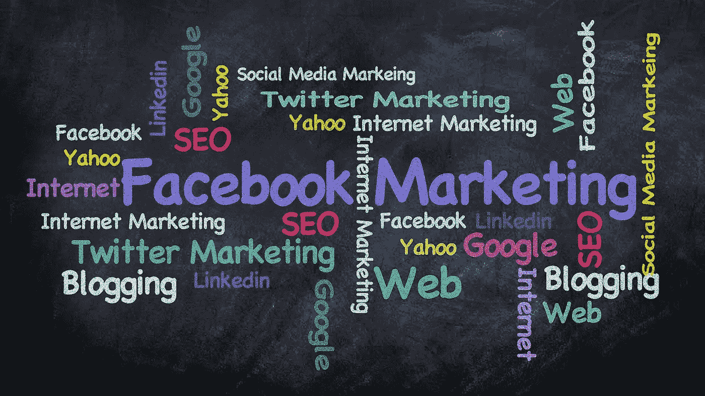

# 通过人工智能驱动的内容营销寻找客户

> 原文：<https://towardsdatascience.com/finding-customers-through-ai-powered-content-marketing-fcd294ec1667?source=collection_archive---------47----------------------->

[图像归属](https://pixabay.com/users/kevinking-289243/?utm_source=link-attribution&amp;utm_medium=referral&amp;utm_campaign=image&amp;utm_content=424521">Kevin King(Chandana Perera)</a> from <a href="https://pixabay.com/?utm_source=link-attribution&amp;utm_medium=referral&amp;utm_campaign=image&amp;utm_content=424521)

有些事情看似显而易见，但当你问一个具体的问题时，却得不到明确的答案。其中一个问题是如何利用互联网做生意。我在咨询有关使用人工智能改善业务功能时提出了这个问题，大多数答案充其量是“模糊的”。

在深入本文的主题之前，让我们定义一个非详尽的使用互联网进行商业活动的方式列表，而不考虑行业或商业活动类型(例如，从创业到医疗保健实践)。)

**利用互联网做生意的方法**

**电子商务**
【客户访问网站，订购产品，通过支付网关付款，商品送货上门。

**公司网站**
·提供知名度、宣传、品牌、新闻、财务结果、支持等

**软件即服务(订阅)**
CRM
供应商和员工管理
组织、信息和沟通

**市场调查**
【新产品潜力、竞争对手、标准、产品评论

**云托管**
【外包 IT 需求】

**广告**
销售广告:新闻&社交媒体(如 NYT、脸书、推特、LinkedIn)
通过广告销售:内容营销(如博客、medium.com、影响者)

进一步分析这个概念，我们看到它不是一维的。如果考虑实施模式，则该概念最好在 3d 空间中建模。因此，这三个维度是网络、移动和即将到来的增强虚拟现实 IOT，反映了不同的交付和交互模式(见下图)

三维空间

在上述范围内，我们将重点关注**内容营销**。

**什么是内容营销**
内容营销是一种营销方式，专注于持续创造和分享有价值的、高度相关的内容，以吸引和保留明确定义的受众，从而推动有利可图的客户行动。

没有人喜欢被直接卖给。无论是在数字上被追逐为“线索”或“潜在客户”，还是走进一家商店并被“我能帮什么忙”(翻译为“你不能只是浏览，你必须买些东西”)所困扰，它都没有很好的效果。

任何企业、服务或实践都需要能够快速回答的问题是“你如何找到客户？”。作为一个企业主，如果答案是“毫无头绪，事情就这么发生了”，那么至少还有显著改善的空间。通常的答案是“广告”，然后的问题是如何，在哪里和多少。

高效、有影响力的广告需要给广告“消费者”带来价值。如果一个广告要在寻找顾客或至少诱导顾客购买方面起作用，它需要对所花费的注意力有所回报。一个恼人的广告充其量只是不起作用，但在许多情况下会对品牌有害(以及成本影响)。

随着部分“生锈”的销售机制释放出被压抑的需求，在新冠肺炎危机爆发的一年内通过接种疫苗进行控制的可能性将导致增长反弹。因此，需求和购买的需要是存在的，企业需要为这个机会做好准备，部分是通过重新评估他们的销售业务。

**广告类型和提供的价值**
专注于任何营销传播中所需的附加值，一些广告的幽默内容提供了这种价值(见下文)。

其他人提供教育，而其他人则伪装成提供一些娱乐的文章，例如“申请世界上最好的工作”，实际上只是宣传一个加勒比海岛屿，或者“她错误地使用“xyz”消息平台向她的老板发送了一条 x 级消息”。

但是最强大的，有机的客户获取方法是内容营销。

与许多人可能相信的相反，网络和当前的技术并没有产生这个概念。内容营销至少从上个世纪就已经存在了。最近发生的变化是可访问性大大增强。

这同样适用于“免费增值”商业模式(“免费”和“溢价”是一种定价策略，通过这种策略，免费提供基本产品或服务，但金钱(溢价)是用于附加功能或服务)。

在讨论内容营销的未来之前，下面描述了一些有意义的历史例子来说明上述观点。

**内容营销—约翰迪尔**
1895 年，约翰迪尔开始出版一本名为《犁沟》的杂志，旨在教育农民如何有效地管理他们的作物。它是免费的，没有推广 John Deere 产品。当时没有电视、广播或互联网，但印刷机技术刚刚起步，并在世界各地被用于创作和接触观众。

不涉及销售，但通过向普通农民和牧场主提供这些内容，John Deere 成为了思想领袖，并使用内容营销将农业与品牌联系起来。《犁沟》现在在 40 多个国家以 12 种语言出版，完全在线，相关内容通过社交媒体渠道发布。这种内容营销方法使 John Deere 成为农业的同义词。

**内容营销——米其林**
“米其林指南”创作于 1900 年左右，是一本免费的车主指南(当时车主很少)，教育他们如何使用和保养车辆。作为轮胎生产商，米其林并不关注轮胎，而是希望建立一个受众群体，为他们提供免费的旅行建议。这包括如何处理磨损、地图、如何换轮胎的信息、哪里可以找到汽油等等。汽车使用得越多，对新轮胎的需求就越大。

**免费增值模式——杰克·丹尼尔的**
1884 年，19 岁的杰克·丹尼尔买下了一家酒厂，开始了自己的威士忌生产。作为一名营销天才，他在几个月内建立了这个品牌，在整个田纳西州的销售中排名第二。他是第一批在瓶子上印上商标的人之一，并很快意识到把瓶子做成黑色和方形能使他的产品与众不同。

至少在 20 世纪 50 年代之前，杰克·丹尼尔(Jack Daniel)有意识地保持供应小于需求，将“稀缺”作为一种销售策略。他使用一种混合的“免费增值”模式来推广自己的品牌，创建了一个乐队，名为“杰克丹尼尔原创银短号乐队”，在当地一家酒吧免费演奏音乐，并与老板达成协议，将他的威士忌卖给他的客户。

人工智能驱动的内容营销人工智能驱动的内容可以改变任何企业的游戏规则。无论您想要理解您的数据，实现内容创作还是个性化内容，AI 都有能力提供帮助。

**AI 在内容营销中是如何运用的**
我们来探讨一下 AI 目前在内容营销中运用的最流行的方式。

**1。基于对客户需求理解的个性化内容(包括电子邮件)更有可能作为间接的购买建议产生影响。**

个性化内容必须写得很好，具有良好的视觉效果，必须提供真正的附加值。

满足并超越观众的期望能创造持久的纽带，让顾客的需求得到关注。

人工智能的最新进展使得内容个性化变得有效可行。机器学习有助于跟踪消费者的行为、偏好以及他们与内容的互动。这可以走得更远，一些人工智能系统使用多种数据源提供实时全面的访客资料。

**2。预测分析**
预测分析使用机器学习模型来预测未来事件。与内容营销相关的此类模型的示例有:

聚类模型
聚类是一种涉及数据点分组的机器学习技术。这些算法可以用于基于过去的品牌参与、过去的购买和人口统计数据的受众细分。

推荐模型
推荐系统是一类向用户提供个性化建议的机器学习算法。这些模型分为协作过滤和基于内容两类，帮助用户发现新产品和新服务，引导他们找到最有可能购买的产品。

倾向模型
这些模型试图预测访问者和客户采取某些行动的可能性，如对报价采取行动或退出。

**3。客户细分客户细分是一种将客户划分为具有不同需求的不同群体的方式。K-means 聚类是一种流行的无监督机器学习算法，它可以找到不同的“聚类”(组)，使它们尽可能小。目标是创建尽可能多的不同组。**

然后，可以根据客户群的概况(例如，如何联系他们，通过邮件或短信等)对客户群进行不同的称呼。

上面描述的三种方法是最常用的，但是在营销中使用人工智能还有很多方法，包括:

媒体购买优化
对话式人工智能(聊天机器人)
增强和虚拟现实
面部识别
生物识别

通过网络、电子邮件和社交媒体，内容营销是获得客户的一种强有力的方法。但是，内容的创建和管理是一项重要的任务。

为了帮助这一点，各种人工智能技术可以并且正在被使用，如上所述。

内容营销的概念可以通过实际创建一个利基社交媒体平台来进一步发展，通过这个平台来创造观众和分享个性化的内容。

**关于作者**

[**尼古拉·费科斯**](https://gr.linkedin.com/in/nicolas-fekos-ab809025?trk=profile-badge-name)

[https://www.fortuitapps.com](http://www.fortuitapps.com/)