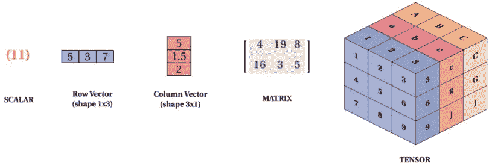
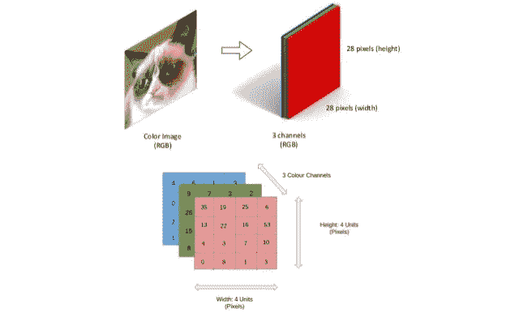
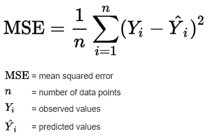
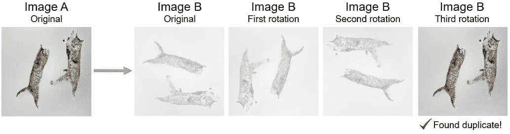

# 使用 Python 查找重复图像

> 原文：<https://towardsdatascience.com/finding-duplicate-images-with-python-71c04ec8051?source=collection_archive---------4----------------------->

## 在您的计算机上自动搜索重复图像


图片由 [KissCC0](https://www.kisscc0.com/photo/fujifilm-instax-mini-9-photographic-film-camera-fu-i5q8jh/) 提供。

你有没有发现自己在经历过**数百张**，甚至**数千张**的图像后，才发现有些其实看起来有点**太像**？它们会是复制品吗？然后你可能检查了两个图像分辨率，然后删除了最低的一个。

我多次发现自己处于这种情况。很痛苦，很费时间，很累。特别是，如上所述，如果你必须通过成千上万的图像。此外，有些图像乍一看可能很容易被归类为重复的，但有些图像可能需要精确检查，也可能导致您删除图像，而实际上并没有重复。

> 那时我想:让我们自动化这个过程。

在今天的文章中，我将介绍为自动搜索本地计算机上文件夹中的重复图像**编写一个 **Python** **3.8** 脚本的过程。**

**在**[**GitHub**](https://github.com/elisemercury/Duplicate-Image-Finder)**和**[**PyPi**](https://pypi.org/project/difPy/)**上查看 difPy 项目。**🎉

# 1 |理论上:将图像转换为数字数据

为了将图像相互比较，我们需要以某种方式将它们转换成可比较的、计算机可读的数据。你们中熟悉机器学习和计算机视觉的人可能已经知道，图像可以被转化为矩阵，或者更准确地说，转化为张量。一个[张量](https://en.wikipedia.org/wiki/Tensor)是一个可以保存 n *维数据的容器。因此，矩阵是一个二维张量。*



图片由 Mukesh Mithrakumar 从[开发到](https://dev.to/mmithrakumar/scalars-vectors-matrices-and-tensors-with-tensorflow-2-0-1f66)

彩色图像中的每一个像素都可以用**红色**、**绿色**和**蓝色**的组合来表示。这三种颜色组成了这个像素的独特颜色。

如果我们有一个红色矩阵，一个绿色矩阵和一个蓝色矩阵来代表图像中的所有像素，我们可以将这三个矩阵相互叠加，最终得到一个张量。🎉



来自 Slideshare.net 的伯尔顿·恩肖的图片

这太棒了，因为这意味着我们可以用数字来表示我们的图像。现在应该已经敲响了警钟:数字很容易相互比较。假设一幅图像和另一幅图像由完全相同的张量组成，我们可以得出结论:这些是复制品！

很好，现在让我们继续，看看我们如何将理论应用于实践。

# 2 |实践:将图像转换为数字数据

让我们首先导入我们将用于这个脚本的 Python 库: **skimage** 、 **matplotlib** 、 **numpy** 、 **openCV** 、 **os** 和 **imghdr** 。

我们将从编写函数 *create_imgs_matrix 开始。*这是我们的最后一个函数，但是您可以随意查看下面代码的详细解释:

该函数将为我们的算法在特定文件夹中找到的每幅图像创建一个张量。我们读入我们的计算机目录，遍历所有的文件，并确保我们的文件夹中的文件格式实际上是图像(即 JPG，PNG 等。).有一个非常方便的库叫做 **imghdr** 可以在这个过程中帮助我们。

我们首先检查文件是否可以通过以下方式访问:

```
os.path.isdir(directory + filename)
```

然后我们检查它是否是一个图像:

```
imghdr.what(directory + filename)
```

如果它不是一个图像，这个函数将返回 *None* ，并因此移动到目录中的下一个文件。如果两个输出都有效，该函数将继续下一行，在这里我们使用 **opencv** 库来解码我们的图像文件并将其转换为张量:

```
img = cv2.imdecode(np.fromfile(directory + filename, dtype=np.uint8), cv2.IMREAD_UNCHANGED)
```

然后，我们检查它是否已经成功地转换为一个 n 维数组，并确保我们的张量最多有 3 层。

在我们的最后一步，我们调整我们的图像张量的像素大小为 50，也就是说，我们希望它的像素宽度和高度为 50。我们这样做是为了加快图像的比较过程。如果我们有高分辨率图像，它们各自的张量也将非常大，因此导致与其他图像张量相比，一对一比较的计算时间更长。

最后，我们将调整后的张量添加到我们的 imgs_matrix 列表中，并继续处理我们目录中的下一个文件(如果存在的话)。

酷——在我们写完这个函数之后，我们得到了目录中所有图像的张量列表。现在，我们如何比较这些呢？为此，我们将使用一个名为 MSE 的指标。

# 图像相似性的 3 | MSE(均方误差)

统计领域经常使用 **MSE** 或[均方误差 T5。对于我们的用例，我们将使用它来比较**两幅图像**的相似程度。](https://en.wikipedia.org/wiki/Mean_squared_error)

> 两幅图像之间的均方误差是两幅图像之间的平方差之和。误差越小，图像越“相似”。

MSE 计算如下:



图片来自[维基百科](https://en.wikipedia.org/wiki/Mean_squared_error)

我不会详细介绍这个公式的作用，而是让我给你一个 Python 代码中的等价形式:

这个函数计算 imageA 和 imageB 之间的 MSE，并将返回一个浮点值，我们可以将它解释为这些图像之间的相似性。这个数字越低，这些图像越相似。

# 4 |查找重复项的最后提示和注意事项

在进入最后一章**之前，让我给你一些我在这个项目中学到的技巧和思考。**

## A.选择什么目标 MSE？

因为我们寻找的是重复的图像，而不仅仅是相似的图像，我们可以假设 MSE 为 0 是我们确信图像是重复的目标吗？

总的来说，是的。但是在我们的例子中:还记得我们将图像的尺寸调整为 50 像素宽 x 50 像素高吗？这可能会导致给出具有不同初始分辨率或大小的图像的略微不同的张量。当我自己编写这个函数时，我看到一些确实是重复的图像，不知何故没有导致 MSE 为 0。因此，更好的做法是将我们的 MSE 阈值设置得高一点，这样我们就可以确保捕捉到所有重复的图像，即使没有完全相同的张量。

对于这个用例，我选择 200 的 **MSE 作为**最大阈值**。一旦两个图像的 MSE 低于 200，我们就认为它们是重复的。**

## B.那些旋转的图像是怎么回事？

这也是我写完第一个初始函数后才意识到的。当然，根据我们的图像旋转，我们的图像的张量会看起来不同。因此，我们需要确保将我们的图像与第二幅图像的所有可能的旋转进行比较。



图片来自 [KissCC0](https://www.kisscc0.com/photo/cat-dog-kitten-feline-lower-urinary-tract-disease-s82nd2/) 由作者修改

借助内置的 *rot90* 函数，numpy 库可以让我们轻松地执行这个操作，这个函数可以将矩阵旋转 90 度。

## C.比较图像分辨率

当然，除了寻找重复，我们还希望我们的算法帮助我们决定哪些可以删除。因此，我们希望比较图像的原始分辨率，并让我们的算法输出最低的文件名。

我们将通过使用 *os.stat st_size* 函数来完成这项工作，该函数将输出文件大小。具有较小大小的文件将被添加到单独的列表中。

# 5 |将所有这些放在一起

首先，祝贺你一直坚持到现在，并走了这么远。我们到了最后一章，我们将把所有的东西放在一起！

总结我们的步骤:

1.  计算文件夹中所有图像的图像张量。
2.  逐一检查所有图像张量并计算它们的 MSE。在此过程中，我们确保将图像旋转 90 度，这样即使这些图像没有相同的初始方向，我们也可以找到重复的图像。
3.  如果我们的两个图像的 MSE< 200, classify them as duplicates.
4.  Check the file size of the original two files. The one having the lower size will be added to a list of images that can be deleted.

Instead of pasting the full code here, I will share with you the link to my **GitHub 库**，我已经上传了[完全复制图像查找器(DIF)脚本](https://github.com/elisemercury/Duplicate-Image-Finder)。

<https://github.com/elisemercury/Duplicate-Image-Finder>  

# *** | 2021 年 10 月更新**

DIF 现在也可以作为 **Python 包** *difPy* 供您通过 *pip* 安装程序进行安装。

<https://pypi.org/project/difPy/>  

您现在可以只使用`pip install difPy`并如下使用该库:

我希望这篇文章对您有所帮助，并且可以帮助您节省一些宝贵的图像比较和重复数据删除时间！至少对我个人来说是这样的。😜

如果您有任何问题或反馈，请随时联系我，或者在下面发表评论，让我知道您的想法。

## 参考资料:

[1] A. Rosebrock，[如何:Python 比较两幅图像](https://www.pyimagesearch.com/2014/09/15/python-compare-two-images/) (2014)

[2] J. Brownlee，[用 NumPy](https://machinelearningmastery.com/introduction-to-tensors-for-machine-learning/) 对用于机器学习的张量的温和介绍(2018)