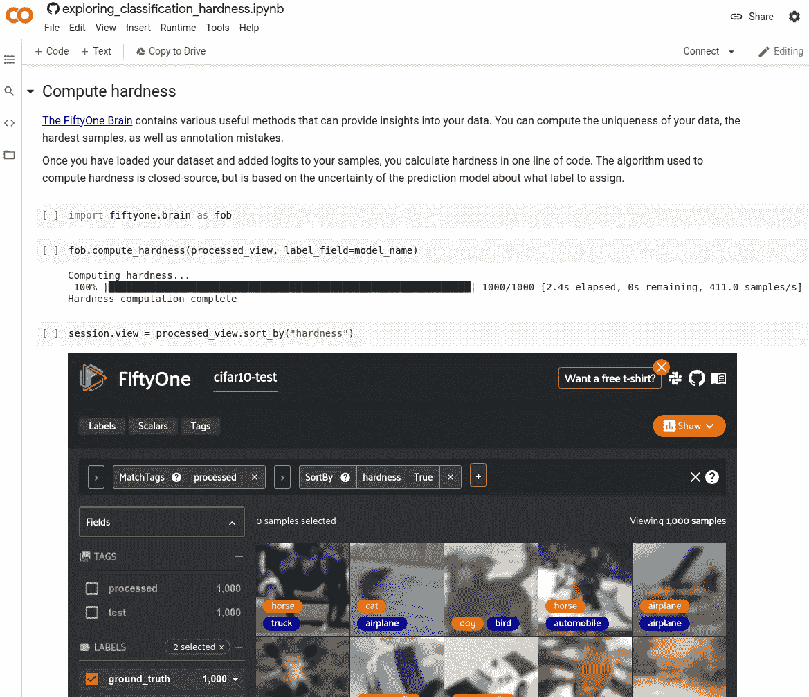
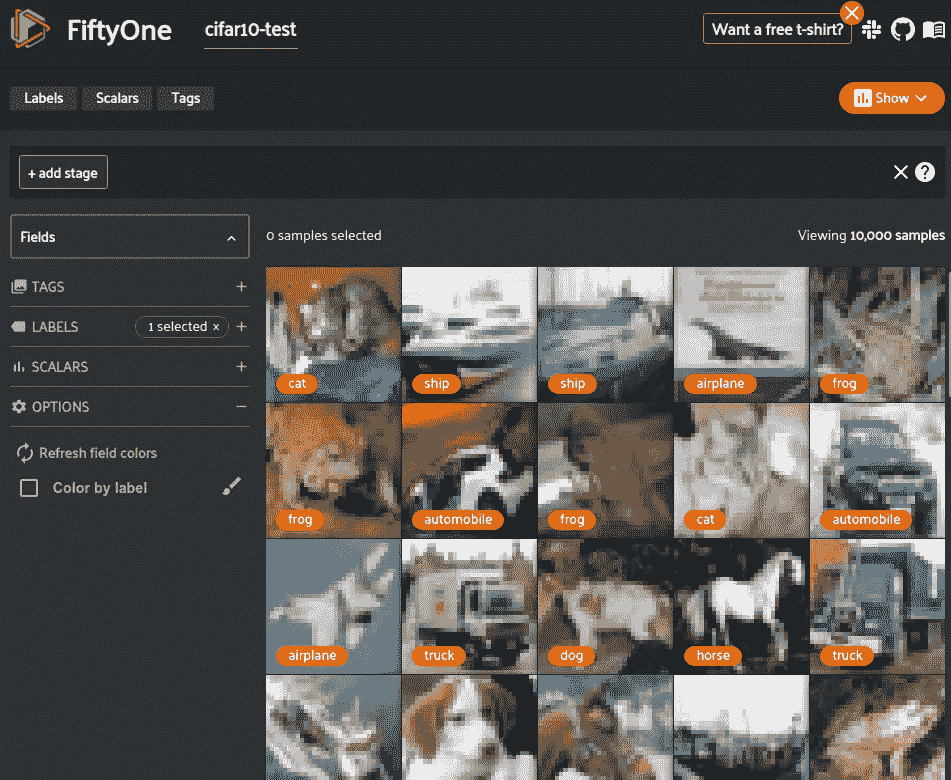
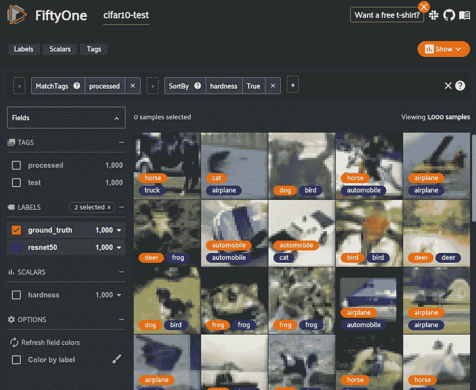
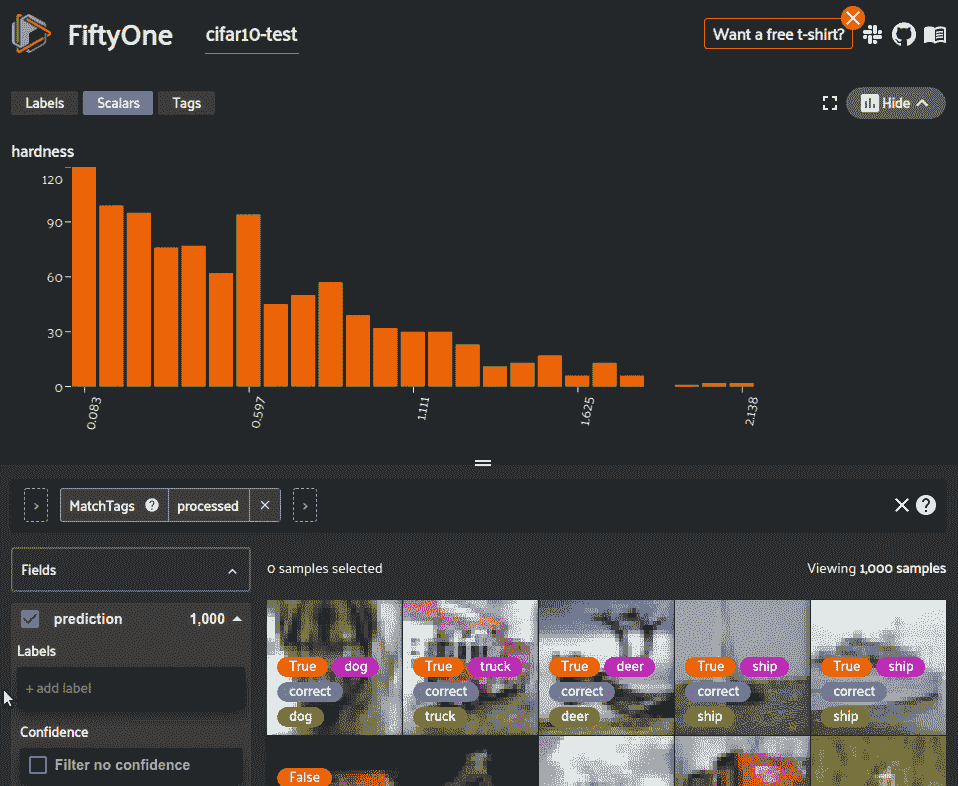
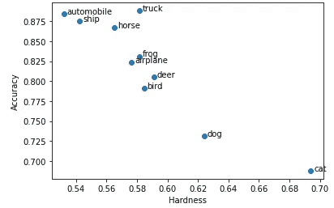
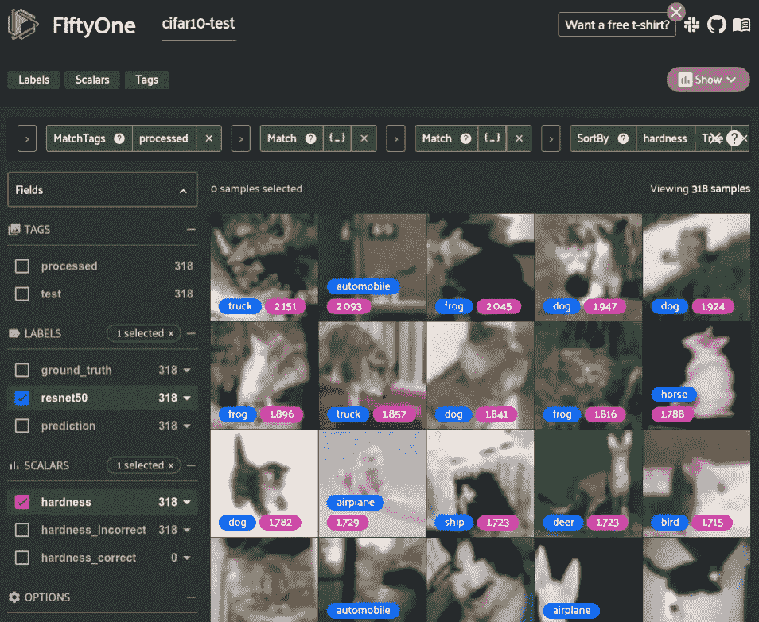
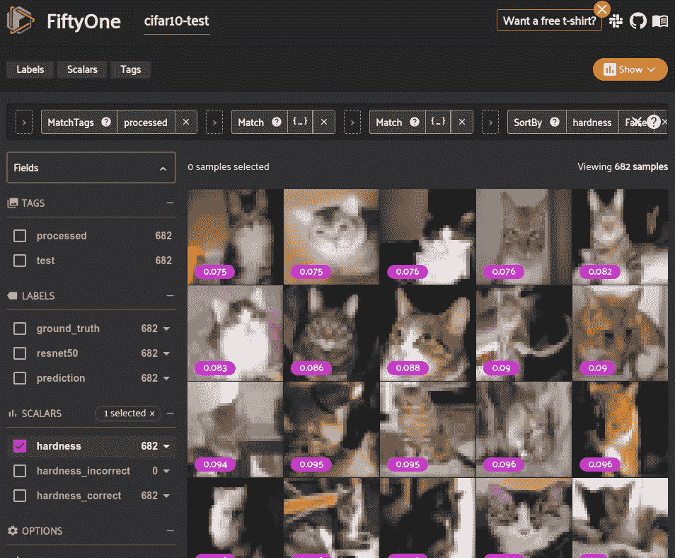

# 在影像分类数据集中查找硬样本

> 原文：<https://towardsdatascience.com/finding-hard-samples-in-your-image-classification-dataset-32d195b7ee52?source=collection_archive---------14----------------------->

## 挖掘硬样本是改进机器学习数据集的有效方法，本指南将向您展示如何自己去做


蒂姆·福斯特在 [Unsplash](https://unsplash.com?utm_source=medium&utm_medium=referral) 上的照片

假设你有一个数据仓库，里面有数百万张未标记的图片。您成功地标记了数据的子集，并在其上训练了图像分类模型，但它的表现不如您希望的那样好。**你如何决定给哪些新样本添加注释并添加到你的训练集中？**

您可以随机选择新的样本进行注释，但是有一个更好的方法。[硬样本挖掘](http://cs.brown.edu/people/pfelzens/papers/lsvm-pami.pdf)是一种屡试不爽的方法，可以将大量未标记的原始数据提取为更小的高质量标记数据集。

> 硬样本是指你的机器学习(ML)模型发现很难正确预测标签的样本。

在影像分类数据集中，硬样本可以是任何东西，从看起来像狗的猫到分辨率模糊的影像。如果您希望您的模型在这些硬样本上表现良好，那么您可能需要“挖掘”这些硬样本的更多示例，以添加到您的训练数据集中。在训练期间将您的模型暴露于更硬的样本将允许它在以后对这些类型的样本执行得更好。

硬样本不仅对训练数据有用，还必须包含在测试集中。如果您的测试数据主要由简单的样本组成，那么您的[性能将很快达到上限，导致进度停滞](https://www.sciencedirect.com/science/article/abs/pii/S0925231219316984)。将硬样本添加到测试集将使您更好地了解模型在硬边缘情况下的表现，并可以更深入地了解哪些模型更可靠。

[**使用这款 Colab 笔记本，跟随您的浏览器！**](https://colab.research.google.com/github/voxel51/fiftyone-examples/blob/master/examples/exploring_classification_hardness.ipynb)



这个演练在 Colab 中运行 [(ipynb 链接在此)](https://github.com/voxel51/fiftyone-examples)(图片由作者提供)

# 概观

这篇文章将带你了解如何使用我正在开发的新的开源 ML 工具 [FiftyOne](https://fiftyone.ai/) ，在你的数据集中寻找硬样本。为了使本演练易于理解，我们将使用现有的模型和数据集。即 ResNet50 在 [CIFAR-10](https://www.cs.toronto.edu/~kriz/cifar.html) 数据集测试分裂中寻找硬样本。

它将指导您如何:

*   将您的图像数据集加载到[51](https://fiftyone.ai/)
*   将预训练网络中的逻辑添加到数据集中
*   使用[五十一](https://fiftyone.ai/)计算每个样品的硬度
*   探索您的数据集，找到最难和最容易的样本

## 设置

本演练将使用 GitHub 上的 [PyTorch](https://pytorch.org/) 和[fiftone](https://fiftyone.ai)以及 [PyTorch_CIFAR10 的模型。PyTorch 和 FiftyOne 的安装说明很简单:](https://github.com/huyvnphan/PyTorch_CIFAR10/tree/v2.1)

```
pip install torch torchvision
pip install fiftyone
```

# 加载您的数据

对于本例，我们将使用影像分类数据集的测试分割， [CIFAR-10](https://www.cs.toronto.edu/~kriz/cifar.html) 。该数据集包含 10，000 个测试图像，标记了 10 个不同的类别。这是[51 数据集动物园](https://voxel51.com/docs/fiftyone/user_guide/dataset_zoo/index.html)中的几十个数据集之一，所以我们可以很容易地加载它。

我们可以使用 [FiftyOne App](https://voxel51.com/docs/fiftyone/user_guide/app.html) 来看看这个数据集。



CIFAR-10 和地面真相标签在[51 应用](https://voxel51.com/docs/fiftyone/user_guide/app.html)中可视化(图片由作者提供)

***注*** :也可以[将自己的数据集加载到五十一](https://voxel51.com/docs/fiftyone/user_guide/dataset_creation/index.html)中。它支持许多计算机视觉任务的标签，包括[分类](https://voxel51.com/docs/fiftyone/user_guide/using_datasets.html#classification)、[检测](https://voxel51.com/docs/fiftyone/user_guide/using_datasets.html#object-detection)、[分割](https://voxel51.com/docs/fiftyone/user_guide/using_datasets.html#objects-with-instance-segmentations)、[关键点](https://voxel51.com/docs/fiftyone/user_guide/using_datasets.html#keypoints)和[更多](https://voxel51.com/docs/fiftyone/user_guide/using_datasets.html#labels)。例如，如果数据集包含存储在每个类的目录中的图像，可以使用下面的代码来加载它。

# 添加逻辑

为了[计算第五十一张图像的硬度](https://voxel51.com/docs/fiftyone/user_guide/brain.html#sample-hardness)，你首先需要使用一个模型来计算这些图像的对数。您可以使用任何您想要的模型，但理想情况下，它将是一个经过训练的类似数据，并且在相同的任务中，您将使用这些新图像。

在本例中，我们将使用来自 [PyTorch CIFAR-10 库](https://github.com/huyvnphan/PyTorch_CIFAR10/tree/v2.1)的代码，即预训练的 ResNet50 分类器。

```
# Download the software
git clone --depth 1 --branch v2.1 https://github.com/huyvnphan/PyTorch_CIFAR10.git

# Download the pretrained model (90MB)
eta gdrive download --public \
    1dGfpeFK_QG0kV-U6QDHMX2EOGXPqaNzu \
    PyTorch_CIFAR10/cifar10_models/state_dicts/resnet50.pt
```

您可以轻松地将带有逻辑的分类字段添加到 51 个数据集中的样本中。

# 计算硬度

第五十一个大脑包含了各种有用的方法，可以让你深入了解数据。此刻，你可以计算出你的数据的[唯一性](https://voxel51.com/docs/fiftyone/user_guide/brain.html#image-uniqueness)，最难的[样本，以及注释的](https://voxel51.com/docs/fiftyone/user_guide/brain.html#sample-hardness)[错误](https://voxel51.com/docs/fiftyone/user_guide/brain.html#label-mistakes)。这些都是在数据集上生成标量指标的不同方法，可让您更好地了解现有数据的质量，并选择高质量的新数据样本。

加载数据集并将 logits 添加到样品后，您可以在一行代码中计算硬度。硬度算法是闭源的，但基本思想是利用模型预测的相对不确定性，为每个样本分配一个标量硬度值。

# 探索和识别最难的样本

您可以使用 FiftyOne 应用程序可视化您的数据集，并探索硬度最高和最低的样品。



数据集排序以显示最难的样本(按作者排序的图像)

虽然这个例子使用的是 CIFAR-10 的小图像，但 FiftyOne 也可以处理高分辨率图像和视频。

我们可以编写一些查询来更深入地挖掘这些硬度计算，以及它们如何与数据的其他方面相关联。例如，我们可以分别在模型的正确和错误预测上看到硬度的分布。



正确和错误预测样品的硬度分布(图片由作者提供)

如您所料，上图显示正确预测的硬度分布偏向较低的硬度值，而不正确的预测在高硬度值时分布更均匀。这表明模型预测不正确的样本往往是更难的样本。因此，向训练集添加更难的样本应该会提高模型性能。

我们还可以看到样品的硬度如何分布在不同的类别中。

```
Average classwise hardness

cat: 0.703082
dog: 0.628436
airplane: 0.591202
bird: 0.588827
frog: 0.577954
truck: 0.573330
horse: 0.564832
deer: 0.561707
automobile: 0.554695
ship: 0.553041
```

看起来猫和狗是最难的职业，所以在其他职业之前添加更多的例子是值得的。



分类准确度与硬度(图片由作者提供)

我们可以看到，一个类中样本的平均硬度与该类上模型的精度存在反相关关系。

我们来看看最难类“猫”的错误预测样本。



最难的错误预测样本最难的类别“猫”(图片由作者提供)

现在让我们来看看硬度最低的猫的正确预测图像。



最难正确预测最难类别“猫”的样本(图片由作者提供)

将最难预测错误的猫图像与最容易预测正确的猫图像进行比较，我们可以看到，该模型在对直视相机的猫面部图像进行分类时要容易得多。模特最难处理的猫的图像是那些光线不好、背景复杂的猫的图像，以及它们没有坐着面对摄像机的姿势。现在，我们对添加到这个数据集中的猫图像的类型有了一个概念。

# 下一步是什么？

这个例子是在一个先前注释过的数据集上完成的，目的是展示硬度与数据集的其他方面的关系。在现实世界的应用程序中，您现在可以将此方法应用于新的未标记数据。

一旦确定了可用的最难样本，就该更新数据集了。您可以选择硬度值最高的 X 个样本发送出去，进行注释并添加到您的训练或测试集中。或者，您可以根据上面计算的每个等级的硬度按比例选择样本。

[根据这些新数据重新训练你的模型](https://openaccess.thecvf.com/content_ICCV_2017/papers/Dong_Class_Rectification_Hard_ICCV_2017_paper.pdf)现在应该可以让它[在更困难的情况下表现得更好](https://arxiv.org/pdf/1804.04606.pdf)(我正在写一篇后续博文来展示这一点)。此外，如果模型在测试集上表现良好，将这些样本添加到测试集将使您对模型在新的未知数据上表现良好的能力更有信心。