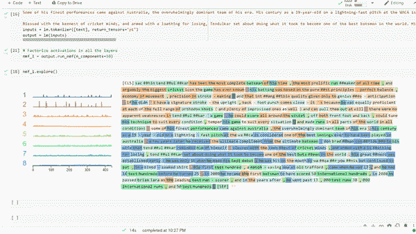
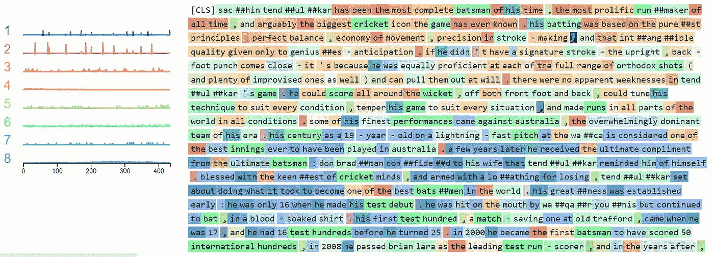
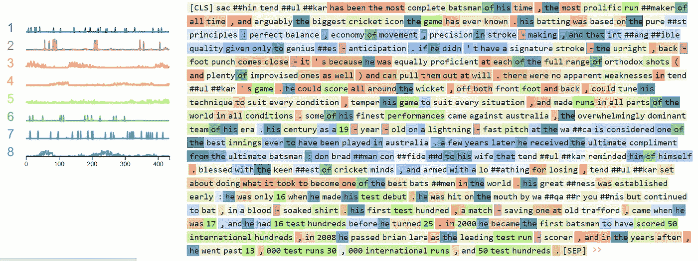

# 使用 NMF 在数据中寻找模式

> 原文：<https://towardsdatascience.com/finding-pattern-in-data-using-nmf-7b119555cb41?source=collection_archive---------7----------------------->

## 使用 Ecco 对文本数据进行非负矩阵分解



使用 EECO 的 NMF 可视化(来源:作者)

自然语言处理是人工智能领域最热门的话题之一。它有助于构建聊天机器人、语音助手、情感分析、推荐引擎等应用。这是一个新兴领域，大多数相关公司都在投资和研究创造下一代语音助手。

自然语言处理最重要的算法之一是主题建模，它有助于描述文本数据集中的数量趋势，并找出数据集的概要特征。换句话说，这是一种特征工程，我们在数据集中找出最重要的特征。

NMF 是一种无监督的主题建模技术，其中没有提供训练数据或数据标签。它将高维数据分解为低维表示。

Ecco 是一个开源的 Python 库，它提供了使用交互式可视化来探索和解释 NLP 模型的多种功能。

在本文中，我们将使用 Ecco 来执行 NMF，并为其创建一个交互式可视化。

让我们开始吧…

# 安装所需的库

我们将从使用 pip 安装 Ecco 开始。下面给出的命令可以做到这一点。

```
pip install ecco
```

# 导入所需的库

在这一步中，我们将导入所需的库和函数来创建 NMF 可视化。我们还将从 eeco 加载预训练的 Bert 模型。

```
import ecco
lm = ecco.from_pretrained('bert-base-uncased', activations=True)
```


加载预训练模型(来源:作者)

# 对文本进行标记

在这一步中，我们将对用于 NMF 可视化的数据进行符号化。你可以用任何你想要的文字，我正在写一篇关于萨钦·坦杜尔卡尔的文章。

```
text = ''' Sachin Tendulkar has been the most complete batsman of his time, the most prolific runmaker of all time, and arguably the biggest cricket icon the game has ever known. His batting was based on the purest principles: perfect balance, economy of movement, precision in stroke-making, and that intangible quality given only to geniuses - anticipation. If he didn't have a signature stroke - the upright, back-foot punch comes close - it's because he was equally proficient at each of the full range of orthodox shots (and plenty of improvised ones as well) and can pull them out at will.There were no apparent weaknesses in Tendulkar's game. He could score all around the wicket, off both front foot and back, could tune his technique to suit every condition, temper his game to suit every situation, and made runs in all parts of the world in all conditions.Some of his finest performances came against Australia, the overwhelmingly dominant team of his era. His century as a 19-year-old on a lightning-fast pitch at the WACA is considered one of the best innings ever to have been played in Australia. A few years later he received the ultimate compliment from the ultimate batsman: Don Bradman confided to his wife that Tendulkar reminded him of himself.Blessed with the keenest of cricket minds, and armed with a loathing for losing, Tendulkar set about doing what it took to become one of the best batsmen in the world. His greatness was established early: he was only 16 when he made his Test debut. He was hit on the mouth by Waqar Younis but continued to bat, in a blood-soaked shirt. His first Test hundred, a match-saving one at Old Trafford, came when he was 17, and he had 16 Test hundreds before he turned 25\. In 2000 he became the first batsman to have scored 50 international hundreds, in 2008 he passed Brian Lara as the leading Test run-scorer, and in the years after, he went past 13,000 Test runs 30,000 international runs, and 50 Test hundreds. '''
inputs = lm.tokenizer([text], return_tensors="pt")
output = lm(inputs)
```

# 使用 NMF 和 EECO 分解文本

这是最后一步，我们将创建 NMF 的可视化，我们将使用两种类型的因式分解，即所有层的因式分解和第一层的因式分解。

```
#All layers
nmf_1 = output.run_nmf(n_components=10)
nmf_1.explore()
```



NMF 所有层(来源:作者)

```
#First Layer
nmf_2 = output.run_nmf(n_components=8, from_layer=0, to_layer=1)
nmf_2.explore()
```



第一层 NMF(来源:作者)

在这里，我们可以清楚地看到只用一行代码创建的 NMF 可视化效果。这些可视化是互动的，高度可解释的。我们可以清楚地分析 NMF 在可视化中的不同主题和权重。

继续尝试不同的数据集，并创建美丽的可视化。如果您发现任何困难，请在回复部分告诉我。

本文是与 [Piyush Ingale](https://medium.com/u/40808d551f5a?source=post_page-----7b119555cb41--------------------------------) 合作完成的。

# 在你走之前

***感谢*** *的阅读！如果你想与我取得联系，请随时通过 hmix13@gmail.com 联系我或我的* [***LinkedIn 个人资料***](http://www.linkedin.com/in/himanshusharmads) *。可以查看我的*[***Github***](https://github.com/hmix13)**简介针对不同的数据科学项目和包教程。还有，随意探索* [***我的简介***](https://medium.com/@hmix13) *，阅读我写过的与数据科学相关的不同文章。**