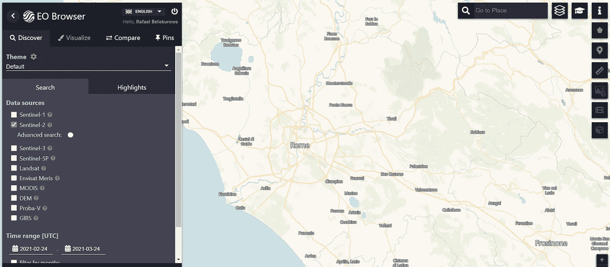
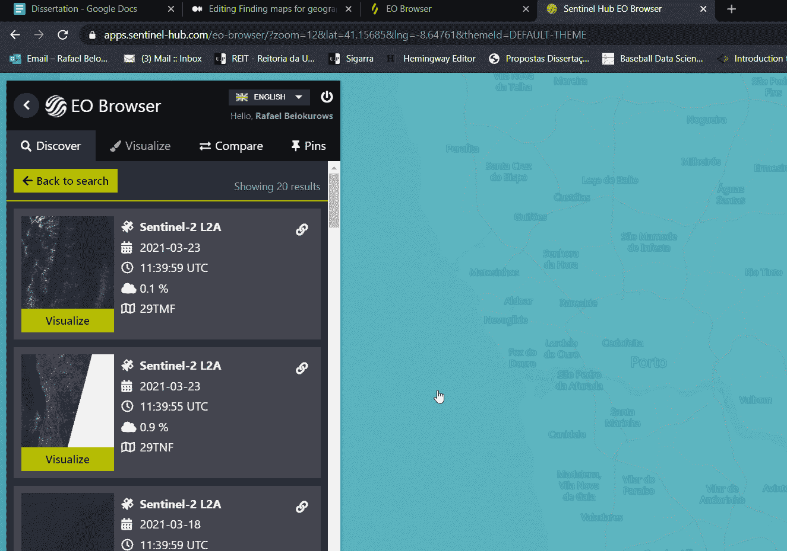
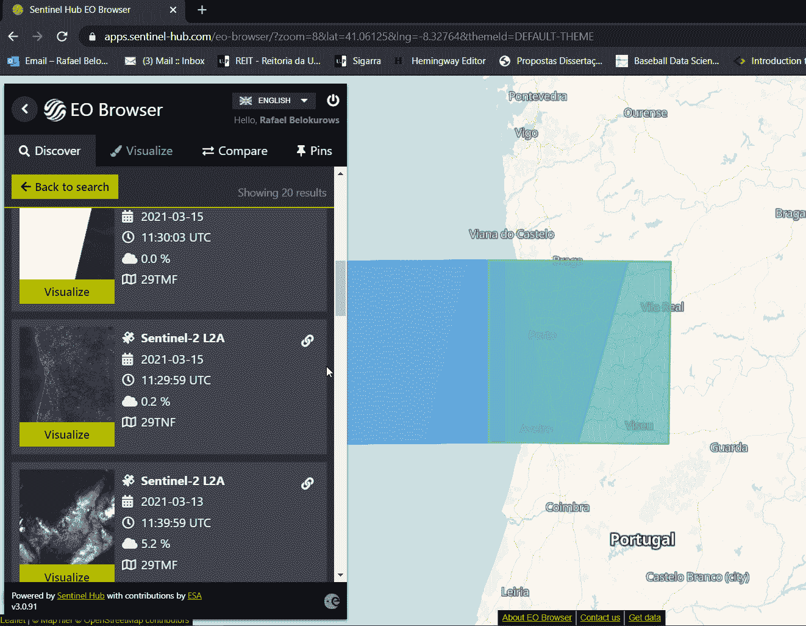
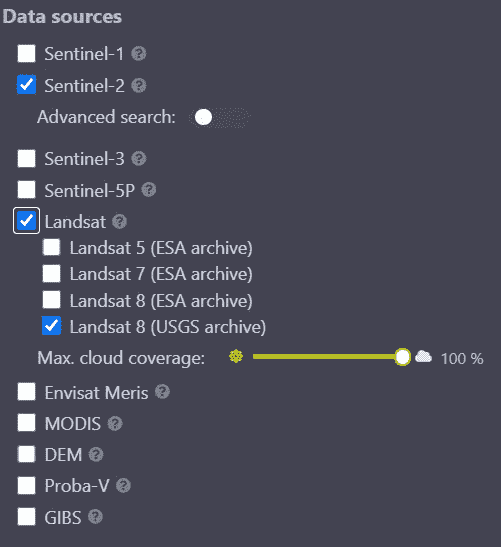
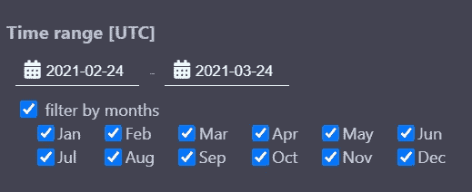
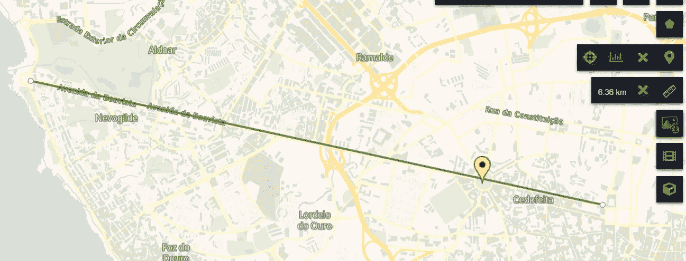
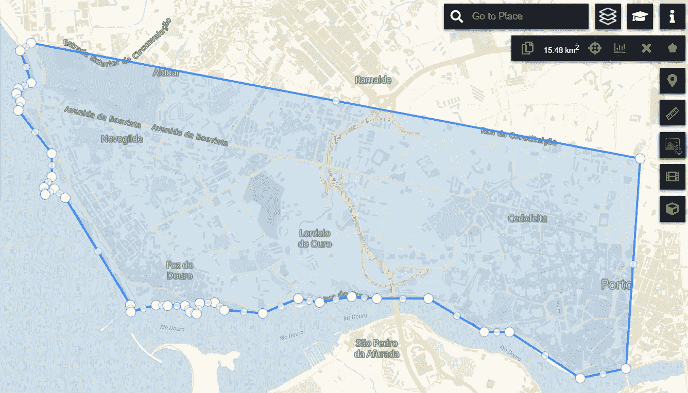

# 为您的数据科学项目查找卫星图像

> 原文：<https://towardsdatascience.com/finding-satellite-images-for-your-data-science-project-888695361925?source=collection_archive---------28----------------------->

## Sentinel Hub，为您的数据科学项目提供卫星图像的最佳资源之一

由[托拜厄斯](https://unsplash.com/@tbshg?utm_source=medium&utm_medium=referral)在 [Unsplash](https://unsplash.com?utm_source=medium&utm_medium=referral) 拍摄的照片

如今，你可以用卫星图像做很多事情，无论是在你的地理分析系统中使用，还是在 R/Python 或任何其他编程语言上帮助你进行统计分析。

你将(也应该)问自己的第一个问题是:我在哪里可以找到这些卫星图像？这个问题的答案就在这里。我将向您展示您可以从世界任何地方找到高质量卫星图像的最佳资源。

接下来，我将展示如何从特定区域获取这些图像。我会选择波尔图——葡萄牙**🇵🇹的一座美丽的海滨城市，作为我的工作区域，因为那是我居住的地方。IMO 获取卫星图像的最佳来源是:**

** [## Sentinel-hub 电子浏览器 3

### 2018 年 8 月 18 日拍摄的哨兵-2 L2A 图像

apps.sentinel-hub.com](https://apps.sentinel-hub.com/eo-browser/) 

1.  注册一个账户，简单快捷。使用最近创建的帐户登录，您将看到以下屏幕:

2.缩小地图，将地图移动到您希望获取卫星图像的位置。点击“搜索”,你会看到覆盖你所选区域的所有图片。

3.选择最适合你的图像，例如，云层最少的图像通常最适合进行任何类型的分析。当你找到你喜欢的，点击此按钮进入下载链接:

点击第二个链接开始下载。它将打开一个新的页面，并要求用户和密码。这和你几分钟前登录网站用的信息是一样的。输入用户和密码，下载将立即开始。

仅此而已。几分钟后，您将获得所需的卫星图像，并可以在您选择的软件中打开它们，无论是 SNAP、ArcGIS、RStudio 还是任何其他您想要的软件。

# Sentinel Hub 的其他一些功能和注意事项

*   你也可以选择从另一颗卫星上获取图像。Landsat 是另一个非常受欢迎的获取图像的选择(这里也有)

*   日期过滤器将允许您选择一个月或一段时间:

您可以直接在 Sentinel Hub 的界面上使用地图，进行如下操作:

*   放置标记，测量距离:

*   计算面积:

还可以用你选择的地图制作延时视频或动画。

# 最后的想法

这就是你需要了解的关于哨兵枢纽的基本知识。我相信这是为您的数据科学项目下载卫星图像的最佳资源之一。

查看一些由[阿卜迪沙库尔](https://medium.com/u/d4284ce02aec?source=post_page-----888695361925--------------------------------)、[阿德里安·塞拉皮奥](https://medium.com/u/60c1c2b787cc?source=post_page-----888695361925--------------------------------)和[阿努巴夫·帕特奈克](https://medium.com/u/d6fbbcb89e29?source=post_page-----888695361925--------------------------------)撰写的关于地理空间分析的好文章，为你的下一个项目提供灵感:

 [## 外部地理空间数据:类型和用例

### 不同地理空间数据流、其类型和使用案例的详细回顾

towardsdatascience.com](/external-geospatial-data-types-and-use-cases-7131e9a1ee24)  [## 简单、直观的地理空间分析，帮助疫情做好准备

### 使用可视化技术和实时数据来分析菲律宾的医疗保健系统，及其能力。

towardsdatascience.com](/are-we-fcqd-dfea9e534eb1)  [## 基于深度学习的土地利用/土地覆盖分类

### 确定地球表面的物理方面(土地覆盖)以及我们如何开发土地(土地利用)是一个…

towardsdatascience.com](/land-use-land-cover-classification-with-deep-learning-9a5041095ddb) 

一有机会就去看看 Sentinel Hub，找到你需要的图片，在评论区让我知道你的想法！**