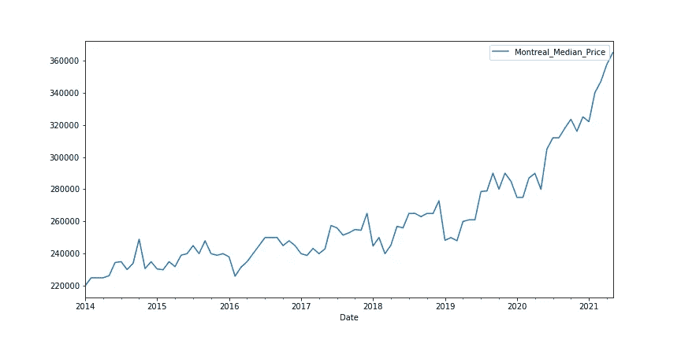
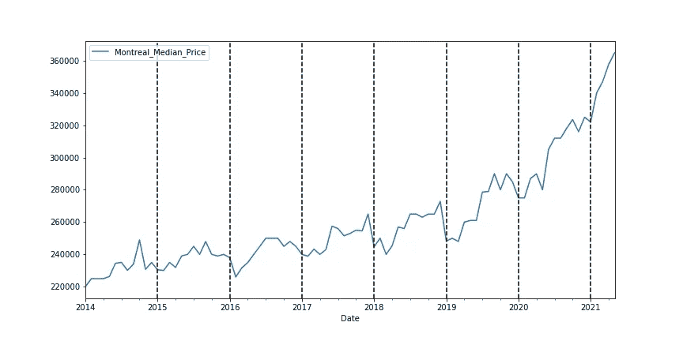
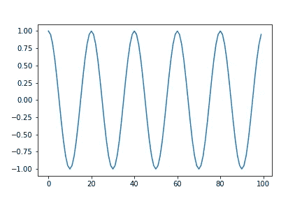
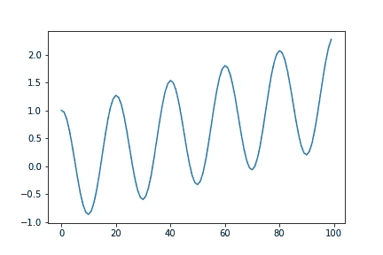
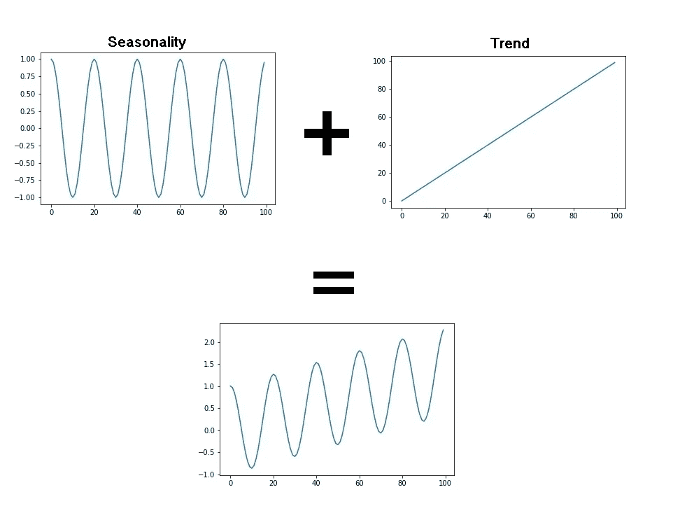
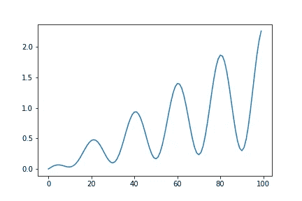
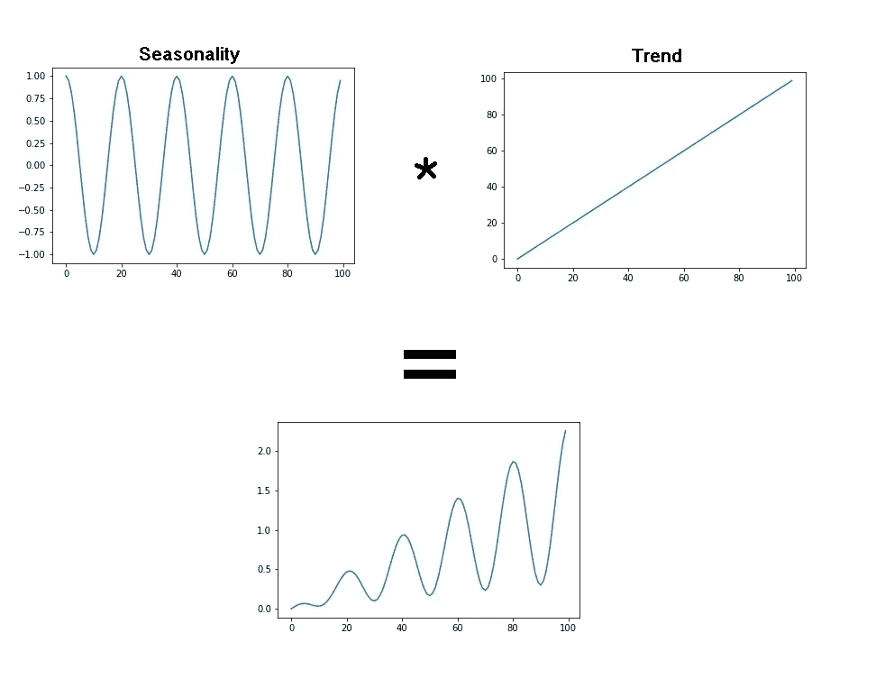
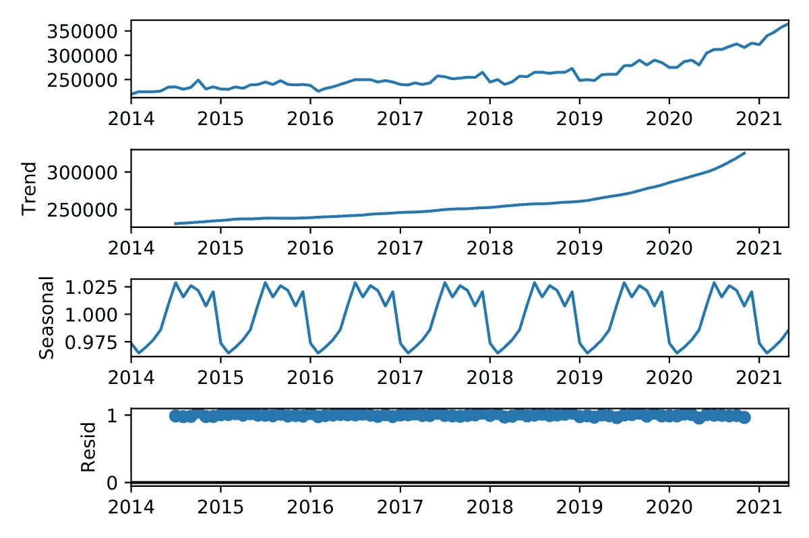

# 用 Python 在时间序列数据中发现季节性趋势

> 原文：<https://towardsdatascience.com/finding-seasonal-trends-in-time-series-data-with-python-ce10c37aa861?source=collection_archive---------1----------------------->

## 理解不同种类的季节性以及如何将时间序列分解为趋势和季节的指南

照片由来自[佩克斯](https://www.pexels.com/photo/concrete-road-between-trees-1563356/?utm_content=attributionCopyText&utm_medium=referral&utm_source=pexels)的[克雷格·阿德利](https://www.pexels.com/@thatguycraig000?utm_content=attributionCopyText&utm_medium=referral&utm_source=pexels)拍摄

# 为什么要探索季节性？

时间序列数据中的季节性指的是以固定间隔发生的模式。这不同于有规律的周期性趋势，如股票价格的上涨和下跌，这些趋势有规律地重复出现，但没有固定的周期。从了解数据中的季节性模式中可以获得很多洞察力，甚至可以将其用作比较时间序列机器学习模型的基线。

# **入门**

*快速提示:在这篇文章中，我将使用魁北克房地产经纪人专业协会发布的数据。该协会每月发布房地产统计数据。为了方便起见，我将魁北克省和蒙特利尔大都会区的每月公寓价格中值放入一个 CSV 文件中，可在此处获得:*[*https://drive . Google . com/file/d/1 smrkzpaa 0 AAL-zhnllfbmdgymtxgpab/view？usp =共享*](https://drive.google.com/file/d/1SMrkZPAa0aAl-ZhnHLLFbmdgYmtXgpAb/view?usp=sharing)

了解数据是否有季节性趋势的最快方法是绘制图表。让我们看看当我们按月绘制蒙特利尔的房价中值时会得到什么。

*作者图片*

敏锐的眼睛可能已经从这幅图中看出，价格似乎在新年前后下降，并在几个月前夏末左右达到峰值。让我们通过为每年的一月画一条垂直线来更深入地了解这一点。

*作者图片*

看起来这绝对是一种趋势。在这种情况下，季节性似乎有一年的周期。接下来，我们将研究一个工具，我们可以使用它来进一步检查季节性，并将我们的时间序列分解为趋势、季节性和剩余部分。不过，在我们这样做之前，你必须了解加性和倍增性季节性之间的区别。

# 加法与乘法季节性

在分析时间序列数据时，您可能会遇到两种季节性。为了理解它们之间的区别，让我们看一个具有完美季节性的标准时间序列，一个余弦波:

正弦波图— *作者图片*

我们可以清楚地看到，波浪的周期为 20，振幅(从中心线到波峰顶部或波谷底部的距离)为 1，并且保持不变。

## 附加季节性

实际时间序列很少具有恒定的波峰和波谷值，相反，我们通常会看到某种总体趋势，如随着时间的推移而增加或减少。例如，在我们的销售价格图中，中间价格往往会随着时间的推移而上升。

如果我们的季节性幅度保持不变，那么我们就有了所谓的附加季节性。下面是一个附加季节性的例子。

附加季节性— *作者图片*

一个很好的思考方式是，想象我们用标准余弦波，简单地给它添加一个趋势:

*作者图片*

我们甚至可以把之前的基本余弦模型想象成一个趋势不变的加性模型！我们可以使用下面的简单等式来模拟加性时间序列:

Y[t] = T[t] + S[t] + e[t]

Y[t]:我们的时间序列函数
T[t]:趋势(向上或向下移动的总体趋势)
S[t】:季节性(定期出现的循环模式)
e[t]:残差(趋势或季节性中没有考虑的数据中的随机噪声

## 倍增季节性

您可能在时间序列数据中遇到的另一种季节性是倍增性的。在这种类型中，我们季节性的幅度根据趋势变大或变小。下面是一个倍增季节性的例子。

倍增的季节性— *作者图片*

我们可以采用与加法模型类似的思路，想象我们采用余弦波，但不是将趋势相加，而是将其相乘(因此得名乘法季节性):

倍增的季节性— *作者图片*

我们可以用一个类似于加法模型的等式来建模，只需将加法换成乘法。

Y[t] = T[t] *S[t] *e[t]

# 分解数据集

现在我们已经对不同的模型有了一个清晰的了解，让我们看看如何将我们的房地产时间序列分解成它的趋势、季节性和剩余部分。我们将使用 statsmodels 库中的[季节性分解](https://www.statsmodels.org/stable/generated/statsmodels.tsa.seasonal.seasonal_decompose.html)模型。

季节性分解模型要求您选择季节性的模型类型(加法或乘法)。我们将选择乘法模型，因为看起来周期的幅度随着时间而增加。这是有道理的，因为影响房价的一个重要因素是贷款利率，贷款利率是房价的一个百分比。

*作者图片*

哒哒！趋势、季节和残差分量作为 Pandas 系列返回，因此您可以通过调用它们的 plot()方法来绘制它们，或者对它们执行进一步的分析。可能有用的一件事是衡量它们与外部因素的相关性。例如，您可以测量趋势和抵押贷款利率之间的相关性，或者您可以查看残差和城市新生儿数量之间是否有很强的相关性。

# 结论

从我们的分解中，我们可以看到这个模型在季节之间获得了 5%的差异。如果你想卖掉你的房子，如果你想卖个好价钱，你应该在春末而不是仲冬上市。