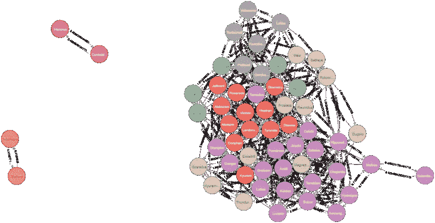

# 寻找与网络分析的协同作用

> 原文：<https://towardsdatascience.com/finding-synergies-with-network-analysis-using-neo4j-to-identify-the-best-pok%C3%A9mon-teams-4ff89e791671?source=collection_archive---------31----------------------->

## 使用 Neo4J 确定最佳神奇宝贝团队


*作者图片*

## 在本文中，我们…

使用网络分析来确定在竞争游戏中哪些人是彼此的最佳队友。

讨论衡量团队绩效和队友合作的指标。

解释从 JSON 导入数据和使用 Neo4J 执行社区检测。

标签:Neo4J，CYPHER，JSON，Pokémon，Smogon。

# 摘要

Smogon.com 是一个在线竞技神奇宝贝战斗的平台，它每月发布一份关于比赛数据的 JSON。这是关于电子竞技中玩家行为的大量数据，让我们能够分析竞争对手如何制定策略。在这篇文章中，我们探讨了以下问题:“我能挑选的最好的团队是什么？”一个团队由六只神奇宝贝组成。为了回答这个问题，我们从普通玩家和高排名玩家的比赛中提取数据，并比较这两个群体如何不同地选择团队。因此，我们确定了高成就玩家倾向于选择的神奇宝贝集群。虽然没有一个“最佳”团队，因为每个策略都有一个反策略，但我们可以确定高绩效球员如何选择他们的团队，我们可以确定当前竞争环境中的顶级团队。

# 介绍

术语“元游戏”的意思是“关于游戏的游戏”，它指的是任何类型的游戏中的竞争者如何做出战略选择，以赢得一系列比赛。这方面的例子包括大联盟棒球俱乐部如何为一个赛季挑选他们的球队，或者教练如何计划他们球队的训练制度。在每种情况下，目标都不是赢得一场比赛，而是赢得一系列比赛。

电子竞技是探索元游戏的沃土，因为它们发生在数字空间，这意味着通过正确的工具，我们可以提取游戏中发生的几乎任何事情的数据。

电子竞技的另一个有趣的特点是，游戏的开发者可以而且确实会积极干预游戏的参数，以优化游戏的“平衡”这里的“平衡”是指在一场竞争性比赛中，某些策略可能比其他策略更好。*‘失衡’的结果是一个非常无聊的竞技游戏，在这里只有少数策略是可行的选项。玩家和粉丝希望游戏中有各种有趣的策略可以使用，并对抗这些策略。当游戏平衡时，就有多样性和有趣的各种比赛可以享受。*

*在分析元博弈时，我们可以检查可行策略的多样性，并分析玩家如何达到这些策略。从这个分析中，我们可以回答诸如“在元博弈的当前状态下，什么是最佳策略选择？”*

*在本文中，我们探讨了关于 Smogon.com 的元游戏的两个问题:*

*考察成功的球员如何选择不同于一般球员的球队。我们假设游戏中表现最好的玩家选择的队伍是“最好”的队伍。*

*与 2015 年相比，2020 年的高技能玩家选择团队的方式有所不同，当时 Smogon.com 以不同的方式“平衡”了元游戏。*

# *数据*

*在本文中，我们使用 Smogon.com 管理的“神奇宝贝对决”的数据，通过网络分析展示了元游戏分析。*

*我们的目标是创建一系列网络图，其中我们显示了不同级别玩家排名中神奇宝贝被一起选中的趋势。数据中的变量总结如下:*

# *变量*

*对玩家技能的衡量:在这个分析中，我们使用[‘Elo’分数](https://en.wikipedia.org/wiki/Elo_rating_system)来评估玩家技能。下面的例子解释了 ELO 的基本概念:新玩家从 1，500 Elo 点开始。如果玩家赢得一场比赛，他们将获得 25 分以及一个可变的数额，如果他们击败的对手具有更高的 Elo 分数，则该数额会更大。相反，失败的玩家会失去 25 点 Elo 点数，如果他们输给了级别较低的对手，还会失去更多。随着时间的推移，我们希望 Elo 分数较高的玩家比分数较低的玩家更擅长赢得更多、更艰难的游戏。*

***对两个神奇宝贝一起被选中的一种衡量:**为此，我们使用了“队友权重”，即一个神奇宝贝的选择给另一个选择的后验概率的变化。例如，如果神奇宝贝“Scizor”出现在我们数据集中 40%的团队中，但出现在所有带有“Excadrill”的团队中的 60%，那么我们可以说 Scizor 带有 Excadrill 的“队友权重”为 20。这些权重也可以是负数，这表明拥有神奇宝贝 X 的团队倾向于积极避免选择神奇宝贝 y。*

# *数据源*

*上述变量的来源由 Smogon.com 提供。每个月，Smogon 都会发布一个 JSON 文件，其中包含按技能等级和游戏类型划分的数据。在我们的分析中，我们使用:*

*“第 8 代，过度使用”(gen8OU)游戏类型:这是最平衡的竞争阶梯。在这种游戏类型中，一些太强大的神奇宝贝是不允许的，这样玩家可以从许多可行的策略中选择，而不是被迫只选择一小撮“被压制”的选择。“第 8 代”意味着玩家可以从第 8 版之前的所有神奇宝贝中进行选择。熟悉该系列的人可能知道，每一代大约会推出 150 个新的神奇宝贝。*

*我们正在比较两个 JSON 数据集:平均技能等级(这是一个新手会与之竞争的)和最高技能等级。*

*通过比较 2015 年和 2020 年的最高技能水平，我们还可以看到策略的选择如何随着时间的推移而变化。*

*本文中使用的数据是开放的，可从以下网址获得:*

*[高技能玩家:1825 年 Gen8OU+ELO，2020 年 10 月](https://www.smogon.com/stats/2020-10/chaos/gen8ou-1825.json)*

*[平均技能玩家:2020 年 9 月 0-1500 ELO Gen8OU](https://www.smogon.com/stats/2020-09/chaos/gen8ou-1500.json)*

*[2015 年高技能玩家:2015 年 10 月 Gen5OU at 1760+ELO](https://www.smogon.com/stats/2015-10/chaos/gen5ou-1760.json)*

# *方法学*

*为了直观显示技能等级中的玩家如何选择他们的团队，我们创建了一个网络图，然后进行了社区分析，以确定何时某些神奇宝贝集群被一起选择到了显著的程度。为了进行这种分析，我们设置了一个 neo4j 沙箱，然后创建了一个用 CYPHER 编写的分析管道(参见附录)。*

*我们执行此分析的步骤总结如下:*

*1.我们从 JSON 导入原始数据，并为数据集中的每个神奇宝贝创建一个节点。*

*2.根据相同的 JSON 数据，我们在每个神奇宝贝和其他神奇宝贝之间创建了一个名为“队友”的边(即关系)。这种关系有一个浮动属性，即“队友权重”变量(参见“变量”一节)。*

*3.我们删除了队友权重低于任意阈值(在本例中为 40)的所有关系。这是因为很难将每个节点与其他节点相关的图形可视化，我们只对神奇宝贝很可能被一起挑选出来的关系感兴趣。*

*4.我们实现了 [Louvain 社区检测](https://en.wikipedia.org/wiki/Louvain_method)，类似于层次聚类，以识别更频繁一起选择的神奇宝贝集合。为此，我们将队友权重变量调整为 0 到 1 之间的浮动值。*

*5.最后，我们用由颜色分隔的社区形象化这个图。*

# *结果*

**

*图 1:截至 2020 年 10 月的高技能玩家。*图片作者。**

*在图 1 中，在高技能的玩家中，我们可以看到一些明确定义的团队起草策略。*

***在蓝色的**中，我们有一个 12 个选项的社区，其中 cle 寓言、河马兽和 Toxapex 是最核心的。有经验的玩家可以识别出为什么这是一个强队:cle 寓言是一个强大的神奇宝贝，但对钢铁和毒药很弱。河马兽是对抗大多数钢铁和毒药的绝佳对手，包括广受欢迎的克理寓言，盔甲鸟。毒顶是一种适合对抗*其他*基于寓言的团队的毒药类型。*

*在 brown 中，Excadrill 似乎是许多团队所围绕的神奇宝贝。然而，Excardill 也可能出现在基于 cle 寓言的团队中，通常作为河马兽的替代品(因此河马兽<->Excardill 的队友权重相对较低)。*

***在 orange** 中，Riabloom 是另一个热门的组队选择。在这个社区的左上角可以看到一个有趣的观察结果:Shuckle 似乎是 Riabloom 团队中最常见的角色，并且只有在与 Urshifu 配对时才出现。这告诉我们，在舒克尔和乌尔西弗之间可以发现一种有趣的协同作用。*

***绿色**中，Genesect 是最中心的节点。有趣的是，没有节点将这个社区连接到其他社区，这告诉我们这个团队策略与其他选择相互排斥。*

***红色，**我们有另一个孤立的集群，但只有三个神奇宝贝。这表明这三个经常一起出现，但他们团队中剩余的神奇宝贝是许多不同选择的混合，没有队友权重超过我们的阈值。*

**

*图 2:一般球员中的队友选择，2020 年 9 月。*图片作者。**

*在图 2 中，我们创建了与图 1 中相同的网络图，但是是针对普通玩家的。从图 1 和图 2 中，我们可以比较普通玩家和高技能玩家的团队选择策略。通过比较这两个数字，我们发现:*

*社区的分离要少得多，这意味着普通玩家更频繁地混合来自不同社区的神奇宝贝。因此，被组织成典型团队的神奇宝贝的定义不太明确。这可能表明玩家做出了更多的实验性选择，而更熟练的玩家对队友的最佳组合有更敏锐的感觉。*

*这些社区中最核心的节点不同于高技能层中的节点。这表明普通玩家*并没有和高技能玩家*组成相同的队伍，而是高技能玩家选择了和普通玩家完全不同的队伍。这告诉我们，比赛前的团队选择，而不仅仅是比赛中熟练的决定，是成功的关键因素。*

**

*图 3:高技能选手中的队友选择，2015 年 10 月。*图片作者。**

*比较 2020 年和 2015 年流行的团队也很有趣，当时第 6 代到第 8 代还没有出现。在图 3 中，我们为 2015 年排名靠前的玩家创建了一个网络图。从图中我们再次看到高排名的玩家比普通玩家有更清晰的社区定义。*

*一个有趣的观察是，尽管 cle 寓言和 Excadrill 在 2015 年都可用，但它们并不是团队建设的关键选择，就像我们在 2020 年看到的那样。这向我们表明了元博弈是如何随着时间而变化的。*

# *结论*

*电子竞技中的元游戏是分析战略选择的一个极好的话题，因为我们有一个独特的机会来捕捉玩家如何在不同的战略背景下做出选择的非常详细的信息。在许多游戏中，也在许多其他环境中，单个组件如何协同工作与它们如何单独操作一样重要。这种对行动者之间协同作用的强调是分析由基因、营销活动以及游戏中队友组成的系统的重要方法。*

*在本文中，我们演示了如何使用共现来创建网络图，我们可以通过分析来辨别玩家采用的各种策略。我们可以识别出神奇宝贝的某些选项何时可能有互补的角色，或者何时它们服务于互斥的角色，因此玩家应该选择其中一个，而不是两个。像这样对高技能玩家行为的洞察可以帮助我们理解如何更快地在游戏中取得成功，并将这种方法应用到其他领域。*

# *参考*

*https://www . smogon . com/forums/threads/everything-you-even-want-to-know-about-ratings . 3487422/*

*【https://www.smogon.com/stats/2015-10/chaos/gen5ou-1760.json 号*

*【https://www.smogon.com/stats/2020-10/chaos/gen8ou-1825.json *

*[https://www.smogon.com/stats/2020-09/chaos/gen8ou-1500.json](https://www.smogon.com/stats/2020-09/chaos/gen8ou-1500.json)*

*[https://en.wikipedia.org/wiki/Elo_rating_system](https://en.wikipedia.org/wiki/Elo_rating_system)*

*[https://en.wikipedia.org/wiki/Louvain_method](https://en.wikipedia.org/wiki/Louvain_method)*

# *附录:演练*

*您可以自己重新创建整个分析！完成下面的演练可能需要大约 20-30 分钟。这是一个初学者友好的演练，所以你不需要任何先前的经验。熟悉任何查询语言都有助于理解代码的作用。*

# *准备一个环境*

*1.使用 Neo4J 创建一个免费帐户，并在此创建您自己的沙箱。*

*2.选择“新项目”，然后选择“空白沙盒”*

*3.选择“在浏览器中启动”*

*4.在屏幕的顶部，您会看到命令行，分块输入以下代码(不幸的是，neo4j 沙箱不够强大，无法一次执行所有代码！)*

# *代码*

*分别执行每个注释部分。下面的代码从一个选定的 JSON 文件中提取数据。只需将 URL 更改为 smogon.com/stats,的不同设置，即可分析不同的技能等级或时间段。*

```
*// Create Nodes and Relationships from JSONWITH “https://www.smogon.com/stats/2020-10/chaos/gen8ou-1825.json" AS urlCALL apoc.load.json(url) YIELD valueUNWIND value.data as dFOREACH (name in keys(d) | CREATE (Pokémon:Pokémon {id: name, teammates: keys(d[name].Teammates)}))With valueUNWIND keys(value.data) as nameMATCH (a:Pokémon) WHERE a.id = nameUNWIND a.teammates as tmMATCH (b:Pokémon) WHERE b.id = tmCREATE (a)-[r:Teammate {name: a.id +’<->’+b.id, weight: value.data[a.id].Teammates[b.id]}]->(b)// Cull Relationships where weight is below a thresholdWith 40 as thresholdMATCH p=()-[r:Teammate]->() WHERE r.weight < threshold DELETE r// Scaling weights before community detection algorithmMATCH ()-[r:Teammate]->() WITH toFloat(max(r.weight)) as maxMATCH ()-[r:Teammate]->() SET r.nweight = toFloat(r.weight) / max// Create a named graph with gdc packageCALL gds.graph.create(‘myGraph’,‘Pokémon’,‘Teammate’,{relationshipProperties: ‘nweight’})YIELD graphName// Call the Louvian community detetction algorithm on the named graphCALL gds.louvain.write(‘myGraph’, { writeProperty: ‘community’, relationshipWeightProperty: ‘nweight’ })YIELD communityCount// Name the community after most central nodeMATCH (p:Pokémon)WITH p, p.community as community, size( (p)-[:Teammate]-() ) as centrality ORDER BY community ASC, centrality DESCWITH community, (head(collect(p))).id as top, count(*) as size, collect(p.id)[0..6] as likleyTeam, collect(p) as allORDER BY size DESCFOREACH (p IN all | SET p.communityName = top)// Name the community after most central nodeMATCH (p:Pokémon)WITH p, p.community as community, size( (p)-[:Teammate]-() ) as centrality ORDER BY community ASC, centrality DESCWITH community, (head(collect(p))).id as top, count(*) as size, collect(p.id)[0..6] as likleyTeam, collect(p) as allORDER BY size DESCFOREACH (p IN all | SET p.communityName = top)// Add the community name as a label to each node, which will then color each node in the visualizationMATCH (p:Pokémon)CALL apoc.create.addLabels(p,[p.communityName]) yield node RETURN node// Before visualising, we remove the ‘Pokémon’ label, so neo4j will color code by communityMATCH (p:Pokémon)REMOVE p:PokémonRETURN p.name, labels(p)// Visualize the graphMATCH pkmn=()-[r:Teammate]->() RETURN pkmn*
```