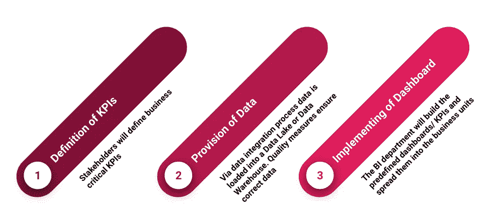
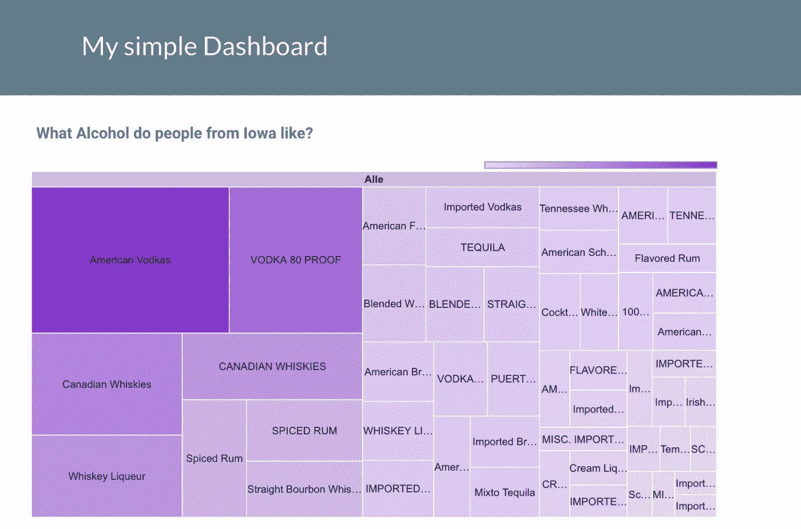
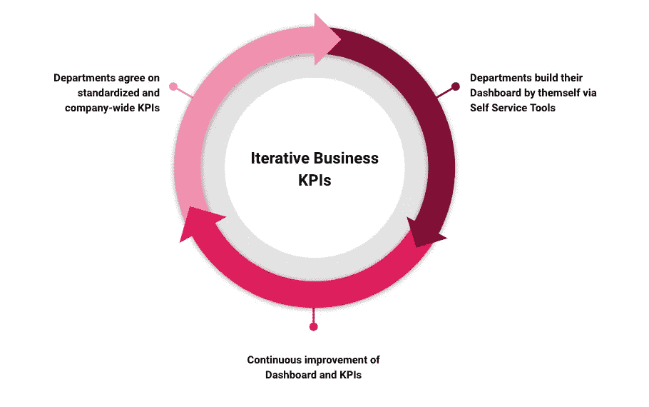

# 寻找正确的数据分析策略

> 原文：<https://towardsdatascience.com/finding-the-right-data-analytics-strategy-e90820970d0?source=collection_archive---------31----------------------->

## 如何构建有意义的 KPI 和仪表板

在 [Unsplash](https://unsplash.com/s/photos/asian-business-woman?utm_source=unsplash&utm_medium=referral&utm_content=creditCopyText) 上由[米米·蒂安](https://unsplash.com/@mimithian?utm_source=unsplash&utm_medium=referral&utm_content=creditCopyText)拍摄的照片

**KPI** 是**关键绩效指标**的缩写。该术语指的是可用于确定公司活动绩效的关键数字。应该考虑哪些 KPI 来衡量成功或失败取决于公司目标[1]。这些 KPI 可以与其他事实和数字一起显示在所谓的**仪表板**上。微软 Power BI、Google Data Studio 或 Tableau 等先进的(自助式)BI 工具可用于此目的。在下面的文章中，我将描述如何战略性地开发这样的 KPI 和仪表板，以及实现这一点的两种方法。

## 自上而下方法

董事总经理和其他高管定义对他们来说有意义的 KPI。这些 KPI 和仪表板然后根据严格的规范实现，并且应该成为公司的准标准。

自上而下的方法流程—作者提供的图片

**Pro:** 流程和数字都是标准化的——这样你就知道数字是从哪里来的，可以让它们变得透明易懂。也使得部门、地区、国家具有可比性。

**反对:** 特殊的区域要求和环境不能或不应该被映射。

## 自下而上的方法

业务部门将借助自助 BI 工具构建 KPI 的任务分配给 IT 部门，或者自己使用这些工具。

通过 Google Data Studio 轻松使用 Self BI——图片由作者提供

这些不是从上面决定的，而是根据自己的需求迭代开发的。

**Pro:**
个别部门和地区完全可以根据自己的需求构建仪表盘。

**反对:**
供应可能会更加耗时，例如，可能需要提供额外的数据。此外，由于部分数据集成(尤其是仪表板的创建)没有标准化，因此很难进行比较。这也会导致更复杂的维护。

自下而上的方法流程—作者提供的图片

## 摘要

这两种方法在公司中经常同时出现。自下而上方法的缺点当然可以通过标准化部门中建立的 KPI 并将其推广到公司来抵消。这里的挑战是，有关各方必须就标准达成一致，但一旦达成一致，结果很可能会比自顶向下的方法更符合实际的操作需求。然而，有一点很清楚，前提是建立一个可扩展且易于使用的数据平台。有了它，这种分析首先成为可能。

> *“KPI 的使用意味着提高和转变组织的绩效。”―* ***朱【2】***

## 资料来源和进一步阅读

[1]KPI.ORG，[什么是关键绩效指标(KPI)？](https://kpi.org/KPI-Basics) (2021)

[2]朱珍珠，[性能大师:用整体方法开启数字性能](https://www.goodreads.com/work/quotes/56857026) (2021)