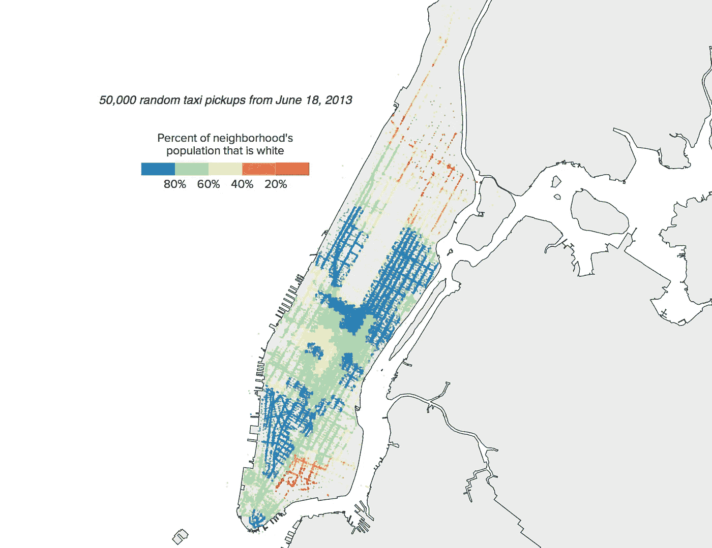

# 查找曼哈顿每对位置之间与时间相关的旅行时间

> 原文：<https://towardsdatascience.com/finding-time-dependent-travel-times-between-every-pair-of-locations-in-manhattan-c3c48b0db7ba?source=collection_archive---------37----------------------->

在这篇文章中，我将向您展示一种相对简单快捷的方法，使用完全开源的软件包和开放数据来计算一天中任何时间曼哈顿每个十字路口之间的旅行时间。代码完全是用 Python 写的，可以在 [GitHub](https://github.com/nick-caros/nyc-travel-times) 上找到。这种方法可以推广到任何有数据的城市。


纽约市的平均交通速度是每小时 4.7 英里。[勒隆·皮耶特斯](https://unsplash.com/@thevantagepoint718?utm_source=unsplash&utm_medium=referral&utm_content=creditCopyText)在 [Unsplash](https://unsplash.com/s/photos/new-york-traffic-jam?utm_source=unsplash&utm_medium=referral&utm_content=creditCopyText) 上的照片

作为一名交通研究人员，我经常遇到利用纽约市的出租车和叫车出行记录来测试算法和假设的研究。需要多少辆自动驾驶汽车来取代整个出租车车队？城市空中出租车机场的最佳位置是哪里？该数据集在研究社区中很受欢迎，因为它是分类的，这意味着它包括每次旅行的记录，包括确切的接送时间和地点，因此可用于非常详细和现实的研究。



来自一篇题为:出租车司机是种族主义者吗？(来源:[https://bennstancil.com/nyc-taxis-and-race](https://bennstancil.com/nyc-taxis-and-race))

使用这些数据的挑战之一是它代表了大量的起点和终点。如果您想要测试算法，或者想要为新的假设三轮车出租车服务设置模拟，您最终需要知道所有可能的上车、下车和闲置车辆位置之间的行驶时间。这是一个多对多的旅行时间问题，计算的次数等于可能位置的个数的平方。此外，如果您想要一天中不同时间或一周中不同天的行驶时间，这意味着重新计算每个时间段的行驶时间。

使用谷歌地图 API 是一种选择，但它不是免费的，如果需要多次调用，成本会很高。像 Valhalla 这样的其他路径包是免费的，但有一个学习曲线，可能需要大量的时间来完成大规模的旅行时间计算。相反，我决定利用 Python 中相对快速的图形分析算法，以及精彩的[优步运动](https://movement.uber.com/?lang=en-US) (UM)数据，其中包括几十个城市中曼哈顿每条道路的行驶速度。完整的方法在下一节中描述。

首先，我需要创建一个网络来代表曼哈顿的街道。幸运的是，有一个 Python 库可以解决这个问题。 [OSMnx](https://github.com/gboeing/osmnx) 是对现实生活中的城市进行空间分析的天赐之物，它包括一个单线功能，可以创建世界上几乎任何城市的街道网络图(见下文)。它使用 OpenStreetMap 创建图表。

```
import osmnx as ox
G = ox.graph_from_place('Manhattan, New York, USA', network_type='drive')
```

该网络包括每个街道交叉口的结点以及每条道路每个方向的边。我们现在可以使用网络算法来寻找每对节点之间的最短路径(即网络中的每个交叉点)。 [NetworkX](https://networkx.org/) 是一个通用且功能强大的库，内置最短路径函数，是 OSMnx 的构建模块之一。我们可以使用以下代码行创建一个 shortest_path 生成器:

```
import networkx as nx
path_enumerator = nx.shortest_path(G, weight='weight')
```

然后我们可以通过调用`path_enumerator[origin][destination]`找到包含任意节点对之间最短路径的边集。我们还可以使用单独的函数为最短路径的*创建一个生成器:*

```
*path_generator = nx.shortest_path_length(G, weight='weight')*
```

*但是在这种情况下“最短”是什么意思呢？您会注意到，该函数采用一个“权重”输入参数，该参数可用于指定在确定“最短”路径时使用哪些属性。现在，我们的边包括距离属性，但没有旅行时间。*

*OSMnx 确实包括一个单独的功能来分配网络中每个链接的旅行时间，但它们是基于 OpenStreetMap 的自由流旅行速度。在曼哈顿几乎没有自由流动的流量，所以这对于大多数应用程序来说是行不通的。幸运的是，OSMnx 保留了网络中每条边的 OSM 路 ID 作为边属性。猜猜 OSM 路 ID 还索引了什么？UM 速度数据。我们需要做的就是导入 UM 数据，将速度作为一个新属性附加到每条边上，然后使用速度作为最短路径算法的权重。*

*UM 数据可以从网站上以 CSV 格式下载。下面是一个例子，说明如何使用 Python 从 CSV 导入 UM 数据，并使用方式 id 作为键，速度作为值创建一个字典。*

```
*import pandas as pd
df = pd.read_csv('Data/nyc_avg_speeds_2019-06.csv') 
mydict = dict([(t.osm_way_id, t.speed) for t in df.itertuples()])*
```

*现在，我们可以快速找到曼哈顿任何两个地点之间在任何时间段或任何感兴趣的一天的最短驾驶时间。如果使用滑行数据，请注意，OSMnx 包括将任何纬度/经度对捕捉到最近的图形节点的功能:*

```
*pickup_node = ox.get_nearest_node(G, (lon, lat))*
```

*这种方法不仅限于曼哈顿。OSMnx 覆盖了全球大部分地区，而 UM 包括了不同大洲的许多城市，因此它也可以用于开罗、悉尼或班加罗尔。*

*我希望这能对你有所帮助。如果你在自己的研究中使用这个作为资源，请让我知道。*

*[1]从 2016 年 6 月开始，这些位置实际上被汇总到了社区级别，在此之前，一些聪明人发现你可以使用准确的位置数据来[跟踪城市中的名人，并确定脱衣舞俱乐部顾客住在哪里](https://www.fastcompany.com/3036573/nyc-taxi-data-blunder-reveals-which-celebs-dont-tip-and-who-frequents-strip-clubs)。*

*[2] UM 速度数据基于优步驾驶员记录的行驶速度，可用于一周中任意一天或多天的 5 个时间段。*

*[3] OpenStreetMap 数据是 OpenStreetMap 贡献者。*