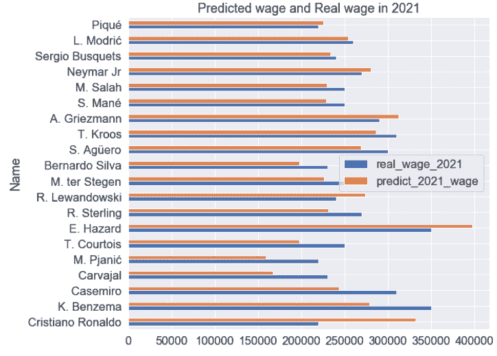

# 在被低估的足球运动员中发现未开发的潜力

> 原文：<https://towardsdatascience.com/finding-untapped-potential-in-undervalued-soccer-players-8de0f6e54263?source=collection_archive---------32----------------------->

## 世界级的足球运动员收入丰厚。

维也纳·雷耶斯在 [Unsplash](https://unsplash.com?utm_source=medium&utm_medium=referral) 上拍摄的照片

不出所料，世界级的足球运动员收入不菲。

据美国经济杂志 [Forbes](https://www.forbes.com/sites/christinasettimi/2020/09/14/the-worlds-highest-paid-soccer-players-2020-messi-wins-mbappe-rises/?sh=c12b641cff04) 报道，2020 年，阿根廷足球运动员莱昂内尔·梅西以 1.26 亿美元的收入排名世界第一。我使用了国际足联数据集中的统计元素来探究这些元素是如何影响球员工资的。我从 [Kaggle](https://www.kaggle.com/bryanb/fifa-player-stats-database?select=FIFA21_official_data.csv) 得到了 FIFA 数据集。

来自 [Kaggle](https://www.kaggle.com/bryanb/fifa-player-stats-database?select=FIFA21_official_data.csv) 的 FIFA 数据集

然后我分析了相对于能力被低估的球员(相对于能力领取低工资)。

## 换句话说，**该分析的目标**是

1.  根据球员 2020 年的特征数据预测 2021 年的工资，并模拟其与 2021 年实际工资的匹配程度
2.  预测与他们的特征元素相比目前被低估的未来足球明星。

# **[目标# 1——根据球员 2020 年的特征数据预测 2021 年的工资，并模拟其与 2021 年实际工资的匹配程度]**

照片由 [Siora 摄影](https://unsplash.com/@siora18?utm_source=medium&utm_medium=referral)在 [Unsplash](https://unsplash.com?utm_source=medium&utm_medium=referral) 上拍摄

## **数据清理**

有 65 个特征，但是我删除了具有“对象”类型和“标记”列的特征(由于大量的空值)。

为了从工资和价值列中删除“€”、“K”、“M”，我创建了几个函数来清理单词，如下所示。此函数还将“工资”和“价值”列的类型更改为 float，然后乘以 1，000，000 而不是“M”，乘以 1，000 而不是“K”。

用于删除字符串并将字符串数据转换为数字数据的函数

使用创建的函数清理数据(11，779 行和 47 列)

然后，我可视化了 Wage_2021(€)的信息，这是预测的目标。

直方图和箱线图

似乎有太多的局外人，因为著名的明星球员拿着巨额工资。

在这些特性中，我删除了“ID”和“Name”列，只选择数字数据，并为每个特性创建了直方图以便可视化。

每个特征的直方图

从直方图中，我意识到这些特征没有被缩放。所有要素都应进行归一化，以符合相同的单位。

我使用了来自 **Scikit-learn 库**的 **StandardScaler()** 。

首先，由于我使用原始值来预测工资，“Wage_2021(€)”应该从标准化中排除。

我设置**w 2020 _ 21 _ picher . drop([' Wage_2021(€)']，axis = 1)为 X** 使用除 Wage _ 2021(€)以外的所有特性，然后使用 StandardScaler()。fit_transform()归一化所有要素。

完成这项工作后，所有缩放后的特征通过 pd.concat 函数与“Wage_2021(€)”的原始值相结合。最后，我将 **Wage_2021(€)设为 y** 进行线性回归。

所有特征都被规范化，如下所示。(y:工资 _2021(€))

数据帧' picher_df '

## **线性回归**

对于线性回归，我将数据分为训练数据集和测试数据集。

为了评估该回归模型，使用了 **R2 评分和**RMSE 评分。

R2 分数和 RMSE 分数

然后，我训练并输出回归系数。打印出回归系数后，我想知道这 45 个特征中哪一个是最有影响的特征，于是我用 statsmodel 库进行了回归分析。我将结果可视化如下。

然后我创建了一个热图来进行关联分析。

首先，我计算了特征之间的相关系数矩阵，并用计算值生成了一个热图。

热图—相关系数矩阵

我检查了系数的多重共线性，作为提高回归预测性能的一种方法。

一般来说，如果 VIF 系数超过 10-15，就意味着出现了多重共线性问题。

VIF 系数

基于这个结果，我选择了

**['弱脚'，'国际声誉'，'技能招式'，'工资 _2020(€)'，'沉着'，'价值 _2020(€)'，'年龄'，'潜力'，'最佳综合评分'，'总体']** 作为有效特征。

从 VIF 因子的得分来看，多重共线性问题似乎发生在最佳总体评分(99.64)和总体评分(102.49)中。

我不得不删除“最佳总体评分”或“总体”来解决多重共线性问题，

当我在删除“总体”后再次计算系数的多重共线性时，另一个系数(“最佳总体评级”)从 99.64 更改为 7.73。

“最佳总体评价”从(99.64)变为(7.73)

完成这项工作后，我用选定的功能重置了 X。

然后用 **R2 分数和**RMSE 分数再次评估回归模型。

具有选定 VIF 系数的 R2 评分和 RMSE 评分

第一次得分与第二次得分的比较

## **可视化**

具有选定特征的 X(['弱脚'，'国际声誉'，'技能移动'，'工资 _2020(€)'，'沉着'，'价值 _2020(€)'，'年龄'，'潜力'，'最佳综合评分'])，

我用**predict _ 2021 _ wage = lr . predict(X)预测了 2021 年的工资。**然后将‘预测 _ 2021 _ 工资’和‘工资 _ 2021(€)’与 picher_df 结合。

连接数据框后，我将列**‘y’重命名为‘real _ Wage _ 2021’，****‘Wage _ 2020(€)’重命名为‘real _ Wage _ 2020’**。

并且只分析了续约后工资有变化的球员。

## **结果 _df:**

## 结果可视化 _df:

用 Matplotlib 可视化

数据机器人可视化

# **【目标 2——预测与他们的特征元素相比目前被低估的未来足球明星。]**

Andriyko Podilnyk 在 [Unsplash](https://unsplash.com?utm_source=medium&utm_medium=referral) 上拍摄的照片

为了找出那些年轻、身体状况良好但被低估的球员(目前工资较低，因此将有利于俱乐部)，我重新加载了数据集，并使用了从系数的多重共线性中选择的列。对于守门员的数据集，我添加了[' GK driving '，' GKHandling '，' GKKicking '，' GKPositioning '，' GKReflexes']列，这是专门为守门员提供的。

我用 **75%** 作为条件的值来计算被低估的玩家。

**对于年龄，我使用 25%的值作为标准，而不是 75%的值。这是因为与其他属性不同，年龄越小越好。此外，我没有使用工资和价值列，因为工资和价值应该在其他功能设置为确定的标准后进行评估。**

用于生成描述性统计数据的描述函数

年龄使用 25%,其他特征使用 75%

以上所有条件，球员有 92 个结果，门将球员有 8 个结果。

我按照**工资 _2021(€** 一栏升序排列结果。

92 名被低估的球员

8 名被低估的门将球员

从结果来看，我发现 92 名球员和 8 名门将的能力被低估了。

[Md Mahdi](https://unsplash.com/@mahdi17?utm_source=medium&utm_medium=referral) 在 [Unsplash](https://unsplash.com?utm_source=medium&utm_medium=referral) 上拍摄的照片

# 结论

总之，从 Kaggle 数据集中有超过 50 个关于足球运动员的统计特征。基于数据集使用线性回归模型预测足球运动员的未来工资，在评价中显示出相当高的分数。

此外，VIF 系数有助于挑选最有用的特征。基于这些具体特征，用 describe 函数算出前 25%的数据，就能算出相对于能力被低估的球员。

根据结果，包括 N. Zaniolo、J. Kluivert、L. Ivanuš ec 和 A. Hlož ek 在内的 92 名球员与其能力相比被低估。8 包括 Pau López、D. Livakovi、A. Onana 和 P. Rajkovi 在内的守门员球员与其能力相比也被低估。

如果假设这些特征是基于真实球员的信息进行客观评估的，这些有天赋的年轻球员是转会市场上值得关注的人。