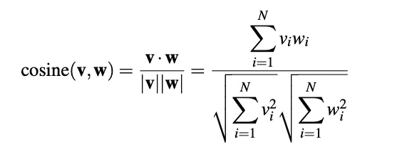
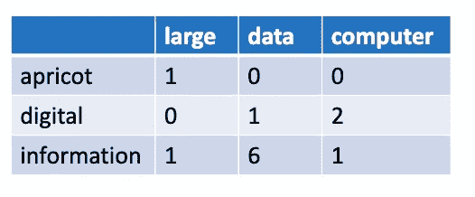
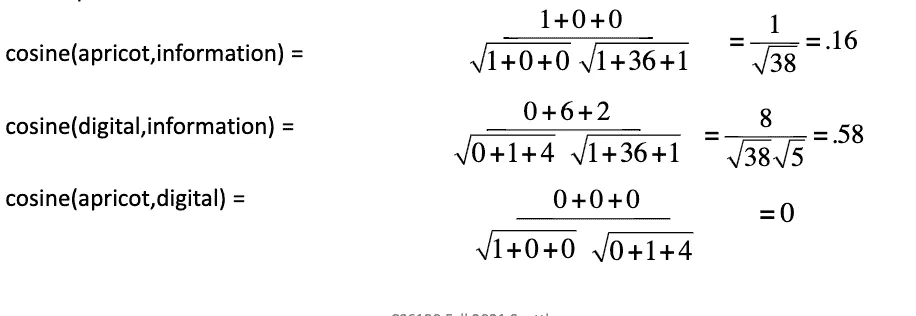
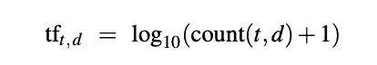
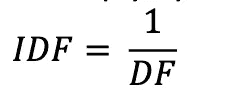

# 在 Python 中使用 TF-IDF 和余弦在术语上下文矩阵中从头开始查找单词相似度

> 原文：<https://towardsdatascience.com/finding-word-similarity-using-tf-idf-in-a-term-context-matrix-from-scratch-in-python-e423533a407?source=collection_archive---------1----------------------->

## 嵌入是直接从单词在文本中的分布来表征单词的意思。这些表示被用在每一个利用意义的 NLP 应用中。

这篇文章的完整代码可以在[这里](https://github.com/cleopatra27/Document-Similarity)找到。

词义的一个重要组成部分是词义之间的关系。例如，当一个单词的意思与另一个单词的意思相同或几乎相似时，我们说这两个单词的两个意思是**同义词**。如*的关键* / *的命令式。*

虽然单词没有很多同义词，但大多数单词都有很多相似的术语。*饭*不是*豆*的同义词，但是*饭*和*豆*无疑是相近的词(都是食物)。在谈论词义之间的关系时，相似性是从同义词的一个有价值的转变；这将简化我们的任务。

我们将分析一系列莎士比亚的文本，并在我们的戏剧中寻找戏剧和文字之间的相似之处。我们的数据有一些来自不同莎士比亚戏剧的句子和戏剧的名字。

# 术语-文档矩阵

意义的向量或分布模型通常基于共现矩阵，这是一种表示单词共现频率的方法。我们将实现两个流行的矩阵；术语-文档矩阵和术语-上下文矩阵。

在术语-文档矩阵中，每行代表词汇表中的一个单词，每列代表文档集合中的一个文档。请看下面我们的实现:

```
def term_document(self, word_list):
    for play, word in word_list:
        if (play, word) in self.term_document_matrix:
            self.term_document_matrix[(play, word)] += 1
        else:
            self.term_document_matrix[(play, word)] = 1
    return self.term_document_matrix
```

我们矩阵中的数据示例如下:

```
('Twelfth Night', 'love'): 77
('Julius Caesar', 'come'): 75
('Romeo and Juliet', 'enter'): 74
```

上面的意思是单词 enter 在戏剧《罗密欧与朱丽叶》的句子中出现了 74 次，以此类推。

我们可以从上面的矩阵中计算出这些剧本之间的相似性，这可以使用**余弦**来完成。这基于线性代数中的点积运算符，可计算如下:



图片来自作者

**余弦**值的范围从指向相同方向的向量的 1 到正交向量的 0。

我们将利用 scipy 的空间库来实现这一点，如下所示:

```
def cos_sim(self, vector1, vector2):
    cosine_similarity = 1 - spatial.distance.cosine(vector1, vector2)
    print(cosine_similarity)
```

我们可以通过一个小样本轻松验证这一点:



图片来自作者



实现此功能以进行测试:

```
**apricot** = [1, 0, 0]
**digital** = [0, 1, 2]
**information** = [1, 6, 1]
print(self.cos_sim(apricot, digital))0.0
```

测试其他样本也返回有效结果，太好了，现在让我们测试我们的数据，我们将相互比较我们的每个文档:

```
def cal_cosine(self, docs):
    tf = self.read_csv()
    play_dict = {}
    for play in self.play_names:
        play_vec = []
        for word in self.vocab:
            play_vec.append(tf[(play, word)])
        play_dict[play] = play_vec

    scores = []
    for k1, v1 in play_dict.items():
        for k2, v2 in play_dict.items():
            if k1 <= k2: continue
            scores.append((self.cos_sim(v1, v2), (k1 ,k2)))
    scores.sort(reverse=True)
    print(scores[:25])
```

我们的顶级**余弦相似点**是:

```
(0.9885556994486011, ('Cymbeline', 'A Winters Tale')),(0.9817079988849085, ('Henry VI Part 2', 'Henry VI Part 1')),(0.9811981513422073, ('Alls well that ends well', 'A Winters Tale'))
```

# 术语上下文矩阵

对于我们上面的计算，我们使用了频率，但原始频率可能会非常倾斜，要知道我们的单词或文档共享哪些上下文，停用词在这里或任何其他频繁出现的单词形式都没有用，不知何故，在你关注的单词附近出现的单词的频率更重要。

这个问题的解决方案是使用 *tf-idf* 加权，这是两项的乘积:

***TF***——这是词频，即单词 *t* 在文档 *d、*中的出现频率，这是在日志空间中计算的:



图片来自作者

***IDF*** -本逆文档频率***N/df***；其中 N 是集合中的文档总数，df 是一个术语出现在其中的文档数。这使得只在少数文档中出现的单词具有更高的权重。仅限于几个文档的术语有助于将这些文档与集合中的其他文档区分开来。术语出现的文档越少，权重越高，这也是在日志空间中计算的:


图片来自作者

***TF-IDF*** 是 ***TF*** 和 ***IDF*** 的点积，因此计算为:


图片来自作者

让我们在当前的语料库上尝试一下，我们将从实现一个术语上下文矩阵开始，我们将查看每个单词和前后的 4 个单词，然后统计它在同一个单词周围出现的频率。

```
def term_context(self):
    term_context = defaultdict(lambda: defaultdict(lambda: 0))
    with open("ShakespearePlays_text.csv", "r") as f:
        # load csv
        reader = csv.reader(f, delimiter=";")
        # loop through line in csv
        for line in reader:
            play_name = line[1]
            if play_name not in self.play_names:
                continue
            tokens = line[5].split()
            sentence = []
            for term in tokens:
                token = self.clean(term)
                if token in self.vocab:
                    sentence.append(token)
            for i in range(len(sentence)):
                word = sentence[i]
                for j in range(max(0, i - 4), min(len(sentence), i + 5)):
                    if i == j: continue
                    term_context[word][sentence[j]] += 1
    return term_context
```

我们的术语上下文矩阵看起来像这样:

```
'**befortune**': ({'i': 1, 'wish': 1, 'all': 1, 'good': 1, 'you': 1})'**bohemia**': ({'chance': 1, 'camillo': 1, 'to': 4, 'visit': 1,'on': 1, 'difference': 1, 'betwixt': 1, 'our': 1, 'and': 5, 'your': 1, 'sicilia': 1, 'means': 1, 'pay': 1, 'the': 5, 'visitation': 1}
```

接下来，我们将构建我们的文档频率矩阵，我们将使用上面的术语上下文来完成这个任务，(以减少计算时间并使用更小的子集)，

```
def cal_doc_freq(self, term_frequency):
    values_per_key = {}
    for k, v in term_frequency:
        values_per_key.setdefault(k, set()).add(v)
    counts = {k: len(v) for k, v in values_per_key.items()}
    return counts
```

我们将使用下面的公式计算术语上下文中所有单元格的文档频率:



图片来自作者

我们将计算 ***TF-IDF***

```
 t = self.read_csv()
    counts = self.cal_doc_freq(t)
    tc = self.term_context()
    for i in tc:
        for j in tc[i].keys():
            tc[i][j] = tc[i][j] * (1 / counts[j])
    return tc
```

我们将在我们的 vocab 的一个小子集上进行测试，并找到单词罗密欧、朱丽叶、贵族、凯撒和朋友与其他单词的相似性。

```
def compute_word_similarity(self, words):
    tc = self.idf()

    def to_vec(w):
        vec = []
        for x in self.vocab:
            vec.append(tc[w][x])
        return vec

    for word in words:
        word_vec = to_vec(word)
        scores = []
        c = 0
        for k in tc.keys():
            if k == word: continue
            k_vec = to_vec(k)
            scores.append((self.cos_sim(word_vec, k_vec), k))
            c += 1
            # if  c > 10: break
        scores.sort(reverse=True)
        print("Top-5 matches for " + word + ": ", scores[:5])
```

我们的前 5 个相似词是:

```
**Top-5 matches for romeo**:  [(0.7349592582145151, 'dead'), (0.7291389527324256, 'he'), (0.7256033280986567, 'then'), (0.7237096963536124, 'it'), (0.719416236702853, 'where')]**Top-5 matches for juliet**:  [(0.7840722487008701, 'lucius'), (0.7700540752904482, 'servants'), (0.7692483251584336, 'soldiers'), (0.7682255792237922, 'warwick'), (0.7672900349518263, 'others')]**Top-5 matches for nobleman**:  [(0.8139265551526883, 'woman'), (0.813455008644156, 'soldier'), (0.808373550553078, 'little'), (0.8053083580334184, 'gentleman'), (0.8046068607590102, 'stranger')]**Top-5 matches for caesar**:  [(0.8897940437391335, 'him'), (0.8825311102107262, 'them'), (0.8718307075270313, 'that'), (0.8707738937545483, 'his'), (0.8674185090147457, 'me')]**Top-5 matches for friend**:  [(0.9280138220686541, 'wife'), (0.9239327316145367, 'daughter'), (0.9111186066627961, 'father'), (0.9091224168395339, 'brother'), (0.9086148854991047, 'mother')]
```

这看起来很合理，因为朋友——妻子、女儿、兄弟、父亲和母亲确实有一些相似之处。贵族和绅士或许还有士兵有一些相似之处，等等。

我确信有办法让我们的预测更准确，但这是一个好的开始。

期待问题、评论和反馈。谢了。