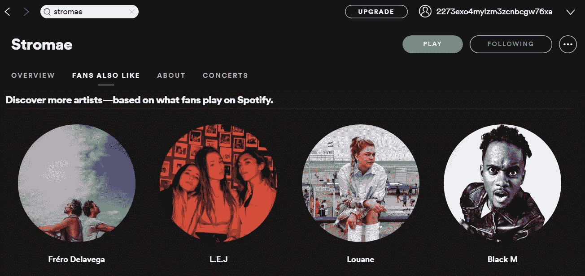

# 使用 Networkx 在 Spotify 上查找下一位最喜欢的艺术家

> 原文：<https://towardsdatascience.com/finding-your-next-beloved-artists-37596d48f32c?source=collection_archive---------33----------------------->

## 你现在最喜欢的艺术家会如何影响你对新音乐人才的追求？

安托万·朱利安在 [Unsplash](https://unsplash.com/s/photos/artists?utm_source=unsplash&utm_medium=referral&utm_content=creditCopyText) 上拍摄的照片

一年来，我一直在查看 Spotify 的 Discover Weekly，尽管我很欣赏他们的选择，但我发现自己在推荐的 30 首歌曲中，最多只喜欢 5 首。我喜欢的那些人的共同点是，我会点击他们背后的艺术家的简介，阅读他们的简历，并查看他们的一些热门歌曲。

> **我意识到比起发现歌曲，我更喜欢发现艺术家。**

我知道宝石是稀缺的，一个艺术家很少会有一首以上的热门歌曲，但有时一首歌并不能涵盖一个艺术家的全部，我们错过了探索他们的唱片目录的机会。

本文探讨了一种基于你的历史流媒体偏好在 Spotify 上寻找新艺术家的策略。每一步都伴随着一个使用 Spotify API 的 Python 实现。

下图是司徒迈(比利时艺术家)在 Spotify 上的个人资料页面。点击“**粉丝也喜欢**”，根据对 Spotify 社区收听历史的分析，你会找到多达 50 位与司徒迈相似的艺术家的列表。API 文档没有深入到相似性度量的细节，但我认为它是音乐特征和协作过滤的结合(即，如果两个艺术家拥有相同的粉丝群，那么他们很可能是相似的)。

Spotify 上的司徒迈个人资料(信用:[https://www.spotify.com](https://www.spotify.com))

“**粉丝也喜欢**”列表不够翔实，因为它只显示了与司徒迈相似的艺术家，而没有考虑我个人的历史流媒体偏好。换句话说，如果能知道“**粉丝也喜欢**”页面上的艺人和我的前 50 名歌手有多相似，那就更有帮助了。

与司徒迈相似的艺人名单(鸣谢:[https://www.spotify.com](https://www.spotify.com))

例如， **Black M** 被认为是第四个与司徒迈相似的人物，但我很想知道，在我的年度前 50 名艺术家中，有多少人与 Black M 有关

## 第一步:检索 Spotify 流媒体数据

在 [Spotify 上为开发者](https://developer.spotify.com/)创建一个账户后，您将收到一个 API 令牌来访问您的流媒体历史记录。

Spotify 在三个不同的时间范围内跟踪您的前 50 位艺术家:

*   *短期*:基于你上个月的流媒体
*   *中期*:基于你过去六个月的流水
*   *长期*:自你的 Spotify 账户创建以来

我们编辑了以下三个时间范围内的顶级艺术家列表:

## 第二步:创建一个你最喜欢的艺术家的网络

网络说明了我喜欢的艺术家是如何联系在一起的。大节点是我的前 50 名艺术家，小节点是与他们相关的其他艺术家。请注意 **Black M** 与我已经喜欢的 4 位艺术家联系在一起，这意味着我应该探索他的音乐，尽管就与司徒迈的相似性而言，他似乎是第四位。

Spotify 上我最喜欢的艺术家的网络可视化

## 第三步:排列艺术家

与我的前 50 名联系最多的艺术家列表

按照同样的逻辑，我们统计网络中每个艺术家的学位，然后排除前 50 名的艺术家。结果是一个表格，显示了与我的前 50 位艺术家联系最多的艺术家。艺术家之间的联系越多，我就越有可能觉得他们的音乐有趣，值得探索。

***注:*** *我恰好只知道这一张表中 30%左右的艺人。但看到他们与我的前 50 名艺术家有如此紧密的联系还是很有趣的。*

在 Spotify 上包含这一功能将允许用户根据他们的流媒体偏好发现更丰富的艺术家网络，这将改善我们的音乐发现体验，并让艺术家对他们的整个作品给予相当多的关注。

<https://github.com/Tahahaha7> 