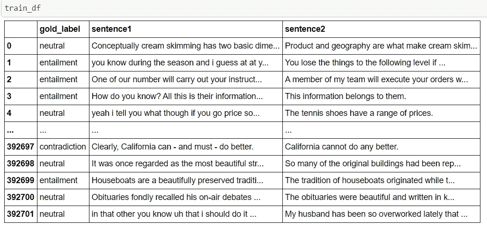
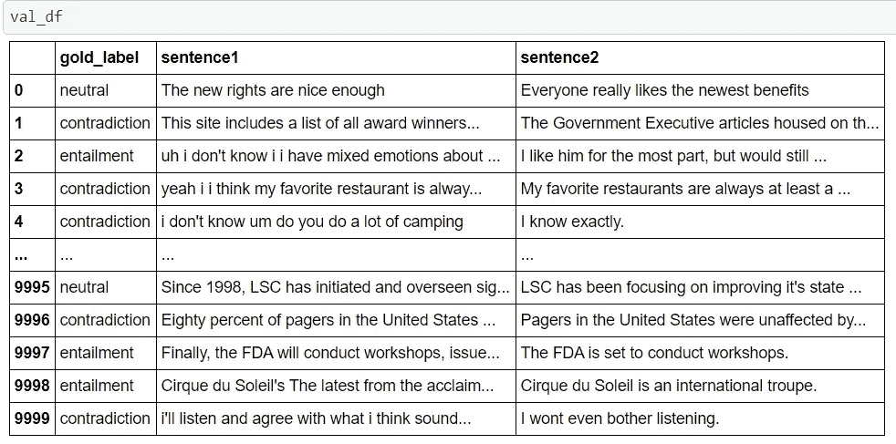

# 用于句子蕴含的微调预训练转换器模型

> 原文：<https://towardsdatascience.com/fine-tuning-pre-trained-transformer-models-for-sentence-entailment-d87caf9ec9db?source=collection_archive---------7----------------------->

## 在 MultiNLI 数据集上微调 BERT 的 PyTorch 和 Hugging Face 实现


图片来自 [PNGWING](https://www.pngwing.com/en/free-png-ncpgf) 。

在本文中，我将描述使用 MultiNLI 数据集(Bowman et al. [通过推理理解句子的大范围挑战语料库](https://www.aclweb.org/anthology/N18-1101/))对诸如 BERT 和 ALBERT 之类的预训练模型进行微调的过程。模型将使用拥抱人脸库加载，并使用 PyTorch 进行微调。

# 什么是蕴涵？

为了理解蕴涵，让我们从一个例子开始。
1。吉姆每天早上骑自行车去上学。
2。吉姆会骑自行车。

如果一个提出的前提是真的，就产生了蕴涵。在这个例子中，如果句子“*吉姆每天早上骑自行车去上学。”是真的，那么前提是吉姆每天早上都去上学，吉姆也知道如何骑自行车。因此，这将使第二句话，或假设，也为真。*

用简单的术语来定义蕴涵，如果 *X* 为真并且 *Y* 可以从其逻辑上导出，那么一个句子 *Y* 被称为蕴涵句子 *X* 。对于我使用的数据集，一对句子可以是相互依存的，可以是中性的，也可以是相互矛盾的——下一节将详细介绍数据集。

# MultiNLI 数据集

多体裁自然语言推理(MultiNLI)语料库是一种设计用于开发和评估机器学习模型以理解句子的数据集。它有超过 433，000 个示例，是可用于自然语言推理(也称为识别文本蕴涵)的最大数据集之一。该数据集的设计还使得在斯坦福 NLI 语料库上训练的现有机器学习模型也可以使用 MultiNLI 进行评估。你可以在论文中了解更多关于这个数据集的信息——一个通过推理理解句子的覆盖面广的挑战语料库[。](https://www.aclweb.org/anthology/N18-1101/)

作为训练过程的一部分，数据集中考虑了 3 列—“gold _ label”、“句子 1”(前提)和“句子 2”(假设)。“gold_label”是指示给予这对句子的标签的列。有三个标签——“蕴含”、“中性”和“矛盾”
训练集有 392702 个样本，验证集还剩 10000 个样本。



训练集。图片由作者提供。



验证集。图片由作者提供。

# 模特——伯特

[BERT](https://arxiv.org/pdf/1810.04805.pdf)(Transformers 的双向编码器表示)是 Google 基于[这篇论文](https://papers.nips.cc/paper/2017/file/3f5ee243547dee91fbd053c1c4a845aa-Paper.pdf)中介绍的编码器-解码器 transformer 模型的语言模型。它使用变形金刚的注意力机制来学习单词的上下文含义以及它们之间的关系。伯特，以及它的改型如[艾伯特](https://arxiv.org/abs/1909.11942)、[罗伯塔](https://arxiv.org/abs/1907.11692)等。在诸如问答和自然语言推理的各种自然语言处理任务上取得了最先进的结果。

与定向长短期记忆网络不同，变压器编码器一次读取整个单词序列。这使得模型可以根据一个单词的所有环境来学习它的上下文。转换器的编码器模块将令牌序列作为输入。这些首先被嵌入到向量中，并通过前馈神经网络进行反馈。这个神经网络的输出是一个向量序列，每个向量对应于一个给定索引的输入序列。

虽然我不会详细说明 BERT 的训练过程，但是你可以阅读[这篇文章](/bert-explained-state-of-the-art-language-model-for-nlp-f8b21a9b6270)来获得关于它的工作以及训练它的程序的详细描述。

# 微调伯特

最后，进入使用拥抱脸和 PyTorch 微调预训练 BERT 模型的过程。在这个例子中，我使用了“bert-base”模型。由于计算限制和 Google Colab 上的训练时间，这是在从原始训练集中采样的 100，000 个训练样本上训练的。

第一步涉及到创建一个 DataLoader 对象来为模型提供数据。用于序列分类的 BERT 要求数据以一定的格式排列。每个句子的开始需要有一个***【CLS】***标记存在，句子的结束需要一个***【SEP】***标记。因此，对于由两个句子组成的序列，需要将其格式化为***【CLS】句子 1【SEP】句子 2【SEP】***。此外，每个序列都需要有与之相关联的 segment _ ids。序列中的第一句用[0]标记，第二句用[1]标记。最后，每个序列都需要一个注意力屏蔽来帮助模型确定输入序列的哪一部分不是填充的一部分。

创建 DataLoader 对象

既然已经创建了定型集和验证集的 DataLoader 对象，那么就可以加载模型及其优化器了。对于这种情况，我将使用 BertForSequenceClassification 预训练模型。这个模型提供了一个额外的参数来添加一个可选的分类头和所需数量的标签。对于这种情况，有三个类。因此，我将 num_labels 设置为 3。这增加了一个具有三个输出单元的分类头作为最终层。

加载预训练模型

既然已经加载了模型，那么是时候进入训练和验证循环了。作为训练过程的一部分，该模型被微调了 5 个时期。

培训和验证循环

定义了训练和验证循环后，我们可以在 MultiNLI 数据集上调整模型，以尝试实现预期的性能。

```
Epoch 1: train_loss: 0.5973 train_acc: 0.7530 | val_loss: 0.5398 val_acc: 0.7836 01:47:59.10 
Epoch 2: train_loss: 0.3623 train_acc: 0.8643 | val_loss: 0.5222 val_acc: 0.8072 01:48:18.70 
Epoch 3: train_loss: 0.2096 train_acc: 0.9256 | val_loss: 0.6908 val_acc: 0.7939 01:48:11.29 
Epoch 4: train_loss: 0.1295 train_acc: 0.9558 | val_loss: 0.7929 val_acc: 0.7891 01:47:59.77 
Epoch 5: train_loss: 0.0916 train_acc: 0.9690 | val_loss: 0.8490 val_acc: 0.7906 01:47:52.39
```

从上面的损失和精度值可以看出，模型似乎在学习，同时有点过度拟合。这可以通过用更多的数据而不是采样的 100，000 个样本进行训练来解决。

感谢您阅读本文！这个项目的全部代码，以及其他模型基准，可以在[https://github.com/dh1105/Sentence-Entailment](https://github.com/dh1105/Sentence-Entailment)找到。

# 参考

1.  [通过推理理解句子的大范围挑战语料库](https://www.aclweb.org/anthology/N18-1101/)
2.  [伯特:用于语言理解的深度双向转换器的预训练](https://arxiv.org/pdf/1810.04805.pdf)
3.  [注意力是你所需要的一切](https://papers.nips.cc/paper/2017/file/3f5ee243547dee91fbd053c1c4a845aa-Paper.pdf)
4.  [ALBERT:一个用于语言表达自我监督学习的 Lite BERT】](https://arxiv.org/abs/1909.11942)
5.  [RoBERTa:一种稳健优化的 BERT 预训练方法](https://arxiv.org/abs/1907.11692)
6.  [https://towards data science . com/Bert-explained-state-of-art-state-language-model-for-NLP-F8 b 21 a9 b 6270](/bert-explained-state-of-the-art-language-model-for-nlp-f8b21a9b6270)