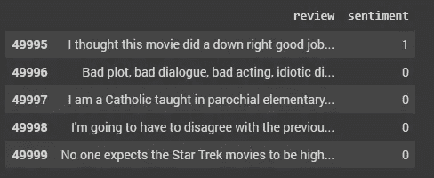
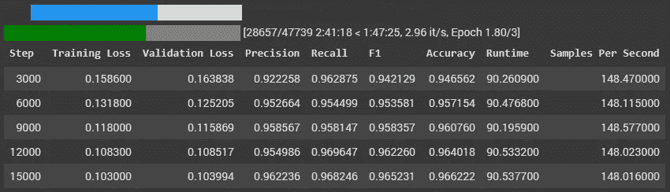

# 使用 Huggingface 的训练器微调预训练的 NLP 模型

> 原文：<https://towardsdatascience.com/fine-tuning-pretrained-nlp-models-with-huggingfaces-trainer-6326a4456e7b?source=collection_archive---------3----------------------->

## 无需原生 Pytorch 或 Tensorflow 即可微调预训练 NLP 模型的简单方法


克里斯托夫·高尔在 [Unsplash](https://unsplash.com?utm_source=medium&utm_medium=referral) 上拍摄的照片

**动机**:在参加一个数据科学竞赛时，我正在微调一个预先训练好的模型，并意识到使用原生 PyTorch 或 Tensorflow 来微调一个模型是多么乏味。我用 Huggingface 的训练器 API 进行了实验，并对它的简单程度感到惊讶。由于网上关于如何使用 Huggingface 的训练器 API 的例子很少，我希望提供一个简单的例子，说明如何使用训练器来微调你的预训练模型。

在我们开始之前，这里有一些理解本文的先决条件:

1.  对 Python 的中级理解
2.  对训练神经网络模型的基本理解
3.  对迁移学习的基本理解

为了节省您的时间，我将只为您提供代码，这些代码可用于使用训练器 API 来训练和预测您的模型。然而，如果你有兴趣了解它是如何工作的，请继续阅读。

**步骤 1:** 初始化预训练模型和记号赋予器



代码所基于的示例数据集

在上面的代码中，使用的数据是 IMDB 电影情感数据集。这些数据允许我们训练一个模型来检测电影评论的情绪- 1 是积极的，而 0 是消极的。这是序列分类的 NLP 任务，因为我们想要将每个评论(文本序列)分类为正面或负面。

有许多预训练的模型可以用来训练我们的情感分析模型，让我们以预训练的 BERT 为例。预训练的 BERT 模型有很多变体， *bert-base-uncased* 只是其中一种变体。你可以从[拥抱面部模型页面](https://huggingface.co/models)搜索更多预训练模型。

```
model_name = "bert-base-uncased"
tokenizer = BertTokenizer.from_pretrained(model_name)
model = BertForSequenceClassification.from_pretrained(model_name, num_labels=2)
```

由于我们使用的是预训练模型，我们需要确保输入数据的形式与预训练模型的训练形式相同。因此，我们需要使用模型的名称来实例化记号赋予器。

既然已经初始化了模型和记号化器，我们可以继续预处理数据了。

**步骤 2:** 使用预训练的标记器预处理文本

```
X_train_tokenized = tokenizer(X_train, padding=True, truncation=True, max_length=512)
X_val_tokenized = tokenizer(X_val, padding=True, truncation=True, max_length=512)
```

让我们使用前面初始化的标记器对文本进行预处理。

我们用于标记器的输入文本是一个字符串列表。

我们已经设置了`padding=True, truncation=True, max_length=512`,这样我们可以为模型获得相同长度的输入——长文本将被截断为 512 个标记，而短文本将添加额外的标记，使其成为 512 个标记。

使用 512 个令牌，因为这是 BERT 模型可以采用的最大令牌长度。

对文本进行标记后，您将得到一个包含 3 个键的 python 字典:

1.  输入标识
2.  令牌类型标识
3.  注意 _ 屏蔽

**步骤 3:** 创建 torch 数据集

训练器 API 要求模型在`**torch.utils.data.Dataset**` 类中。因此，我们需要创建一个从 torch Dataset 类继承的新类。

在继承的类中，我们需要有`__getitem__`和`__len__`方法，它们允许训练器创建批量数据并分别获得长度。

```
class Dataset(torch.utils.data.Dataset):    
    def __init__(self, encodings, labels=None):          
        self.encodings = encodings        
        self.labels = labels

    def __getitem__(self, idx):
        item = {key: torch.tensor(val[idx]) for key, val in self.encodings.items()}
        if self.labels:
            item["labels"] = torch.tensor(self.labels[idx])
        return item def __len__(self):
        return len(self.encodings["input_ids"])train_dataset = Dataset(X_train_tokenized, y_train)
val_dataset = Dataset(X_val_tokenized, y_val)
```

将默认 labels 参数设置为 None 的目的是，我们可以重用该类来预测看不见的数据，因为这些数据没有标签。

`__getitem__`方法基本上为每个文本返回一个值字典。通过运行该方法，当在训练过程中批量处理数据时，它为每个文本创建一个带有`input_ids`、`attention_mask`和`token_type_ids`的字典。

`__len__`方法需要返回输入数据的长度。

**步骤 4:** 定义培训参数和培训师

```
def compute_metrics(p):    
    pred, labels = p
    pred = np.argmax(pred, axis=1)
    accuracy = accuracy_score(y_true=labels, y_pred=pred)
    recall = recall_score(y_true=labels, y_pred=pred)
    precision = precision_score(y_true=labels, y_pred=pred)
    f1 = f1_score(y_true=labels, y_pred=pred) return {"accuracy": accuracy, "precision": precision, "recall": recall, "f1": f1} # Define Trainer
args = TrainingArguments(
    output_dir="output",
    evaluation_strategy="steps",
    eval_steps=500,
    per_device_train_batch_size=8,
    per_device_eval_batch_size=8,
    num_train_epochs=3,
    seed=0,
    load_best_model_at_end=True,)
trainer = Trainer(
    model=model,
    args=args,
    train_dataset=train_dataset,
    eval_dataset=val_dataset,
    compute_metrics=compute_metrics,
    callbacks=[EarlyStoppingCallback(early_stopping_patience=3)],)

# Train pre-trained model
trainer.train()
```

这就是培训师功能的神奇之处。我们可以在 TrainingArguments 和 Trainer 类中定义训练参数，也可以用一个命令训练模型。

我们需要首先定义一个函数来计算验证集的指标。由于这是一个二元分类问题，我们可以使用准确度、精确度、召回率和 f1 分数。

接下来，我们在 TrainingArgs 和 Trainer 类中指定一些训练参数，设置预训练模型、训练数据和评估数据。

在我们定义了参数之后，只需运行`trainer.train()`来训练模型。



培训师的培训示例

**第五步:**进行预测

```
# Tokenize test data
X_test_tokenized = tokenizer(X_test, padding=True, truncation=True, max_length=512) # Create torch dataset
test_dataset = Dataset(X_test_tokenized) # Load trained model
model_path = "output/checkpoint-50000"
model = BertForSequenceClassification.from_pretrained(model_path, num_labels=2) # Define test trainer
test_trainer = Trainer(model) # Make prediction
raw_pred, _, _ = test_trainer.predict(test_dataset) # Preprocess raw predictions
y_pred = np.argmax(raw_pred, axis=1)
```

训练完模型后，我们对测试数据重复相同的步骤:

1.  使用预训练的标记器标记测试数据
2.  创建 torch 数据集
3.  负载训练模型
4.  定义培训师

要从前面的步骤中加载已训练模型，请将 model_path 设置为包含已训练模型权重的路径。

为了进行预测，也只需要一个命令`test_trainer.predict(test_dataset)`。

做了一个预测之后，你只会得到原始的预测。将它转换成可用的格式需要额外的预处理步骤。

因为这个任务只是一个简单的序列分类任务，所以我们可以只获得轴 1 上的 argmax。请注意，其他 NLP 任务可能需要不同的方式来预处理原始预测。

我希望这篇文章将有助于简化你微调预训练 NLP 模型的过程。请随意阅读官方的 Huggingface 文档，以更好地理解代码并了解它还能做什么。

Edit 1 (23/6/21): Removed `save_steps` parameter from `TrainingArgument` as it is ignored when `load_best_model_at_end` is set to True. Thanks 杨程 for the feedback!

## 参考

[1]https://huggingface.co/transformers/training.html

[2][https://hugging face . co/transformers/main _ classes/trainer . html](https://huggingface.co/transformers/main_classes/trainer.html)