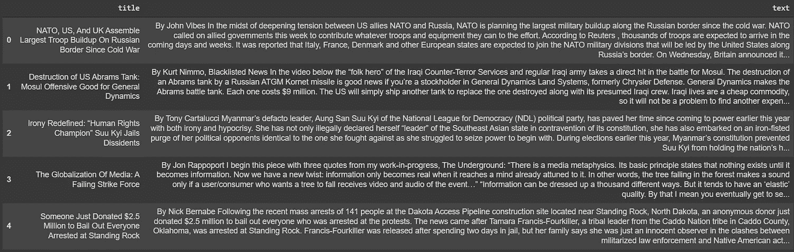
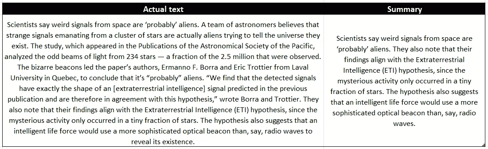

# 文本摘要 BART 大模型的优化

> 原文：<https://towardsdatascience.com/fine-tuning-the-bart-large-model-for-text-summarization-3c69e4c04582?source=collection_archive---------1----------------------->

## 微调模型以总结世界新闻

来源:[https://unsplash.com/photos/Mwuod2cm8g4](https://unsplash.com/photos/Mwuod2cm8g4)

据《大西洋月刊》T4 报道，纽约时报每天发表 150 多篇文章，周日发表 250 多篇。《华尔街日报》每天刊登大约 240 篇报道。其他网站，如 Buzzfeed，每月发布 6000 多篇报道。

随着信息量的增加，摘要成为机器学习/自然语言处理(NLP)中一项非常受欢迎的任务也就不足为奇了。

总结有两种主要方法。第一种，抽取摘要，旨在识别最重要的句子，并使用那些精确的句子作为摘要。

更高级的方法是抽象概括。它包括以一种新的方式解释和总结信息。这是我们将在本文中使用的方法。

## BART 大型模型

像任何 NLP 任务一样，存在可以用作起点的高级模型。这里的想法是使用预训练神经网络模型的所有权重，并将其用作初始点，以便加速训练并提高性能。

在本教程中，使用的模型被称为`facebook/bart-large-cnn`，由脸书开发。它包含 1024 个隐藏层和 406 个参数，并使用 CNN(一个新闻摘要数据集)进行了微调。

如你所见，这个模型非常庞大，所以我建议你使用 Google Colab 来运行代码。它是 100%免费的，并提供轻松访问 GPU，这将加快训练速度。

# 代码

## 1.导入和准备数据

让我们从导入数据(并稍微清理一下)以及微调模型所需的库开始。

我将使用可以在[这里](https://www.kaggle.com/mrisdal/fake-news/data)找到的数据。我将只使用数据集的一小部分来总结被归类为阴谋的新闻。

这里没什么特别的。blurr 库将 huggingface transformer 模型(就像我们使用的那个)与 fast.ai 集成在一起，fast . ai 是一个旨在使深度学习比以往任何时候都更容易使用的库。

正如您在第 22 行看到的，我在本教程中只使用了数据的一个子集，主要是因为内存和时间的限制。这是数据的样子。

这里，`text` 列将被用作我们想要总结的文本，而`title`列将被用作我们想要获得的目标。

我这样做是因为我没有实际的总结，但如果你有，当然你应该把它作为目标。

## 2.导入模型

在本节中，我们将导入预先训练的模型，并为训练准备数据。

这里有点复杂，所以让我们一行一行地看一下每件事是怎么做的:

*   第 2–3 行:这是我们导入预训练 BART 大型模型的地方，我们将对其进行微调。
*   第 7–15 行:这是处理创建小批量输入和目标的地方。我们还指定了任务是什么，以及一组超参数(在 text_gen_kwargs 字典中)。
*   第 20 行:这一行包含创建数据集所需的内容。我们在这里提供什么是文本，什么是目标摘要。
*   第 21 行:我们创建数据集并提供 batch_size。我建议保持这个数字很小，否则你可能会遇到`CUDA OUT OF MEMORY`错误。

要了解更多关于不同功能和参数的信息，我邀请您查看文档[这里](https://ohmeow.github.io/blurr/data-seq2seq-core)和[这里](https://docs.fast.ai/data.block.html#DataBlock.dataloaders)。

## 3.培养

我们现在可以开始实际训练了。

*   第 2–9 行:创建一个字典，其中包含一系列性能指标，这些指标将用于在训练期间评估模型。
*   第 17–19 行:学习函数是我们指定数据、模型和损失函数的地方，这些将用于训练。
*   第 26 行:使用 1cycle 策略来拟合一个模型，这是在这篇[论文](https://arxiv.org/abs/1708.07120)中介绍的，旨在使用较大的学习率非常快速地训练神经网络。我们在这一行中指定了历元数(3)和学习率。

## 4.生成预测

现在让我们看看如何给定一个文本生成摘要。

我只返回一个概要，但是你可以返回多个概要，并从给定的选项中选择最佳的概要。

作为一个例子，这里有一个文本和返回的摘要。

这就对了。考虑到我所做的训练是如此之少，仅仅使用了一个非常小的数据集，这是非常令人印象深刻的。当你想对一个给定的主题保持更新，而不需要阅读关于它的所有内容时，你肯定可以看到摘要的用途。

现在，您已经知道如何微调文本摘要的 BART large。非常感谢你的阅读，我希望我能有所帮助！

代码可以在[这里](https://github.com/francoisstamant/Fine-tuning-for-text-summarization)找到。

成为会员:[https://francoisstamant.medium.com/membership](https://francoisstamant.medium.com/membership)