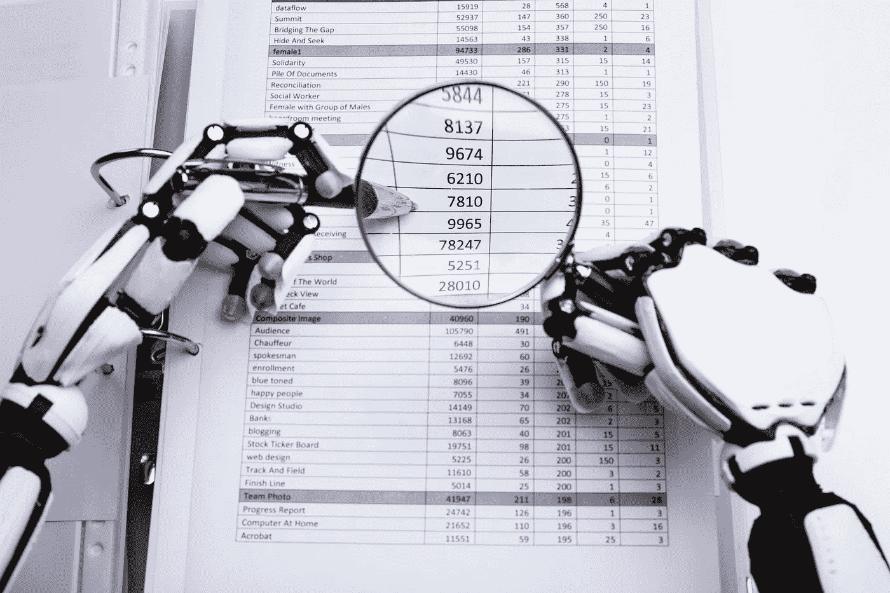
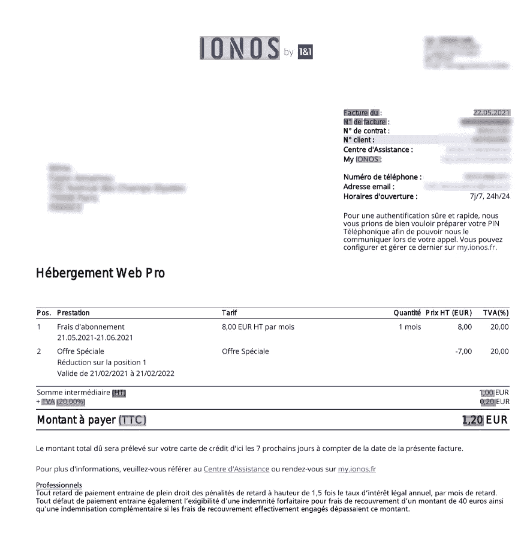
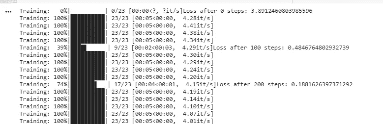
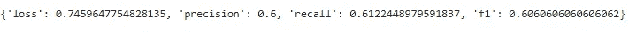
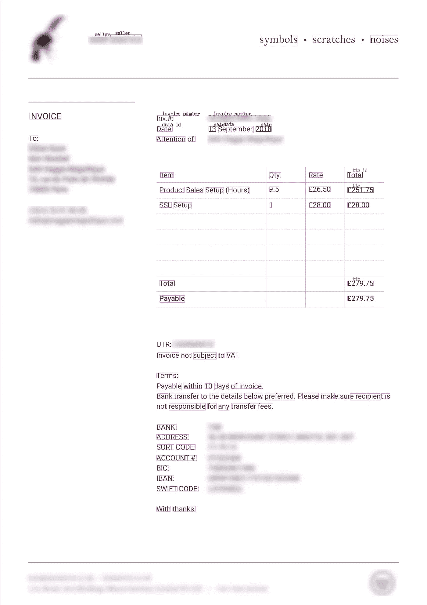

# 用于发票识别的微调变压器模型

> 原文：<https://towardsdatascience.com/fine-tuning-transformer-model-for-invoice-recognition-1e55869336d4?source=collection_archive---------5----------------------->

## 从注释到训练的逐步指南



安德烈·波波夫摄于 [Dreamstime](https://www.dreamstime.com/robotic-hand-examining-financial-data-elevated-view-magnifying-glass-image148941585)

# 介绍

基于我最近关于[如何为 NLP 应用注释 pdf 和扫描图像的教程](/how-to-annotate-pdfs-and-scanned-images-for-nlp-applications-f7b7b1db5c4a)，我们将尝试在一个包含法语和英语发票的注释定制数据集上微调最近发布的微软[布局 LM 模型](https://github.com/microsoft/unilm/tree/master/layoutlm)。虽然之前的教程侧重于使用公开可用的 [FUNSD 数据集](https://guillaumejaume.github.io/FUNSD/)来微调模型，但这里我们将展示从注释和预处理到训练和推理的整个过程。

# LayoutLM 模型

LayoutLM 模型基于 BERT 架构，但增加了两种类型的输入嵌入。第一种是 2d 位置嵌入，表示文档内标记的相对位置，第二种是文档内扫描标记图像的图像嵌入。该模型在几个下游任务中取得了新的最先进的结果，包括表单理解(从 70.72 到 79.27)、收据理解(从 94.02 到 95.24)和文档图像分类(从 93.07 到 94.42)。有关更多信息，请参考[原文](https://arxiv.org/abs/1912.13318)。

幸运的是，这个模型是开源的，可以在 huggingface 库中获得。谢谢微软！

对于本教程，我们将直接从 huggingface 库中克隆模型，并在我们自己的数据集上对其进行微调，下面是 google colab 的链接。但是首先，我们需要创建训练数据。

[https://colab . research . Google . com/drive/1 nkvuyw 6 ne 25 hoz _ IApiv _ miyb 4 LX caq？usp =共享](https://colab.research.google.com/drive/1KnkVuYW6Ne25hOZ_IApiv_MIYb4lxCAq?usp=sharing)

# 发票注释

使用 [UBIAI 文本注释工具](https://ubiai.tools)，我已经注释了大约 50 张个人发票。我对提取实体的键和值感兴趣；例如，在下面的文本“日期:06/12/2021”中，我们会将“日期”注释为 DATE_ID，将“06/12/2021”注释为 Date。提取键和值将有助于我们将数值与它们的属性相关联。以下是所有已被注释的实体:

```
DATE_ID, DATE, INVOICE_ID, INVOICE_NUMBER,SELLER_ID, SELLER, MONTANT_HT_ID, MONTANT_HT, TVA_ID, TVA, TTC_ID, TTC
```

以下是一些实体定义:

```
MONTANT_HT: Total price pre-taxTTC: Total price with taxTVA: Tax amount
```

以下是使用 [UBIAI](https://ubiai.tools) 的注释发票示例:



作者图片:带注释的发票

标注后，我们直接从 UBIAI 中以正确的格式导出训练和测试文件，没有任何[预处理步骤](https://colab.research.google.com/github/NielsRogge/Transformers-Tutorials/blob/master/LayoutLM/Fine_tuning_LayoutLMForTokenClassification_on_FUNSD.ipynb)。导出将包括每个训练和测试数据集的三个文件，以及一个包含所有名为 labels.txt 的标签的文本文件:

培训/测试. txt

```
2018	O
Sous-total	O
en	O
EUR	O
3,20	O
€	O
TVA	S-TVA_ID
(0%)	O
0,00 €	S-TVA
Total	B-TTC_ID
en	I-TTC_ID
EUR	E-TTC_ID
3,20	S-TTC
€	O
Services	O
soumis	O
au	O
mécanisme	O
d'autoliquidation	O
-	O
```

Train/Test_box.txt(包含每个令牌的边界框):

```
€	912 457 920 466
Services	80 486 133 495
soumis	136 487 182 495
au	185 488 200 495
mécanisme	204 486 276 495
d'autoliquidation	279 486 381 497
-	383 490 388 492
```

Train/Test_image.txt(包含边界框、文档大小和名称):

```
€ 912 425 920 434 1653 2339 image1.jpg
TVA 500 441 526 449 1653 2339  image1.jpg
(0%) 529 441 557 451 1653 2339  image1.jpg
0,00 € 882 441 920 451 1653 2339  image1.jpg
Total 500 457 531 466 1653 2339  image1.jpg
en 534 459 549 466 1653 2339  image1.jpg
EUR 553 457 578 466 1653 2339  image1.jpg
3,20 882 457 911 467 1653 2339  image1.jpg
€ 912 457 920 466 1653 2339  image1.jpg
Services 80 486 133 495 1653 2339  image1.jpg
soumis 136 487 182 495 1653 2339  image1.jpg
au 185 488 200 495 1653 2339  image1.jpg
mécanisme 204 486 276 495 1653 2339  image1.jpg
d'autoliquidation 279 486 381 497 1653 2339  image1.jpg
- 383 490 388 492 1653 2339  image1.jpg
```

标签. txt:

```
B-DATE_ID
B-INVOICE_ID
B-INVOICE_NUMBER
B-MONTANT_HT
B-MONTANT_HT_ID
B-SELLER
B-TTC
B-DATE
B-TTC_ID
B-TVA
B-TVA_ID
E-DATE_ID
E-DATE
E-INVOICE_ID
E-INVOICE_NUMBER
E-MONTANT_HT
E-MONTANT_HT_ID
E-SELLER
E-TTC
E-TTC_ID
E-TVA
E-TVA_ID
I-DATE_ID
I-DATE
I-SELLER
I-INVOICE_ID
I-MONTANT_HT_ID
I-TTC
I-TTC_ID
I-TVA_ID
O
S-DATE_ID
S-DATE
S-INVOICE_ID
S-INVOICE_NUMBER
S-MONTANT_HT_ID
S-MONTANT_HT
S-SELLER
S-TTC
S-TTC_ID
S-TVA
S-TVA_ID
```

# 微调 LayoutLM 模型:

在这里，我们使用带有 GPU 的 google colab 来微调模型。以下代码基于[原创 layoutLM 论文](https://github.com/microsoft/unilm/tree/master/layoutlm)和[本教程](https://colab.research.google.com/github/NielsRogge/Transformers-Tutorials/blob/master/LayoutLM/Fine_tuning_LayoutLMForTokenClassification_on_FUNSD.ipynb)。

首先，安装 layoutLM 包…

```
! rm -r unilm! git clone -b remove_torch_save https://github.com/NielsRogge/unilm.git! cd unilm/layoutlm! pip install unilm/layoutlm
```

…以及将从其中下载模型的 transformer 包:

```
! rm -r transformers! git clone https://github.com/huggingface/transformers.git! cd transformers! pip install ./transformers
```

接下来，创建一个包含 labels.txt 中唯一标签的列表:

```
from torch.nn import CrossEntropyLossdef get_labels(path):
    with open(path, "r") as f:
        labels = f.read().splitlines()
    if "O" not in labels:
        labels = ["O"] + labels
    return labelslabels = get_labels("./labels.txt")
num_labels = len(labels)
label_map = {i: label for i, label in enumerate(labels)}
pad_token_label_id = CrossEntropyLoss().ignore_index
```

然后，创建 pytorch 数据集和数据加载器:

```
from transformers import LayoutLMTokenizer
from layoutlm.data.funsd import FunsdDataset, InputFeatures
from torch.utils.data import DataLoader, RandomSampler, SequentialSamplerargs = {'local_rank': -1,
        'overwrite_cache': True,
        'data_dir': '/content/data',
        'model_name_or_path':'microsoft/layoutlm-base-uncased',
        'max_seq_length': 512,
        'model_type': 'layoutlm',}# class to turn the keys of a dict into attributes
class AttrDict(dict):
    def __init__(self, *args, **kwargs):
        super(AttrDict, self).__init__(*args, **kwargs)
        self.__dict__ = selfargs = AttrDict(args)tokenizer = LayoutLMTokenizer.from_pretrained("microsoft/layoutlm-base-uncased")# the LayoutLM authors already defined a specific FunsdDataset, so we are going to use this here
train_dataset = FunsdDataset(args, tokenizer, labels, pad_token_label_id, mode="train")
train_sampler = RandomSampler(train_dataset)
train_dataloader = DataLoader(train_dataset,
                              sampler=train_sampler,
                              batch_size=2)eval_dataset = FunsdDataset(args, tokenizer, labels, pad_token_label_id, mode="test")
eval_sampler = SequentialSampler(eval_dataset)
eval_dataloader = DataLoader(eval_dataset,
                             sampler=eval_sampler,
                            batch_size=2)batch = next(iter(train_dataloader))input_ids = batch[0][0]tokenizer.decode(input_ids)
```

从 huggingface 加载模型。这将在数据集上进行微调。

```
from transformers import LayoutLMForTokenClassification
import torchdevice = torch.device("cuda" if torch.cuda.is_available() else "cpu")model = LayoutLMForTokenClassification.from_pretrained("microsoft/layoutlm-base-uncased", num_labels=num_labels)
model.to(device)
```

最后，开始训练:

```
from transformers import AdamW
from tqdm import tqdmoptimizer = AdamW(model.parameters(), lr=5e-5)global_step = 0
num_train_epochs = 50
t_total = len(train_dataloader) * num_train_epochs # total number of training steps#put the model in training mode
model.train()
for epoch in range(num_train_epochs):
  for batch in tqdm(train_dataloader, desc="Training"):
      input_ids = batch[0].to(device)
      bbox = batch[4].to(device)
      attention_mask = batch[1].to(device)
      token_type_ids = batch[2].to(device)
      labels = batch[3].to(device)# forward pass
      outputs = model(input_ids=input_ids, bbox=bbox, attention_mask=attention_mask, token_type_ids=token_type_ids,
                      labels=labels)
      loss = outputs.loss# print loss every 100 steps
      if global_step % 100 == 0:
        print(f"Loss after {global_step} steps: {loss.item()}")# backward pass to get the gradients 
      loss.backward()#print("Gradients on classification head:")
      #print(model.classifier.weight.grad[6,:].sum())# update
      optimizer.step()
      optimizer.zero_grad()
      global_step += 1
```

你应该可以看到训练进度和损失得到更新。



图片作者:布局 LM 训练进行中

训练后，使用以下函数评估模型性能:

```
import numpy as np
from seqeval.metrics import (
    classification_report,
    f1_score,
    precision_score,
    recall_score,
)eval_loss = 0.0
nb_eval_steps = 0
preds = None
out_label_ids = None# put model in evaluation mode
model.eval()
for batch in tqdm(eval_dataloader, desc="Evaluating"):
    with torch.no_grad():
        input_ids = batch[0].to(device)
        bbox = batch[4].to(device)
        attention_mask = batch[1].to(device)
        token_type_ids = batch[2].to(device)
        labels = batch[3].to(device)# forward pass
        outputs = model(input_ids=input_ids, bbox=bbox, attention_mask=attention_mask, token_type_ids=token_type_ids,
                        labels=labels)
        # get the loss and logits
        tmp_eval_loss = outputs.loss
        logits = outputs.logitseval_loss += tmp_eval_loss.item()
        nb_eval_steps += 1# compute the predictions
        if preds is None:
            preds = logits.detach().cpu().numpy()
            out_label_ids = labels.detach().cpu().numpy()
        else:
            preds = np.append(preds, logits.detach().cpu().numpy(), axis=0)
            out_label_ids = np.append(
                out_label_ids, labels.detach().cpu().numpy(), axis=0
            )# compute average evaluation loss
eval_loss = eval_loss / nb_eval_steps
preds = np.argmax(preds, axis=2)out_label_list = [[] for _ in range(out_label_ids.shape[0])]
preds_list = [[] for _ in range(out_label_ids.shape[0])]for i in range(out_label_ids.shape[0]):
    for j in range(out_label_ids.shape[1]):
        if out_label_ids[i, j] != pad_token_label_id:
            out_label_list[i].append(label_map[out_label_ids[i][j]])
            preds_list[i].append(label_map[preds[i][j]])results = {
    "loss": eval_loss,
    "precision": precision_score(out_label_list, preds_list),
    "recall": recall_score(out_label_list, preds_list),
    "f1": f1_score(out_label_list, preds_list),
}
```

只有 50 个文档，我们得到以下分数:



作者图片:培训后的评估分数

注释多了，肯定能得更高的分数。

最后，保存模型以供将来预测:

```
PATH='./drive/MyDrive/trained_layoutlm/layoutlm_UBIAI.pt'torch.save(model.state_dict(), PATH)
```

# 推论:

现在有趣的部分来了，让我们上传一张发票，对其进行 OCR，并提取相关实体。对于此测试，我们使用的发票不在培训或测试数据集中。为了解析发票中的文本，我们使用开源的 Tesseract 包。让我们安装软件包:

```
!sudo apt install tesseract-ocr!pip install pytesseract
```

在运行预测之前，我们需要解析图像中的文本，并将标记和边界框预处理为特征。为此，我创建了一个预处理 python 文件 [layoutLM_preprocess.py](https://github.com/UBIAI/layout_lm_tutorial.git) ，这将使预处理图像更加容易:

```
import sys
sys.path.insert(1, './drive/MyDrive/UBIAI_layoutlm')
from layoutlm_preprocess import *image_path='./content/invoice_test.jpg'image, words, boxes, actual_boxes = preprocess(image_path)
```

接下来，加载模型并获得单词预测及其边界框:

```
model_path='./drive/MyDrive/trained_layoutlm/layoutlm_UBIAI.pt'model=model_load(model_path,num_labels)word_level_predictions, final_boxes=convert_to_features(image, words, boxes, actual_boxes, model)
```

最后，显示带有预测实体和边界框的图像:

```
draw = ImageDraw.Draw(image)font = ImageFont.load_default()def iob_to_label(label):
  if label != 'O':
    return label[2:]
  else:
    return ""label2color = {'data_id':'green','date':'green','invoice_id':'blue','invoice_number':'blue','montant_ht_id':'black','montant_ht':'black','seller_id':'red','seller':'red', 'ttc_id':'grey','ttc':'grey','':'violet', 'tva_id':'orange','tva':'orange'}for prediction, box in zip(word_level_predictions, final_boxes):
    predicted_label = iob_to_label(label_map[prediction]).lower()
    draw.rectangle(box, outline=label2color[predicted_label]) draw.text((box[0] + 10, box[1] - 10), text=predicted_label, fill=label2color[predicted_label], font=font)image
```

瞧吧:



作者图片:测试发票上的预测

虽然该模型犯了一些错误，如将 TTC 标签分配给购买的商品或不识别某些 id，但它能够正确地提取卖家、发票号码、日期和 TTC。鉴于带注释的文档数量很少(只有 50 个)，结果令人印象深刻，非常有希望！有了更多带注释的发票，我们将能够达到更高的 F 分数和更准确的预测。

# 结论:

总的来说，LayoutLM 模型的结果非常有希望，证明了 transformers 在分析半结构化文本中的有用性。该模型可以在任何其他半结构化文档上进行微调，如驾照、合同、政府文档、财务文档等。

如果您有任何问题，请不要犹豫，在下面提问或发送电子邮件至 admin@ubiai.tools。

如果你喜欢这篇文章，请喜欢并分享！

在 Twitter 上关注我们 [@UBIAI5](https://twitter.com/UBIAI5) 或[订阅这里](https://walidamamou.medium.com/subscribe)！