# 咖啡中的粉末会迁移，但不会太远:第 1 部分

> 原文：<https://towardsdatascience.com/fines-migrate-in-espresso-but-not-far-part-1-44a1e7184224?source=collection_archive---------33----------------------->

## 咖啡数据科学

## 他们对拍摄的影响仍然值得怀疑

我之前在一个用过的冰球上做了一些分析，取一个横截面，观察颗粒分布的差异。与顶部相比，圆盘底部的较细颗粒尺寸略有增加。这似乎是微粒迁移的证据，尽管数量很少。

所以我决定再次进行这个实验，但是收集更多的样本来帮助提高这个结论的可信度。所以我拿了三片，分成上、中、下三块。

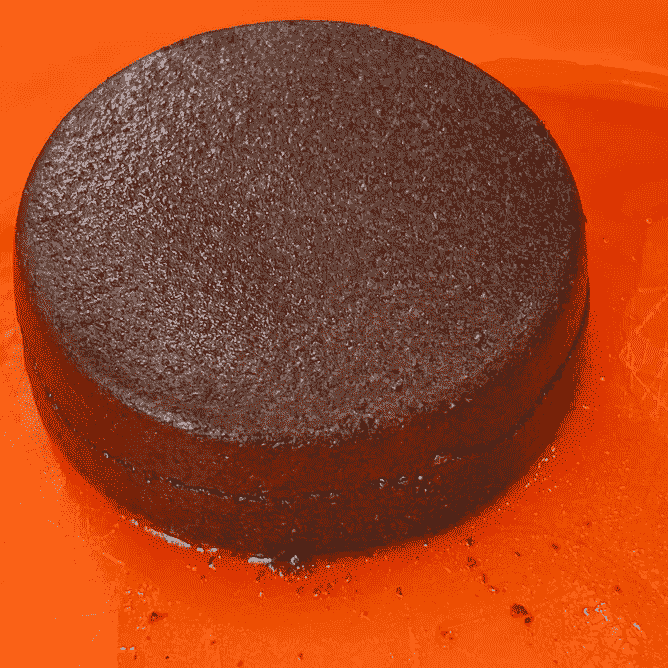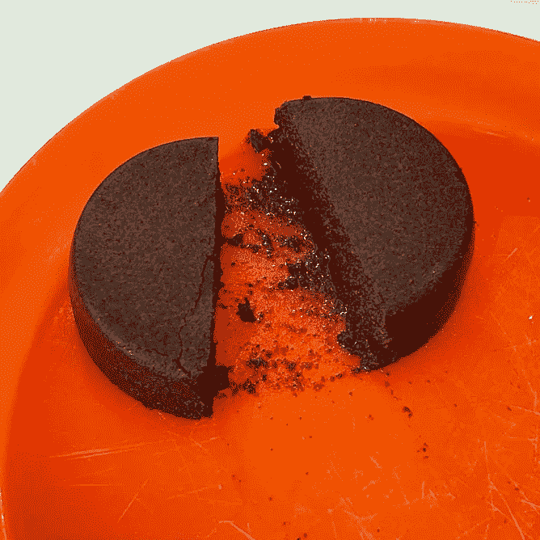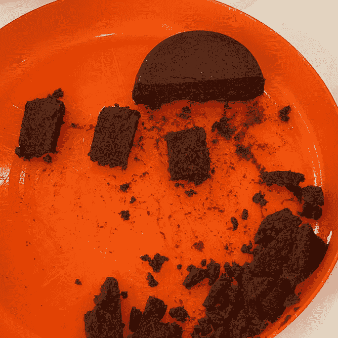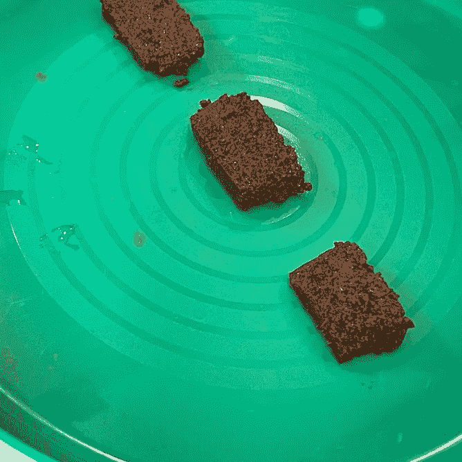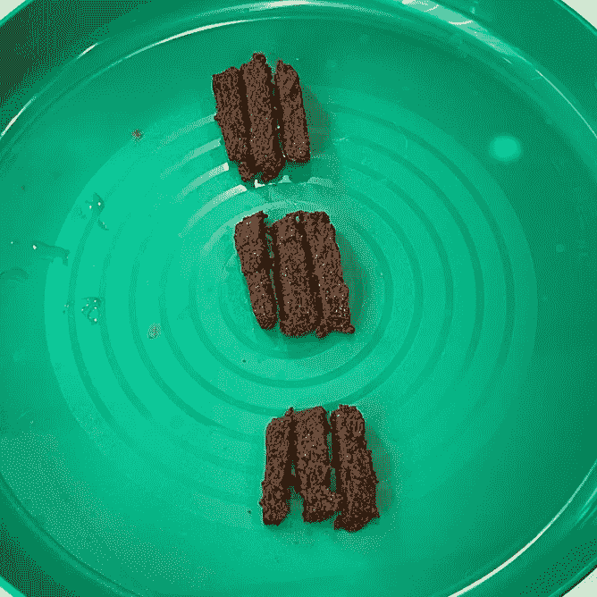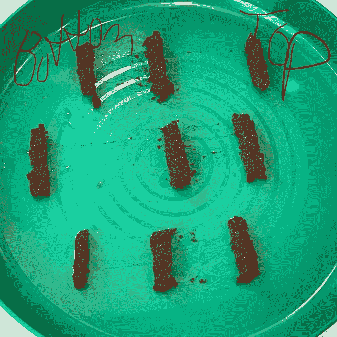

所有图片由作者提供

我让这些磨粒完全干燥，然后从每个磨粒中取三个样本来计算颗粒分布。对于顶部、中部和底部，我最终每个都有 9 个样本。

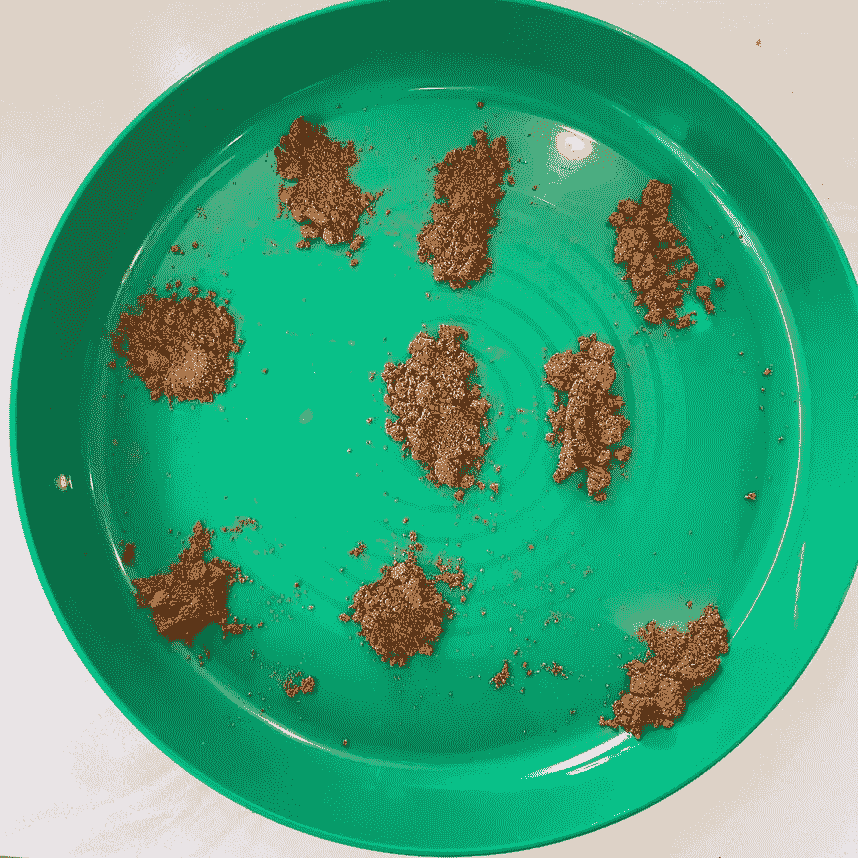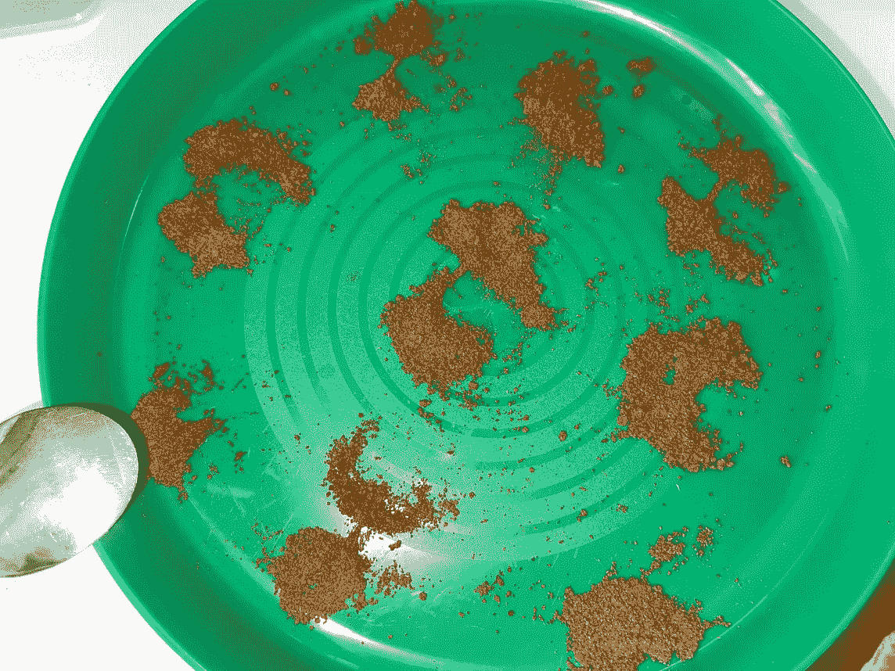

然后我做了一些粒子分析。

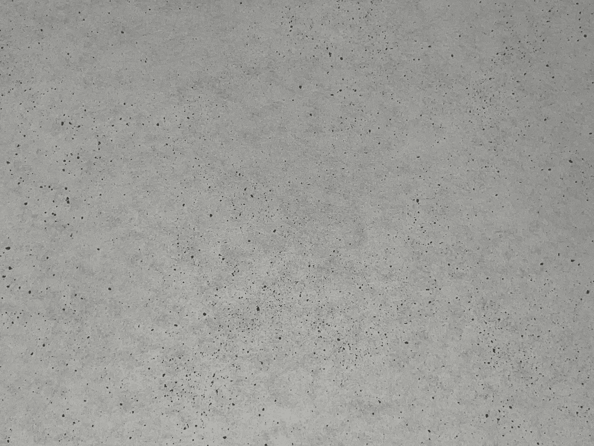

我查看了这 9 个样本的最小值、平均值和最大值。小颗粒的数量很难区分，特别是因为在最小值、平均值和最大值之间没有明确的模式。

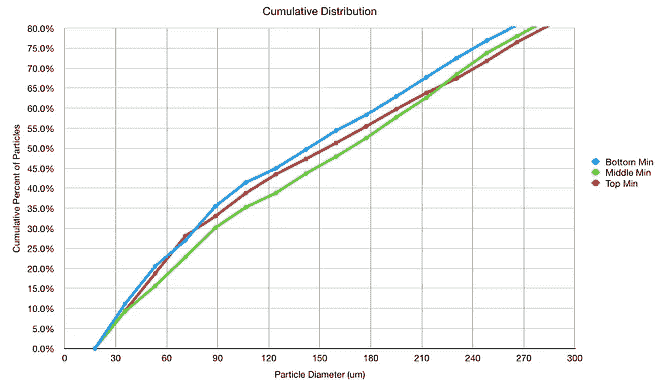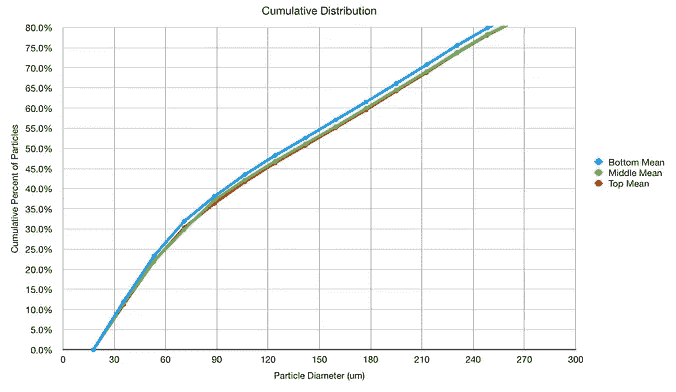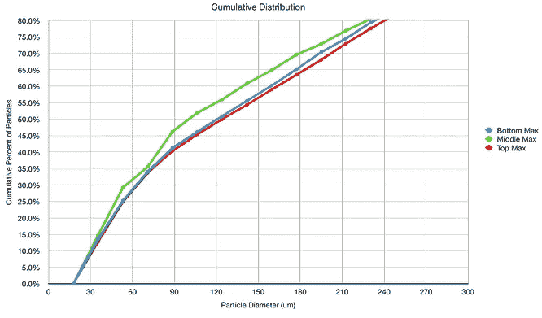

我们可以从不同的角度来看待中位数，它可能比平均值更好。在这里，我们看到一个小图案，底部比顶部或中部有更多的小颗粒，总共约 3%或 4%。对于大约 100 微米或更小的颗粒，总差值为这些颗粒的 10%。

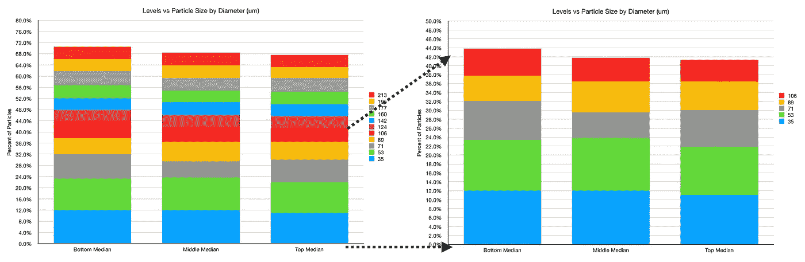

当我们观察图像中的表面区域时，这个故事发生了进一步的变化。我有估计数量的指标，它们显示了类似的模式。成像的问题是第三维很难捕捉。这种观点，还是有 0.6%的理由差异。

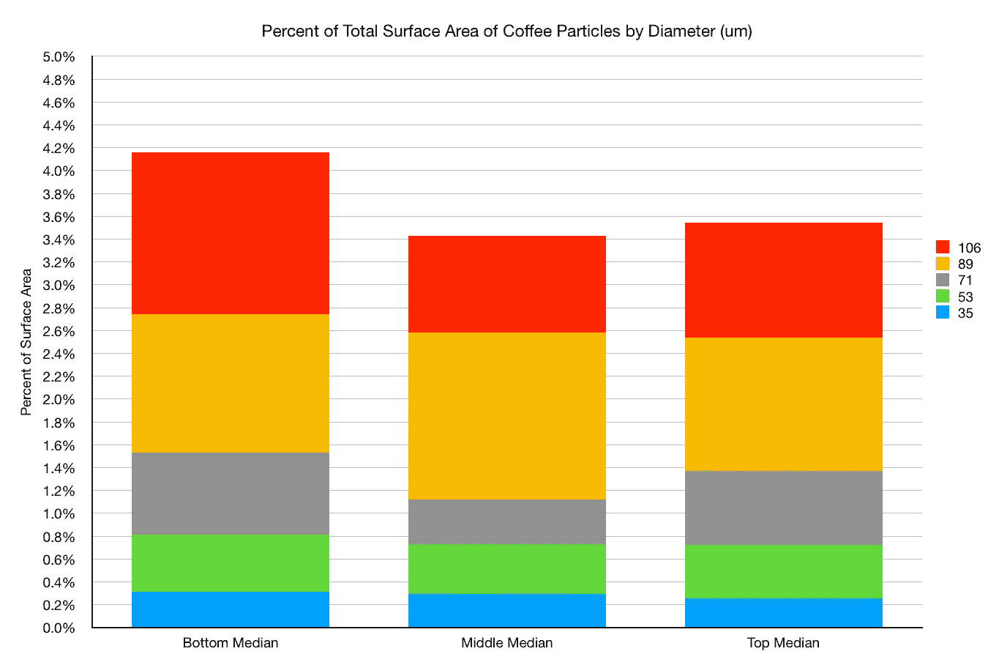

我们可以单独或累积地观察这些差异:

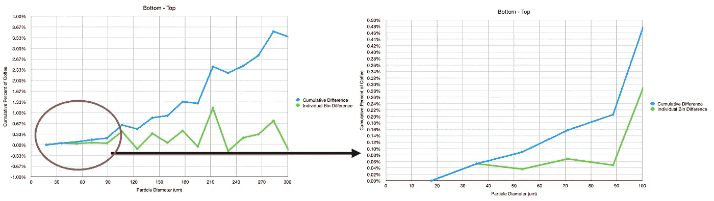

这两项研究都表明，粉末迁移量很小，总共不到所有粉末的 1%。

# 刮擦顶部和底部

我通过刮擦冰球的顶部和底部做了另一个测试。我认为这些应该是所有粒子迁移中最不同的。

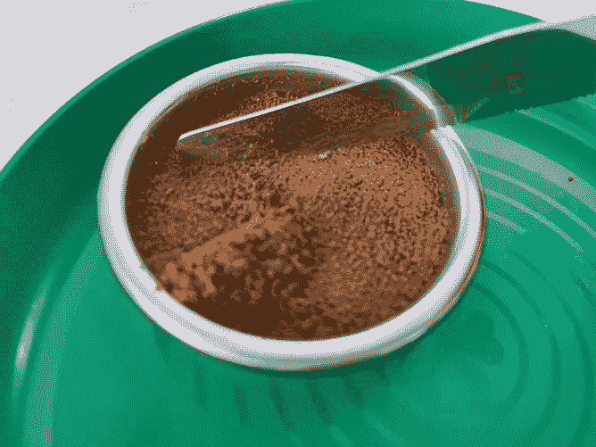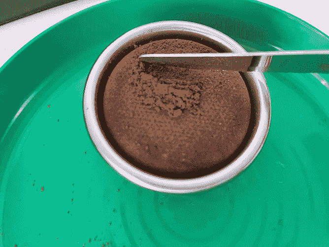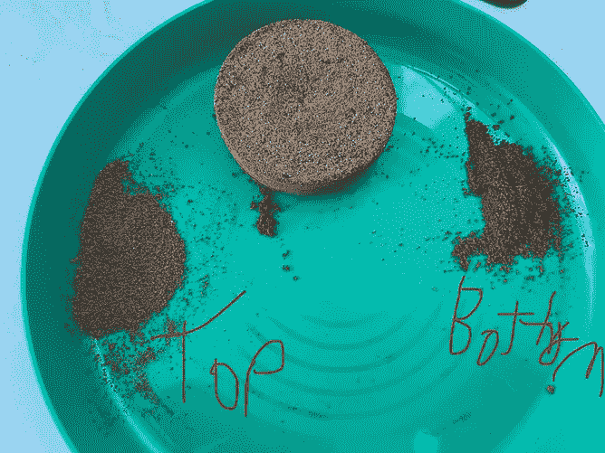

这些分布显示出很小的差异。这并不是说没有区别，但这很难衡量。这也可能是一个线索，让我们知道迁徙有多好，但我现在还不确定。

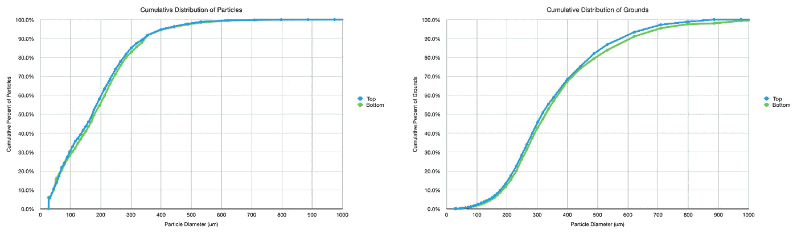

科学由实验和观察组成。我得出了我最初的观察结果，即微粒不会迁移，因为我无法解决正在发生的少量移动。现在有了更好的解决细粒的能力，细粒被观察到迁移，但是只占所有粉末的一小部分。现在更大的问题是，这种细微的变化是否足以让一杯酒的味道变得不同。

如果你愿意，可以在 Twitter 和 YouTube 上关注我，我会在那里发布不同机器上的浓缩咖啡视频和浓缩咖啡相关的东西。你也可以在 [LinkedIn](https://www.linkedin.com/in/robert-mckeon-aloe-01581595?source=post_page---------------------------) 上找到我。也可以关注我[中](https://towardsdatascience.com/@rmckeon/follow)和[订阅](https://rmckeon.medium.com/subscribe)。

# [我的进一步阅读](https://rmckeon.medium.com/story-collection-splash-page-e15025710347):

[浓缩咖啡系列文章](https://rmckeon.medium.com/a-collection-of-espresso-articles-de8a3abf9917?postPublishedType=repub)

[工作和学校故事集](https://rmckeon.medium.com/a-collection-of-work-and-school-stories-6b7ca5a58318?source=your_stories_page-------------------------------------)

[个人故事和关注点](https://rmckeon.medium.com/personal-stories-and-concerns-51bd8b3e63e6?source=your_stories_page-------------------------------------)

[乐高故事启动页面](https://rmckeon.medium.com/lego-story-splash-page-b91ba4f56bc7?source=your_stories_page-------------------------------------)

[摄影飞溅页](https://rmckeon.medium.com/photography-splash-page-fe93297abc06?source=your_stories_page-------------------------------------)

[使用图像处理测量咖啡研磨颗粒分布](https://link.medium.com/9Az9gAfWXdb)

[改善浓缩咖啡](https://rmckeon.medium.com/improving-espresso-splash-page-576c70e64d0d?source=your_stories_page-------------------------------------)

[断奏生活方式概述](https://rmckeon.medium.com/a-summary-of-the-staccato-lifestyle-dd1dc6d4b861?source=your_stories_page-------------------------------------)

[测量咖啡磨粒分布](https://rmckeon.medium.com/measuring-coffee-grind-distribution-d37a39ffc215?source=your_stories_page-------------------------------------)

[咖啡萃取](https://rmckeon.medium.com/coffee-extraction-splash-page-3e568df003ac?source=your_stories_page-------------------------------------)

[咖啡烘焙](https://rmckeon.medium.com/coffee-roasting-splash-page-780b0c3242ea?source=your_stories_page-------------------------------------)

[咖啡豆](https://rmckeon.medium.com/coffee-beans-splash-page-e52e1993274f?source=your_stories_page-------------------------------------)

[浓缩咖啡用纸质过滤器](https://rmckeon.medium.com/paper-filters-for-espresso-splash-page-f55fc553e98?source=your_stories_page-------------------------------------)

[浓缩咖啡篮及相关主题](https://rmckeon.medium.com/espresso-baskets-and-related-topics-splash-page-ff10f690a738?source=your_stories_page-------------------------------------)

[意式咖啡观点](https://rmckeon.medium.com/espresso-opinions-splash-page-5a89856d74da?source=your_stories_page-------------------------------------)

[透明 Portafilter 实验](https://rmckeon.medium.com/transparent-portafilter-experiments-splash-page-8fd3ae3a286d?source=your_stories_page-------------------------------------)

[杠杆机维护](https://rmckeon.medium.com/lever-machine-maintenance-splash-page-72c1e3102ff?source=your_stories_page-------------------------------------)

[咖啡评论和想法](https://rmckeon.medium.com/coffee-reviews-and-thoughts-splash-page-ca6840eb04f7?source=your_stories_page-------------------------------------)

[咖啡实验](https://rmckeon.medium.com/coffee-experiments-splash-page-671a77ba4d42?source=your_stories_page-------------------------------------)