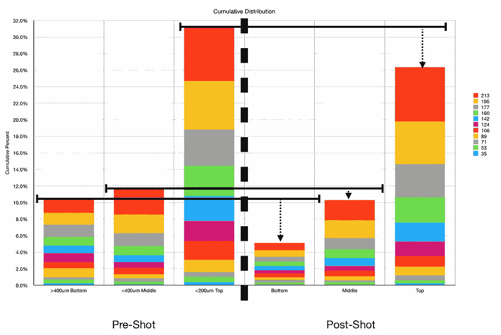

# 咖啡中的粉末会迁移，但不会太远:第 2 部分

> 原文：<https://towardsdatascience.com/fines-migrate-in-espresso-but-not-far-part-2-320a0801677c?source=collection_archive---------40----------------------->

## 咖啡数据科学

## 一个废断奏镜头的横截面切片

作为我深入研究细小微粒迁移的一部分，我决定用废咖啡做一些实验。在这个实验中，我使用了一个扭曲的分层镜头，通过在底部放置较粗的粉末来给细颗粒最好的迁移机会。

# 镜头准备

我在底部放了一个纸过滤器，目的是捕捉任何可能通过的粉末。

所有图片由作者提供

然后，在把它放进篮子之前，我对筛过的粉末进行了一些测量:

我把这个镜头换成了一个断续的镜头:

1.  纸质过滤器
2.  底层大于 400 微米
3.  中间层是<400um
4.  Top Layer is <200um
5.  Metal mesh screen on top

While these layers are mostly separated, the separation wasn’t absolute because coffee grounds stick together. So it is very difficult to get perfectly sifted coffee.

Top is loose grounds, Bottom is tamped. Left is >圆盘底部的 400 μm，然后是中间的< 400 μm，右边是圆盘顶部的< 200um。

# 扣动扳机

我拔枪，结果是 1%的提取率，比预期的要高。水也浑浊，我就存了。

圆盘是干净的，过滤器的底部也相对干净。这一枪打得很均匀。

# 切冰球

当我试图把冰球取出来时，麻烦就开始了。因为底层是粗糙的，它没有密封的方式，我可以很容易地捣实它。较粗的颗粒没有很好地粘在一起。最后，我加了一些水，以确保它不会太干，所以它不会分裂。然后我用刀子切开一个洞把它挤出来。

很乱，但我能得到一片干净的。主要的问题是，带有较粗颗粒的圆盘底部移动了很多，一些较细的颗粒落到了圆盘的底部。

在杯子里，当我倒出液体时，剩下了一些粉末。它们可能来自冰球的底部，因为筛选并不完美。如果他们来自更高的地方，我怀疑会有更多。我也不认为他们占了场地的很大一部分。

# 拍摄后分析

我把冰球切成了 6 层，然后让它们干燥几天。我把每一层都和它应该有的样子进行了比较。

较粗的地面有两层奇怪的混合，其中一层有所有的细颗粒。这可能是因为我想把冰球拿出来。

我也看了累积图，大多数分布保持不变。右图是左图的放大版。

左:399um 最大 bin。右:213um 最大 bin。

# 平均图层

如此庞大的数据量令人应接不暇。所以我把各层平均了一下。一旦我看到分布是如何重叠的，这种比较就很有意义。

实线表示拍摄前的图层，虚线表示拍摄后的图层。

我发现奇怪的是，底层的细颗粒减少(> 400 微米)，这表明大部分粗颗粒中的细颗粒会迁移到杯中。

令我惊讶的是，更多的微粒没有停留在底部的粗糙层(> 400 微米)。我也很沮丧，因为我费了很大的劲才把冰球取出来。总的来说，我认为这个实验是不确定的，它肯定没有导致更细的颗粒大量转移到底层。

如果你愿意，可以在 Twitter 和 YouTube 上关注我，我会在那里发布不同机器上的浓缩咖啡视频和浓缩咖啡相关的东西。你也可以在 [LinkedIn](https://www.linkedin.com/in/robert-mckeon-aloe-01581595?source=post_page---------------------------) 上找到我。也可以关注我[中](https://towardsdatascience.com/@rmckeon/follow)和[订阅](https://rmckeon.medium.com/subscribe)。

# [我的进一步阅读](https://rmckeon.medium.com/story-collection-splash-page-e15025710347):

[浓缩咖啡系列文章](https://rmckeon.medium.com/a-collection-of-espresso-articles-de8a3abf9917?postPublishedType=repub)

[工作和学校故事集](https://rmckeon.medium.com/a-collection-of-work-and-school-stories-6b7ca5a58318?source=your_stories_page-------------------------------------)

[个人故事和关注点](https://rmckeon.medium.com/personal-stories-and-concerns-51bd8b3e63e6?source=your_stories_page-------------------------------------)

[乐高故事启动页面](https://rmckeon.medium.com/lego-story-splash-page-b91ba4f56bc7?source=your_stories_page-------------------------------------)

[摄影飞溅页](https://rmckeon.medium.com/photography-splash-page-fe93297abc06?source=your_stories_page-------------------------------------)

[使用图像处理测量咖啡研磨颗粒分布](https://link.medium.com/9Az9gAfWXdb)

[改善浓缩咖啡](https://rmckeon.medium.com/improving-espresso-splash-page-576c70e64d0d?source=your_stories_page-------------------------------------)

[断奏生活方式概述](https://rmckeon.medium.com/a-summary-of-the-staccato-lifestyle-dd1dc6d4b861?source=your_stories_page-------------------------------------)

[测量咖啡研磨分布](https://rmckeon.medium.com/measuring-coffee-grind-distribution-d37a39ffc215?source=your_stories_page-------------------------------------)

[咖啡萃取](https://rmckeon.medium.com/coffee-extraction-splash-page-3e568df003ac?source=your_stories_page-------------------------------------)

[咖啡烘焙](https://rmckeon.medium.com/coffee-roasting-splash-page-780b0c3242ea?source=your_stories_page-------------------------------------)

[咖啡豆](https://rmckeon.medium.com/coffee-beans-splash-page-e52e1993274f?source=your_stories_page-------------------------------------)

[浓缩咖啡用纸质过滤器](https://rmckeon.medium.com/paper-filters-for-espresso-splash-page-f55fc553e98?source=your_stories_page-------------------------------------)

[浓缩咖啡篮及相关主题](https://rmckeon.medium.com/espresso-baskets-and-related-topics-splash-page-ff10f690a738?source=your_stories_page-------------------------------------)

[意式咖啡观点](https://rmckeon.medium.com/espresso-opinions-splash-page-5a89856d74da?source=your_stories_page-------------------------------------)

[透明 Portafilter 实验](https://rmckeon.medium.com/transparent-portafilter-experiments-splash-page-8fd3ae3a286d?source=your_stories_page-------------------------------------)

[杠杆机维护](https://rmckeon.medium.com/lever-machine-maintenance-splash-page-72c1e3102ff?source=your_stories_page-------------------------------------)

[咖啡评论和想法](https://rmckeon.medium.com/coffee-reviews-and-thoughts-splash-page-ca6840eb04f7?source=your_stories_page-------------------------------------)

[咖啡实验](https://rmckeon.medium.com/coffee-experiments-splash-page-671a77ba4d42?source=your_stories_page-------------------------------------)